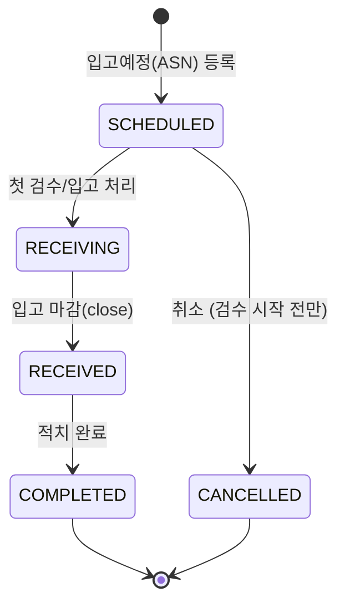
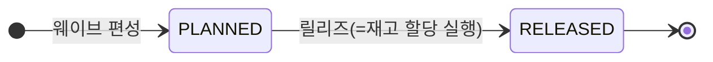
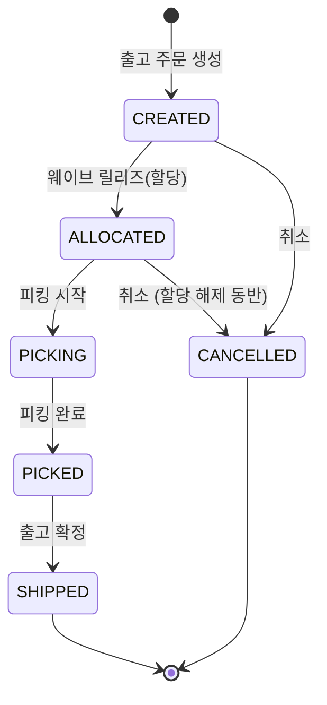

# WMS 프로세스 설계

입고 → 재고 → 출고 전체 흐름의 상태 전이와 재고 모델 설계. 구현보다 설계 판단을 먼저 확정하고, 각 판단의 근거를 여기에 남긴다.

## 도메인 설정

**식품/음료 유통 물류센터 (단일 센터, B2B 점포 출고)** 를 가정한다.

- Lot·유통기한·FEFO 할당이라는 핵심 설계가 의미를 갖는 도메인이고, 벤더 납품 입고에서 부분입고/마감 시나리오가 자연스럽다.
- 존 구성: `RCV-STAGE`(입고 스테이징) + 보관존은 온도대별 `DRY`(상온) / `CHL`(냉장) / `FRZ`(냉동).

도메인이 부여하는 v1 확장 규칙 2가지:

| 규칙 | 내용 |
|---|---|
| **온도대 제약** | SKU에 보관 온도대(DRY/CHL/FRZ), 로케이션에 존 온도대를 두고 적치·이동 시 불일치를 차단한다. |
| **납품기한 출고 제한** | 잔여수명 허용률(예: 40%)은 상품이 아니라 **납품처(점포) 기준정보**다 — 같은 상품이라도 납품처마다 요구 기준이 다르다. 점포 마스터(STORE)에 두고, 주문 점포의 허용률 미달 Lot을 할당 대상에서 제외한다. FEFO 정렬 **앞단의 필터**로 동작한다. |

백로그(v1 제외): 폐기/홀드(재고 상태 + 만료 Lot 자동 홀드 배치), 로케이션 용량 제약, 3PL 멀티화주.

## 설계 원칙

**헤더 상태는 "워크플로가 어느 단계까지 진행됐는가"만 표현한다. 부분 여부(부분입고/부분할당)는 상태로 두지 않고 라인 수량에서 파생한다.**

- `PARTIALLY_RECEIVED` 같은 상태를 헤더에 두면 상태 조합이 늘어나고, 수량과 상태가 어긋나는 버그(라인은 전량 입고됐는데 헤더는 PARTIAL)가 생긴다.
- 부분 여부는 `expectedQty` vs `receivedQty` 비교로 항상 계산 가능하므로 중복 저장하지 않는다.

## 입고 (Inbound)

- 라인에 `expectedQty` / `receivedQty` / `putawayQty`를 두고 부분입고는 수량으로만 표현.
- **입고 마감(close)은 전량 검수 완료 시엔 필요 없다**: 라인 전량(`rcvdQty == expctQty`)이 채워지면 검수 저장 시점에 자동으로 RECEIVING → RECEIVED 전이한다. close는 **부분입고를 더 기다리지 않고 끝내는 경우에만** 쓰는 명시적 액션 — "예정 100개 중 90개만 도착, 더 안 옴"을 확정하고 미입고 잔량을 그 시점에 확정한다. (v1 현재: 이 부분입고 확정 UI는 백로그, 버튼 미노출 — 화면엔 자동전이 케이스만 존재)
- 검수는 v1에서 별도 문서로 분리하지 않고 입고 처리 시 합격/불합격 수량 필드로 처리 (범위 제한).
- **적치(putaway)는 "재고 이동"의 특수 케이스로 모델링**: 입고 처리 시 스테이징 로케이션(예: `RCV-STAGE`)에 재고가 증가하고, 적치는 스테이징 → 보관 로케이션으로의 MOVE다. 적치를 별도 개념으로 두지 않아 모델이 단순해진다.
- **적치는 헤더 상태(RECEIVING/RECEIVED)와 무관하게 즉시 가능**: 스테이징에 쌓인 수량(`rcvdQty - putawayQty`)이 있으면 아직 검수 마감 전이라도 적치할 수 있다 — 적치를 미룰 이유가 없기 때문. COMPLETED는 "RECEIVED 상태 **and** 전 라인 putawayQty == rcvdQty" 두 조건이 모두 충족된 시점에 전이한다 (둘 중 나중에 끝나는 쪽이 트리거).
- **적치 로케이션 배정은 v1에서 수동 선택**: 자동 슬로팅/전략 엔진은 로케이션 용량 제약(위 백로그)이 있어야 의미가 생기므로 함께 백로그로 미룬다. 대신 후보 로케이션(SKU 온도대와 일치하는 STORAGE)을 `loc.pick_prty` 오름차순으로 정렬해 보여줘서 최소한의 추천 순서만 제공한다.
- **적치 목록은 라인이 아니라 (라인, Lot) 배치 단위로 한 행이다**: 한 라인의 `rcvdQty`가 여러 날 나눠 검수돼 서로 다른 Lot에 걸쳐 있을 수 있는데(증분 검수), 라인 단위로 뭉쳐 보여주면 "입고일자" 같은 배치 고유 정보(Lot마다 다른 `receiptDt`)를 한 행에 담을 수 없다. 그래서 `inv_hist`를 `(ib_line_id, lot_id)`로 그룹핑해 스테이징(`RCV-STAGE`)에 남은 수량(`SUM(qty)`)이 있는 조합만 배치 하나로 반환한다. 이를 위해 `inv_hist`에 `ib_line_id`(nullable)를 추가해 라인 → Lot 이력을 역추적한다(아래 검수 취소도 동일 컬럼을 재사용).
- **적치 실행은 목록에서 고른 배치(Lot) 하나만 처리한다**: 목록이 이미 유통기한(FEFO) 순으로 정렬돼 있으므로, 예전처럼 서비스가 라인의 여러 Lot을 순회하며 자동 소진할 필요가 없다 — 행 선택 자체가 "어떤 Lot부터 뺄지"를 대신한다. 요청에 `lotId`를 함께 받아 그 Lot의 스테이징 잔량 내에서만 이동한다 (라인 전체 잔량이 아니라 배치 잔량이 상한).
- **적치 지시(putaway task) 단계는 두지 않는다**: 할당처럼 "예약 후 대기"가 필요한 업무가 아니라 스테이징 실물을 바로 옮기는 단일 액션이므로, 별도 엔티티/상태 없이 즉시 실행한다.
- 같은 Lot을 서로 다른 주문이 공유하는 경우(같은 SKU+입고일자+제조일자), 다른 주문이 먼저 실물을 적치해 스테이징 잔량이 모자라면 이 배치의 적치는 "재고 부족" 오류가 난다 — 실물이 이미 이동한 것이므로 정상 동작으로 간주한다.

### 검수 취소

검수 중 실수로 잘못 입력한 건을 되돌리는 기능. 라인 전체를 리셋하는 게 아니라 **개별 검수 건(1회 저장 호출) 단위 취소**.

- 전제: `inv_hist.ib_line_id`(위 적치 항목과 공용)로 이 라인이 만든 검수 이력만 정확히 조회한다. `ref_doc_no`(입고번호)만으로는 한 주문에 동일 SKU 라인이 여럿일 때 구분이 안 된다.
- 조건: ① 주문이 `RECEIVING` 상태일 때만(마감 이후 불가 — 마감은 명시적 확정이라는 원칙과 충돌) ② 취소 수량만큼 해당 Lot의 스테이징 `onHandQty`가 남아있어야 함(이미 적치된 분은 취소 불가).
- 처리: `ib_line.rcvdQty` 차감 + Lot 스테이징 `onHandQty` 차감 + `inv_hist`에 `ADJUST` 타입으로 `-수량` 기록. 원 이력 건은 수정하지 않고 반대 방향 기록을 추가한다 (append-only 원장 원칙 유지).
- Lot 자체는 삭제하지 않는다 (이력 보존 목적 — 재고 0인 Lot이 남아있어도 무방).

## 출고 (Outbound)

입고의 거울상으로 설계한다: 입고가 `RECEIVE(스테이징 +) → MOVE(스테이징→보관)`이면, 출고는 `PICK(보관→출고스테이징) → SHIP(출고스테이징 반출)`이다.

웨이브와 주문은 별개의 상태 기계다. 주문의 `CREATED→ALLOCATED` 전이를 웨이브 릴리즈가 트리거한다.

### 웨이브 (할당 단위)

- **웨이브는 재고 할당의 단위다. 할당은 오직 웨이브 릴리즈로만 일어난다** — 주문은 반드시 웨이브에 편성돼야 할당된다(주문 1건짜리 웨이브도 허용). 웨이브를 "여러 주문을 묶는 태그"가 아니라 할당 트리거로 격상한 이유: 동시성 실험(아래 재고 섹션)이 이 지점에서 자연스럽게 증폭된다 — 두 웨이브가 동시에 릴리즈되며 같은 재고를 노리는 게 WMS의 대표적 경합이다.
- 웨이브 상태는 `PLANNED`(편성중, 주문 담기 가능) → `RELEASED`(릴리즈 완료) 둘뿐이다. 릴리즈 이후의 진행(피킹/확정)은 전부 주문 단위로 흐르므로 웨이브는 여기서 역할이 끝난다.
- **피킹은 웨이브가 아니라 주문 단위다** — 웨이브 릴리즈까지만 배치로 처리하고, 배치 피킹(SKU×로케이션으로 뭉쳐 집품 후 주문별 분류)은 도입하지 않는다. 그 경우 피킹 단위가 주문라인별 할당 레코드와 어긋나 별도 지시 엔티티(pick_task/pick_line)가 필요해지는데, v1은 그 복잡도를 회피한다. 피킹 리스트는 주문의 할당 레코드를 로케이션 순으로 정렬한 **뷰**로 충분하다.

### 재고 할당 (웨이브 릴리즈)

- 소속 주문을 정렬(order_dt → outb_no)해 순회하고, 각 라인마다 FEFO로 할당한다.
- **할당 전략: FEFO** (Lot 유통기한 임박 순) → 동순위 시 로케이션 우선순위(`loc.pick_prty`). Lot 관리를 하는 이상 FIFO보다 FEFO가 도메인 요구에 맞는다.
- **점포 잔여수명 필터는 주문마다 다르다**: 같은 웨이브라도 각 주문의 `store.outb_life_rate`로 Lot을 먼저 거른 뒤 FEFO 정렬한다 — 같은 SKU라도 A점포엔 되는 Lot이 B점포엔 안 될 수 있다. FEFO 정렬 **앞단의 필터**로 동작한다.
- 할당은 헤더가 아닌 **라인 단위 Allocation 레코드**(`outb_alloc`: 주문라인 ↔ 재고(SKU+Loc+Lot), 수량)로 기록한다. 후보 `inv` row에 락을 걸고 `alloc_qty`를 증가시키며, 물리 이동이 아니므로 **이력에는 남기지 않는다**(할당 상태는 `outb_alloc`이 담당).
- **재고 부족 시 부분할당을 허용하고 그대로 넘어간다**(백오더 없음). 헤더 상태는 원칙대로 수량(`order_qty` vs `SUM(alloc_qty)`)에서 파생 판단하고, 미충족 잔량은 별도 상태/레코드로 두지 않는다 — 파생 조회로만 확인한다.

### 피킹 · 출고확정 (2단계 물리 모델)

- **피킹 = 보관 → `SHIP-STAGE`(출고 스테이징) MOVE**, `tx_type=PICK`으로 출발(-)/도착(+) 2행 기록. 보관 `inv`는 `onHandQty -= q` **와 함께 `allocQty -= q`**(실물이 나가므로 예약을 소진 — `alloc <= onHand` 불변식 유지), SHIP-STAGE `inv`는 `onHandQty += q`. `outb_alloc.picked_qty`를 누적한다. 전 할당의 `picked_qty == alloc_qty`가 되면 주문이 PICKED로 전이한다.
- **출고확정 = SHIP-STAGE에서 반출**, `tx_type=SHIP`으로 SHIP-STAGE `inv.onHandQty -= q` 1행. 보관 `allocQty`는 피킹 시점에 이미 소진됐으므로 여기선 SHIP-STAGE 재고만 뺀다(이중처리 없음). 주문이 SHIPPED로 전이하고 `shipped_at`을 기록한다.
- **왜 2단계인가**: 피킹과 확정을 한 번에 차감하면 `PICK`/`SHIP` 두 tx_type 중 하나가 무의미해지고, 입고(RECEIVE→적치)와의 대칭도 깨진다. 출고 스테이징에 실물이 잠깐 머무는 게 실제 상하차 흐름과도 맞는다. `SHIP-STAGE`는 `RCV-STAGE`와 동일하게 `loc_type=STAGE`이고 온도대는 플레이스홀더 — 반출 지점이라 온도 제약은 서비스에서 스킵한다.

### 취소

- CREATED → CANCELLED: 단순 종료.
- ALLOCATED → CANCELLED: 할당 해제 동반 — `outb_alloc` 삭제 + `inv.alloc_qty` 복원(물리 이동 전이므로 이력 없음).
- **피킹 시작 이후 취소는 v1에서 지원하지 않는다**(보상 트랜잭션 범위 제한). 실물이 이미 SHIP-STAGE로 이동해, 되돌리려면 역방향 MOVE가 필요하므로 백로그로 미룬다.

## 재고 (Inventory)

재고 키: **SKU + Location + Lot**

두 테이블을 함께 운용한다:

| 테이블 | 역할 |
|---|---|
| `Inventory` (현재고 스냅샷) | `sku + location + lot` 유니크. `onHandQty`, `allocatedQty` 보유. 가용재고는 `onHand - allocated`로 파생 (컬럼 아님). 할당 시 락을 거는 지점. |
| `InventoryHistory` (재고 이력) | 모든 **물리적** 변동(RECEIVE, MOVE, ADJUST, PICK, SHIP)을 ±수량과 참조 문서(입고번호/주문번호)로 append-only 기록. |

- **할당은 물리 이동이 아니므로 이력에 기록하지 않는다.** 할당 상태는 Allocation 테이블이 담당한다.
- **불변식: 이력 합계 = 현재고 스냅샷.** 재고를 변경하는 모든 코드는 반드시 (1) 이력 1건 기록 + (2) 스냅샷 갱신을 한 트랜잭션에서 수행한다.
- 실무에서 재고 이력은 대부분 "조회용 기록"에 그친다. 이 프로젝트에서는 이력을 검증 가능한 원장으로 격상한다: 대사(reconciliation) 배치가 불일치를 감지하고, 이력 리플레이로 스냅샷을 재구성할 수 있어야 한다.

## 동시성 (핵심 차별화 포인트)

동시에 두 주문이 같은 재고를 할당하려는 상황이 WMS의 대표적인 동시성 문제다.

계획:
1. 락 없이 동시 할당 시 재고가 음수가 되는 것을 **재현하는 테스트**를 먼저 작성
2. 비관적 락(`PESSIMISTIC_WRITE`)과 낙관적 락(`@Version` + 재시도)을 **둘 다 구현**
3. 부하 도구로 동시 요청을 걸어 처리량/실패율을 측정하고, 수치 근거로 전략을 선택해 README에 기록

## 진행 순서

1. ~~상태 전이 설계~~ (이 문서)
2. 엔티티 확정 — 마스터(SKU, Location, Lot) → 입고 → 재고 → 출고/할당
3. 시더 — 입고→출고 프로세스를 시간순으로 리플레이하는 물동량 시뮬레이터 형태
4. 할당 동시성: 락 전략 2종 구현 + 부하 측정
5. 대시보드 (React 19 + Vite + Tailwind + ag-grid, 프론트 별도 레포)