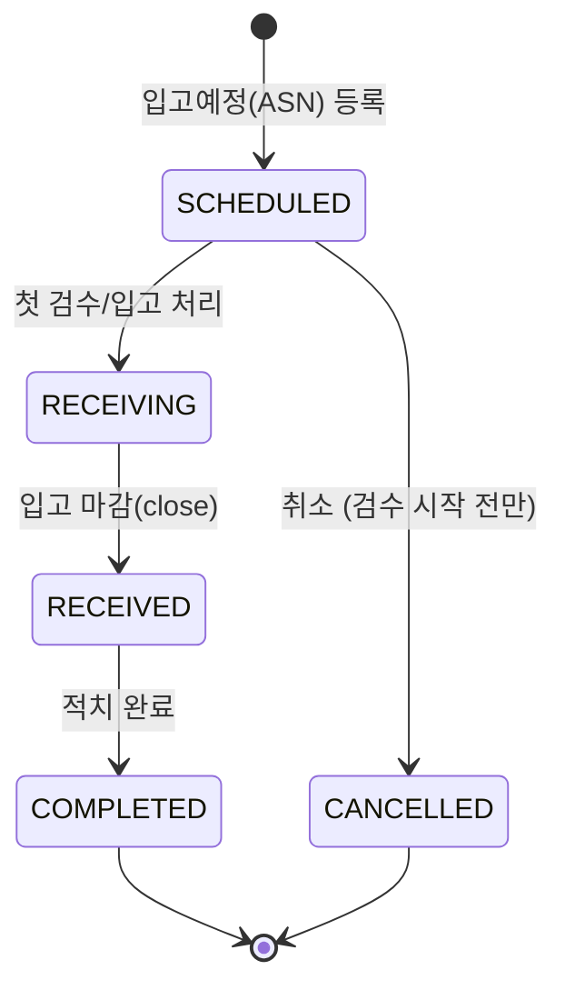
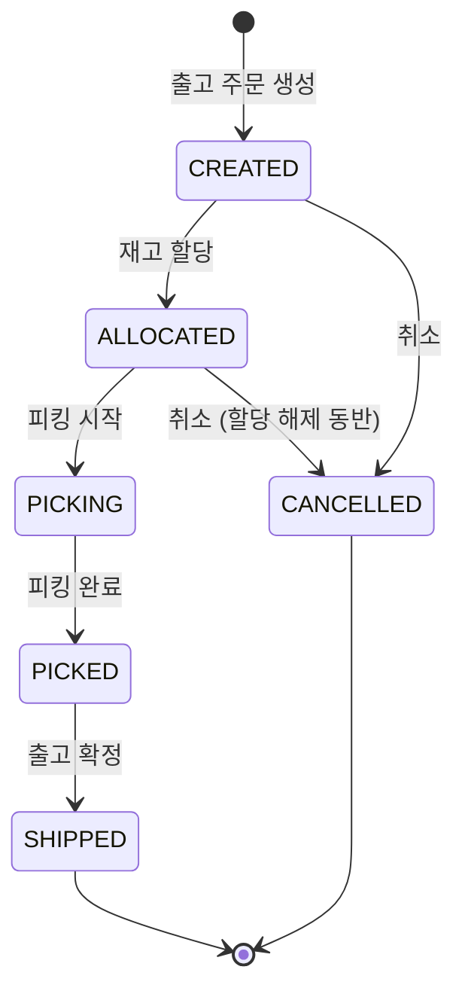

# WMS 프로세스 설계

입고 → 재고 → 출고 전체 흐름의 상태 전이와 재고 모델 설계. 구현보다 설계 판단을 먼저 확정하고, 각 판단의 근거를 여기에 남긴다.

## 도메인 설정

**식품/음료 유통 물류센터 (단일 센터, B2B 점포 출고)** 를 가정한다.

- Lot·유통기한·FEFO 할당이라는 핵심 설계가 의미를 갖는 도메인이고, 벤더 납품 입고에서 부분입고/마감 시나리오가 자연스럽다.
- 존 구성: `RCV-STAGE`(입고 스테이징) + 보관존은 온도대별 `DRY`(상온) / `CHL`(냉장) / `FRZ`(냉동).

도메인이 부여하는 v1 확장 규칙 2가지:

| 규칙 | 내용 |
|---|---|
| **온도대 제약** | SKU에 보관 온도대(DRY/CHL/FRZ), 로케이션에 존 온도대를 두고 적치·이동 시 불일치를 차단한다. |
| **납품기한 출고 제한** | 잔여수명 허용률(예: 40%)은 상품이 아니라 **납품처(점포) 기준정보**다 — 같은 상품이라도 납품처마다 요구 기준이 다르다. 점포 마스터(STORE)에 두고, 주문 점포의 허용률 미달 Lot을 할당 대상에서 제외한다. FEFO 정렬 **앞단의 필터**로 동작한다. |

백로그(v1 제외): 폐기/홀드(재고 상태 + 만료 Lot 자동 홀드 배치), 로케이션 용량 제약, 3PL 멀티화주.

## 설계 원칙

**헤더 상태는 "워크플로가 어느 단계까지 진행됐는가"만 표현한다. 부분 여부(부분입고/부분할당)는 상태로 두지 않고 라인 수량에서 파생한다.**

- `PARTIALLY_RECEIVED` 같은 상태를 헤더에 두면 상태 조합이 늘어나고, 수량과 상태가 어긋나는 버그(라인은 전량 입고됐는데 헤더는 PARTIAL)가 생긴다.
- 부분 여부는 `expectedQty` vs `receivedQty` 비교로 항상 계산 가능하므로 중복 저장하지 않는다.

## 입고 (Inbound)

- 라인에 `expectedQty` / `receivedQty` / `putawayQty`를 두고 부분입고는 수량으로만 표현.
- **입고 마감(close)은 명시적 액션**: "예정 100개 중 90개만 도착, 더 안 옴"을 확정하는 행위. 미입고 잔량은 마감 시점에 확정된다.
- 검수는 v1에서 별도 문서로 분리하지 않고 입고 처리 시 합격/불합격 수량 필드로 처리 (범위 제한).
- **적치(putaway)는 "재고 이동"의 특수 케이스로 모델링**: 입고 처리 시 스테이징 로케이션(예: `RCV-STAGE`)에 재고가 증가하고, 적치는 스테이징 → 보관 로케이션으로의 MOVE다. 적치를 별도 개념으로 두지 않아 모델이 단순해진다.

## 출고 (Outbound)

- 피킹 시작 이후 취소는 v1에서 지원하지 않음 (보상 트랜잭션 범위 제한).
- 할당은 헤더가 아닌 **라인 단위 Allocation 레코드**(주문라인 ↔ 재고(SKU+Location+Lot), 수량)로 기록. 재고 부족 시 부분할당을 허용하되 헤더 상태는 원칙대로 수량에서 파생 판단.
- **할당 전략: FEFO** (Lot 유통기한 임박 순) → 동순위 시 로케이션 우선순위. Lot 관리를 하는 이상 FIFO보다 FEFO가 도메인 요구에 맞는다.

## 재고 (Inventory)

재고 키: **SKU + Location + Lot**

두 테이블을 함께 운용한다:

| 테이블 | 역할 |
|---|---|
| `Inventory` (현재고 스냅샷) | `sku + location + lot` 유니크. `onHandQty`, `allocatedQty` 보유. 가용재고는 `onHand - allocated`로 파생 (컬럼 아님). 할당 시 락을 거는 지점. |
| `InventoryHistory` (재고 이력/수불) | 모든 **물리적** 변동(RECEIVE, MOVE, ADJUST, PICK, SHIP)을 ±수량과 참조 문서(입고번호/주문번호)로 append-only 기록. |

- **할당은 물리 이동이 아니므로 이력에 기록하지 않는다.** 할당 상태는 Allocation 테이블이 담당한다.
- **불변식: 이력 합계 = 현재고 스냅샷.** 재고를 변경하는 모든 코드는 반드시 (1) 이력 1건 기록 + (2) 스냅샷 갱신을 한 트랜잭션에서 수행한다.
- 실무에서 재고 이력은 대부분 "조회용 기록"에 그친다. 이 프로젝트에서는 이력을 검증 가능한 원장으로 격상한다: 대사(reconciliation) 배치가 불일치를 감지하고, 이력 리플레이로 스냅샷을 재구성할 수 있어야 한다.

## 동시성 (핵심 차별화 포인트)

동시에 두 주문이 같은 재고를 할당하려는 상황이 WMS의 대표적인 동시성 문제다.

계획:
1. 락 없이 동시 할당 시 재고가 음수가 되는 것을 **재현하는 테스트**를 먼저 작성
2. 비관적 락(`PESSIMISTIC_WRITE`)과 낙관적 락(`@Version` + 재시도)을 **둘 다 구현**
3. 부하 도구로 동시 요청을 걸어 처리량/실패율을 측정하고, 수치 근거로 전략을 선택해 README에 기록

## 진행 순서

1. ~~상태 전이 설계~~ (이 문서)
2. 엔티티 확정 — 마스터(SKU, Location, Lot) → 입고 → 재고 → 출고/할당
3. 시더 — 입고→출고 프로세스를 시간순으로 리플레이하는 물동량 시뮬레이터 형태
4. 할당 동시성: 락 전략 2종 구현 + 부하 측정
5. 대시보드 (React 19 + Vite + Tailwind + ag-grid, 프론트 별도 레포)