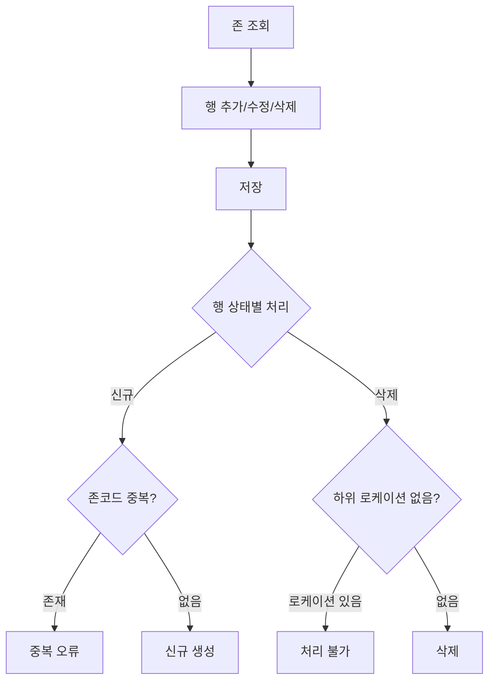
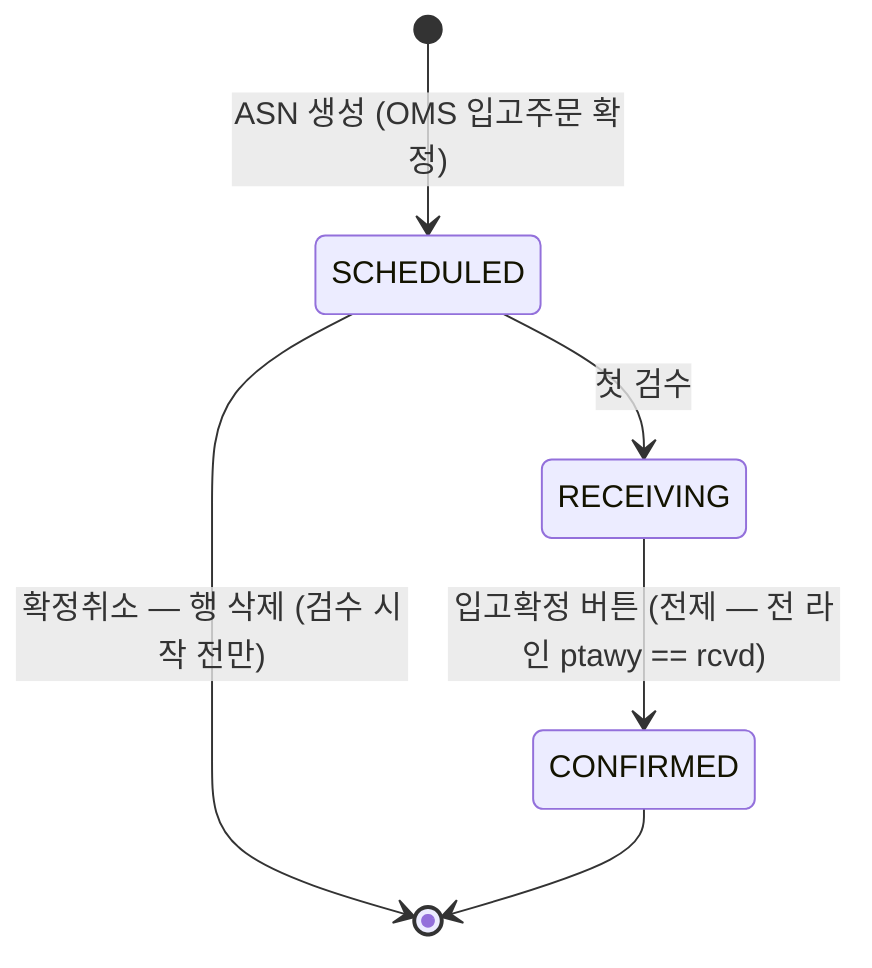
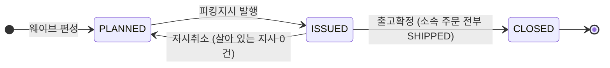
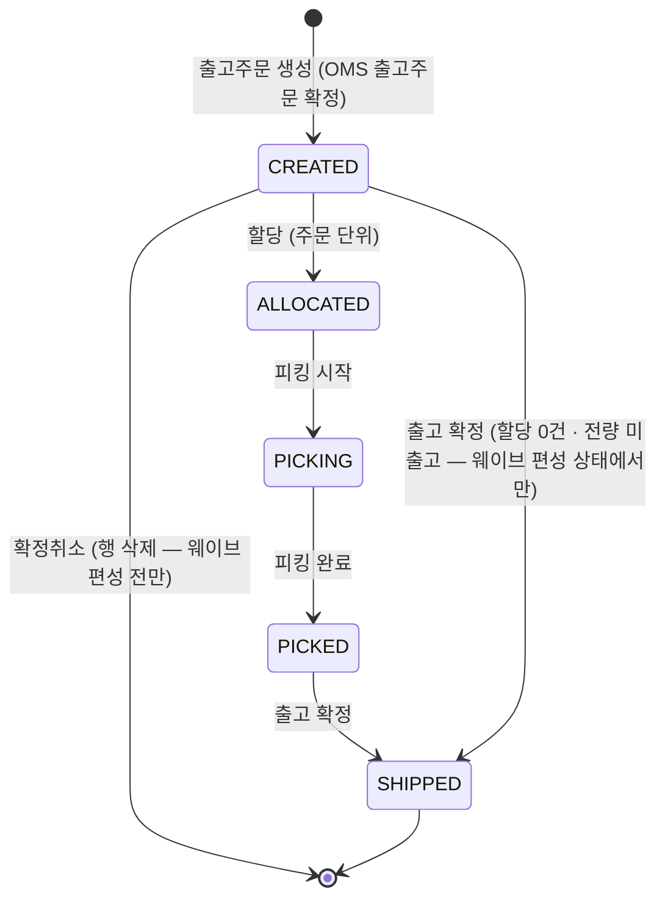

# WMS 프로세스 설계

입고 → 재고 → 출고 전체 흐름의 상태 전이와 재고 모델 설계. 구현보다 설계 판단을 먼저 확정하고, 각 판단의 근거를 여기에 남긴다.

## 도메인 설정

**식품/음료 유통 물류센터 (단일 센터, B2B 점포 출고)** 를 가정한다.

- Lot·유통기한·FEFO 할당이라는 핵심 설계가 의미를 갖는 도메인이고, 벤더 납품 입고에서 부분입고/마감 시나리오가 자연스럽다.
- 존 구성: `RCV-STAGE`(입고 스테이징) + 보관존은 온도대별 `DRY`(상온) / `CHL`(냉장) / `FRZ`(냉동). **단, 이건 시드 기본값이지 고정 목록이 아니다** — 존은 `zon` 마스터에서 등록·삭제한다(아래 「존 마스터」 참조).

도메인이 부여하는 v1 확장 규칙 2가지:

| 규칙 | 내용 |
|---|---|
| **온도대 제약** | 상품에 보관 온도대(DRY/CHL/FRZ), 로케이션에 존 온도대를 두고 적치·이동 시 불일치를 차단한다. 로케이션의 온도대는 그 로케이션이 속한 **존의 온도구분과 일치해야** 등록된다(보관 로케이션 한정 — 스테이징은 전 온도대가 거쳐 가는 지점이라 예외). |
| **납품기한 출고 제한** | 잔여수명 허용률(예: 40%)은 상품이 아니라 **납품처(점포) 기준정보**다 — 같은 상품이라도 납품처마다 요구 기준이 다르다. 점포 마스터(STORE)에 두고, 주문 점포의 허용률 미달 Lot을 할당 대상에서 제외한다. FEFO 정렬 **앞단의 필터**로 동작한다. |

v1 포함으로 승격: **재고 보류**(`inv.hld_qty` 보류수량 → 보류분은 가용재고에서 제외 — 「재고 보류」 절), **로케이션 용량 제약**(적치 전략의 전제. 형태는 **수량 상한**(`loc.max_qty`)으로 확정 — 입고 섹션 「적치 지시」 참고).

백로그(v1 제외): 폐기, 만료 Lot 자동 보류 배치, 3PL 멀티화주.

## 설계 원칙

**헤더 상태는 "워크플로가 어느 단계까지 진행됐는가"만 표현한다. 부분 여부(부분입고/부분할당)는 상태로 두지 않고 라인 수량에서 파생한다.**

- `PARTIALLY_RECEIVED` 같은 상태를 헤더에 두면 상태 조합이 늘어나고, 수량과 상태가 어긋나는 버그(라인은 전량 입고됐는데 헤더는 PARTIAL)가 생긴다.
- 부분 여부는 `expectedQty` vs `receivedQty` 비교로 항상 계산 가능하므로 중복 저장하지 않는다.

## 계량단위와 환산

**단위 목록은 공통코드 `UOM` 그룹이 갖고, 상품은 포장 목록(`prod_uom`)과 그중 어느 것이 입고단위·출고단위인지를 갖는다.** 단위에 전용 마스터 테이블을 두지 않은 이유는 화면 때문이다 — 그리드에서 행을 추가할 때 단위를 콤보박스로 고르는데, 그 목록을 온도대·보관유형 같은 다른 코드성 값과 다른 경로(`/master/uoms`)로 받을 이유가 없다. 전부 `/master/codes/{grpCd}` 하나로 통일한다. 박스로 받아 낱개로 내보내는 것이 유통센터의 기본 형태인데, 그 전까지는 입수량이 상품명 문자열에만 있었다(`'코카콜라 350ml (24입)'`).

| 컬럼 | 뜻 |
|---|---|
| `prod_uom (prod_id, uom_cd)` | 이 상품이 갖는 포장 하나. 낱개·박스·파렛트를 동시에 가질 수 있다 |
| `prod_uom.ea_qty` | 이 단위 1개 = 낱개 몇 개 (낱개 그 자체면 1) |
| `prod_uom.wgt` | 이 단위 1개의 중량(kg). 포장재 무게 포함 실측값, 미측정이면 NULL |
| `prod.inb_uom_cd` | 입고단위 — 벤더에게 발주하고 납품받는 단위. 포장 목록 안의 코드여야 한다 |
| `prod.outb_uom_cd` | 출고단위 — 출고주문서에 사람이 쓰는 단위. 역시 포장 목록 안의 코드 |

**환산수량을 상품에 한 칸으로 두지 않고 낱개수량으로 파생시킨다.** 상품당 한 칸이면 「입고단위 → 출고단위」 한 쌍만 표현되어 박스·파렛트를 함께 다룰 때 쌍마다 컬럼이 늘어난다. 낱개를 매개로 삼으면 어떤 두 단위든 환산된다 — `odr_qty × ea_qty(그 단위)`. 중량이 갈 자리가 생기는 것도 같은 이유다: 상품에 중량 한 칸을 두면 그게 어느 포장 기준인지 이름에 안 드러나고, 박스 중량을 「낱개중량 × 낱개수량」으로 파생하게 되어 포장재 무게(tare)가 사라진다.

**불변식: 창고(WMS)의 모든 수량 컬럼은 낱개(EA) 기준이다.** 입력 단위를 유지하는 곳은 OMS 주문 라인 둘뿐 — `oms_ib_line.odr_qty`(입고단위) · `oms_outb_line.odr_qty`(출고단위). 주문 원장은 사람이 쓰는 단위, 창고 장부는 낱개다.
(번복 — 원래 "모든 수량 컬럼은 출고단위" 확정이었다. 출고 경로에 환산이 없다는 이점 때문이었는데, 저장 단위가 상품 마스터의 한 컬럼(`outb_uom_cd`)에 따라 상품마다 달라지는 구조라 "이 숫자가 몇 개인가"를 늘 상품과 함께 읽어야 했고, 출고단위를 바꾸면 기존 수량 행 전체의 의미가 바뀌는 시한폭탄이 있었다. EA 통일로 저장 단위는 상수(常數)가 되고, 그 대가는 출고 확정 경계의 환산 한 번이다.)

- **환산은 OMS → WMS 경계 세 곳에서만 한다** — `OmsIbOrderService.confirm()`(발주 → ASN, 입고단위), `ReceivingService.receiveLine()`(검수 입력 → 저장, 입고단위), `OmsOutbOrderService.confirm()`(출고주문 → 창고 출고주문, 출고단위). 전부 `Prod.toEaQty()` 곱셈이라 수량이 깎일 수 없다. 이 세 곳 밖에서 환산을 추가하지 말 것 — 환산 지점이 흩어지면 어느 행이 어느 단위인지 사후에 복원할 방법이 없다.
- **검수 입력은 입고단위(발주단위) 개수다** (번복 — 원래 "검수 입력도 출고단위" 확정이었다). 출고단위 입력을 유지했던 이유는 예정수량과 같은 단위로 그대로 비교되게 하려는 것이었는데, 실무 검수는 박스·파렛트로 세므로 낱개 입력 강제가 그 자체로 오입력원이었다. 대신 화면이 예정·잔량·누계를 전부 입고단위로 환산해 보여줘 "예정 240 / 검수 [10]" 단위 혼선을 없앤다. **입고단위 정수만 허용한다** — 부분 박스는 표현할 수 없고, 입고단위로 딱 안 떨어지는 잔량은 마감으로 미입고 확정한다. **과입고(예정 잔량 초과)는 화면과 서버 양쪽에서 차단한다.**
- **수량 컬럼에 단위 컬럼을 딸려 두지 않는다.** 각 수량 옆에 `uom_cd`를 두면 `ck_inv_qty`·`ck_ib_line_qty` 같은 CHECK가 서로 다른 단위의 값을 비교하게 되어 무의미해진다. 단위는 상품이 갖고, 수량은 단위를 갖지 않는다.
- **낱개수량은 상품 마스터에 두고 문서에 스냅샷하지 않는다.** 발주 후 입수량이 바뀌면 이미 변환된 ASN의 예정수량과 어긋나지만, v1은 이를 허용한다 — 라인마다 환산값을 복사해 두면 마스터 수정이 과거 문서에 반영되지 않는 별개의 혼선이 생기고, 실제로 입수량이 바뀌는 빈도는 낮다. 백로그.
- `ea_qty >= 1`을 DB CHECK(`ck_prod_uom_ea_qty`)로 막는다. 0이면 검수가 재고를 0으로 만들고 음수면 재고를 음수로 민다 — 단위와 관련해 DB가 지켜주는 유일한 지점이다.
- 나누어떨어짐 검증은 폐지했다 (번복 — EA 통일 이전엔 입고단위 낱개수량이 출고단위 낱개수량의 배수인지 `ProdService`·`ProdUomService`가 저장 시점에 막았다. `toOutbQty`의 정수 나눗셈이 수량을 깎는 걸 막는 가드였는데, 환산이 곱셈만 남으면서 막을 것 자체가 사라졌다). 두 단위가 포장 목록 안에 있는지는 여전히 저장 시점에 본다(FK가 없으므로 DB는 모른다).
- **화면 주의**: 포장단위가 노출되는 곳은 OMS 입고주문 화면(발주 수량 = 입고단위), OMS 출고주문 화면(주문 수량 = 출고단위), 입고검수 화면(검수 입력·예정·잔량·누계 = 입고단위 환산)이다. 그 밖의 ASN 목록·적치·재고·출고(창고) 화면의 수량은 전부 낱개(EA)다 — 발주 10과 예정 240이 같은 물건이라는 게 화면에서 보여야 한다.

## 존 마스터

존(`zon`)은 로케이션의 상위 그룹이다. 존코드 · 존명 · 온도구분 · 보관유형(랙/평치/가상) · 업무구분(입고작업/출고작업/보관/피킹/반품/작업)을 갖고, 업무구분은 **존당 하나**다.


```mermaid
flowchart TD
    A[존 조회] --> B[행 추가/수정/삭제]
    B --> C[저장]
    C --> V{행 상태별 처리}
    V -->|신규| D{존코드 중복?}
    D -->|존재| X[중복 오류]
    D -->|없음| F[신규 생성]
    V -->|삭제| G{하위 로케이션 없음?}
    G -->|로케이션 있음| Y[처리 불가]
    G -->|없음| H[삭제]
```

- **하위 로케이션이 하나라도 있으면 삭제하지 않는다.** `loc.zon_id`는 `Loc.zon` 연관(`@ManyToOne`)이지만 FK가 없어 DB가 막아주지 않으므로 `ZonService`가 `LocRepository.existsByZon`으로 직접 확인한다. **존코드는 등록 후 수정할 수 없다** — 업무 식별자이고, 재고조사 범위(`inv_stktk.zon_cd`)처럼 코드값을 그대로 보존하는 곳이 있어 바꾸면 그 기록이 가리키는 존을 잃는다.
- **온도구분·보관유형·업무구분에는 CHECK 제약을 걸지 않았다.** 값 목록의 주인은 공통코드(`TEMP_ZONE` · `STRG_TYP` · `BIZ_DVSN`)이고, 코드를 추가할 때마다 DDL을 고치게 만들지 않기 위해서다. 서버측 검증은 Java enum(`TempZone` · `StrgTyp` · `BizDvsn`)의 역직렬화가 담당한다. 이 코드베이스의 다른 마스터(`loc` · `prod`)는 CHECK를 갖고 있어 **존만 다른 방식**이라는 점에 유의할 것.
- 온도구분 컬럼은 `zon.tmp_zon`으로, `loc.tmp_zon` · `prod.tmp_zon`과 **이름과 값 도메인을 모두 공유**한다(공통코드 `TEMP_ZONE`, Java `TempZone` enum). 온도대 일치 검증이 상품 ↔ 로케이션 ↔ 존 세 군데를 관통해야 하므로 복제하지 않았다.

## 고정 로케이션 마스터 (피킹존, 2026-08-20)

보편적인 창고 운영은 「보관은 자유 로케이션 + 피킹은 상품별 고정 로케이션」 혼합이다. 그 고정을 담는 마스터가 `fxng_loc`(상품×로케이션 + 보충 기준 min/max)이고, 적치 전략의 `FXNG_LOC` 방식이 이 마스터를 후보 원천으로 쓴다 — 예전 mthd_cd 주석의 "고정로케이션 방식은 고정상품 마스터가 없어 제외"가 이걸로 해소됐다.

- **한 로케이션 = 한 상품 전용이다(`uq_fxng_loc` — loc_id UNIQUE).** 고정 피킹 페이스는 자리에 상품 라벨이 붙는 전용 슬롯이라는 통상 운영을 따랐고, 적치 후보 조회(`PutawayQueryRepository`)가 fxng_loc를 left join할 때 로케이션당 ≤1행이 보장되어 inv 집계가 곱셈 오염되지 않는 근거이기도 하다. 반대 방향(한 상품 → 여러 로케이션)은 허용한다 — 회전 빠른 상품은 피킹 페이스가 여럿일 수 있다.
- **지정 가능한 로케이션은 STORAGE + 상품 온도대 일치뿐이고, PIKNG 존 강제는 하지 않는다.** STAGE는 적치·할당 후보 모집단 밖이라 지정해도 영영 쓰이지 않아 등록을 막고, 온도대 불일치는 적치·이동이 차단해 고정이 성립하지 않는다. 존 업무구분은 강제하지 않는다 — `biz_dvsn` 값 목록의 주인은 공통코드라(위 「존 마스터」와 같은 이유) 서비스가 특정 코드값에 결합하지 않고, 보관존 안의 고정 로케이션 운영도 실무상 유효하다.
- **min/max는 정기보충(SPMT)의 기준값이다 — 정기보충은 구현됐다(2026-08-21, `SpmtService`).** 먼저 들어온 수시보충(아래 「수시보충」, `mov_dvsn=RPLN`)과는 같은 `inv_mov_task`를 쓰되 갈래가 다르다 — 수시보충은 피킹지시가 짝으로 내고 예약을 들지 않지만, 정기보충은 화면·스케줄러가 내고 예약을 들어 확정·취소를 이동지시 관리 화면과 공유한다. `max_qty`는 수시보충의 도착지 여유 상한으로도 쓰인다(`RplnDestinationResolver`). 재보충점(min) 미달 시 상한(max)까지 채우는 지시를 `inv_mov_task`에 `mov_dvsn=SPMT`·`SPMT_NO` 채번(`SP-` 접두 — `rfn_doc_no`로 보충/일반이동 이력이 구분된다)으로 싣는다 — 예약·MOVE 이력·용량 합산을 그대로 얻는다(「재고 이동」의 이동구분 항 참고). 적치의 `FXNG_LOC` 배정 상한에는 max를 쓰지 않는다 — 적재가능수량 식(`LocCapacityService`)은 하나여야 하고, min/max는 보충의 파라미터다.
  - **대상 판정은 `현재고 + 미완료 유입 잔량 < min`, 부족량은 `max − 현재고 − 유입`이다.** 유입(오고 있는 지시 잔량)을 얹지 않으면 이미 지시를 걸어 둔 자리가 재조회마다 다시 대상으로 잡혀 중복 발행된다. **현재고와 유입 둘 다 지정 상품만 합산한다**(`LocCapacityQueryRepository.openInflowQtyByProdLoc` / `openInflowQty(prodId, locId)`) — 전용 자리의 타상품 재고·타상품 유입은 오염이지 보충 판정의 재고가 아니다. 유입을 로케이션 전체(적재가능 식의 유입 항)로 잡으면 타상품 지시 하나가 진짜 부족한 자리를 대상에서 가리고 부족량을 깎아 정상 발행까지 거부한다(2026-08-23 수정). 물리 용량은 별개로 `InvMovService.register`가 전 상품 기준으로 검증한다.
  - **원천은 같은 상품의 보관 가용재고를 FEFO(할당과 같은 정렬 정의)로 자동 추천하되, 고정로케이션에 등재된 자리는 상품 불문 전부 제외한다** — 다른 피킹 자리를 헐어 채우면 그 자리가 곧 보충 대상이 된다. 같은 상품의 다중 대상은 원천 가용을 전역 선점한다(적치 일괄 추천의 배치 간 공유와 같은 원리). 추천은 예약이 아니라서 발행이 같은 식으로 재검증한다(2회 검증) — 고정 등재·상품 일치·부족량 상한은 `SpmtService`가 보고, 나머지(STORAGE·온도대·가용·물리용량)는 `InvMovService.register` 위임이 맡는다. 트리거는 둘이다 — **스케줄러(`SpmtScheduler`, `spmt.cron` 기본 매일 03:00 — 피킹이 멈춘 시간대, `-`로 비활성)가 정기 실행의 본선**이고, 화면 일괄 발행은 임의 시점 재계산·원천 보정용 보조다. 둘 다 같은 plan→issue 경로라 규칙이 갈리지 않는다. 실행 이력은 로그로 남긴다(알림 인프라 없음 — 실패도 로그가 전부, 발행이 전량 롤백이라 다음 주기가 처음부터 재시도).
- **가드는 세 방향이다.** 상품 삭제는 `WmsProdRefChecker`, 로케이션 삭제는 `LocRefQueryRepository.findAnyReference`가 막고, 로케이션 수정은 `LocService`가 고정 걸린 로케이션의 유형·온도대 변경과 `max_qty`를 고정 보충 상한 아래로 낮추는 것을 막는다(등록 시 `max ≤ loc.max_qty` 검증의 짝). `fxng_loc` 행 자체의 삭제는 자유다 — 어떤 문서도 fxng_loc_id를 참조하지 않는 순수 설정 마스터다.
- **적치가 피킹존을 침범하지 않게 하는 것은 코드가 아니라 전략 데이터다.** 1단계 `FXNG_LOC`(고정 없는 상품은 자동으로 다음 단계), 이후 단계는 `loc_cond = BIZ_DVSN IN [STRG]`로 보관존만 지정한다. `NOT_IN`을 열지 않은 이유 — loc_cond는 "조건이 아니라 지정"이라는 결정(2026-08-03)의 번복이 되고, NOT_IN은 존 미등록 로케이션(bizDvsn null)을 소리 없이 포함하는 함정이 있다. 할당의 「피킹존 먼저」도 같은 노선이다 — 할당 전략 `INVN_FLTR` 1계층에 `BIZ_DVSN IN [PIKNG]`, 마지막 계층은 조건 없음으로 등록하면 되고 코드 변경이 없다. 「피킹존에서만」은 등록할 수 없다(아래 할당 절).

## 입고주문 (OMS)

**수정은 작성(CREATED) 상태에서만 가능하다.** 확정된 주문을 고치면 이미 나간 ASN의 예정수량과 어긋난다 — 창고는 옛 수량으로 받을 준비를 한 상태이고, 주문만 바꿔도 그 예정이 따라오지 않는다. 고치려면 확정취소를 먼저 거친다. 이 판정은 `OmsIbOrder.update()`가 하며, `revertConvert()`·`requireDeletable()`과 같은 자리에 둔다 — 호출 경로가 늘어도 불변식이 깨지지 않게 하려는 것이다.

**상태는 `CREATED ↔ CONFIRMED` 둘뿐이고 취소 상태를 두지 않는다.** 없앨 주문은 지운다 — 확정 전이면 바로, 확정 뒤면 확정취소로 되돌린 뒤에. 「지운 것도 아니고 쓰는 것도 아닌」 상태를 두면 목록·집계마다 그 상태를 빼는 필터가 따라붙고, 화면에서는 삭제와 취소 중 무엇을 눌러야 하는지가 매번 애매해진다(마스터에서 `us_yn`을 걷어낸 것과 같은 판단).

**용어를 「확정」으로 통일했다 — 화면·상태값·메서드·경로 전부.** 사용자가 하는 행위는 *발주를 확정한다*이고 ASN 생성은 그 **결과**다. 상태값이 결과(`CONVERTED`)를 가리키는 동안 화면 부제는 "확정", 버튼은 "ASN 변환"으로 갈려 있었다. 「변환」은 `docs/naming-dictionary.md`에 없는 단어이기도 했다 — `CNVR`은 **환산**(단위 환산)이라 오히려 헷갈린다. 사전에 있는 **확정 = `CFM`**을 쓴다(`converted_at` → `cfm_dt`). ASN이 생긴다는 사실은 버튼 이름이 아니라 툴팁·모달이 설명한다.

**ASN(`ib_order`) 쪽도 취소 상태를 두지 않는다 — 확정취소는 ASN 행을 삭제한다.** 검수 전의 예정은 아직 아무 일도 하지 않은 문서라 흔적 가치가 없고, `CANCELLED`를 남기면 입고예정 목록·집계마다 취소분을 빼는 필터가 따라붙는다(주문 쪽 취소 상태를 안 둔 것과 같은 판단). 재확정하면 새 입고번호로 새 행이 생긴다. `uq_ib_order_oms_active`는 평범한 유니크 인덱스로 "주문당 ASN 하나"를 강제한다. (원래는 CANCELLED로 남겨 부분 유니크였다 — 2026-07-31에 삭제 방식으로 전환, `migration-drop-asn-cancelled.sql`.)

**수정해도 주문번호는 바뀌지 않는다.** 예정일을 고쳐도 마찬가지다. 번호는 채번 시점의 식별자이지 예정일을 따라다니는 값이 아니고, 이미 그 번호로 벤더와 주고받은 이력이 어긋난다.

**라인은 통째로 갈아끼운다.** 어느 라인이 남고 어느 라인이 바뀌었는지를 클라이언트가 알려주지 않아도 되게 하려는 것이고, `orphanRemoval`이 빠진 라인을 지운다.

### 헤더 부가 항목 — 발주구분 · 담당자 · 비고

- **발주구분(`odr_dvsn`)은 지금 표시·분류용이다.** 공통코드 `ODR_DVSN`(정상/긴급/반품입고)을 문자열로 참조한다. 긴급이라고 적치·피킹 순서가 바뀌지는 않는다 — 그러려면 확정 시 ASN까지 값을 넘기고 전략이 그걸 읽어야 하며, 그건 별개의 결정이다.
- **비고(`rmk`)는 ASN으로 넘기지 않는다.** 발주 시점에 벤더에게 전할 메모라, 창고 작업 지시와 성격이 다르다. 창고에 전할 말이 필요해지면 ASN 쪽에 따로 칸을 두는 게 맞다.
- **담당자(`pic_nm`)는 감사 컬럼 `created_by`와 별개다.** 인증이 없어 `created_by`가 `admin` 고정이기도 하고, 대신 발주한 경우 실제 담당자가 다르다.

## 출고주문 (OMS)

**입고주문과 같은 2계층이다 — 원장은 OMS(`oms_outb_order`), 작업문서는 WMS(`outb_order`).** 확정하면 같은 트랜잭션에서 창고 출고주문이 생기고, 확정취소하면 그 행이 삭제되며 주문은 `CREATED`로 돌아온다. 상태도 `CREATED ↔ CONFIRMED` 둘뿐이고 취소 상태를 두지 않는다(없앨 주문은 지운다). 판단 근거는 전부 「입고주문 (OMS)」 절과 같으므로 반복하지 않고, **다른 점만** 적는다.

**① 상대가 벤더가 아니라 납품처(점포)다.** 컬럼은 `store_id`이고 화면 라벨이 「납품처」다. 사전에 `납품처=DLVPLC`가 있지만 쓰지 않았다 — FK 컬럼은 참조 테이블의 PK명을 그대로 쓴다는 규칙이 사전보다 위이기 때문이다. 점포는 잔여수명 허용률(`store.outb_life_rate`)을 갖고 있어 할당 시 Lot 필터의 기준이 되므로, 주문이 가리키는 것은 텍스트가 아니라 마스터여야 한다.

**② 확정 시 넘기는 값이 셋이다 — 납품처 · 출고유형(`outb_typ`) · 편수(`vhcl_fltno`).** 입고에서 `odr_dvsn`이 표시용이었던 것과 달리 이 둘은 **실제로 동작하는 값**이다. 웨이브 전략의 편성 조건이 정확히 이 두 필드(`WaveOrderField`)라서, 주문 시점에 정해지지 않으면 창고가 주문을 묶을 수 없다. 그래서 복사가 아니라 전달이 목적이다.

**③ 환산의 기준이 입고단위가 아니라 출고단위다.** `oms_outb_line.odr_qty`는 출고단위(`prod.outb_uom_cd`) 기준이고, 확정 시 `prod_uom.ea_qty`(출고단위)를 곱해 낱개(EA)로 환산돼 `outb_line.odr_qty`가 된다(`OmsOutbOrderService.confirm()`). 입고와 다른 것은 환산 여부가 아니라 **어느 단위를 곱하는가**뿐이다 — 발주는 입고단위, 출고주문은 출고단위. 출고단위인 컬럼이 `oms_outb_line.odr_qty` 하나뿐이고 그 아래 창고 수량은 전부 EA라는 불변식(위 「계량단위와 환산」 절)이 여기서도 유지된다.
(번복 — 원래 "수량을 환산하지 않는다. 확정 시 `outb_line.odr_qty`로 1:1 복사된다"였다. 창고의 저장 단위가 곧 출고단위였던 시절의 서술이라, 저장 단위를 낱개(EA)로 통일하면서 환산이 없을 근거도 함께 사라졌다.)

**④ 확정취소를 막는 지점이 「검수 시작」이 아니라 「웨이브 편성」이다.** `OutbOrder.requireRevertible()`은 `CREATED`이면서 웨이브에 담기지 않은 문서만 통과시킨다. 편성된 주문을 지우면 그 웨이브의 피킹지시와 전략 실행 로그가 존재하지 않는 주문을 가리키게 된다 — 되돌리려면 웨이브에서 빼는 것이 먼저다.

  - **그 판정은 `outb_order` 행 락 위에서 해야 한다 (2026-08-21).** 확정취소가 락 없이 읽으면 「판정 → 삭제」 사이에 웨이브 편입·할당이 커밋될 수 있다. `outb_line`은 cascade + orphanRemoval로 함께 삭제되는데 **`outb_alloc.outb_line_id`에 FK가 없어** 그 할당이 존재하지 않는 라인을 가리키는 고아로 남고, 할당해제가 `outb_alloc → outb_line → outb_order`를 조인해 예약을 되돌리는 구조라 **예약을 회수할 경로 자체가 죽는다.** 동시에 OMS 주문은 `CREATED`로 돌아가 재확정이 열리므로 같은 물량이 두 번 잡힌다. `outb_order`에는 `@Version`이 없어 낙관적 잠금 방어도 없으니, **편입·할당과 같은 행 락**이 유일한 방어다 — `findByOmsOutbOrderIdForUpdate`(PESSIMISTIC_WRITE)가 편성용 `findByIdForUpdate`와 같은 자리를 맡는다.

**출고예정일(`expct_de`)을 새로 두고, 웨이브 편성 대상 기간의 기준을 주문일에서 이쪽으로 옮겼다.** 그전에는 `outb_order.odr_de` 하나가 「들어온 날」과 「나갈 날」을 겸했다. 주문 원장이 생기면서 둘이 갈라졌고, 웨이브는 정의상 *같은 날 나갈 주문*을 묶는 단위라 기간 필터가 출고예정일을 봐야 한다(`OutbOrderSearchCond.dateFrom/To` · `WaveStgyExecRequest.expctDeFrom/To`). `odr_de`는 주문이 등록된 날로 남아 확정 시 복사된다.

**창고 쪽 취소(`outb_order.CANCELLED`)를 폐지하고 확정취소 하나로 모았다.** 같은 「없앤다」를 두 조작이 다르게 처리하고 있었다 — 취소는 행을 `CANCELLED`로 눕히고 주문을 확정으로 두었고, 확정취소는 행을 지우고 주문을 작성으로 되돌렸다. 화면에서는 무엇을 눌러야 하는지가 매번 애매했고 목록·집계에는 취소분을 빼는 필터가 따라붙는다. ASN이 같은 이유로 `CANCELLED`를 폐지한 선례를 따랐다(위 「입고주문 (OMS)」 절). `POST /outbound/orders/{id}/cancel`은 제거됐다(`migration-drop-outb-cancelled.sql`).

## 입고 (Inbound)


```mermaid
stateDiagram-v2
    [*] --> SCHEDULED : ASN 생성 (OMS 입고주문 확정)
    SCHEDULED --> RECEIVING : 첫 검수
    SCHEDULED --> [*] : 확정취소 — 행 삭제 (검수 시작 전만)
    RECEIVING --> CONFIRMED : 입고확정 버튼 (전제 — 전 라인 ptawy == rcvd)
    CONFIRMED --> [*]
```

- 라인에 `expctQty` / `rcvdQty` / `ptawyQty`를 두고 부분입고는 수량으로만 표현.
- **저장 상태는 셋뿐이고 자동 전이가 없다** (2026-08-14 — 「RECEIVED 재도입 · 자동 전이」 재번복). 입고확정을 「온 것은 전부 적치 완료된 뒤, 사람이 눌러 결품(`expctQty - rcvdQty`)을 못박으며 입고건을 닫는 유일한 종결 액션」으로 재정의했다 — 실무의 입고확정이 검수 결과를 검토하고 잠그는 관문이라는 데 맞춘 것. 전량 검수돼도, 전량 적치돼도 상태는 `RECEIVING`에 머문다.
  - 옛 모델(RECEIVED/COMPLETED + 자동 전이)의 근거였던 "사람이 누를 것이 없는 버튼은 두지 않는다"는 확정을 결품 확정으로만 볼 때의 이야기다. 확정이 **문서를 닫는 검토 행위**가 되면 전량 입고된 건에도 누를 내용이 생기고, RECEIVED/COMPLETED 구분은 수량(`ptawyQty`)에서 파생되므로 저장할 이유가 없다.
  - 치른 비용: 결품 정보가 적치에 묶인다 — 80/100만 오고 끝난 게 확실해도 창고가 80을 다 적치하기 전엔 확정을 못 눌러 「20 결품」이 시스템에 박히지 않는다. v1엔 정산·재발주 연동이 없고 적치도 보통 당일 끝나 실질 손해는 없다고 보고 수용했다.
  - **`confirm()` 전제조건: 전 라인 `ptawyQty == rcvdQty`** (미적치 잔량 0). 미적치인 채로 닫으면 `RCV-STAGE`에 실물이 남았는데 문서는 닫혀 그 재고를 옮길 화면 진입점이 사라진다. 미완료 적치지시 존재는 따로 검사하지 않는다 — 지시 잔량이 있으면 스테이징 예약이 남아 반드시 `ptawy < rcvd`라 이 전제가 논리적으로 배제한다.
  - `rcvdQty`가 전부 0이어도 확정할 수 있다(전량 결품 확정) — 전량 검수취소된 `RECEIVING` 주문의 유일한 종결 경로가 confirm이라(OMS 확정취소는 `SCHEDULED`만 통과) 막으면 영구 고착된다.
- **화면이 보여주는 진행은 5단계 파생값(`IbPrgr`)이다** — 예정 / 검수 / 적치지시 / 적치완료(확정대기) / 확정. 저장하지 않고 수량·미완료 지시 존재에서 매번 계산한다(「상태와 수량의 분담」). 판정 순서상 「검수 0건」이 「전량 적치」(0 == 0)보다 먼저다.
- 검수는 v1에서 별도 문서로 분리하지 않고 입고 처리 시 수량 입력으로 처리한다. 실무 검수가 개수 대조 수준이라 **불합격 수량은 두지 않는다** — 안 온 것(결품)과 온 것(검수수량) 두 값이면 충분하다.

### 검수 동시성 — 상품 로우 락 (2026-08-07 확정)

**검수 저장이 잠그는 것은 상품 행이다** (`ReceivingService.lockProds`). 지켜야 할 것은 Lot 쪽인데 — 「배치 재사용 조회 → 채번 → 저장」이 겹치면 같은 배치를 가리키는 Lot이 둘 생기거나 `lot_no`가 부딪힌다 — 아직 존재하지 않는 행은 잠글 수 없다. 그래서 그 배치들이 매달린 상품을 대신 잠근다. 「재고 속성변경」의 상품 → Lot 락 순서와 같은 결정이고, 그쪽이 이 순서를 따르는 이유도 여기에 있다.

이 락에 두 가지 규칙이 붙는다. 둘 다 **락을 어떻게 거느냐가 아니라 언제·어떤 순서로 거느냐**의 문제라 DB가 도와주지 않는다.

- **한 요청에 라인이 여럿이면 상품 id 오름차순으로 한 건씩 잠근다.** 락은 커밋까지 유지되므로 요청이 보낸 순서대로 잠그면 상품이 겹치는 두 검수가 서로 반대 순서로 잡아 교착이 난다(A: 상품1→상품2 / B: 상품2→상품1). **라인 id로 정렬해서는 안 된다** — 라인 id 순서와 상품 id 순서는 입고마다 다르다. 재고 행 락을 표준 순서 하나로 고정한 것(「락 순서」 절)과 같은 원칙이다.
- **라인을 읽기 전에 락을 전부 끝낸다** (검수 제약 평가도 그 뒤다). 라인을 먼저 읽어두면 영속성 컨텍스트에 올라가 뒤에 락을 잡아도 그 값이 갱신되지 않는다 — 같은 라인을 동시에 검수한 둘이 같은 잔량을 보고 과입고 검사를 통과한 뒤, 각자 더한 `rcvd_qty`를 절대값으로 덮어써 한쪽 검수가 증발한다(이력엔 두 건이 남아 라인 누계와 어긋난다). **`ib_line`에는 `@Version`이 없고 `ck_ib_line_qty`도 `rcvd_qty ≤ expct_qty`를 보지 않아** 아무도 막지 않는다. 이건 「후보를 엔티티로 먼저 읽어두지 않는다」(할당)와 같은 이야기다.
- 그래서 **잠글 상품을 스칼라 조회로 고른다** — 정렬하려고 라인을 엔티티로 미리 읽으면 위 규칙이 그대로 깨진다.

### 입고 제약 (검수 관문) — 미구현 · 백로그

> **현재 코드에 이 규칙은 하나도 없다.** `ReceivingService`에 검증이 없고, 기준값을 담던 `prod.ib_life_rate`는 삭제했다 — 값(전 상품 70)을 넣기만 하고 읽는 코드가 없는 write-only 컬럼이었다. 아래는 구현할 때의 설계이지 현재 동작이 아니다.

**FEFO 창고의 방어선은 출고가 아니라 입고에 있다.** 출고쪽 잔여수명 필터는 이미 있는데(점포 기준) 입고쪽에 문턱이 없으면, 창고가 처음부터 못 내보낼 물건을 받아 재고로 쌓는다. 문턱은 검수 단계에 둔다 — 전략 테이블 없이 **검수 저장 시 규칙 2개를 코드로 검증**하는 형태로 간다.

| 규칙 | 내용 | 기준값 |
|---|---|---|
| **잔여수명 하한** | `(expiryDt - 입고일자) / shelfLifeDays < 기준률`이면 검수 차단 | **전역 기본값 + 상품 override** (아래) |
| **역순 입고 차단** | 같은 상품에 **재고가 남아있는** Lot의 최대 제조일자보다 과거인 제조일자는 검수 차단 | 컬럼 없음 (기존 Lot에서 파생) |

- **기준률은 전역 기본값을 두고 상품에는 예외만 둔다** (판단 번복). 원래는 상품 전용 컬럼(`prod.ib_life_rate`)이었고 근거는 "벤더에 두면 유통기한 3일짜리와 1년짜리에 같은 비율이 걸려 무의미하다"였다. **이 근거는 틀렸다** — 판정식이 이미 `shelfLifeDays`로 나누므로 비율은 척도에 무관하다(40%면 3일짜리는 1.2일, 365일짜리는 146일). 상품별로 두어야 할 진짜 이유는 따로 있다: 정규화 뒤에도 허용 비율은 품목 성격을 탄다(삼각김밥은 80%, 스팸은 30%도 무방). 하지만 그건 유통기한 길이에 비례하지 않는 **카테고리 문제**이고, 상품 하나하나에 값을 채우게 만들면 결국 전부 비어 미적용이 된다 — 실제로 그렇게 됐다. 그래서 전역값이 항상 걸리고 상품은 예외만 갖는다.
- 출고쪽 `store.outb_life_rate`와는 **주체가 다르므로**(출고는 "납품처가 요구하는 기준", 입고는 "우리가 받아주는 기준") 값을 공유하지 않는다. 입고 기준은 출고 기준보다 높아야 정상이다 — 받을 때 이미 40%면 점포에 내보낼 창이 남지 않는다.
- **역순 입고를 막는 이유**: 뒤늦게 더 오래된 물건을 받으면 그 Lot이 즉시 FEFO 최우선 할당 대상이 되어, 이미 나가기로 정해져 있던 순서가 통째로 뒤집힌다. 비교 대상은 **재고가 0인 Lot을 제외**한다 — 다 나가고 껍데기만 남은 Lot이 영구히 입고를 막으면 안 된다.
- 유통기한 미관리 상품(`shelf_life_days`가 NULL)는 두 규칙 모두 대상이 아니다 (제조일자 자체가 NULL).
- 구현 시 **차단만** 한다. 강제 입고 override 경로는 두지 않는다 (권한 모델이 없어 "누가 승인했나"를 기록할 수 없다). 백로그.
- 제조일자 기준 잔여비율은 유통기한 기준 잔여비율과 같은 값을 다른 쪽에서 잰 것이라 규칙을 하나만 둔다.
### 적치 (Putaway)

- **적치는 "재고 이동"의 특수 케이스로 모델링**: 검수 시 스테이징(`RCV-STAGE`)에 재고가 증가하고, 적치는 스테이징 → 보관 로케이션으로의 MOVE다. 적치를 별도 재고 개념으로 두지 않아 모델이 단순해진다.
- **적치는 헤더 상태와 무관하게 즉시 가능**: 스테이징에 쌓인 수량(`rcvdQty - ptawyQty`)이 있으면 확정 전이라도 적치할 수 있다 — 미룰 이유가 없다. 검수와 적치는 순서가 아니라 수량으로 맞물리며 `RECEIVING` 구간 안에서 병행된다. 단 확정된 입고에는 새 지시를 만들 수 없다(닫힌 문서).
- **적치 대상 목록은 라인이 아니라 (라인, Lot) 배치 단위로 한 행이다**: 한 라인의 `rcvdQty`가 여러 날 나눠 검수돼 서로 다른 Lot에 걸쳐 있을 수 있는데(증분 검수), 라인 단위로 뭉치면 "입고일자" 같은 배치 고유 정보(Lot마다 다른 `receiptDt`)를 한 행에 담을 수 없다. `inv_hist`를 `(ib_line_id, lot_id)`로 그룹핑해 스테이징에 남은 수량(`SUM(qty)`)이 있는 조합만 반환한다. 이를 위해 `inv_hist`에 `ib_line_id`를 둔다(검수 취소도 같은 컬럼을 재사용).
- 같은 Lot을 서로 다른 주문이 공유하는 경우(같은 상품+입고일자+제조일자), 다른 주문이 먼저 실물을 적치해 스테이징 잔량이 모자라면 "재고 부족" 오류가 난다 — 실물이 이미 이동한 것이므로 정상 동작으로 간주한다.

#### 적치 지시 (putaway_task)

**지시 생성(전략이 로케이션을 정함)과 지시 실행(실물 MOVE)을 분리한다.** 작업자는 지시를 보고 움직이고, 시스템은 지시 대비 실적을 추적한다. 지시 없이 화면에서 로케이션을 직접 골라 옮기던 기존 방식은 지시 실행으로 대체됐다(구현 완료 — 즉시 MOVE 경로는 제거).

- **레코드**: `putaway_task(ib_line_id, lot_id, to_loc_id, drct_qty, cmpl_qty, status)`. `from_loc`는 항상 `RCV-STAGE`라 컬럼으로 두지 않는다. 지시와 실적을 두 테이블로 나누지 않는 이유는 실적의 실체가 이미 `inv_hist`의 MOVE 2행이기 때문이다 — 지시 한 테이블 + `cmpl_qty`로 충분하다.
- **로케이션 용량은 수량 상한(`loc.max_qty`)으로 정한다** (미결정 해소). "1로케이션 1상품"은 식품 유통센터의 혼재 보관 현실과 맞지 않고, 용량이 곧 0/1이 되어 분할 지시가 불가능해진다.
  - `적재가능수량 = loc.max_qty − 해당 로케이션 현재고 − 미완료 지시 잔량(SUM(drct_qty − cmpl_qty))`
- **지시는 출발지(스테이징)를 `aloc_qty`로 예약하고, 도착지(TO 로케이션)는 선점하지 않는다** (2026-08-04 확정 — 「선점하지 않는다」에서 출발지 쪽만 번복).
  - **출발지 예약**: `aloc_qty` = 예약수량 일반이라는 확정에 따라 적치지시도 스테이징 재고를 예약한다. **예약이 막는 것은 검수 취소 하나**다 — 지시받은 물량을 검수 취소가 밑에서 빼가면 스테이징은 0인데 지시는 남는 유령이 되고, 그 사실은 적치를 실행할 때에야 정합성 오류로 드러난다. 예약이 있으면 취소 시점에 가용수량 검사 한 줄로 걸린다.
    - 근거가 이 하나뿐인데도 예약을 두는 이유는 **특례를 없애기 때문**이다. 예약이 없으면 `ReceivingService`가 적치지시를 직접 조회해야 하고(원래 설계의 검수취소 조건 ③), 앞으로 스테이징 재고를 건드리는 코드마다 "적치지시 확인했나"를 기억해야 한다. 가용재고 한 개념으로 「이 물량은 임자가 있다」를 표현하면 `avalQty()`만 보면 된다.
    - **예약이 막지 <u>않는</u> 것**: 같은 물량의 중복 지시·재추천은 아래 「배치 상한」이 막고, 같은 로케이션 이중 배정은 「로케이션 유입 잔량」이 막는다. 셋은 서로 대체하지 못한다 — 예약을 믿고 배치 상한을 걷어내면 같은 Lot을 공유하는 다른 입고라인의 물량까지 끌어다 지시하게 된다(`inv`의 예약은 (상품, 로케이션, Lot) 단위라 라인 경계를 모른다).
  - **도착지는 파생식**: TO 로케이션 용량은 컬럼 선점 없이 위 계산식의 `미완료 지시 잔량` 항이 담당한다. 다만 그 항에는 적치지시뿐 아니라 **이동지시(`inv_mov_task`)의 유입 잔량도 합산**해야 한다 — 두 지시가 같은 자리를 노리기 때문이다. 계산식이 이동지시 등록·적치 추천·적치지시 생성 세 곳에 흩어지므로 `LocCapacityService`가 단일 정의를 갖고, 유입 원천은 `LocInflowPort` 구현으로 등록한다(도메인 간 직접 조회를 피하는 포트 패턴).
  - 추천 쿼리에만 용량 조건을 걸면 추천과 지시 사이의 변동을 막지 못한다. **지시 생성 시점에 위 식으로 재검증**한다 — 추천과 검증을 같은 식으로 두 번 하는 것이 요지다.
  - **배치 상한은 따로 본다**: `inv`의 예약은 (상품, 로케이션, Lot) 단위라 같은 Lot을 공유하는 다른 입고라인과 구분되지 않는다. 그래서 지시 생성은 「그 (라인, Lot) 배치가 스테이징에 남긴 잔량 − 이미 지시한 몫」도 함께 검증한다. 둘 중 하나만 두면 라인 경계를 넘는 지시가 생긴다.
- **지시는 권고가 아니라 명령이다** (미결정 해소): 지시와 다른 로케이션으로의 적치는 막는다. 허용하면 용량 계산이 즉시 실제와 어긋나 제약 자체가 무의미해진다. 다른 곳에 두려면 **지시의 로케이션을 변경·분할**한 뒤 실행한다 (2026-08-20 — 취소 후 재지시의 화면 3단계를 줄이려 변경 API를 추가). 실행이 지시대로만 움직인다는 원칙은 그대로다 — 바뀌는 것은 실행이 아니라 지시다.
  - 잔여 전량(미실행)이면 목적지만 바꾸고, 일부 수량이면 그만큼 **새 지시로 떼어낸다(분할)**. 부분 실행된 지시의 잔여분도 이 창구로 빠져나간다 — 분할 없이는 「30개는 들어갔는데 남은 10개가 지시 자리에 물리적으로 안 들어가는」 상황에서 잔여 예약이 갇힌다(잔량 취소가 없으므로 유일한 탈출구다). 분할로 원 지시에 실행분만 남으면 완료로 전이한다.
  - 예약은 스테이징 재고에 (상품, 로케이션, Lot) 단위로 걸려 있어 변경·분할 모두 총량이 그대로다 — 재고 무접촉. 목적지 검증은 생성과 같은 식이되 적재가능수량은 옮기는 수량 기준.
- **용량이 모자라면 로케이션을 1:N으로 분할한다**: 한 배치가 한 로케이션에 다 안 들어가면 후보를 우선순위(`pikng_prty`) 순으로 순회하며 적재가능수량만큼 잘라 여러 지시로 쪼갠다. 분할이 없으면 용량 제약이 곧 "적치 불가"가 된다.
- **후보 산출은 적치 전략(`ptawy_stgy`)이 정한다.** 처음에는 「온도대 일치 `STORAGE`를 `pikng_prty` 순」이라는 규칙 하나뿐이라 전략 마스터를 두지 않기로 했으나, 단계(적재로케이션/빈로케이션/전체)·조건·정렬을 화면에서 다루기로 하면서 전략 테이블을 도입했다(「적치 전략」 절 참고). 지시 생성 화면은 그 추천 결과를 그대로 지시로 저장한다.
  - **일괄 추천은 배치 간 용량을 공유한다**: 배치마다 따로 추천하면 여러 배치가 같은 로케이션의 남은 용량을 각자 다 쓸 수 있다고 보고 이중 배정한다. 한 번의 일괄 추천 안에서 이미 배정한 양을 누적해 다음 배치의 적재가능수량에서 뺀다. 배치를 넘기는 순서는 화면이 보여준 유통기한 순(FEFO) 그대로다.
- **적치 실행은 지시 한 건 단위**다. 지시가 이미 (라인, Lot, 로케이션, 수량)을 확정해 놨으므로 실행은 수량만 받는다(부분 실행 허용 → `cmpl_qty` 누적). FEFO 소진 순서는 지시 생성 시 배치 목록의 유통기한 정렬이 이미 대신한다.
- **지시는 주문 단위로 걸고, 실행은 상품 단위로 한다** — 화면의 묶음이 서로 다르다. 지시는 문서 흐름을 따라가므로 입고건 하나를 통째로 발행하고(관리자가 배치별로 따로 내릴 이유가 없다), 실행은 사람이 드는 단위를 따라가므로 상품이 축이다(작업자는 스테이징에서 상품 하나를 집어 로케이션으로 간다). 지시 레코드 자체는 양쪽 모두 (라인, Lot, 로케이션) 단위 그대로다 — 바뀌는 것은 화면의 묶음이지 지시의 단위가 아니다.
  - 실행에 **일괄 경로**(여러 지시를 한 트랜잭션)를 둔다. 1:N 분할된 상품을 한 번 들고 나가 나눠 넣는 것이 정상 동작이라 화면이 건별 API를 N번 부르게 두면 부분 실패 시 무엇이 반영됐는지 알 수 없다.
- **전략이 없거나 추천이 잔량을 남기면 수동 지시로 발행한다.** 전략 미설정·용량 부족을 지시 불가로 두면 물건이 스테이징에 갇힌다. 수동 지시도 생성 경로와 검증은 추천분과 완전히 같다 — 로케이션을 사람이 골랐을 뿐이다.

### 수량의 원천 — 캐시 컬럼은 두되 증분 갱신은 금지

`ib_line.rcvd_qty` / `ptawy_qty`는 **`inv_hist`에서 파생 가능한 값의 캐시**다. 캐시를 두는 순간 위험한 것은 조정 경로에서 `ptawy_qty = ptawy_qty - 작업수량`처럼 증분 차감을 하는 패턴이다 — 원천 SUM과 컬럼이 어긋날 수 있는 경로가 생긴다. 그 경로를 아예 만들지 않는다.

- **원천**: `rcvdQty = SUM(qty)` where `ib_line_id` = ? and `tx_typ in (RECEIVE, ADJUST)` / `ptawyQty = SUM(qty)` where `tx_typ = MOVE and qty > 0`.
- **규칙**: 검수·검수취소·적치 어느 경로든 컬럼을 직접 증감하지 않고, **재계산 후 덮어쓰기** 한 곳(`IbLine#recalcQty`)만 거친다. 어긋날 수 있는 경로 자체를 없앤다.
- **그럼에도 컬럼을 남기는 이유**: ① 목록 화면이 라인마다 이력을 집계하면 그대로 N+1 집계가 된다 ② `CHECK (ptawy_qty <= rcvd_qty)`가 애플리케이션 버그의 최후 방어선 역할을 하는데, 컬럼이 없으면 DB가 검증할 대상도 사라진다.

### 시각의 원천 — 저장은 파생 불가능한 것만

진행 5단계는 저마다 「언제」가 필요하지만, 단계마다 시각 컬럼을 두지 않는다. **사건이 다른 테이블에 이미 남는 단계는 거기서 파생시키고, 남을 곳이 없는 단계만 컬럼으로 저장한다.**

| 단계 | 사건이 남는 곳 | 시각 |
|---|---|---|
| 검수 | `inv_hist` (RECEIVE 행) | 파생 — `MAX(created_at)` |
| 적치지시 | `putaway_task.created_at` | 파생 |
| 적치완료 | `putaway_task.cmpl_dt` | 파생 |
| 확정 | **없음** — 재고를 움직이지 않는다 | **저장** — `ib_order.cfm_dt` |

확정만 컬럼인 이유는 적치까지 끝난 문서를 사람이 닫는 행위라 물리 변동이 없어서다. 원장에 남길 행이 없으니 `IbOrder#confirm()`이 찍는 `cfm_dt`가 그 사건의 유일한 기록이다. **넷 중 하나만 컬럼인 것은 임의의 선택이 아니라 이 규칙의 결과다.**

- **네 단계를 다 저장하지 않는 이유**: 갱신 지점이 검수 · 검수취소 · 지시발행 · 지시취소 · 적치실행 · 적치취소로 늘고, 그만큼 원장과 어긋날 자리가 생긴다. 위 「수량의 원천」이 캐시 컬럼에 증분 갱신을 금지한 것과 같은 판단이다.
- **수량은 캐시하면서 시각은 안 하는 이유**: 수량 컬럼은 `CHECK (ptawy_qty <= rcvd_qty)`가 검증할 대상이 되어야 하고 라인마다 집계하면 N+1이 된다. 시각은 CHECK 대상이 아니고, 목록 쿼리 안의 상관 서브쿼리로 함께 나와 N+1도 아니다 — 남길 이유가 둘 다 없다.
- **대신 읽기 비용은 인덱스로 낮춘다**: 최종 검수일시가 목록 조회마다 `inv_hist`를 집계하므로 `ix_invh_ib_line_typ_created (ib_line_id, tx_typ, created_at)`를 커버링으로 둬 테이블을 읽지 않게 한다.

지시일시 · 완료일시를 화면에 내보내게 되면 그때도 저장이 아니라 `putaway_task`에서 파생시킨다.

### v1에서 제외하는 것

| 항목 | 제외 사유 |
|---|---|
| 입고유형(정상/반품)과 반품 시 비정상 재고 상태 | 반품 입고는 별도 프로세스(검수 기준·귀책 판정)를 끌고 온다. 재고 보류 상태를 먼저 넣고 그 위에 얹는다 |
| ~~입수량(EA_QTY) 단위 환산 (박스 ↔ 낱개)~~ | **v1 포함으로 승격됨** — 아래 「계량단위와 환산」 참고 |
| 입고조정(확정 후 수량 정정) | 확정 후 정정은 재고 조정(ADJUST) 화면으로 처리한다 — 닫힌 입고 문서를 되열지 않는다 |
| 적치완료 취소 | 실물이 이미 보관에 앉은 것을 되돌리는 것이므로 재고 이동(MOVE) 화면의 일이다. 입고 문서의 책임이 아니다 |

### 검수 취소

검수 중 실수로 잘못 입력한 건을 되돌리는 기능. 라인 전체를 리셋하는 게 아니라 **개별 검수 건(1회 저장 호출) 단위 취소**.

- 전제: `inv_hist.ib_line_id`(위 적치 항목과 공용)로 이 라인이 만든 검수 이력만 정확히 조회한다. `rfn_doc_no`(입고번호)만으로는 한 주문에 동일 상품 라인이 여럿일 때 구분이 안 된다.
- 조건: ① 주문이 `RECEIVING`일 때만 — 확정(`CONFIRMED`)된 입고는 결품까지 못박힌 닫힌 문서라 검수 취소로 수량이 움직이면 안 된다. 같은 Lot을 공유한 다른 주문 때문에 스테이징 잔량이 남아있을 수 있어 잔량 체크만으로는 끝난 주문의 수량이 되돌아갈 수 있다는 옛 `COMPLETED` 차단 근거도 이 가드가 그대로 잇는다. ② 취소 수량만큼 해당 Lot의 스테이징 **가용재고**(`onHand − aloc − hld`)가 남아있어야 함. 이미 적치된 분도, 적치지시가 예약한 분도 이 한 조건에 걸린다 — 적치지시가 스테이징을 `aloc`로 예약하게 되면서 「미완료 적치지시가 있으면 차단」이라는 별도 특례가 필요 없어졌다(위 「적치 지시」 참고).
- 처리: Lot 스테이징 `onHandQty` 차감 + `inv_hist`에 `ADJUST` 타입으로 `-수량` 기록 + 라인 수량 재계산(위 「수량의 원천」). 원 이력 건은 수정하지 않고 반대 방향 기록을 추가한다 (append-only 원장 원칙 유지).
- 헤더 되돌림은 없다 — 자동 전이가 사라져 취소가 깨뜨릴 저장 상태도 없다. 전량 취소해 `rcvdQty`가 0이 돼도 상태는 `RECEIVING` 그대로이고, 재검수든 전량 결품 확정이든 그 자리에서 이어진다.
- Lot 자체는 삭제하지 않는다 (이력 보존 목적 — 재고 0인 Lot이 남아있어도 무방).

## 출고 (Outbound)

입고의 거울상으로 설계한다: 입고가 `RECEIVE(스테이징 +) → MOVE(스테이징→보관)`이면, 출고는 `PICK(보관→출고스테이징) → SHIP(출고스테이징 반출)`이다.

웨이브와 주문은 별개의 상태 기계다. 웨이브는 **할당이 아니라 피킹지시의 발행 단위**이며, 주문의 `CREATED→ALLOCATED` 전이는 주문 단위 할당 화면이 트리거한다.


```mermaid
stateDiagram-v2
    direction LR
    [*] --> PLANNED : 웨이브 편성
    PLANNED --> ISSUED : 피킹지시 발행
    ISSUED --> PLANNED : 지시취소 (살아 있는 지시 0건)
    ISSUED --> CLOSED : 출고확정 (소속 주문 전부 SHIPPED)
    CLOSED --> [*]
```


```mermaid
stateDiagram-v2
    [*] --> CREATED : 출고주문 생성 (OMS 출고주문 확정)
    CREATED --> [*] : 확정취소 (행 삭제 — 웨이브 편성 전만)
    CREATED --> ALLOCATED : 할당 (주문 단위)
    ALLOCATED --> PICKING : 피킹 시작
    PICKING --> PICKED : 피킹 완료
    PICKED --> SHIPPED : 출고 확정
    CREATED --> SHIPPED : 출고 확정 (할당 0건 · 전량 미출고 — 웨이브 편성 상태에서만)
    SHIPPED --> [*]
```

### 웨이브 (피킹지시 발행 단위)

출고 흐름은 **주문 생성 → 웨이브 편성 → 할당 → 피킹지시 → 피킹 → 출고확정** 이다. 입고의 `검수 → 적치지시 → 적치`와 대칭을 이룬다.

- **웨이브는 피킹지시의 발행 단위다** — 여러 주문의 집품을 한 번에 지시하기 위한 그룹. 주문은 반드시 웨이브에 편성돼야 피킹지시를 받는다(주문 1건짜리 웨이브도 허용).
- **편성 경로는 둘: 수동 · 웨이브 전략.** 전략은 「출고유형 · 차량편수 · 납품처그룹 · 납품처유형」 조건으로 미편성 주문을 걸러 전략마다 웨이브 하나를 만든다(`wav_stgy` · `WaveOrderField`). 뒤의 둘은 나중에 늘었다(`migration-wav-stgy-comment-store-fields.sql`) — 납품처 속성은 주문 헤더가 아니라 `store` 마스터에서 온다. 앞의 두 값을 `outb_order`에 컬럼으로 둔 이유는 **웨이브가 「같은 유형·같은 차수에 실릴 주문만 묶는」 단위**여서다 — 기준값이 주문 헤더에 없으면 그 묶음을 조건으로 표현할 수 없다.
- 편성 출처(`wav_reg_typ` = STGY/MANUAL)를 남긴다. 조건으로 표현하기 어려운 묶음은 결국 수동으로 하게 되므로, 수동 편성은 금지 대상이 아니라 **가시화** 대상이다 — 전략 조건과 맞지 않는 주문이 웨이브에 있는 상황을 화면이 구분해 보여준다.
- **할당은 웨이브를 대상으로 실행한다**(2026-08-03 번복 — 아래). 할당 화면에서 웨이브를 골라 자동(FEFO)/수동으로 실행하며, 이것이 v1의 유일한 할당 진입점이다. **웨이브에 편성되지 않은 주문은 할당 대상이 아니다** — 대상 조회가 웨이브에서 출발하고, 편성되지 않으면 어차피 피킹지시를 받지 못한다. 급한 주문 하나만 할당해야 하면 주문 1건짜리 웨이브를 만든다.

  > **번복 이력.** 원래는 *"할당은 웨이브가 아니라 주문 단위다. 웨이브 릴리즈(=웨이브 단위 일괄 할당)는 v1에서 제외한다. 할당 화면에서 **주문을 골라** 할당한다"*였다. 뒤집은 이유는 **피킹지시가 웨이브 단위**이기 때문이다 — 할당만 주문 단위로 두면 편성(웨이브) → 할당(주문) → 피킹지시(웨이브)로 흐름 중간에서 단위가 한 번 어긋나고, 아래 「미결정」 항목(웨이브에 미할당 주문이 섞였을 때)이 바로 그 어긋남의 증상이다.
  >
  > **「웨이브 릴리즈 없음」은 그대로다.** 도입한 것은 웨이브를 **실행 파라미터**로 쓰는 것이지 웨이브에 **할당 상태**를 주는 것이 아니다 — 웨이브 상태 기계는 `PLANNED → ISSUED` 둘 그대로이고 할당이 건드리지 않으며, 할당 결과는 전부 주문 상태·라인 수량·재고 예약에 남는다. 그래서 `RELEASED → ISSUED` 개명(`migration-wave-issued.sql`)의 근거 둘(「릴리즈」라는 동작이 없다 / `inv_hld.RELEASED`와 한 토큰이 두 뜻이 된다)이 모두 유효하다.
- 웨이브 상태는 `PLANNED`(편성중, 주문 담기 가능) → `ISSUED`(지시가 나가 있다 — 작업중 또는 확정 대기) → `CLOSED`(종료 — 소속 주문이 전부 출고확정) 셋이다 (2026-08-21 `CLOSED` 신설). 발행 이후의 진행(피킹/확정)은 주문 단위로 흐르고, 마지막 주문이 확정되는 순간 웨이브가 닫힌다.

  > **번복 이력 (2026-08-21).** 원래는 *"웨이브 상태는 편성/발행 둘뿐이다 — 발행 이후의 진행은 전부 주문 단위라 웨이브는 여기서 역할이 끝난다"*였다. 뒤집은 이유는 종료 상태가 없어 **`ISSUED`가 「나갔다 · 작업중 · 끝났다」 셋을 겸했기** 때문이다 — 한 지시라도 완료된 웨이브는 영원히 `ISSUED`였고, 피킹지시·피킹 화면 목록에서 끝난 웨이브가 빠지지 않았다. 종료로 가는 길은 출고확정 하나이고 되돌아오는 길은 없다(출고확정 취소 없음).
- **할당이 시작되면 편성 집합은 닫힌다 — 담기도 빼기도 해체도 막힌다** (2026-08-21 확인). 웨이브가 `PLANNED`여도 소속 주문 중 `CREATED`가 아닌 것이 하나라도 있으면 새 주문을 담을 수 없다(`OutbWaveService.addOrders`의 `started > 0` 가드). 빼기·해체가 같은 조건으로 막히는 것과 대칭이다. 이유는 **할당이 웨이브의 주문 집합을 한 배치로 실행하기 때문**이다 — 상품별로 라인을 모아 후보 재고를 도착순(`expct_de → outb_no`)으로 소진하는데, 할당이 끝난 뒤 주문을 끼워 넣으면 그 주문은 먼저 처리된 주문들이 가져간 뒤의 잔여만 받아 **같은 웨이브 안에서 우선권 순서가 실행 시점에 따라 갈라진다.** 웨이브 잔량 합계·발행 대상도 그 순간 바뀐다. 나중에 온 주문은 새 웨이브에 담는다(주문 1건짜리 웨이브 허용). 되돌리려면 할당해제로 전 주문을 `CREATED`에 되돌린 뒤 담는다.
- **피킹지시 엔티티를 둔다**: 웨이브에 묶인 주문들의 할당 레코드를 모아 로케이션 순으로 정렬한 지시를 발행한다. 지시 행은 **할당 레코드와 1:1**이며, 상품×로케이션으로 뭉치는 배치 피킹은 도입하지 않는다 — 뭉치면 집품 후 주문별 분류 공정이 추가로 필요해지는데 v1은 그 복잡도를 회피한다. 웨이브가 주는 이점은 "여러 주문의 집품 동선을 한 번에 정렬"까지다.
  - 2026-08-20 확정 — 엔티티는 **`pikng_task`**, `putaway_task`·`inv_mov_task`와 **동등한 위치의 작업지시 문서**다(지시/완료 수량·상태 보유). 실행 실적은 append-only 로그 **`pikng_acrst`**가 따로 담는다(실행 1회 = 1행). 상세는 「피킹 · 출고확정」 절.
- **미할당 주문 섞임 — 해소(2026-08-20)**: 원래 미결정이었던 「웨이브에 미할당 주문이 섞여 있을 때 발행 차단 vs 할당분만 발행」은 **주문 단위 가드**로 확정했다 — **할당이 0건인 주문이 있으면 웨이브째 발행 차단**(그대로 발행하면 그 CREATED 주문이 ISSUED 웨이브에 갇혀 편성 변경도 할당도 영영 못 받는다), **부분할당 주문은 발행 허용**(라인의 미할당 잔량은 부족 출고로 진행 — 백오더 없음 원칙의 연장). 그 잔량은 재고가 들어오면 **발행 후에도 다시 할당해 추가 발행할 수 있다** (2026-08-21 — 아래 「발행 후에도 재할당과 추가 발행이 열려 있다」. 원래는 「ISSUED는 할당 대상이 아니라 그 웨이브에서 다시 채워지지 않는다」였다).

### 재고 할당 (웨이브 단위 실행 · 라인 단위 결과)

**웨이브를 대상으로 실행해서, 그 안의 출고주문 라인을 채운다.** 계층이 셋이고 하는 일이 다르다 — **웨이브**는 화면 선택과 실행 파라미터(상태는 바뀌지 않는다), **상품**은 후보 조회와 락의 그룹 단위, **라인**은 요청수량과 할당 결과(`outb_alloc`)다. 구현은 `OutbAllocService`.

- **동기 · 단일 트랜잭션이다.** 웨이브를 여러 건 골라도 도중 실패하면 이번 실행 전체가 롤백된다(부분 성공 없음 — 웨이브 전략 실행의 「부분 편성 없음」과 같은 판단). 대가가 작은 이유는 **재고 부족이 실패가 아니기 때문**이다. 비동기로 가면 진행 플래그·상품별 병렬·부분 성공이 줄줄이 따라오고 결과를 화면에 돌려줄 수 없어진다.
- **대상 웨이브**: `SUM(odr_qty) > SUM(aloc_qty)`인 웨이브. 라인별 과할당이 막혀 있어 합계 잔량 > 0 과 「잔량 있는 라인의 존재」가 같은 뜻이다. 빈 웨이브는 조회되지 않는다. **`ISSUED`도 대상이다** (2026-08-21 번복 — 아래 「발행 후에도 재할당과 추가 발행이 열려 있다」). 원래는 「추가 할당이 『지시 없는 할당』을 만든다」는 이유로 `PLANNED`만 봤는데, 늘어난 몫이 새 할당 행 + 새 지시 행으로 가는 것으로 정리되면서 근거가 사라졌다. **주문 쪽 검색조건은 전부 `EXISTS`**라 조건은 어느 웨이브를 보여줄지만 정하고 수량은 언제나 웨이브 전체다 — 조건으로 좁힌 합계를 내리면 할당 합계와 기준이 어긋나 잔량이 틀어진다.
- **라인을 상품별로 모아 처리한다** — 같은 상품의 여러 라인이 후보 리스트 하나를 순서대로 소진하므로 그룹당 조회·락이 1회다. 한 주문에 동일 상품 라인이 둘이어도 이중 배분이 구조적으로 불가능해진다. **상품별 병렬은 두지 않는다**(부분 성공 금지 원칙).
- **그룹 안 라인 순서 = `expct_de → outb_no → outb_line_id`.** 먼저 처리된 라인이 재고를 먼저 가져가므로 이 순서가 곧 우선권인데, 점포 마스터에 우선순위 컬럼이 없어 업무적 우선순위를 만들 재료가 없다 — 남는 것은 **도착순(출고번호순)**이다.
  > 2026-08-14: 점포 마스터에 **그룹·유형**(`store_grp`·`store_typ`)은 신설됐다 — 다만 이건 웨이브 편성 조건과 할당 **분배 대상 선별**(누구에게 먼저 나눌지)의 재료이고, 기본 **정렬**(도착순)의 재료로는 쓰지 않는다. 정렬 우선순위 컬럼은 여전히 없다.
- **재고 부족 시 순차 소진이 기본값이다.** 앞선 라인이 채울 수 있는 만큼 다 가져간다. 부분할당을 허용하고 백오더가 없으므로, 나누면 **모든 주문이 부분출고**가 되어 어느 점포도 만족하지 못한다. 순차 소진은 「완전 출고 주문 수」를 최대화한다. 대가는 뒤 순번 점포가 굶는 것이고, 이건 파생된 사실이 아니라 **업무 정책 선택**이다.

  > **번복 이력 (2026-08-03).** 원래는 *"균등분배를 도입하지 않는다"*였다 — 위 근거로 순차 소진을 **코드에 고정**한 것이다. 할당 전략(아래 「전략이 정하는 것 / 코드가 정하는 것」) 도입으로 **선택지로 승격**한다: 순차 소진은 그대로 기본값이고, 관리자가 분배 슬롯을 등록하면 주문 비율·균등으로 바꿀 수 있다. 뒤집은 이유는 위 근거가 틀려서가 아니라 **적용 범위가 좁아서**다 — 「어느 점포도 만족하지 못한다」는 판단은 정기 배송처럼 다음 회차가 곧 오는 경우에 맞고, 한 번의 배분이 그대로 결과가 되는 경우(행사·긴급 배분)에는 오히려 균등이 맞는다. 코드가 하나를 고르면 다른 하나가 불가능해지지만, 전략이 고르면 둘 다 가능하다. **기본값을 순차 소진으로 남기는 것이 이 번복의 절반**이다 — 전략을 만들지 않은 창고는 지금과 똑같이 동작한다.
- **수동할당**도 웨이브 컨텍스트를 유지한다(진입 단위를 하나로 통일). 다른 것은 후보를 사람이 고른다는 것과 **잔여수명 필터가 차단이 아니라 경고**라는 것뿐이고, 저장 경로는 자동할당과 같은 함수다. 검증은 **요청의 전 행 합계**로 한다 — 행마다 따로 보면 각각은 통과하는데 합계가 주문수량을 넘는 요청이 통과한다.
- **할당해제**는 `pikng_qty = 0`이고 **그 할당의 살아 있는 지시가 없는** 행만. 뒤쪽 판정은 웨이브 단위가 아니라 **할당 단위**다 — 같은 웨이브의 다른 할당에 지시가 살아 있어도, 이 할당의 지시가 취소됐다면 해제할 수 있다(위 지시 단위 취소가 여는 경로가 바로 이것이다). 「아직 지시되지 않은 잔량만 되돌린다」가 이 조건 하나로 표현되므로 **할당차수 컬럼을 두지 않는다**(재할당은 행이 하나 더 생기는 것으로 누적된다).
- 주문의 각 라인마다 FEFO로 할당한다.
- **할당 전략: FEFO** (Lot 유통기한 임박 순) → 동순위 시 로케이션 우선순위(`loc.pikng_prty`). Lot 관리를 하는 이상 FIFO보다 FEFO가 도메인 요구에 맞는다.
- **수동할당 후보 화면의 통과 판정도 자동할당과 같은 기준이다 (2026-08-21).** 비율 계산(`AlocRstrct.lifeRate`)뿐 아니라 **통과 여부**(`AlocPlanner.rstrctReason`)까지 같은 함수를 지난다 — 화면이 점포 기준으로만 판정하면 전략이 고정 기준값(`basis=FIXED`)을 쓸 때 「화면엔 초록인데 자동할당은 거르는」 Lot이 생겨, 「화면에 보이는 비율과 자동할당이 거르는 비율이 다르면 화면을 믿을 수 없게 된다」는 원칙이 판정 축에서만 깨진다. 후보 화면은 그 라인 하나를 대상으로 실행과 **같은 창구**(`AlocStgyService.select`)로 전략을 고르고, 적용된 기준은 미달 사유 문자열에 그대로 실어 화면이 보여준다. 차단이 아니라 경고라는 성격은 그대로다.
- **점포 잔여수명 필터가 FEFO 앞단에 붙는다**: 주문 점포의 `store.outb_life_rate`로 Lot을 먼저 거른 뒤 FEFO 정렬한다 — 같은 상품이라도 A점포엔 되는 Lot이 B점포엔 안 될 수 있다. 상품별로 모아 조회한 후보에 **라인마다** 그 점포 기준을 건다.
  - **비율의 분모까지 Lot에서 뽑는다**(`expiry_dt − mfg_dt`). `prod.shelf_life_days`(마스터의 현재값)를 분모로 쓰면 ① 분자가 Lot 스냅샷인데 분모가 마스터라 유통기한일수를 고치는 순간 기존 Lot 전체의 비율이 움직여 「소급 영향 없음」이 깨지고 ② 「벤더가 찍은 유통기한 ≠ 제조일자 + shelf_life_days」가 정상 데이터인데(「재고 속성변경」 절) 그 경우 비율이 100%를 넘거나 실제보다 후하게 나온다. **판정에도 `shelf_life_days`를 쓰지 않는다** — 상품을 관리 → 미관리로 전환하는 순간 기존 Lot이 전부 필터를 통과해버린다. 미관리 상품의 Lot은 두 날짜가 NULL이라 자연히 대상에서 빠진다.
  - 입고 검수 `SHELF_LIFE_PCT`가 `shelf_life_days`를 그대로 쓰는 것과 **의도적으로 다르다** — 입고는 Lot이 생성되는 그 시점에 판정하므로 스냅샷과 마스터가 같은 값이지만, 출고는 몇 달 뒤에 재고 그 사이에 마스터 변경과 속성 정정이 끼어든다.
  - **기준일은 출고예정일**(`expct_de`)이다. 점포가 요구하는 것은 「납품 시점의 잔여수명」이라, 할당 실행일로 재면 할당을 며칠 앞당길수록 통과 Lot이 늘어나 기준이 흔들린다.
  - **유통기한이 지난 Lot은 비율과 무관하게 제외한다** — `outb_life_rate = 0`인 점포에도 줄 수 없다. 필터와 별개의 하드 가드이고, 수동할당 후보에서도 빠진다.
- **정렬(FEFO)과 락 취득 순서를 분리한다.** 한 상품 그룹이 여러 `inv` 행을 잡는데 FEFO 순서는 락 순서와 달라, 후보가 겹치는 두 실행이 각자 FEFO 순으로 잠그면 서로 반대 순서가 되어 데드락이 난다. **후보를 FEFO로 늘어놓되 락은 표준 순서(재고 키 오름차순 — 「락 순서」 절, 2026-08-09에 id순에서 통일)로 InvStore가 잠그고**, 상품 그룹 순회도 `prod_id` ASC로 고정한다(검수·속성변경의 「상품 → Lot」 락 순서와 같은 성격의 결정). 그룹 순회가 prod 우선이라 실행 전체의 획득 순서도 전역 키 오름차순이 된다.
  - **필요한 만큼이 아니라 후보 전체를 잠근다** — 필요분만 잠그면 락 후 가용이 줄었을 때 안 잠근 후보가 뒤늦게 필요해지고, 그 순간 순서 밖의 행을 추가로 잡아 규칙이 깨진다.
  - `WHERE … IN (…) ORDER BY` 일괄 락을 쓰지 않는다 — `ORDER BY`는 결과 정렬을 보장할 뿐 **락 획득 순서를 보장하지 않는다**. 정렬된 키를 순차 호출하는 것만이 보장된 형태다 (InvStore.lockAll이 담당).
  - 후보를 엔티티로 먼저 읽어두지 않고 **id만 받아 락을 걸며 처음 읽는다** — 먼저 읽으면 영속성 컨텍스트에 올라가 락을 걸어도 값이 갱신되지 않아 낡은 가용수량을 쓰게 된다.
- 할당은 헤더가 아닌 **라인 단위 Allocation 레코드**(`outb_alloc`: 주문라인 ↔ 재고(상품+Loc+Lot), 수량)로 기록한다. 같은 `(라인, 재고)` 조합은 새 행을 만들지 않고 **기존 행에 합산한다** — DB에 그 조합의 UNIQUE가 없어 중복 행이 허용되지만 화면과 해제 단위가 이유 없이 쪼개진다. 할당 가능 수량은 **가용재고(`onHand − aloc − hld`)**다 — 보류분(「재고 보류」 절)은 후보에서 자연히 빠진다. 후보 `inv` row에 락을 걸고 `aloc_qty`를 증가시키며, 물리 이동이 아니므로 **이력에는 남기지 않는다**. `aloc_qty`는 출고 할당 전용이 아니라 **예약수량 일반**이다(2026-08-03 확정) — 이동지시(`inv_mov_task`)도 같은 컬럼으로 재고를 선점하며, 원천별 내역은 각자의 테이블(`outb_alloc` / `inv_mov_task`)이 담당한다. **항등식: `aloc_qty` = 원천별 미소진 잔량 합** — 「이력 합계 = 스냅샷」과 별도의 대사 축이다.
- **재고 부족 시 부분할당을 허용하고 그대로 넘어간다**(백오더 없음). 헤더 상태는 원칙대로 수량(`odr_qty` vs `SUM(aloc_qty)`)에서 파생 판단하고, 미충족 잔량은 별도 상태/레코드로 두지 않는다 — 파생 조회로만 확인한다.

#### 전략이 정하는 것 / 코드가 정하는 것 (2026-08-03)

할당 전략(`aloc_stgy`)은 위 규칙들을 **없애는 것이 아니라 슬롯 단위로 덮어쓴다.** 그래서 전략을 하나도 만들지 않으면 이 절의 동작이 그대로 유지된다 — 「전략 없음」은 미설정 결함이 아니라 정상 상태다.

| 전략이 바꿀 수 있는 것 | 미설정 시 (= 이 절의 기본값) |
|---|---|
| 후보 재고의 계층 (존 업무유형으로 분할, 앞 계층부터 소진. **마지막 계층은 조건 없음이어야 한다** — 2026-08-21) | 계층 없음 — 보관 재고 전체가 한 덩어리 |
| 후보 필터 (잔여수명 기준을 점포 기준 대신 고정값으로) | 점포 기준(`store.outb_life_rate`) |
| 재고 소진 순서 | FEFO → `loc.pikng_prty` → `loc_cd` |
| 라인 처리 순서 (= 우선권) | `expct_de → outb_no` |
| 부족 시 배분 방식 | 순차 소진 |

**계층은 조건 없는 계층으로 끝나야 한다 (2026-08-21).** 이 창고에는 보충 이동이 없어, 어느 계층에도 맞지 않는 재고는 자동할당이 영영 쓰지 않고 그 물량은 결품이 된다. 「피킹존에서만」 같은 닫힌 계층 집합은 저장 단계에서 거부한다(`AlocStgyService.validateTiersEndOpen`) — 마지막 분배가 조건 없이 끝나야 하는 것과 같은 규칙이다. 수동할당 후보 화면은 자동할당과 같은 판정(`AlocPlanner.tierSeq`)으로 각 재고의 계층을 보여 주고, 어느 계층에도 안 맞는 재고는 「대상 아님」으로 표시한다(이미 저장된 옛 전략은 실행 시 검사하지 않으므로 생길 수 있다).

**전략이 건드릴 수 없는 것** — 보관 로케이션만 · 가용재고 > 0 · 유통기한 경과 Lot 제외 · 과할당 금지 · 락 순서(재고 키 오름차순 — 「락 순서」 절)와 상품 그룹 경계 · 정렬의 마지막 동률 해소(`inv_id`/`outb_line_id` — 이쪽은 락이 아니라 재현성용 정렬이라 id를 그대로 쓴다). 앞의 넷은 정합성의 전제이고 뒤의 둘은 재현성의 전제라, 정책이 아니라서 화면에 옵션으로 세우지 않는다. 특히 **정렬(전략)과 락 순서(고정)의 분리**는 위 「정렬과 락 취득 순서를 분리한다」가 전략 도입 후에도 그대로 성립해야 하는 이유다 — 관리자가 정렬을 바꿔도 락 순서는 표준 하나로 고정이다.

- **전략은 실행 1회당 1건 확정한다.** 처리 단위인 상품 그룹이 웨이브를 가로지르므로(여러 웨이브의 같은 상품이 한 그룹), 웨이브마다 다른 전략을 고르면 한 후보 풀을 두 정의가 다른 순서로 소진하게 되어 정렬도 배분도 성립하지 않는다.
- **수동할당은 전략 밖이다** — 후보를 사람이 고르는 업무라 정렬·배분이 의미를 갖지 않는다. `outb_alloc.aloc_stgy_id`가 NULL로 남아 화면에서 구분된다(전략 미설정 기간의 할당도 같은 NULL이다 — 「전략 없이 만들어짐」이 두 경우를 한 뜻으로 덮는다).
- 미충족의 근거는 결품 테이블이 아니라 **판정 근거(trace)**다 — 「이 라인이 왜 이만큼만 받았나」에 답할 자리를 결품 레코드 대신 여기에 둔다. 다만 **전략 실행분만 durable하다**: `stgy_exec_log`의 `stgy_id`·`rvsn_no`가 NOT NULL이라 전략 없이 실행된 할당은 로그를 남길 수 없고, 그때 trace는 실행 응답(화면)에만 있다. 로그를 남기려고 「전략 없음」용 센티널 전략 행을 만들지는 않는다 — 근거를 남기자고 「전략이 있다」는 사실을 위조하는 셈이 된다. 미충족 **수량**은 어느 경우든 파생값(`odr_qty − SUM(aloc_qty)`)으로 남으므로, durable하지 않은 것은 사유뿐이다. **`stgy_id` NULL을 허용해 「기본 동작」 실행을 로그하는 안도 2026-08-21에 검토하고 기각했다** — 사라지는 것이 사유뿐이라 새 저장 규칙을 들일 만큼이 아니다. 수동할당은 사람이 Lot을 고른 것이라 전략이 아니고, 어느 안에서도 로그 대상이 아니다.

### 피킹 · 출고확정 (2단계 물리 모델)

피킹은 **지시 발행 → 실행** 두 단계다 (2026-08-20 확정 — 분석설계 `E:\logistics\docs\ob\wms-ob-피킹-분석설계.md`).

- **피킹지시(`pikng_task`)는 `putaway_task`·`inv_mov_task`와 동등한 위치의 세 번째 작업지시 문서다** — 지시/완료 수량과 상태(`DIRECTED`/`DONE`/`CANCELLED`)를 스스로 갖는다. 웨이브 발행 시 할당과 1:1로 생성되고(재고 키·정렬 순서 `srt_seq`는 발행 시점 스냅샷), `inv_mov_task` 재사용은 기각했다 — 출고 전용 컬럼(`outb_alloc_id`) 누출과 예약 의미 충돌(이동지시는 등록이 예약하지만 피킹지시는 할당의 예약을 승계한다) 때문이다. 이 확정으로 `InvMovDvsn.PIKNG` 값은 제거했다.
- **발행은 재고에 손대지 않는다** — 웨이브 `PLANNED → ISSUED` 전이와 지시 생성뿐. 주문 상태도 바뀌지 않는다(전이는 첫 실적이 한다). **지시취소는 실적 0인 지시만**이고 삭제가 아니라 `CANCELLED` 전이(행 보존)다 — 재발행은 새 행을 만들고, 살아 있는 지시의 유일성은 부분 유니크(`uq_pikng_task_alloc`)가 지킨다.
  - **취소 단위는 둘이다 (2026-08-21 신설 — 아래 번복)**: **웨이브 단위**(발행의 역조작이라 전부-아니면-전무. 웨이브에 실적이 하나라도 있으면 거부)와 **지시 단위**(고른 지시만. 판정 재료는 **그 지시 자신의 `cmpl_qty`**뿐이다). 지시 단위 취소로 웨이브에 살아 있는 지시가 하나도 남지 않으면 웨이브도 `PLANNED`로 돌린다 — 「살아 있는 지시 없는 `ISSUED` 웨이브를 남기지 않는다」는 웨이브 단위 취소의 취지를 여기서도 지킨다. 완료(`DONE`) 지시가 남아 있으면 되돌리지 않는다.

  > **번복 이력 (2026-08-21).** 원래는 *"지시취소는 웨이브 단위 · 실적 0일 때만"* 하나였다. 뒤집은 이유는 **판정 범위가 웨이브인 가드와 지시인 가드가 서로를 배제해, 어느 쪽으로도 닫히지 않는 지시가 생기기 때문**이다.
  >
  > 웨이브 W1에 지시 T1·T2가 있고 T1은 전량 집혔는데 T2는 선반이 비어 한 개도 못 집었다고 하자. T2를 닫는 문이 하나도 없다 — 결품 종결은 `cmpl_qty > 0`이라야 열리고(실적 0은 짝으로 도는 `outb_alloc.closeShort()`가 `aloc_qty`를 0으로 낮춰 `ck_aloc_qty(aloc_qty > 0)`를 깬다), 웨이브 단위 취소는 **T1의 실적**에 막히고, 할당해제는 살아 있는 지시가 있어 거부되고, 웨이브 편성 변경은 `ISSUED`라 막히고, 재고조사는 `실사수량 >= aloc + hld`에 걸려 「예약을 먼저 풀고 오라」고 되돌려 보낸다. **T2의 예약이 회수 불능이 되고, 그 재고는 다른 주문에도 나가지 못한다.** 현장에 남는 유일한 출구가 「없는 물건을 집었다고 허위 입력하는 것」이라는 사실 자체가 가드가 잘못 놓였다는 증거다.
  >
  > 근본 원인은 「실적 0인 지시는 웨이브 단위 취소가 이미 덮는다」는 **전제가 웨이브 단위 가드 자신에 의해 깨져 있었다**는 것이다. 그래서 결품 종결의 `cmpl_qty > 0`을 푸는 대신(위 `ck_aloc_qty` 때문에 성립하지 않는다) **취소의 판정 범위를 대상 지시로 좁혔다.** 새 개념을 만든 것이 아니라 `PikngTask.cancel()`이 이미 갖고 있던 per-task 가드(`cmpl_qty != 0`)를 서비스가 덮어쓰지 않게 한 것이고, `inv_mov_task.cancelRemainder()`의 「한 문서, 두 분기, 항상 닫힌다」와 같은 형태로 수렴한다.
  >
  > **취소가 예약을 풀지는 않는다.** 예약의 주인은 지시가 아니라 할당(`outb_alloc`)이라, 취소는 할당해제를 **열어줄 뿐**이다 — 「없애기」와 「할당 되돌리기」를 한 버튼에 섞지 않는다(아래 「취소」 절과 같은 판단). 화면이 그 다음 걸음을 안내한다.
- **발행 후에도 재할당과 추가 발행이 열려 있다 (2026-08-21 — 아래 번복).** 늘어난 몫은 언제나 **새 할당 행 + 새 지시 행**으로 간다. 할당해제는 웨이브 상태가 아니라 **「그 할당의 살아 있는 지시가 없는가」**로 판정한다 — 발행된 웨이브에서도 취소된 지시의 할당은 풀 수 있다. 발행·취소·피킹 실행·할당 실행·할당해제는 전부 **웨이브 행 락을 첫 락**으로 잡아 직렬화한다(전역 락 계층의 「문서 헤더」 자리).

  > **번복 이력 (2026-08-21).** 원래는 *"발행 후에는 그 웨이브의 재할당이 막힌다 — 허용하면 「지시 없는 할당」 또는 「할당 없는 지시(미아)」가 생긴다. 잔량을 채우려면 지시취소 → 재할당 → 재발행"*이었다. 뒤집은 이유는 **그 「잔량을 채우는 경로」가 웨이브 단위 취소에서만 성립했기 때문**이다. 지시 단위 취소로 웨이브가 `ISSUED`에 남으면 재할당도 재발행도 `PLANNED`를 요구해 전부 막히고, 지시취소 → 할당해제로 할당이 0건이 된 주문은 `CREATED` + `ISSUED` 웨이브에 갇혀 **확정취소·편성 변경·재할당·재발행·전략 재편입·피킹 어느 문으로도 나가지 못했다.** `ISSUED`에서 나가는 유일한 문(`cancelIssue`)이 「살아 있는 지시 0건」을 요구하는데 완료(`DONE`) 지시도 살아 있는 것으로 세므로, 한 지시라도 완료되면 그 웨이브는 영원히 `ISSUED`다.
  >
  > 같은 문이 **결품 종결도 막고 있었다** — 종결이 `outb_alloc.aloc_qty`를 실적까지 낮춰 미할당 잔량을 사후에 키우는데, 그 잔량을 채울 창구가 `PLANNED`에서만 열렸다. 대상 조회(`odr_qty > SUM(aloc_qty)`)는 이미 그 라인을 대상으로 인정하고 있었고 **웨이브 상태 필터 하나에만 걸려** 목록에 못 올라왔다.
  >
  > **원래 근거(짝을 잃는다)는 그대로 지킨다.** 「할당 없는 지시(미아)」는 여전히 불가능하다 — 할당해제가 「그 할당의 살아 있는 지시가 없을 것」을 요구한다. 「지시 없는 할당」은 **금지가 아니라 정상 상태로 승격**했다: `PLANNED`에서는 이미 정상이었고(발행 전), 금지의 실질은 *"발행이 끝난 웨이브에는 그런 게 없어야 한다"*였는데 **재발행을 여는 순간 「발행이 끝났다」는 개념 자체가 없어진다.** 잊히는 것은 화면이 막는다(미발행 할당 건수를 0이 아니면 무조건 강조).
  >
  > **합산 규칙 하나가 이 개방의 안전장치다.** 재할당이 (라인, 재고)가 같은 기존 할당에 합산되면 `aloc_qty`만 커지고 지시의 `drct_qty`는 그대로라 **항등식이 조용히 깨지고**(DB 제약이 없는 축이다), 그 할당에는 부분 유니크 때문에 새 지시를 만들 수도 없다. 그래서 **살아 있는 지시가 붙은 할당은 합산 대상에서 뺀다** — 판정 축은 웨이브가 아니라 **할당 단위**다(할당해제와 같다). 결품 종결로 닫힌 할당의 사유·수량이 덮이지 않고 남는 것도 이 규칙 덕이다.
  >
  > **`WaveStatus`도 차수 컬럼도 늘리지 않았다.** `ISSUED`의 뜻만 「발행이 끝났다」에서 「지시가 나가 있다」로 넓혔고, 회차는 행의 존재로 남는다(「할당차수 컬럼을 두지 않는다」의 연장). 최초 발행은 `PLANNED`에서만·추가 발행은 `ISSUED`에서만 열려 웨이브 상태 전이는 여전히 최초 발행 한 번뿐이고, 추가분의 집품 순번은 `MAX(srt_seq) + 1`부터라 **순번이 연속이 아니게 된다**(취소된 지시가 자기 번호를 들고 남는다).
  >
  > **발행 가드는 출구에도 선다.** 「할당 0건 주문이 있으면 웨이브째 차단」이 지금까지 발행 시점만 지켰는데, 추가 발행에도 걸어 비대칭을 없앴다 — 갇힌 주문이 있는 웨이브는 그 주문을 먼저 재할당해야 추가 발행이 된다.
- **피킹실적(`pikng_acrst`)은 실행 1회 = 1행의 append-only 로그다** — 「실적 = inv_hist」 원칙의 두 번째 예외(첫째는 보류). PICK 이력의 참조(`rfn_doc_no` = 출고번호)는 주문 단위라 실행 건을 지시 단위로 귀속시키지 못하고, 실적 취소(백로그)의 보상 단위가 이 행이다. **항등식: `pikng_task.cmpl_qty` = `outb_alloc.pikng_qty` = `SUM(pikng_acrst.pikng_qty)`** — 실행 서비스가 한 자리에서 함께 갱신한다(적치의 `putaway_task.cmpl_qty` ↔ `ib_line.ptawy_qty` 이중 카운터와 같은 구조).
- **피킹은 발행된 피킹지시를 소진하는 실행이다** — 지시 행을 골라 실적 수량을 입력한다. 부분 피킹 허용(잔량 재피킹). 재고 변경은 `InvStore.pick()` 단일 창구다(PICK 이력 2행 + 출발지 `on_hand`·`aloc` 동시 소진).
- **결품 종결(`closeShort`) — 끝내 못 집은 잔량을 결품으로 닫고 예약을 푼다** (2026-08-20 확정).

  > **번복 이력.** 원래는 *"지시 잔량은 항상 피킹 가능하다 — 할당 예약이 실재고를 선점하고 `ck_inv_qty`가 보장하므로 실재고와 비교할 필요가 없다"*였다. 뒤집은 이유는 **`ck_inv_qty`가 보장하는 것이 「장부에 그렇게 적혀 있다」이지 「선반에 진짜 있다」가 아니기** 때문이다. 장부와 실물이 어긋나는 것 자체가 WMS가 존재하는 이유이고, 30을 지시했는데 25밖에 없는 상황에는 **나가는 문이 하나도 없었다** — 지시는 `cmpl != drct`라 DONE이 못 되고, 실적이 있어 취소도 안 되고, 할당해제는 `pikng_qty = 0`만 열리고, 재고조사는 예약을 먼저 풀라 하고, 주문은 전 할당이 소진되지 않아 PICKED가 못 된다. 실물 없는 예약이 영구히 남아 그 재고가 다른 주문에도 안 나갔다.
  >
  > 새로 만든 개념이 아니라 **`inv_mov_task.cancelRemainder()`의 부분확정 분기를 피킹에도 둔 것**이다 — 「30 시켰는데 25만 했으면 애초에 25 시킨 걸로 치고 닫는다」.

  - 한 트랜잭션에서 넷이 함께 움직인다: `inv.aloc_qty` 잔량만큼 반환 · `outb_alloc.aloc_qty`를 `pikng_qty`까지 하향 · `pikng_task.drct_qty`를 `cmpl_qty`까지 하향 + DONE · 주문 상태 재산출. **양쪽을 같은 값으로 낮추므로 항등식(`drct_qty = aloc_qty` / `cmpl_qty = pikng_qty`)이 그대로 성립한다.**
  - **`outb_alloc.aloc_qty` 하향이 이동지시와 갈리는 유일한 지점이다** — 이동지시는 예약을 지시 자신이 들고 있어 `drct_qty`만 낮추면 끝나지만, 피킹은 **예약의 주인이 `outb_alloc`**이다. 여기를 안 낮추면 `countUnpickedByOrderId`가 계속 세어 주문이 영영 `PICKING`에 머문다.
  - **실적이 있을 때(`cmpl_qty > 0`)만 연다.** 실적 0인 지시는 **지시 단위 취소**가 덮는다(위 「취소 단위는 둘이다」). 여기서 또 열어도 성립하지 않는다 — 짝으로 도는 `outb_alloc.closeShort()`가 `aloc_qty`를 `pikng_qty`(= 0)까지 낮춰 `ck_aloc_qty(aloc_qty > 0)`를 깬다.

- **주문 상태는 전이가 아니라 재산출이다 (2026-08-21 — 아래 번복).** `OutbOrder.recalcStatus(할당 건수, 미소진 건수, 실적 있는 건수)` 하나가 사실에서 상태를 다시 계산하고, **할당이 바뀌는 자리 다섯**(자동할당·수동할당·피킹 실행·결품 종결·할당해제)이 전부 이 문을 지난다. 판정 기준이 주문수량이 아니라 **할당수량**인 것은 그대로다.

  > **번복 이력 (2026-08-21).** 원래는 전이 메서드 넷이었다 — `allocate()`(첫 할당) · `startPicking()`(첫 실적) · `completePicking()`(전량 소진) · `revertToCreated()`(전 할당 해제). 뒤집은 이유는 **「없애는 쪽」의 물음이 반쪽이었기** 때문이다. 할당해제는 「할당이 0건이 됐나」만 묻고 「남은 것이 다 집혔나」는 묻지 않았다. 그래서 할당 둘 중 하나는 집품 완료, 다른 하나는 지시취소 후 해제된 주문이 **`PICKING`에 영구히 고였다** — 남은 할당은 이미 소진돼 집을 것도 결품 종결할 것도 없는데 아무도 `completePicking()`을 부르지 않는다.
  >
  > 자리를 하나 더 늘리는 방식(재할당용 전이를 신설)으로는 같은 종류의 빠뜨림이 또 생긴다. **물음을 하나로 모으는 편이 자리가 늘어도 안전하다.** 재료 셋이 전부 사실이라 현재 상태를 쓰지 않는 것이 핵심이다 — 실적이 붙은 할당 수가 「집히기 시작했나」를 답하므로 `ALLOCATED`와 `PICKING`을 가르는 데 과거 상태가 필요 없고, `ck_aloc_qty(aloc_qty > 0)` 덕에 「미소진 0건」이 곧 전량 소진을 뜻한다. 결품 종결 뒤 재할당이 들어오면 `PICKED → PICKING` 되돌림도 새 규칙 없이 나온다.
  >
  > **잃은 가드 하나는 앞으로 옮겼다.** `allocate()`의 「할당할 수 없는 상태」 예외가 `SHIPPED` 주문에 할당이 붙는 것을 막고 있었는데, 재산출은 사후 계산이라 그것을 대신하지 못한다. 대상 조회가 주문 상태를 보지 않고 잔량만 보므로 **부족 출고로 확정된 주문은 잔량이 남아 다시 대상에 잡힌다** — 자동할당은 조회에서 거르고, 수동할당은 이유를 말해 거부한다. 재산출 함수의 `SHIPPED` 예외는 최후 방어로 남는다.
  - **결품수량·사유는 컬럼으로 남긴다**(`pikng_task.shotge_qty` · `shotge_rsn_cd` · `shotge_rsn_dscr`, 공통코드 `SHOTGE_RSN`). 종결이 `drct_qty`를 낮추므로 **종결 후에는 결품수량을 파생시킬 수 없고**(원래 지시수량이 남지 않는다), 사유가 없으면 잔량을 없앤 근거가 어디에도 남지 않는다. **결품 테이블은 여전히 두지 않는다** — 지시 행의 세 컬럼 + `pikng_acrst` 로그가 그 자리를 대신한다.
  - **장부에만 남은 수량(`on_hand`)은 건드리지 않는다.** 예약이 풀리면 가용이 그만큼 늘어 다음 할당이 다시 집어갈 수 있지만, 「장부 수량을 줄이는 유일한 경로는 재고조사」라는 원칙을 여기서 열지 않는다 — **종결로 예약이 풀린 시점부터 그 재고조사가 정상 동작한다**(실사 확정의 `실사수량 >= aloc + hld` 검사를 막고 있던 것이 바로 이 예약이었다).
    - **이 출구는 「할당은 보관 로케이션만 · 실사도 보관 로케이션만」에 기대고 있다.** 집품 출발지는 언제나 `STORAGE`라 실사가 닿는다. 두 가드 중 하나라도 손대면(스테이징 재고 정책 — 출고확정 설계 시) 결품 종결의 정리 경로가 함께 끊긴다.
  - **종결은 취소가 아니다** — 실적을 되돌리지 않고 지시를 닫을 뿐이라, 「피킹 시작 이후 취소는 v1 미지원」(아래 「취소」 절)은 그대로다.
- **피킹 = 보관 → `SHIP-STAGE`(출고 스테이징) MOVE + 예약 이전**, `tx_typ=PICK`으로 출발(-)/도착(+) 2행 기록. 보관 `inv`는 `onHandQty -= q` **와 함께 `alocQty -= q`**, SHIP-STAGE `inv`는 `onHandQty += q` **와 함께 `alocQty += q`** (2026-08-21 — from 예약 → to 예약). `outb_alloc.pikng_qty`를 누적한다. 전 할당의 `pikng_qty == aloc_qty`가 되면 주문이 PICKED가 된다.
  - **실행 직전에 실물·예약이 요청 수량 이상인지 확인한다** (2026-08-22). 없으면 `ck_inv_qty` 위반이 원문 그대로 사용자에게 나간다 — 결품 종결 · 보충 확정 · 출고확정이 이미 같은 자리에서 하던 검사이고 실행에만 빠져 있었다. 같은 재고 행을 여러 지시가 나눠 집을 수 있으므로 앞 지시가 소진한 뒤의 현재 값으로 판정한다.

  > **번복 이력 (2026-08-21).** 원래는 *"SHIP-STAGE `inv`는 `onHandQty += q`"*뿐이었다 — 예약은 출발지에서 소진되고 끝났다. 그래서 스테이징 재고는 `aloc_qty = 0`, **전량 가용으로 계산됐고** 재할당을 막는 것은 후보 조회의 `LocTyp.STORAGE` 필터뿐이었다(병렬재점검 ④). 피킹된 물량은 특정 주문의 것이라 누구도 다시 집어갈 수 없다 — 그 사실을 장부에 예약으로 적는다. `inv.aloc_qty`의 뜻(「예약수량 일반」)은 그대로이고 원천이 하나 는다: 출고 할당(보관) · 이동지시(보관) · **피킹된 물량(스테이징)**. 스테이징의 항등식은 `aloc_qty = SUM(outb_alloc.pikng_qty) (주문이 SHIPPED가 아닌 것)`이다. 결품 종결·할당해제·재할당은 전부 보관 행을 다루므로 바뀌지 않는다.
- **출고확정 = SHIP-STAGE에서 반출** (2026-08-21 구현 — 분석설계 `E:\logistics\docs\ob\wms-ob-출고확정-분석설계.md`). `tx_typ=SHIP` 1행(−q)으로 SHIP-STAGE `inv.onHandQty -= q` **와 함께 `alocQty -= q`** — 피킹이 도착지에 잡아 둔 예약이 여기서 풀린다(`InvStore.ship()`). 주문이 SHIPPED로 전이하고 `shmt_dt`을 기록하며, **웨이브의 주문이 전부 SHIPPED면 웨이브가 `CLOSED`**가 된다. 구현은 `OutbShmtService`.
  - **주문 단위**이고 통과하는 상태는 둘이다 — **`PICKED`**(정상 확정, 할당마다 `pikng_qty`만큼 반출)와 **`CREATED`**(전량 미출고 확정 — 할당 0건이라 선점한 재고가 없어 재고 처리 없이 닫기만 한다). `ALLOCATED` · `PICKING`은 「출고작업중」이라 거부한다. 웨이브 밖의 `CREATED`는 거부한다 — 그쪽의 출구는 OMS 확정취소다.
  - **`CREATED` 통과가 발행된 웨이브에 갇힌 주문의 마지막 출구다** — 지시취소 → 할당해제로 비워졌는데 재고가 없어 재할당이 안 되는 주문이 웨이브에서 빼지 않고도 닫힌다(구조점검 §5). 그래서 발행 가드와 `noAllocOrders`는 `SHIPPED` 주문을 「할당 0건 주문」으로 세지 않는다.
  - **반출 재료는 할당이 아니라 지시(`pikng_task`)다** — 할당이 가리키는 보관 `inv` 행은 전량 집품으로 지워졌을 수 있지만 지시는 재고 키를 발행 시점 스냅샷으로 들고 있다(바로 그 용도의 컬럼). 스테이징 키 = (지시의 `prod_id`, SHIP-STAGE, 지시의 `lot_id`), 수량 = `cmpl_qty`.
  - **출고실적 테이블은 두지 않는다** — 「실적 = inv_hist」 원칙의 본령이다(예외는 보류·피킹 둘). 주문별 출하 = `shmt_dt` + `SHIP` 행(`rfn_doc_no` = 출고번호), 결품 = `odr_qty − Σpikng_qty` 파생, 사유는 `pikng_task.shotge_*`.
  - **출고확정 취소는 없다** — 「피킹 시작 이후 취소는 v1 미지원」 그대로. 되살리려면 역방향 SHIP이 필요하다(백로그).
  - 락 순서는 웨이브(오름차순) → 스테이징 재고(키 오름차순), 기존 계층 그대로다. 주문을 바꾸는 모든 조작이 웨이브 락을 첫 락으로 잡으므로 주문 행 락은 따로 없다. **웨이브 id는 스칼라로 먼저 읽고 주문 엔티티는 락 뒤에 읽는다** (2026-08-22 — `OutbOrderRepository.findWaveIdsByOrderIds`). 주문을 먼저 읽으면 `left join fetch o.wave`로 딸려온 웨이브가 영속성 컨텍스트에 올라가고, 뒤에 거는 락이 그 낡은 인스턴스를 돌려줘 락을 얻고도 확정 직전의 옛 상태(`PICKED` · `ISSUED`)로 가드를 통과한다 — 같은 (상품, 로트)의 스테이징 재고가 남아 있으면 이미 확정된 주문이 다시 반출된다. 「후보를 엔티티로 먼저 읽어두지 않는다」(할당 · 검수)와 같은 이야기이고, 이 순서를 검증하는 테스트가 `OutbShmtServiceTest`에 있다. 한 트랜잭션(여러 주문을 골라도 하나가 걸리면 전부 롤백).
- **왜 2단계인가**: 피킹과 확정을 한 번에 차감하면 `PICK`/`SHIP` 두 tx_typ 중 하나가 무의미해지고, 입고(RECEIVE→적치)와의 대칭도 깨진다. 출고 스테이징에 실물이 잠깐 머무는 게 실제 상하차 흐름과도 맞는다. `SHIP-STAGE`는 `RCV-STAGE`와 동일하게 `loc_typ=STAGE`이고 온도대는 플레이스홀더 — 반출 지점이라 온도 제약은 서비스에서 스킵한다. 스테이징 재고는 예약으로 잡혀 있어(위 예약 이전) 가용이 0이고, 할당·보류·실사·이동의 대상도 아니다(`STORAGE` 가드).

### 취소

- **취소 상태를 두지 않는다.** 없앨 출고주문은 상위 OMS 주문의 **확정취소**가 행을 지운다 — 창고 쪽에만 있던 `CANCELLED`는 폐지했다(위 「출고주문 (OMS)」 절).
- **되돌릴 수 있는 구간은 웨이브 편성 전까지다**(`OutbOrder.requireRevertible()`). 편성된 뒤에 지우면 그 웨이브의 피킹지시와 전략 실행 로그가 존재하지 않는 주문을 가리킨다 — 웨이브에서 빼는 것이 먼저다.
- 할당까지 간 주문을 되돌리는 경로는 **할당 해제**다(`outb_alloc` 삭제 + `inv.aloc_qty` 복원, 물리 이동 전이라 이력 없음). 해제로 `CREATED`에 돌아온 뒤에야 확정취소가 열린다 — 「없애기」와 「할당 되돌리기」를 한 버튼에 섞지 않는다.
- **피킹 시작 이후 취소는 v1에서 지원하지 않는다**(보상 트랜잭션 범위 제한). 실물이 이미 SHIP-STAGE로 이동해, 되돌리려면 역방향 MOVE가 필요하므로 백로그로 미룬다.

## 재고 (Inventory)

재고 키: **상품 + Location + Lot**

- **`inv.aloc_qty`는 원장이 없다 — 대사는 원천을 다시 합산해서 한다** (2026-08-21). 예약은 물리 이동이 아니라 `inv_hist`에 남기지 않으므로(`on_hand_qty`는 이력 합계, `hld_qty`는 `inv_hld`와 대사되지만) 잔류·누락을 감지할 상대가 없었다. `GET /inventory/stock/aloc-reconciliation`(`InvAlocRecRepository`)이 원천 셋 — 출고 할당 미소진분(`outb_alloc.aloc_qty − pikng_qty`) · 이동·적치지시 미소진분(`inv_mov_task`, DIRECTED) · 피킹된 물량(`pikng_task.cmpl_qty`, 살아 있는 지시 · 주문 미확정 → SHIP-STAGE) — 을 재고 키로 합산해 `aloc_qty`와 나란히 놓고, 재고 행과 FULL OUTER JOIN해 「예약은 남았는데 행이 없다」도 잡는다. 배치·알림은 두지 않는다 — 현재고 화면의 「예약 대사」가 눌러서 보는 진단이고, 0이 아닌 차이는 코드 결함이지 운영 상태가 아니다(예약을 만들고 푸는 경로가 전부 한 트랜잭션 안에서 짝으로 움직이기 때문).

두 테이블을 함께 운용한다:

| 테이블 | 역할 |
|---|---|
| `Inventory` (현재고 스냅샷) | `prod + location + lot` 유니크. `onHandQty`, `alocQty`(예약), `hldQty`(보류) 보유. **재고수량(onHand) = 가용 + 예약 + 보류**이고 가용재고는 `onHand - aloc - hld`로 파생 (컬럼 아님 — 넷 중 파생 가능한 가용을 저장하지 않는다. onHand를 저장하는 이유는 물리 변동 ±가 곧바로 대응해 「이력 합계 = 스냅샷」 대사가 되기 때문). 할당 시 락을 거는 지점. |
| `InventoryHistory` (재고 이력) | 모든 **물리적** 변동(RECEIVE, MOVE, ADJUST, PICK, SHIP)을 ±수량과 참조 문서(입고번호/주문번호)로 append-only 기록. |

- **할당은 물리 이동이 아니므로 이력에 기록하지 않는다.** 할당 상태는 Allocation 테이블이 담당한다.
- **불변식: 이력 합계 = 현재고 스냅샷.** 재고를 변경하는 모든 코드는 반드시 (1) 이력 1건 기록 + (2) 스냅샷 갱신을 한 트랜잭션에서 수행한다.
- 실무에서 재고 이력은 대부분 "조회용 기록"에 그친다. 이 프로젝트에서는 이력을 검증 가능한 원장으로 격상한다: 대사(reconciliation) 배치가 불일치를 감지하고, 이력 리플레이로 스냅샷을 재구성할 수 있어야 한다.

### 수시보충 — 피킹은 피킹존에서만 (2026-08-22)

할당은 피킹존과 보관존을 모두 후보로 보고(전략 계층은 우선순위만 정한다), **피킹은 피킹존에서만 한다.** 보관존에 잡힌 할당분은 **피킹지시 발행 시점**에 「도착지(피킹존)에서 집으라는 피킹지시」와 「보관존 → 도착지로 옮기라는 보충지시(`inv_mov_task`, `mov_dvsn = RPLN`, `pikng_task_id`로 짝)」가 함께 나간다. 「작업자가 예약 걸린 자리로 직접 간다」던 전제의 번복이다. 분석설계 `E:\logistics\docs\ob\wms-ob-수시보충-분석설계.md`.

- **시점이 할당이 아니라 발행인 이유.** ① 할당은 재고 락을 쥔 뒤에야 어느 행에 잡히는지 알지만 도착 `loc` 락은 전역 계층상 재고보다 앞이어야 한다 — 발행은 웨이브 락만 쥐고 있어 「웨이브 → loc」로 자연스럽게 늘어난다. ② 발행 전(PLANNED)은 재할당·할당해제·편성 변경이 몰리는 구간이라 할당마다 보충지시를 내면 그때마다 따라 취소해야 한다. ③ 발행은 현장 작업의 시작 선언이라 현장 지시(피킹·보충)가 거기서 같이 나가는 것이 맞다(레거시도 같다).
- **보충지시는 예약을 들지 않는다.** 예약의 주인은 할당이고, 보충 확정(`RplnService.confirm` → `InvStore.replenish`)이 그 예약을 실물과 함께 도착지로 옮긴 뒤 `outb_alloc.inv`를 도착지 행으로 바꾼다(`OutbAlloc.relocate`) — 피킹의 from 예약 → to 예약과 같은 꼴. 그래서 보충 취소는 예약 변화 없이 상태 전이로만 끝나고(짝 피킹지시도 함께 `CANCELLED` — 아래 「취소는 양방향」), 예약 대사는 이동지시 항에서 `RPLN`을 뺀다(할당 항이 이미 센다). 이동확정(`InvMovService`)과 갈리는 지점이 이것이라 경로·화면(`/outbound/replenishment`)을 따로 둔다.
- **전량 확정만.** 할당 행 하나는 재고 행 하나를 가리키므로 반만 옮기면 할당이 둘에 걸친다. 같은 이유로 한 할당분을 도착지 둘로 쪼개지 않는다.
- **도착지(`RplnDestinationResolver`)** — 상품의 고정 로케이션(`fxng_loc`, 여유는 `fxng_loc.max_qty` 기준) → 같은 상품이 이미 있는 피킹존 → 빈 피킹존(다른 상품의 고정 로케이션 제외). 각 단계 안에서는 여유 큰 순, 같은 발행 안의 배정분을 누적한다. 후보 loc는 **id 오름차순으로 잠근 뒤** 여유를 읽는다(이동지시 등록이 도착 loc를 선락하는 것과 같은 이유). 셋 다 없으면 **그 할당만 발행에서 빠진다** — 웨이브 통째를 세우지 않는다(가드가 읽는 범위 = 조작 범위). 빠진 할당은 피킹지시 화면 「미발행」에 남아 고정 로케이션 등록 뒤 추가 발행으로 나간다.
- **가드.** 피킹 실행은 짝 보충이 `DONE`이어야 한다(웨이브 락 뒤에 읽어 보충 확정과 직렬화). **짝을 읽을 때 상태를 가리지 않는다** (2026-08-22 — 「취소된 것은 빼고 읽는다」 번복): 취소된 짝을 빼고 읽으면 그 지시가 「짝이 없는 지시」로 보여 그대로 통과하고, 실물은 아직 보관존에 있는데 지시의 from은 피킹존이라 집품이 엉뚱한 행에서 일어난다. 아래 「취소는 양방향」이 그 상태를 애초에 만들지 않지만, 가드가 두 서비스에 걸친 약속에 기대지 않고 스스로 성립해야 한다 — 취소된 짝이 살아 있는 지시에 붙어 있으면 정합성 오류로 거부한다. 지시 단위 취소는 `DIRECTED` 보충을 함께 취소하고 `DONE`이면 피킹지시만 취소한다(실물은 이미 피킹존에 있고 할당도 그 행을 가리키므로 할당해제가 거기서 푼다). 웨이브 통째 취소는 보충 `DONE`이 하나라도 있으면 거부 — 보충 확정은 피킹 실적과 같은 「이미 움직인 것」이다. 할당해제·결품 종결은 변경 없음(피킹지시 가드가 덮는다 / `cmpl_qty > 0`만 대상).
- **취소는 양방향이다** (2026-08-22 추가). 지시 단위 취소가 `DIRECTED` 보충을 함께 취소하듯 **보충 취소도 짝 피킹지시를 함께 취소한다**(`RplnService.cancel`). 원래는 보충만 닫고 지시를 `DIRECTED`로 남겼는데, 위 가드가 취소된 짝을 못 보던 탓에 그 지시가 그대로 실행됐다. 지시를 살려 둘 이유도 없다 — `from_loc`이 이번 발행에서 정한 도착지로 굳어 있어 도착지를 다시 정하려면 어차피 재발행이 필요하고, 「보충지시 단독 재발행은 없다」와 같은 결론이다. 예약·재고는 변하지 않고 할당이 그대로 남아 재발행 대상이 된다. **살아 있는 지시가 0건이 된 웨이브는 `PLANNED`로 돌아간다** — 「지시 없는 `ISSUED` 웨이브를 만들지 않는다」는 지시를 취소하는 모든 진입의 공통 책임이고 이 진입도 예외가 아니다.
- **피킹존 판정은 `zon.biz_dvsn = PIKNG`** 하나다. 값 목록의 주인이 공통코드라 서비스가 특정 값에 결합하지 않는다는 규칙의 명시적 예외이고, 그 결합은 `RplnDestinationResolver.inPikngZon` 한 곳이다. 존이 없는 로케이션은 피킹존이 아니다.
- **가져오지 않은 것** — `fxng_loc.min_qty` 기반 정기보충(별건), 출고대기존을 존으로 넓히는 것(`SHIP-STAGE` 하나 그대로), 보충 부분 확정, 보충지시 단독 재발행(피킹지시 취소 → 추가 발행으로 갈음).

### 재고 이동 (이동지시 2단계)

보관 ↔ 보관 이동은 **이동지시(예약) → 이동확정(실물 MOVE)** 2단계다. 구현은 `InvMovService`.

- **등록이 FROM 재고의 `aloc_qty`를 선점한다** — 이동 FROM은 보관 재고 = FEFO 할당 후보 그 자체라, 선점 없이는 지시 걸린 수량을 할당이 밑에서 빼간다. 적치지시도 출발지(스테이징)를 같은 방식으로 예약한다 — `aloc_qty`는 예약수량 일반이라 원천이 무엇이든 같은 컬럼을 쓴다. 예약은 물리 이동이 아니므로 이력에 남기지 않는다.
- **실적 테이블은 없다** — 실적의 실체는 `inv_hist`의 `MOVE` 2행(`rfn_doc_typ=INV_MOV`, `rfn_doc_no`=지시번호)이고, 분할확정은 확정 횟수만큼 2행이 쌓인다. 지시번호는 건당 유일(라인 구조 없음)이라 번호만으로 실적↔지시가 정확히 매칭된다.
- **확정은 등록과 같이 다건 · 한 트랜잭션이다**(2026-08-09 — 지시 1건당 1호출이던 단건 경로 번복). 화면이 그리드에서 여러 지시의 확정수량을 한 번에 올리는데 건별 호출로 나가면 한 건이 걸렸을 때 앞선 건만 반영된 채로 남고, 화면은 재조회하면서 다른 행에 입력해 둔 값을 통째로 잃는다. 전량 롤백이면 지적된 행만 고쳐 다시 올리면 된다 — 보류 등록·해제, Lot 속성 정정과 같은 정책이다. 취소(잔량 취소)는 행 단위 액션이라 단건으로 남지만, **락 순서는 확정과 같다**(재고 행 → 지시). 둘 다 지시 행을 `FOR UPDATE`로 잡는다 — `inv_mov_task`에는 `@Version`이 없어, 잡지 않으면 확정·취소가 낡은 `cmpl_qty`를 보고 예약을 두 번 소진한다.
- **지시는 명령**(적치지시와 동일): 지시 TO와 다른 로케이션으로 확정 불가, 다른 곳에 두려면 잔량 취소 후 재지시. 상태 집합도 `putaway_task`와 동일(`DIRECTED/DONE/CANCELLED`), 취소는 행 보존.
- **이동구분(`mov_dvsn`)**: `INV_MOV` 재고이동 / `PTAWY` 적치 / `SPMT` 보충(2026-08-21). 등록은 재고이동 화면이 `INV_MOV`, 보충 화면이 `SPMT` 고정이고 **확정·취소는 두 유형 모두 이동지시 관리 화면이 처리한다** — 실물을 옮기는 동일 작업이라 경로를 가르지 않는다(「INV_MOV만 허용」이던 가드를 「PTAWY만 거부」로 완화). 보충이 별도 테이블이 아닌 이유는 적치·피킹을 떼어낸 기준의 역방향이다 — 전용 컬럼이 없고(fxng_loc은 순수 설정 마스터라 지시가 참조하지 않는다) 등록이 직접 예약한다. 적치지시는 별도 `putaway_task`로 유지하기로 확정했다(2026-08-04) — 적치는 FROM이 항상 스테이징이라 컬럼이 필요 없고, 입고 라인·Lot 배치에 매달려 있어 `inv_mov_task`에 넣으면 `ib_line_id` 같은 입고 전용 컬럼이 이동지시 쪽으로 새어 나온다. **피킹도 별도 `pikng_task`로 확정했다(2026-08-20)** — 같은 논리(`outb_alloc_id` 누출)에 예약 의미 충돌(이 테이블은 등록이 예약하지만 피킹지시는 할당의 예약을 승계한다)이 더해진다. 이로써 `PIKNG` 값은 쓰는 코드가 없어 enum·CHECK에서 제거했다(P1 — 등록은 되는데 동작하지 않는 옵션 금지).
- TO 용량은 등록 시점에 `max_qty − 현재고 − 미완료 지시 유입 잔량`으로 검증한다(적치와 **같은 식**이고, 실제로 `LocCapacityService` 한 곳을 공유한다 — 유입 잔량에는 이동지시와 적치지시가 함께 합산된다).

### 재고 보류 (수량 방식, 2026-08-03 확정)

특정 재고 행의 일부/전량을 수량 단위로 묶어 가용재고에서 뺀다. 구현은 `InvHldService`.

- **보류는 상태가 아니라 수량이다** (v1 초기 구상이던 「행 단위 재고상태」 번복). 부분수량 보류와 등록/해제 사유별 히스토리 보존이 요구사항이라 행 상태로는 부족했다. `inv.hld_qty`가 보류수량이고 재고상태 컬럼은 없다.
- **예약과 보류는 배타다**: 재고수량(onHand) = 가용 + 예약(aloc) + 보류(hld). 보류는 가용에서만 잡고, 예약분은 보류할 수 없다. `ck_inv_qty`가 `aloc_qty + hld_qty <= on_hand_qty`로 최후 방어한다.
- **보류/해제는 물리 이동이 아니므로 `inv_hist`에 기록하지 않는다**(할당·이동지시 예약과 같은 판단). `on_hand_qty` 불변. 대신 보류의 원장은 전용 3테이블이다 — 보류 건(`inv_hld`: 보류번호·재고 키·보류수량·해제누계·상태 `HELD`/`RELEASED`) + 보류 실적(`inv_hld_acrst`) + 해제 실적(`inv_hld_rlz_acrst`). 「물리 변동의 실적 테이블을 두지 않는다」 원칙의 유일한 예외인데, 보류는 `inv_hist`(수량 원장)에 실을 수 없으면서 사유 히스토리를 남겨야 하기 때문이다.
- **사유는 공통코드**(보류사유 `HLD_RSN` / 해제사유 `HLD_RLZ_RSN` 그룹) + **기타(`ETC`)일 때만 자유 텍스트**(`rsn_dscr`).
- **같은 재고 행에는 사유가 같든 다르든 미해제 보류가 여러 건 병존한다** (2026-08-09 확정 — 동일 사유 미해제 중복을 부분 UNIQUE 인덱스로 막던 초기 규칙 번복). 그 규칙엔 기간 개념이 없어 「같은 Lot이 다른 날 같은 사유로 또 걸리는」 정당한 업무를 해제 전까지 영구히 막았고, 우회하려면 일어나지도 않은 해제를 실적에 남겨야 했다. 기존 건에 **합산하지 않는 이유**는 보류 건이 `outb_alloc` 같은 연결 행이 아니기 때문이다 — 보류번호·사유 텍스트·등록 시각·부분해제 이력을 건마다 따로 갖는 독립 단위라 합치면 그게 첫 건에 흡수된다. 차단이 막아주던 **중복 제출 실수는 해제(사유: 오등록)로 되돌린다** — 등록 즉시 발효라 취소 구간이 없어서 만들어둔 경로가 이미 그것이다.
- **해제는 특정 보류 건을 지목**하며 부분 해제를 허용한다(잔량 = `hld_qty − rlz_qty` 파생). 오등록 취소도 별도 상태 없이 해제(사유: 오등록)로 흡수한다 — 보류는 등록 즉시 발효라 「실행 전 취소」에 해당하는 구간이 없다.
- **v1 보류 대상은 보관(`STORAGE`) 로케이션 재고만.** 스테이징까지 허용하면 적치지시·출고확정의 수량 체크에도 파급이 생긴다 — 필요해지면 확장.
- **항등식: `inv.hld_qty` = SUM(보류 건 미해제 잔량)** — `aloc_qty` 항등식과 같은 별도 대사 축.
- 파급: 할당(FEFO)·이동지시등록의 가용 계산에 `− hld`, `inv` 행 자동 삭제 조건은 재고수량 0(= onHand·aloc·hld 모두 0).

### 재고조사 (실사, 2026-08-03 확정)

조사 범위를 잡아 라인을 만들고(전산수량 스냅샷) 실사수량을 입력한 뒤, 확정 시점에 차이를 `ADJUST`로 보정한다. 구현은 `InvStktkService`.

- **재고 수량 정정의 유일한 경로다.** 건별 즉시 조정 화면을 두지 않고, 특정 재고 하나의 정정도 범위를 좁게 잡은 조사로 수행한다(입고 확정 후 수량 정정 포함 — 위 「입고조정」 항목이 가리키는 곳이 여기다).
- **조정수량 = 실사수량 − 확정시점 전산수량.** 확정이 라인별로 재고 행 락을 걸고 전산수량을 다시 읽어(`cfm_sys_qty`) 그 차이를 조정한다 — 확정 후 `on_hand_qty`는 실사수량과 정확히 일치한다. 조사 생성 시점 스냅샷(`sys_qty`)은 「시작할 때는 얼마였나」의 기록으로 남아 화면의 「조사 중 변동됨」 표시에 쓰인다. **대가는 실사 이후 들어온 입고분이 실사값에 덮이는 것**이고, 실사와 입고를 같은 시간대에 돌리지 않는 운영으로 막는다.
- **실적 테이블은 없다** — 실적의 실체는 `inv_hist`의 `ADJUST` 행(`rfn_doc_typ=INV_STKTK`, `rfn_doc_no`=조사번호)이다. 「이력 1건 + 스냅샷 갱신 = 한 트랜잭션」 불변식을 그대로 지킨다.
- **조사는 재고를 선점하지 않는다** — 예약이 아니므로 생성·취소가 `aloc_qty`도 이력도 건드리지 않는다. 그래서 같은 재고에 조사가 겹쳐도 이중 반영이 없다(각자 확정시점 값을 다시 읽는다).
- 차이 0 라인은 `ADJUST`를 남기지 않고(`ck_invh_qty`) 사유도 요구하지 않는다. 실사수량 미입력(NULL)은 「미조사」로 건너뛰며 0(실물 없음)과 구분된다.
- 실사수량이 예약+보류보다 적으면 확정을 막는다 — 할당 해제·이동지시 취소·보류 해제로 먼저 정리해야 한다(`ck_inv_qty`가 최후 방어).
- **v1 조사 대상은 보관(`STORAGE`) 로케이션 재고만.** 스테이징은 적치·출고확정이 소진 중이라 세는 시점이 불안정하다 — 보류·이동의 경계와 같다.
- 장부에 없는 재고(발견재고·기초재고)는 라인 수동 추가로 담아 (+)조정이 `inv` 행을 만든다. **Lot은 기존 것만 고른다** — Lot 생성은 검수의 소관이다. 이 경로에는 **온도대·적재가능수량 검증을 걸지 않는다**(실사는 사실을 적는 업무다). 그렇게 생긴 재고 행을 이후 할당·이동이 그대로 신뢰하는 것은 알려진 구멍이고, 잘못된 조합은 다음 조사의 (−)/(+) 조정으로 바로잡는다.
- 상태는 워크플로 단계만(`CREATED` → `CONFIRMED` / `CANCELLED`). 확정 후 재정정은 되열지 않고 새 조사를 만든다(append-only).

### 재고 속성변경 (Lot 속성 정정, 2026-08-03 확정)

Lot의 **제조일자·유통기한 오입력**을 정정한다. 구현은 `LotAttrChngService`.

- **수량이 아닌 속성만 다룬다.** 재고상태 전환은 재고 보류가, 수량 정정은 재고조사가 담당하므로 이 화면에 남는 것은 Lot의 두 날짜뿐이다. **재고를 한 톨도 움직이지 않는 유일한 처리**라 `inv`도 `inv_hist`도 건드리지 않고, 정정의 원장은 `lot_attr_chng` 한 테이블이다(수량 원장에 실을 수 없다는 점에서 보류 실적 테이블과 같은 예외 성격).
- **정정 가능한 것은 `mfg_dt`·`expiry_dt` 둘뿐이다.** `prod_id`·`lot_no`·`receipt_dt`는 Lot의 정체성이다 — 특히 `receipt_dt`는 배치 재사용 키의 일부이자 `lot_no`(`LOT-YYMMDD-NNN`)의 근거라, 바꾸면 번호가 입고일과 어긋난다. 상품이 틀린 재고는 정정 대상이 아니라 재고조사의 (−)/(+) 조정 대상이다.
- **유일한 구조적 위험은 배치 재사용 키 충돌이다.** 검수(`ReceivingService.findOrCreateLot`)는 `(상품+입고일자+제조일자)`가 같으면 기존 Lot을 재사용하는데, 제조일자 정정이 그 키를 바꾼다. 겹치면 같은 배치를 가리키는 Lot이 둘이 되어 이후 검수가 어느 쪽을 재사용할지 비결정이 된다. **`uq_lot`은 `(prod_id, lot_no)`에만 걸려 DB가 잡아주지 않으므로 서비스 검증이 유일한 방어선**이고(「FK가 하나도 없다」와 같은 성격), 동시성은 **검수와 같은 락 순서(상품 → Lot)**로 직렬화한다.
- **유통기한을 `제조일자 + shelf_life_days`로 강제하지 않는다.** `expiry_dt`는 생성 시점 계산 스냅샷일 뿐이고, 오히려 「벤더가 찍은 값이 계산값과 다르다」가 이 화면의 주 사용처다. 서버는 `expiry >= mfg`·`mfg <= receipt`만 본다(화면이 재계산값을 기본값으로 제안하되 덮어쓸 수 있다).
- **유통기한 미관리 상품(`shelf_life_days IS NULL`)의 Lot은 대상이 아니다** — 두 날짜가 항상 NULL인 것이 그 상품의 정의다. 값을 넣는 것은 정정이 아니라 관리방식 전환이고 그건 상품 마스터의 소관이며, 전환해도 소급 적용하지 않는다(스냅샷 원칙).
- **Lot 단위 정정이다** — 그 Lot을 공유하는 모든 재고 행(로케이션이 달라도)에 일괄 반영된다. 정정 즉시 FEFO 정렬과 점포 잔여수명 필터가 새 값을 보지만 **이미 생성된 할당은 건드리지 않는다**(재검증·재할당 없음 — 이후 할당부터). 유통기한을 앞당기는 정정이 기존 할당을 잔여수명 미달로 만들 수 있고, 그 처리는 할당 취소·재할당(출고 소관)이다.
- **취소 경로가 없다** — 되돌리는 정정을 한 번 더 한다. `lot_attr_chng`가 append-only라 왕복이 그대로 이력에 남는다. 채번은 하지 않는다(어디서도 참조되지 않는 로그다 — 보류의 `hld_no`·조사의 `stktk_no`가 필요했던 이유가 여기엔 없다).
- **대사 축이 늘지 않는다.** 수량을 건드리지 않으므로 「이력 합계 = 스냅샷」·`aloc_qty`·`hld_qty` 항등식 어느 것에도 영향이 없다.

### 재고 로트변경 (Lot 간 수량 이동)

「이 로케이션의 이 재고 중 N개는 제조일자가 X였다」를 처리한다. 위 속성변경이 **Lot 하나의 날짜를 고치는 것**(그 Lot을 쓰는 전 재고에 일괄 반영)인 반면, 이쪽은 **재고 일부를 다른 Lot으로 옮긴다** — 이름이 비슷하지만 성격이 반대다. 구현은 `InvLotChngService`, 원장은 `inv_lot_chng`.

- **원 Lot에서 N개를 빼 `(상품+입고일자+정정 제조일자)` 배치의 Lot으로 넣는다.** 그 키의 Lot이 이미 있으면 재사용(병합), 없으면 채번(분할) — 검수의 배치 재사용과 같은 `findOrCreate`라 속성변경이 안고 있던 배치 키 충돌 위험이 여기엔 구조적으로 없다. 둘의 구분은 `to_lot_new_yn`에 남는다.
- **로케이션은 바뀌지 않는다.** 같은 자리에서 Lot만 바뀌는 장부 이동이라 재고 실체는 `inv_hist`의 `ADJUST` 2행(원 Lot −N / 새 Lot +N, `rfn_doc_typ=LOT_CHNG`)이고 `from_loc_id`·`to_loc_id`는 NULL이다.
- **취소 경로가 없다** — 되돌리는 것도 새 로트변경 1건이다(속성변경과 같은 append-only 원칙).
- **채번한다**(`lot_chng_no`). 속성변경이 무채번인 것과 갈리는 지점으로, `inv_hist.rfn_doc_no`로 실려 실적 ↔ 이력이 매칭되어야 하기 때문이다.

## 동시성 (핵심 차별화 포인트)

동시에 두 주문이 같은 재고를 할당하려는 상황이 WMS의 대표적인 동시성 문제다.

원래 계획은 이랬다:
1. 락 없이 동시 할당 시 재고가 음수가 되는 것을 **재현하는 테스트**를 먼저 작성
2. 비관적 락(`PESSIMISTIC_WRITE`)과 낙관적 락(`@Version` + 재시도)을 **둘 다 구현**
3. 부하 도구로 동시 요청을 걸어 처리량/실패율을 측정하고, 수치 근거로 전략을 선택해 README에 기록

**세 단계 모두 보류한다 (2026-08-03).** 두 가지 이유이고, 앞의 것이 더 근본적이다.

- **1번은 지금 코드에서 성립하지 않는다.** 이 계획이 쓰인 뒤에 `inv.version`(`@Version`)과 `ck_inv_qty`가 들어왔다. 그래서 **「락 없이」라는 상태 자체가 존재할 수 없고**(평범한 JPA 갱신 경로에 낙관적 락이 항상 걸린다) **재고가 음수가 될 수도 없다**(DB가 거부). 문서대로 쓴 테스트는 "재현 실패"로 통과하는데, 그건 안전해서가 아니라 재현하려는 상태를 만들 수 없어서다.
- **동시 트랜잭션을 돌릴 인프라가 없고, 들이지 않기로 했다.** 테스트 의존성은 `spring-boot-starter-test` 하나뿐이고 기존 테스트는 전부 Mockito 단위 테스트다. 나중에 도입한다면 **Testcontainers Postgres**다 — H2는 `SELECT FOR UPDATE` 의미와 `ck_inv_qty` 지원이 운영과 달라 「재현했다」고 믿을 수 없어 이 테스트의 목적을 잃는다.

**따라서 락 방식은 비관적 하나로 좁힌다.** 두 방식을 나란히 두는 목적이 「수치 근거로 고르는 것」인데 잴 수단이 없으면 근거 없는 스위치가 하나 늘 뿐이다. `@Version`은 그대로 살아 있다 — 비관적 락과 배타가 아니고, `SELECT FOR UPDATE`가 예약 구간을 직렬화하므로 정상 경로에서 버전 충돌이 날 일이 없으며, 락을 안 거는 다른 경로가 같은 행을 건드리면 그때 최후 방어로 작동한다.

**남는 방어선을 적어둔다** — 테스트가 없다고 규칙이 없어지는 것은 아니다:

| 방어선 | 무엇을 막나 | 상태 |
|---|---|---|
| `ck_inv_qty` | 음수 재고 · 과예약(`aloc + hld > on_hand`) | DB가 항상 막는다 |
| 락 취득 **순서** — 아래 「락 순서」 절 | 데드락 | 정렬은 `InvStore` 내부라 구조적으로 지켜진다 — 창구를 지나는지가 리뷰 대상 |
| 락 취득 **시점** — 잠글 대상이 걸린 행을 읽기 전에 잠근다 | lost update (`ib_line.rcvd_qty` · 재고 가용수량) | 단위 테스트가 **호출 순서만** 본다 — 경합 재현은 통합 테스트 도입 후 |
| `Inv.@Version` | 락을 안 거는 경로와의 충돌 | 항상 켜져 있다 |

**순서와 시점은 다른 방어선이다.** 순서만 맞으면 교착은 없어지지만 낡은 값 위에 덮어쓰는 것은 그대로 남는다 — `ib_line`에는 `@Version`이 없고 `ck_ib_line_qty`도 `rcvd_qty ≤ expct_qty`를 보지 않아 검수 경로에서는 이 시점 규칙이 유일한 방어선이다(「검수 동시성」).

통합 테스트를 도입하게 되면 **락 순서 규칙의 데드락 재현이 첫 번째로 쓸 테스트**다(`InvStore`의 락 메서드와 `ReceivingService.lockProds()`에 이유를 주석으로 남겨뒀다).

### 락 순서 (2026-08-09 확정)

락 순서가 서비스마다 손으로 자라며 세 갈래(id순·키순·무정렬)로 갈라져 교착 짝을 만들었다 —
등록(id순) vs 해제(키순), 자동할당(prod 우선) vs 수동할당(전역 id순), 이동지시 등록(무정렬),
그리고 건별 루프 안의 채번이 재고 락 사이에 끼는 문제. 이를 하나로 통일한다.

- **재고 행의 표준 락 순서는 재고 키(상품 → 로케이션 → Lot) 오름차순 하나다.** id순이 아닌 이유:
  ① 키는 모든 경로가 갖고 있지만 id는 아니다(조사확정은 없던 행을 만들고, 이동확정·보류해제는 키로 찾는다).
  ② inv 행은 0이 되면 지워졌다 다시 생기며 id가 바뀌지만 키는 업무 정체성(`uq_inv`)이라 안 바뀐다 —
  선조회와 락 사이의 재생성을 키 락은 따라간다. ③ 자동할당의 prod 우선 그룹 순회 + 그룹 내
  (로케이션, Lot) 정렬이 곧 전역 키 사전식이라 가장 뜨거운 경로를 재구성하지 않아도 된다.
- **다건 락은 `InvStore.lockAll`/`lockAllByIds`, 단건은 `InvStore.lock`을 지난다** (「락은 서비스 쪽
  책임」이던 원칙 번복 — InvStore가 스냅샷 쓰기에 이어 락 창구도 겸한다). 정렬 비교자의 정의는
  InvStore 안에 하나뿐이라 호출자가 순서를 틀릴 방법이 없다. `WHERE IN + ORDER BY` 일괄 락 금지
  (획득 순서 미보장), 키 스칼라 선조회(영속성 컨텍스트 함정) 같은 미묘한 규칙도 InvStore가 담는다.
- **전역 락 계층** — 한 트랜잭션이 여러 종류를 잠글 때는 이 순서만 허용한다:

  ```
  문서 헤더(inv_stktk · outb_wave) → prod → lot → loc (id 오름차순) → inv (키 오름차순) → inv_hld · inv_mov_task (id 오름차순) → nbr_seq
  ```

  채번(`nbr_seq` 행 락, 커밋까지 유지)이 마지막인 것이 요점이다 — 같은 날짜의 카운터는 한 행을
  공유하므로, 건별 루프에서 「재고 락 → 채번」을 반복하면 재고가 겹치는 두 요청이 카운터와 재고를
  나눠 쥐고 맞물린다. 그래서 보류등록은 「재고 전량 선락 → 건별 검증·채번」의 2단계,
  이동지시 등록은 그 앞에 도착 loc 선락이 붙은 3단계다(아래 `loc` 항목 참고 —
  보류해제·이동확정이 재고 선락 후 그 건을 잡는 것과 같은 구조).

  **`inv_mov_task`가 문서 헤더 단이 아니라 `inv_hld`와 같은 단인 이유** (2026-08-09): 조사(`inv_stktk`)는
  헤더 하나가 여러 재고 행을 덮어 「헤더 → 그 아래 재고」가 자연스러운 포함관계지만, 이동지시는
  보류와 같이 **한 재고 행에 여러 건이 병존하는 수량 문서**다. 그래서 「지시 → 그 지시의 재고」 순으로
  잡으면 같은 행의 지시 둘을 함께 확정하는 요청과 그중 하나만 확정하는 요청이 서로를 물어
  보류해제와 똑같은 교착 짝이 생긴다. 재고를 먼저 잠그는 쪽으로 통일한다.

  **`loc`이 `inv`보다 앞에 들어간 이유** (2026-08-13): 이동지시 등록의 적재가능수량 검증이 락 없는
  집계 파생식(현재고 합 + 미완료 유입 잔량)이라, 같은 도착지로 향하는 두 등록이 서로의 유입을 못 본 채
  둘 다 통과해 `max_qty`를 넘길 수 있었다. 등록이 도착 `loc` 행을 검증 전에 잠가(다건은 id 오름차순)
  같은 도착지의 등록끼리 직렬화한다 — 「도착 loc 선락 → FROM 재고 선락 → 건별 검증·채번」의 3단계.
  재고조사 확정(ADJUST 증가)은 loc 락 없이 현재고를 늘리지만 실사값이 이긴다는 결정의 귀결이라 예외다.
- **inv 스냅샷은 잠근 행에서만 쓴다.** 락 없이 읽어 증감하면 같은 행의 동시 갱신이 각자 읽은
  값 기준으로 충돌한다 — `@Version`이 한쪽을 커밋 시점에 떨어뜨려 원장이 깨지진 않지만, 정상
  업무(동시 적치 둘)가 500으로 실패하는 것을 최후 방어선에 떠넘기는 셈이었다. 적치·검수취소가
  스테이징 행을 잠그게 했고, `InvStore`의 증가·이동 도착 경로(`findOrCreate`)도 기존 행이면 잠근다.
- **남는 한계 둘.** ① 창구 사용 자체는 컨벤션이다 — `findByKeyForUpdate`를 직접 부르는 길이
  남아 있고, 호출자가 InvStore 하나뿐인 상태를 리뷰로 지킨다. ② 선락 시점에 없어서 못 잠근 행이
  처리 중 다른 트랜잭션에 의해 생기면 생성 경로의 락이 순서 밖에서 늦게 잡힌다 — 순환이 되려면
  그 행을 만든 쪽이 동시에 우리가 쥔 행을 기다려야 해 창이 극히 좁고, 걸리면 DB가 교착을 감지해
  한쪽을 끊는다(정합성은 `uq_inv`·`@Version`이 지킨다).
- 검수의 inv 락(스테이징 행)은 라인 순서대로 잡히지만 예외로 안전하다 — 검수끼리는 그보다 앞의
  prod 락(id 오름차순)이 먼저 직렬화하고, 스테이징 행을 같이 만지는 다른 경로(적치·검수취소)는
  단건 락이라 순환에 못 낀다.

**락 대기 상한 (2026-08-21).** Supabase 기본은 `lock_timeout = 0`(무한), `statement_timeout = 2min`(postgres 역할)이라 락 대기는 2분에서 끊기되 원인 없는 오류로 보였다. `ALTER ROLE postgres SET lock_timeout = '10s'`로 **역할 단위**에 건다(`docs/migration-lock-timeout.sql`) — 세션 `SET`은 transaction 풀링으로 바뀌는 순간 백엔드마다 흩어져 거짓이 되므로, 지금 직결(session 모드)이어도 접속 방식에 기대지 않는 자리에 둔다. 앱은 아무 설정도 들지 않고 `GlobalExceptionHandler`가 락 대기 실패를 409(「다른 작업이 같은 대상을 처리 중」), 문장 상한을 503으로 돌려준다. 10초는 사람이 기다릴 수 있는 시간 기준이며, 웨이브 생성 전략 실행이 이를 자주 넘기면(주의 D 실측) 값을 올린다. `statement_timeout`은 건드리지 않는다.

## 진행 순서

1. ~~상태 전이 설계~~ (이 문서)
2. 엔티티 확정 — 마스터(상품, Location, Lot) → 입고 → 재고 → 출고/할당
3. 시더 — 입고→출고 프로세스를 시간순으로 리플레이하는 물동량 시뮬레이터 형태
4. 할당 동시성: 락 전략 2종 구현 + 부하 측정
5. 대시보드 (React 19 + Vite + Tailwind + ag-grid, 프론트 별도 레포)