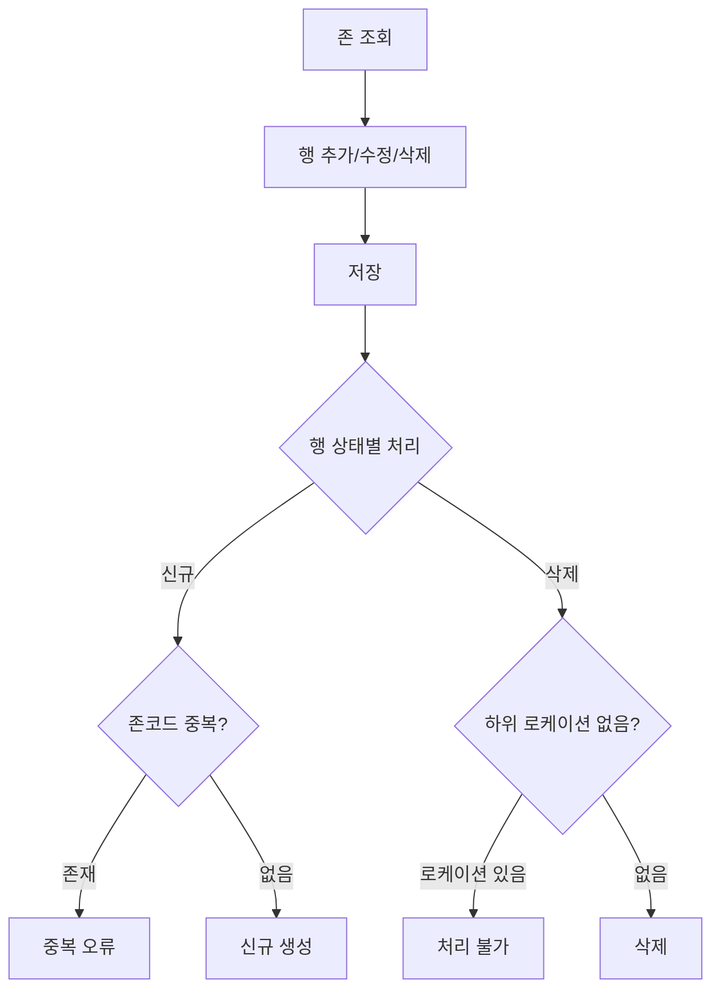
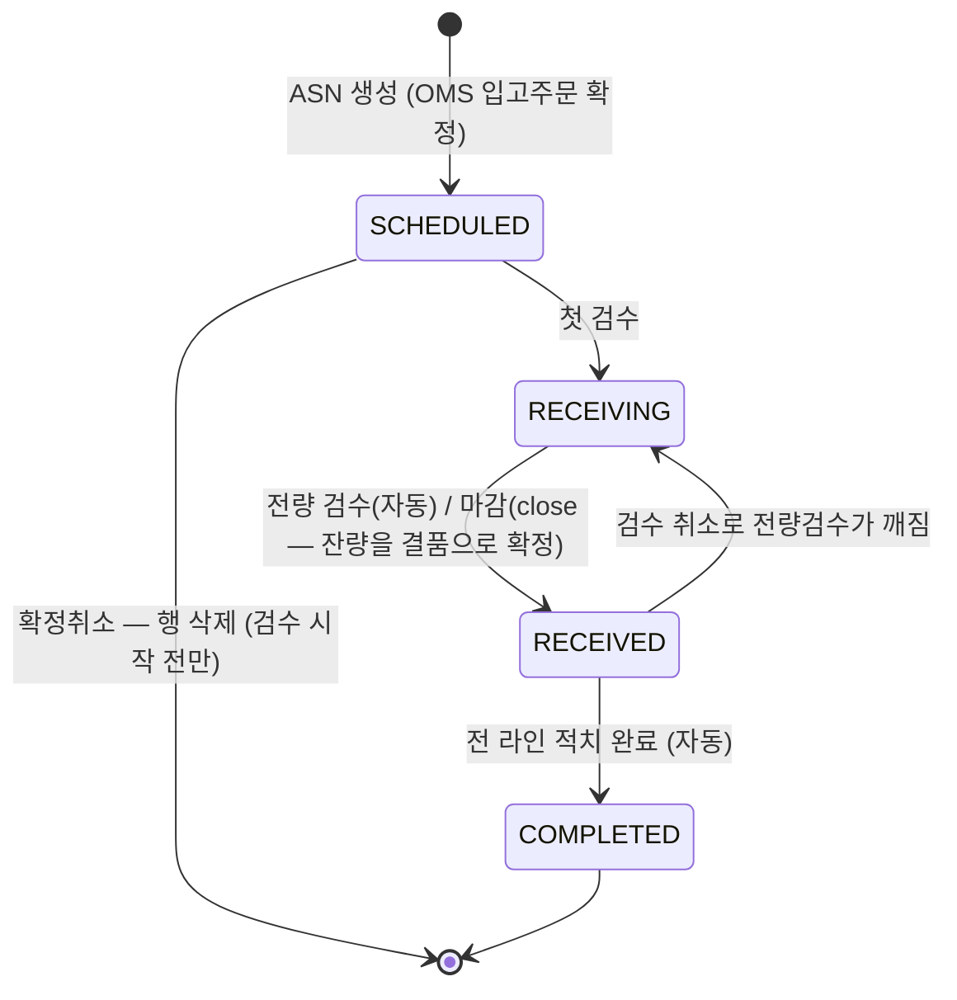
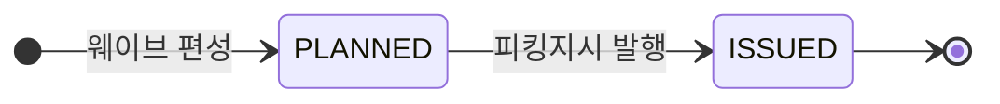
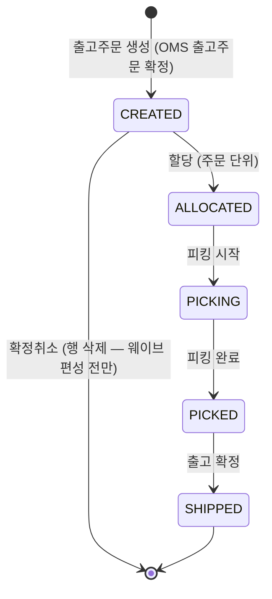

# WMS 프로세스 설계

입고 → 재고 → 출고 전체 흐름의 상태 전이와 재고 모델 설계. 구현보다 설계 판단을 먼저 확정하고, 각 판단의 근거를 여기에 남긴다.

## 도메인 설정

**식품/음료 유통 물류센터 (단일 센터, B2B 점포 출고)** 를 가정한다.

- Lot·유통기한·FEFO 할당이라는 핵심 설계가 의미를 갖는 도메인이고, 벤더 납품 입고에서 부분입고/마감 시나리오가 자연스럽다.
- 존 구성: `RCV-STAGE`(입고 스테이징) + 보관존은 온도대별 `DRY`(상온) / `CHL`(냉장) / `FRZ`(냉동). **단, 이건 시드 기본값이지 고정 목록이 아니다** — 존은 `zon` 마스터에서 등록·삭제한다(아래 「존 마스터」 참조).

도메인이 부여하는 v1 확장 규칙 2가지:

| 규칙 | 내용 |
|---|---|
| **온도대 제약** | 상품에 보관 온도대(DRY/CHL/FRZ), 로케이션에 존 온도대를 두고 적치·이동 시 불일치를 차단한다. 로케이션의 온도대는 그 로케이션이 속한 **존의 온도구분과 일치해야** 등록된다(보관 로케이션 한정 — 스테이징은 전 온도대가 거쳐 가는 지점이라 예외). |
| **납품기한 출고 제한** | 잔여수명 허용률(예: 40%)은 상품이 아니라 **납품처(점포) 기준정보**다 — 같은 상품이라도 납품처마다 요구 기준이 다르다. 점포 마스터(STORE)에 두고, 주문 점포의 허용률 미달 Lot을 할당 대상에서 제외한다. FEFO 정렬 **앞단의 필터**로 동작한다. |

v1 포함으로 승격: **재고 보류**(`inv.hld_qty` 보류수량 → 보류분은 가용재고에서 제외 — 「재고 보류」 절), **로케이션 용량 제약**(적치 전략의 전제. 형태는 **수량 상한**(`loc.max_qty`)으로 확정 — 입고 섹션 「적치 지시」 참고).

백로그(v1 제외): 폐기, 만료 Lot 자동 보류 배치, 3PL 멀티화주.

## 설계 원칙

**헤더 상태는 "워크플로가 어느 단계까지 진행됐는가"만 표현한다. 부분 여부(부분입고/부분할당)는 상태로 두지 않고 라인 수량에서 파생한다.**

- `PARTIALLY_RECEIVED` 같은 상태를 헤더에 두면 상태 조합이 늘어나고, 수량과 상태가 어긋나는 버그(라인은 전량 입고됐는데 헤더는 PARTIAL)가 생긴다.
- 부분 여부는 `expectedQty` vs `receivedQty` 비교로 항상 계산 가능하므로 중복 저장하지 않는다.

## 계량단위와 환산

**단위 목록은 공통코드 `UOM` 그룹이 갖고, 상품은 포장 목록(`prod_uom`)과 그중 어느 것이 입고단위·출고단위인지를 갖는다.** 단위에 전용 마스터 테이블을 두지 않은 이유는 화면 때문이다 — 그리드에서 행을 추가할 때 단위를 콤보박스로 고르는데, 그 목록을 온도대·보관유형 같은 다른 코드성 값과 다른 경로(`/master/uoms`)로 받을 이유가 없다. 전부 `/master/codes/{grpCd}` 하나로 통일한다. 박스로 받아 낱개로 내보내는 것이 유통센터의 기본 형태인데, 그 전까지는 입수량이 상품명 문자열에만 있었다(`'코카콜라 350ml (24입)'`).

| 컬럼 | 뜻 |
|---|---|
| `prod_uom (prod_id, uom_cd)` | 이 상품이 갖는 포장 하나. 낱개·박스·파렛트를 동시에 가질 수 있다 |
| `prod_uom.ea_qty` | 이 단위 1개 = 낱개 몇 개 (낱개 그 자체면 1) |
| `prod_uom.wgt` | 이 단위 1개의 중량(kg). 포장재 무게 포함 실측값, 미측정이면 NULL |
| `prod.inb_uom_cd` | 입고단위 — 벤더에게 발주하고 납품받는 단위. 포장 목록 안의 코드여야 한다 |
| `prod.outb_uom_cd` | 출고단위 — 출고주문서에 사람이 쓰는 단위. 역시 포장 목록 안의 코드 |

**환산수량을 상품에 한 칸으로 두지 않고 낱개수량으로 파생시킨다.** 상품당 한 칸이면 「입고단위 → 출고단위」 한 쌍만 표현되어 박스·파렛트를 함께 다룰 때 쌍마다 컬럼이 늘어난다. 낱개를 매개로 삼으면 어떤 두 단위든 환산된다 — `odr_qty × ea_qty(그 단위)`. 중량이 갈 자리가 생기는 것도 같은 이유다: 상품에 중량 한 칸을 두면 그게 어느 포장 기준인지 이름에 안 드러나고, 박스 중량을 「낱개중량 × 낱개수량」으로 파생하게 되어 포장재 무게(tare)가 사라진다.

**불변식: 창고(WMS)의 모든 수량 컬럼은 낱개(EA) 기준이다.** 입력 단위를 유지하는 곳은 OMS 주문 라인 둘뿐 — `oms_ib_line.odr_qty`(입고단위) · `oms_outb_line.odr_qty`(출고단위). 주문 원장은 사람이 쓰는 단위, 창고 장부는 낱개다.
(번복 — 원래 "모든 수량 컬럼은 출고단위" 확정이었다. 출고 경로에 환산이 없다는 이점 때문이었는데, 저장 단위가 상품 마스터의 한 컬럼(`outb_uom_cd`)에 따라 상품마다 달라지는 구조라 "이 숫자가 몇 개인가"를 늘 상품과 함께 읽어야 했고, 출고단위를 바꾸면 기존 수량 행 전체의 의미가 바뀌는 시한폭탄이 있었다. EA 통일로 저장 단위는 상수(常數)가 되고, 그 대가는 출고 확정 경계의 환산 한 번이다.)

- **환산은 OMS → WMS 경계 세 곳에서만 한다** — `OmsIbOrderService.confirm()`(발주 → ASN, 입고단위), `ReceivingService.receiveLine()`(검수 입력 → 저장, 입고단위), `OmsOutbOrderService.confirm()`(출고주문 → 창고 출고주문, 출고단위). 전부 `Prod.toEaQty()` 곱셈이라 수량이 깎일 수 없다. 이 세 곳 밖에서 환산을 추가하지 말 것 — 환산 지점이 흩어지면 어느 행이 어느 단위인지 사후에 복원할 방법이 없다.
- **검수 입력은 입고단위(발주단위) 개수다** (번복 — 원래 "검수 입력도 출고단위" 확정이었다). 출고단위 입력을 유지했던 이유는 예정수량과 같은 단위로 그대로 비교되게 하려는 것이었는데, 실무 검수는 박스·파렛트로 세므로 낱개 입력 강제가 그 자체로 오입력원이었다. 대신 화면이 예정·잔량·누계를 전부 입고단위로 환산해 보여줘 "예정 240 / 검수 [10]" 단위 혼선을 없앤다. **입고단위 정수만 허용한다** — 부분 박스는 표현할 수 없고, 입고단위로 딱 안 떨어지는 잔량은 마감으로 미입고 확정한다. **과입고(예정 잔량 초과)는 화면과 서버 양쪽에서 차단한다.**
- **수량 컬럼에 단위 컬럼을 딸려 두지 않는다.** 각 수량 옆에 `uom_cd`를 두면 `ck_inv_qty`·`ck_ib_line_qty` 같은 CHECK가 서로 다른 단위의 값을 비교하게 되어 무의미해진다. 단위는 상품이 갖고, 수량은 단위를 갖지 않는다.
- **낱개수량은 상품 마스터에 두고 문서에 스냅샷하지 않는다.** 발주 후 입수량이 바뀌면 이미 변환된 ASN의 예정수량과 어긋나지만, v1은 이를 허용한다 — 라인마다 환산값을 복사해 두면 마스터 수정이 과거 문서에 반영되지 않는 별개의 혼선이 생기고, 실제로 입수량이 바뀌는 빈도는 낮다. 백로그.
- `ea_qty >= 1`을 DB CHECK(`ck_prod_uom_ea_qty`)로 막는다. 0이면 검수가 재고를 0으로 만들고 음수면 재고를 음수로 민다 — 단위와 관련해 DB가 지켜주는 유일한 지점이다.
- 나누어떨어짐 검증은 폐지했다 (번복 — EA 통일 이전엔 입고단위 낱개수량이 출고단위 낱개수량의 배수인지 `ProdService`·`ProdUomService`가 저장 시점에 막았다. `toOutbQty`의 정수 나눗셈이 수량을 깎는 걸 막는 가드였는데, 환산이 곱셈만 남으면서 막을 것 자체가 사라졌다). 두 단위가 포장 목록 안에 있는지는 여전히 저장 시점에 본다(FK가 없으므로 DB는 모른다).
- **화면 주의**: 포장단위가 노출되는 곳은 OMS 입고주문 화면(발주 수량 = 입고단위), OMS 출고주문 화면(주문 수량 = 출고단위), 입고검수 화면(검수 입력·예정·잔량·누계 = 입고단위 환산)이다. 그 밖의 ASN 목록·적치·재고·출고(창고) 화면의 수량은 전부 낱개(EA)다 — 발주 10과 예정 240이 같은 물건이라는 게 화면에서 보여야 한다.

## 존 마스터

존(`zon`)은 로케이션의 상위 그룹이다. 존코드 · 존명 · 온도구분 · 보관유형(랙/평치/가상) · 업무구분(입고작업/출고작업/보관/피킹/반품/작업)을 갖고, 업무구분은 **존당 하나**다.

```mermaid
flowchart TD
    A[존 조회] --> B[행 추가/수정/삭제]
    B --> C[저장]
    C --> V{행 상태별 처리}
    V -->|신규| D{존코드 중복?}
    D -->|존재| X[중복 오류]
    D -->|없음| F[신규 생성]
    V -->|삭제| G{하위 로케이션 없음?}
    G -->|로케이션 있음| Y[처리 불가]
    G -->|없음| H[삭제]
```

- **하위 로케이션이 하나라도 있으면 삭제하지 않는다.** `loc.zon_cd`는 FK가 아니라 문자열 참조라 DB가 막아주지 않으므로 `ZonService`가 `LocRepository.existsByZonCd`로 직접 확인한다. 같은 이유로 **존코드는 등록 후 수정할 수 없다** — 코드를 바꾸면 하위 로케이션이 전부 고아가 된다.
- **온도구분·보관유형·업무구분에는 CHECK 제약을 걸지 않았다.** 값 목록의 주인은 공통코드(`TEMP_ZONE` · `STRG_TYP` · `BIZ_DVSN`)이고, 코드를 추가할 때마다 DDL을 고치게 만들지 않기 위해서다. 서버측 검증은 Java enum(`TempZone` · `StrgTyp` · `BizDvsn`)의 역직렬화가 담당한다. 이 코드베이스의 다른 마스터(`loc` · `prod`)는 CHECK를 갖고 있어 **존만 다른 방식**이라는 점에 유의할 것.
- 온도구분 컬럼은 `zon.tmp_zon`으로, `loc.tmp_zon` · `prod.tmp_zon`과 **이름과 값 도메인을 모두 공유**한다(공통코드 `TEMP_ZONE`, Java `TempZone` enum). 온도대 일치 검증이 상품 ↔ 로케이션 ↔ 존 세 군데를 관통해야 하므로 복제하지 않았다.

## 입고주문 (OMS)

**수정은 작성(CREATED) 상태에서만 가능하다.** 확정된 주문을 고치면 이미 나간 ASN의 예정수량과 어긋난다 — 창고는 옛 수량으로 받을 준비를 한 상태이고, 주문만 바꿔도 그 예정이 따라오지 않는다. 고치려면 확정취소를 먼저 거친다. 이 판정은 `OmsIbOrder.update()`가 하며, `revertConvert()`·`requireDeletable()`과 같은 자리에 둔다 — 호출 경로가 늘어도 불변식이 깨지지 않게 하려는 것이다.

**상태는 `CREATED ↔ CONFIRMED` 둘뿐이고 취소 상태를 두지 않는다.** 없앨 주문은 지운다 — 확정 전이면 바로, 확정 뒤면 확정취소로 되돌린 뒤에. 「지운 것도 아니고 쓰는 것도 아닌」 상태를 두면 목록·집계마다 그 상태를 빼는 필터가 따라붙고, 화면에서는 삭제와 취소 중 무엇을 눌러야 하는지가 매번 애매해진다(마스터에서 `us_yn`을 걷어낸 것과 같은 판단).

**용어를 「확정」으로 통일했다 — 화면·상태값·메서드·경로 전부.** 사용자가 하는 행위는 *발주를 확정한다*이고 ASN 생성은 그 **결과**다. 상태값이 결과(`CONVERTED`)를 가리키는 동안 화면 부제는 "확정", 버튼은 "ASN 변환"으로 갈려 있었다. 「변환」은 `docs/naming-dictionary.md`에 없는 단어이기도 했다 — `CNVR`은 **환산**(단위 환산)이라 오히려 헷갈린다. 사전에 있는 **확정 = `CFM`**을 쓴다(`converted_at` → `cfm_dt`). ASN이 생긴다는 사실은 버튼 이름이 아니라 툴팁·모달이 설명한다.

**ASN(`ib_order`) 쪽도 취소 상태를 두지 않는다 — 확정취소는 ASN 행을 삭제한다.** 검수 전의 예정은 아직 아무 일도 하지 않은 문서라 흔적 가치가 없고, `CANCELLED`를 남기면 입고예정 목록·집계마다 취소분을 빼는 필터가 따라붙는다(주문 쪽 취소 상태를 안 둔 것과 같은 판단). 재확정하면 새 입고번호로 새 행이 생긴다. `uq_ib_order_oms_active`는 평범한 유니크 인덱스로 "주문당 ASN 하나"를 강제한다. (원래는 CANCELLED로 남겨 부분 유니크였다 — 2026-07-31에 삭제 방식으로 전환, `migration-drop-asn-cancelled.sql`.)

**수정해도 주문번호는 바뀌지 않는다.** 예정일을 고쳐도 마찬가지다. 번호는 채번 시점의 식별자이지 예정일을 따라다니는 값이 아니고, 이미 그 번호로 벤더와 주고받은 이력이 어긋난다.

**라인은 통째로 갈아끼운다.** 어느 라인이 남고 어느 라인이 바뀌었는지를 클라이언트가 알려주지 않아도 되게 하려는 것이고, `orphanRemoval`이 빠진 라인을 지운다.

### 헤더 부가 항목 — 발주구분 · 담당자 · 비고

- **발주구분(`odr_dvsn`)은 지금 표시·분류용이다.** 공통코드 `ODR_DVSN`(정상/긴급/반품입고)을 문자열로 참조한다. 긴급이라고 적치·피킹 순서가 바뀌지는 않는다 — 그러려면 확정 시 ASN까지 값을 넘기고 전략이 그걸 읽어야 하며, 그건 별개의 결정이다.
- **비고(`rmk`)는 ASN으로 넘기지 않는다.** 발주 시점에 벤더에게 전할 메모라, 창고 작업 지시와 성격이 다르다. 창고에 전할 말이 필요해지면 ASN 쪽에 따로 칸을 두는 게 맞다.
- **담당자(`pic_nm`)는 감사 컬럼 `created_by`와 별개다.** 인증이 없어 `created_by`가 `admin` 고정이기도 하고, 대신 발주한 경우 실제 담당자가 다르다.

## 출고주문 (OMS)

**입고주문과 같은 2계층이다 — 원장은 OMS(`oms_outb_order`), 작업문서는 WMS(`outb_order`).** 확정하면 같은 트랜잭션에서 창고 출고주문이 생기고, 확정취소하면 그 행이 삭제되며 주문은 `CREATED`로 돌아온다. 상태도 `CREATED ↔ CONFIRMED` 둘뿐이고 취소 상태를 두지 않는다(없앨 주문은 지운다). 판단 근거는 전부 「입고주문 (OMS)」 절과 같으므로 반복하지 않고, **다른 점만** 적는다.

**① 상대가 벤더가 아니라 납품처(점포)다.** 컬럼은 `store_id`이고 화면 라벨이 「납품처」다. 사전에 `납품처=DLVPLC`가 있지만 쓰지 않았다 — FK 컬럼은 참조 테이블의 PK명을 그대로 쓴다는 규칙이 사전보다 위이기 때문이다. 점포는 잔여수명 허용률(`store.outb_life_rate`)을 갖고 있어 할당 시 Lot 필터의 기준이 되므로, 주문이 가리키는 것은 텍스트가 아니라 마스터여야 한다.

**② 확정 시 넘기는 값이 셋이다 — 납품처 · 출고유형(`outb_typ`) · 편수(`vhcl_fltno`).** 입고에서 `odr_dvsn`이 표시용이었던 것과 달리 이 둘은 **실제로 동작하는 값**이다. 웨이브 전략의 편성 조건이 정확히 이 두 필드(`WaveOrderField`)라서, 주문 시점에 정해지지 않으면 창고가 주문을 묶을 수 없다. 그래서 복사가 아니라 전달이 목적이다.

**③ 수량을 환산하지 않는다.** `oms_outb_line.odr_qty`는 출고단위 기준이고 확정 시 `outb_line.odr_qty`로 1:1 복사된다. DB에서 입고단위인 컬럼은 `oms_ib_line.odr_qty` 하나뿐이라는 불변식(위 「계량단위와 환산」 절)이 여기서도 유지된다 — 출고는 재고를 저장 단위 그대로 덜어내는 일이라 단위가 갈릴 이유가 없다.

**④ 확정취소를 막는 지점이 「검수 시작」이 아니라 「웨이브 편성」이다.** `OutbOrder.requireRevertible()`은 `CREATED`이면서 웨이브에 담기지 않은 문서만 통과시킨다. 편성된 주문을 지우면 그 웨이브의 피킹지시와 전략 실행 로그가 존재하지 않는 주문을 가리키게 된다 — 되돌리려면 웨이브에서 빼는 것이 먼저다.

**출고예정일(`expct_de`)을 새로 두고, 웨이브 편성 대상 기간의 기준을 주문일에서 이쪽으로 옮겼다.** 그전에는 `outb_order.odr_de` 하나가 「들어온 날」과 「나갈 날」을 겸했다. 주문 원장이 생기면서 둘이 갈라졌고, 웨이브는 정의상 *같은 날 나갈 주문*을 묶는 단위라 기간 필터가 출고예정일을 봐야 한다(`OutbOrderSearchCond.dateFrom/To` · `WaveStgyExecRequest.expctDeFrom/To`). `odr_de`는 주문이 등록된 날로 남아 확정 시 복사된다.

**창고 쪽 취소(`outb_order.CANCELLED`)를 폐지하고 확정취소 하나로 모았다.** 같은 「없앤다」를 두 조작이 다르게 처리하고 있었다 — 취소는 행을 `CANCELLED`로 눕히고 주문을 확정으로 두었고, 확정취소는 행을 지우고 주문을 작성으로 되돌렸다. 화면에서는 무엇을 눌러야 하는지가 매번 애매했고 목록·집계에는 취소분을 빼는 필터가 따라붙는다. ASN이 같은 이유로 `CANCELLED`를 폐지한 선례를 따랐다(위 「입고주문 (OMS)」 절). `POST /outbound/orders/{id}/cancel`은 제거됐다(`migration-drop-outb-cancelled.sql`).

## 입고 (Inbound)

```mermaid
stateDiagram-v2
    [*] --> SCHEDULED : ASN 생성 (OMS 입고주문 확정)
    SCHEDULED --> RECEIVING : 첫 검수
    SCHEDULED --> [*] : 확정취소 — 행 삭제 (검수 시작 전만)
    RECEIVING --> RECEIVED : 전량 검수(자동) / 마감(close — 잔량을 결품으로 확정)
    RECEIVED --> RECEIVING : 검수 취소로 전량검수가 깨짐
    RECEIVED --> COMPLETED : 전 라인 적치 완료 (자동)
    COMPLETED --> [*]
```

- 라인에 `expctQty` / `rcvdQty` / `ptawyQty`를 두고 부분입고는 수량으로만 표현.
- **`RECEIVED`를 다시 둔다** (이전 판단 번복): "검수가 끝났음"과 "적치까지 끝났음"은 서로 다른 액션이 종결시키는 별개 사건이라 한 전이로 못 합친다. 앞의 것은 **결품 확정**(더 안 올 잔량을 미입고로 못박는 사람의 판단), 뒤의 것은 **실물 이동 완료**다. 하나로 합치면 "검수는 끝났으니 결품을 확정하고 싶은데 적치가 안 끝나서 못 닫는" 구간이 상태 없이 떠 있게 된다.
- **결품 확정 시점은 마감(`close`)이고, 종료(`COMPLETED`)는 자동 전이다.** 결품수량을 별도 컬럼에 계산해 박는다면 마지막에 "입고확정" 액션이 필요하겠지만, 우리는 결품이 `expctQty - rcvdQty`로 항상 파생되고 그 확정은 이미 마감에서 끝난다. `RECEIVED` 이후 남은 일은 적치뿐이다 — 사람이 누를 것이 없는 버튼은 두지 않는다.
  - `RECEIVED` 진입 경로는 둘: 전량 검수되면 자동, 덜 왔는데 더 안 오면 명시적 마감. 후자만 사람의 판단이 필요하다.
  - **`COMPLETED` 선행 조건: 전 라인 `ptawyQty == rcvdQty`** (미적치 잔량 0). 미적치인 채로 닫으면 `RCV-STAGE`에 실물이 남았는데 문서는 닫혀 그 재고를 옮길 화면 진입점이 사라진다.
- 검수는 v1에서 별도 문서로 분리하지 않고 입고 처리 시 수량 입력으로 처리한다. 실무 검수가 개수 대조 수준이라 **불합격 수량은 두지 않는다** — 안 온 것(결품)과 온 것(검수수량) 두 값이면 충분하다.

### 입고 제약 (검수 관문) — 미구현 · 백로그

> **현재 코드에 이 규칙은 하나도 없다.** `ReceivingService`에 검증이 없고, 기준값을 담던 `prod.ib_life_rate`는 삭제했다 — 값(전 상품 70)을 넣기만 하고 읽는 코드가 없는 write-only 컬럼이었다. 아래는 구현할 때의 설계이지 현재 동작이 아니다.

**FEFO 창고의 방어선은 출고가 아니라 입고에 있다.** 출고쪽 잔여수명 필터는 이미 있는데(점포 기준) 입고쪽에 문턱이 없으면, 창고가 처음부터 못 내보낼 물건을 받아 재고로 쌓는다. 문턱은 검수 단계에 둔다 — 전략 테이블 없이 **검수 저장 시 규칙 2개를 코드로 검증**하는 형태로 간다.

| 규칙 | 내용 | 기준값 |
|---|---|---|
| **잔여수명 하한** | `(expiryDt - 입고일자) / shelfLifeDays < 기준률`이면 검수 차단 | **전역 기본값 + 상품 override** (아래) |
| **역순 입고 차단** | 같은 상품에 **재고가 남아있는** Lot의 최대 제조일자보다 과거인 제조일자는 검수 차단 | 컬럼 없음 (기존 Lot에서 파생) |

- **기준률은 전역 기본값을 두고 상품에는 예외만 둔다** (판단 번복). 원래는 상품 전용 컬럼(`prod.ib_life_rate`)이었고 근거는 "벤더에 두면 유통기한 3일짜리와 1년짜리에 같은 비율이 걸려 무의미하다"였다. **이 근거는 틀렸다** — 판정식이 이미 `shelfLifeDays`로 나누므로 비율은 척도에 무관하다(40%면 3일짜리는 1.2일, 365일짜리는 146일). 상품별로 두어야 할 진짜 이유는 따로 있다: 정규화 뒤에도 허용 비율은 품목 성격을 탄다(삼각김밥은 80%, 스팸은 30%도 무방). 하지만 그건 유통기한 길이에 비례하지 않는 **카테고리 문제**이고, 상품 하나하나에 값을 채우게 만들면 결국 전부 비어 미적용이 된다 — 실제로 그렇게 됐다. 그래서 전역값이 항상 걸리고 상품은 예외만 갖는다.
- 출고쪽 `store.outb_life_rate`와는 **주체가 다르므로**(출고는 "납품처가 요구하는 기준", 입고는 "우리가 받아주는 기준") 값을 공유하지 않는다. 입고 기준은 출고 기준보다 높아야 정상이다 — 받을 때 이미 40%면 점포에 내보낼 창이 남지 않는다.
- **역순 입고를 막는 이유**: 뒤늦게 더 오래된 물건을 받으면 그 Lot이 즉시 FEFO 최우선 할당 대상이 되어, 이미 나가기로 정해져 있던 순서가 통째로 뒤집힌다. 비교 대상은 **재고가 0인 Lot을 제외**한다 — 다 나가고 껍데기만 남은 Lot이 영구히 입고를 막으면 안 된다.
- 유통기한 미관리 상품(`shelf_life_days`가 NULL)는 두 규칙 모두 대상이 아니다 (제조일자 자체가 NULL).
- 구현 시 **차단만** 한다. 강제 입고 override 경로는 두지 않는다 (권한 모델이 없어 "누가 승인했나"를 기록할 수 없다). 백로그.
- 제조일자 기준 잔여비율은 유통기한 기준 잔여비율과 같은 값을 다른 쪽에서 잰 것이라 규칙을 하나만 둔다.
### 적치 (Putaway)

- **적치는 "재고 이동"의 특수 케이스로 모델링**: 검수 시 스테이징(`RCV-STAGE`)에 재고가 증가하고, 적치는 스테이징 → 보관 로케이션으로의 MOVE다. 적치를 별도 재고 개념으로 두지 않아 모델이 단순해진다.
- **적치는 헤더 상태와 무관하게 즉시 가능**: 스테이징에 쌓인 수량(`rcvdQty - ptawyQty`)이 있으면 마감 전이라도 적치할 수 있다 — 미룰 이유가 없다. 검수와 적치는 순서가 아니라 수량으로 맞물리며 `RECEIVING` 구간 안에서 병행된다.
- **적치 대상 목록은 라인이 아니라 (라인, Lot) 배치 단위로 한 행이다**: 한 라인의 `rcvdQty`가 여러 날 나눠 검수돼 서로 다른 Lot에 걸쳐 있을 수 있는데(증분 검수), 라인 단위로 뭉치면 "입고일자" 같은 배치 고유 정보(Lot마다 다른 `receiptDt`)를 한 행에 담을 수 없다. `inv_hist`를 `(ib_line_id, lot_id)`로 그룹핑해 스테이징에 남은 수량(`SUM(qty)`)이 있는 조합만 반환한다. 이를 위해 `inv_hist`에 `ib_line_id`를 둔다(검수 취소도 같은 컬럼을 재사용).
- 같은 Lot을 서로 다른 주문이 공유하는 경우(같은 상품+입고일자+제조일자), 다른 주문이 먼저 실물을 적치해 스테이징 잔량이 모자라면 "재고 부족" 오류가 난다 — 실물이 이미 이동한 것이므로 정상 동작으로 간주한다.

#### 적치 지시 (putaway_task)

**지시 생성(전략이 로케이션을 정함)과 지시 실행(실물 MOVE)을 분리한다.** 작업자는 지시를 보고 움직이고, 시스템은 지시 대비 실적을 추적한다. 지시 없이 화면에서 로케이션을 직접 골라 옮기던 기존 방식은 지시 실행으로 대체된다.

- **레코드**: `putaway_task(ib_line_id, lot_id, to_loc_id, drct_qty, cmpl_qty, status)`. `from_loc`는 항상 `RCV-STAGE`라 컬럼으로 두지 않는다. 지시와 실적을 두 테이블로 나누지 않는 이유는 실적의 실체가 이미 `inv_hist`의 MOVE 2행이기 때문이다 — 지시 한 테이블 + `cmpl_qty`로 충분하다.
- **로케이션 용량은 수량 상한(`loc.max_qty`)으로 정한다** (미결정 해소). "1로케이션 1상품"은 식품 유통센터의 혼재 보관 현실과 맞지 않고, 용량이 곧 0/1이 되어 분할 지시가 불가능해진다.
  - `적재가능수량 = loc.max_qty − 해당 로케이션 현재고 − 미완료 지시 잔량(SUM(drct_qty − cmpl_qty))`
- **지시는 로케이션을 선점하지 않는다** (미결정 해소). 위 계산식의 `미완료 지시 잔량` 항이 선점 역할을 대신한다. 적치 대상은 아직 **스테이징 재고**라 출고 할당(보관 재고 대상)과 애초에 경합하지 않는다 — 잠글 것이 없다.
  - **부분 번복 예정 (2026-08-03)**: `aloc_qty` = 예약수량 일반 확정에 따라, 적치지시도 스테이징 재고를 `aloc_qty`로 예약하는 방향으로 바꾼다 — 적치지시 구현 시 반영. 이렇게 되면 검수취소의 「미완료 적치지시가 있으면 차단」 특례가 가용수량 체크 하나로 단순화된다. **TO 로케이션 용량**은 지금처럼 미완료 지시 잔량 파생식이 담당하되, 이동지시(`inv_mov_task`)의 유입 잔량도 같은 항에 합산해야 한다(이동지시 쪽은 이미 그렇게 계산한다 — `InvMovService` 참고).
  - 추천 쿼리에만 용량 조건을 걸면 추천과 지시 사이의 변동을 막지 못한다. **지시 생성 시점에 위 식으로 재검증**한다 — 추천과 검증을 같은 식으로 두 번 하는 것이 요지다.
- **지시는 권고가 아니라 명령이다** (미결정 해소): 지시와 다른 로케이션으로의 적치는 막는다. 허용하면 용량 계산이 즉시 실제와 어긋나 제약 자체가 무의미해진다. 다른 곳에 두려면 **지시 취소 후 재지시**한다 (`cmpl_qty = 0`인 지시만 취소 가능).
- **용량이 모자라면 로케이션을 1:N으로 분할한다**: 한 배치가 한 로케이션에 다 안 들어가면 후보를 우선순위(`pikng_prty`) 순으로 순회하며 적재가능수량만큼 잘라 여러 지시로 쪼갠다. 분할이 없으면 용량 제약이 곧 "적치 불가"가 된다.
- **후보 산출**: 상품 온도대와 일치하는 `STORAGE` 중 적재가능수량 > 0인 것을 `pikng_prty` 오름차순. v1의 "전략"은 이 한 가지 규칙이며 전략 마스터 테이블은 두지 않는다 — 규칙이 하나인데 조건·우선순위 테이블을 만들면 데이터만 늘고 분기는 그대로다.
- **적치 실행은 지시 한 건 단위**다. 지시가 이미 (라인, Lot, 로케이션, 수량)을 확정해 놨으므로 실행은 수량만 받는다(부분 실행 허용 → `cmpl_qty` 누적). FEFO 소진 순서는 지시 생성 시 배치 목록의 유통기한 정렬이 이미 대신한다.

### 수량의 원천 — 캐시 컬럼은 두되 증분 갱신은 금지

`ib_line.rcvd_qty` / `ptawy_qty`는 **`inv_hist`에서 파생 가능한 값의 캐시**다. 캐시를 두는 순간 위험한 것은 조정 경로에서 `ptawy_qty = ptawy_qty - 작업수량`처럼 증분 차감을 하는 패턴이다 — 원천 SUM과 컬럼이 어긋날 수 있는 경로가 생긴다. 그 경로를 아예 만들지 않는다.

- **원천**: `rcvdQty = SUM(qty)` where `ib_line_id` = ? and `tx_typ in (RECEIVE, ADJUST)` / `ptawyQty = SUM(qty)` where `tx_typ = MOVE and qty > 0`.
- **규칙**: 검수·검수취소·적치 어느 경로든 컬럼을 직접 증감하지 않고, **재계산 후 덮어쓰기** 한 곳(`IbLine#recalcQty`)만 거친다. 어긋날 수 있는 경로 자체를 없앤다.
- **그럼에도 컬럼을 남기는 이유**: ① 목록 화면이 라인마다 이력을 집계하면 그대로 N+1 집계가 된다 ② `CHECK (ptawy_qty <= rcvd_qty)`가 애플리케이션 버그의 최후 방어선 역할을 하는데, 컬럼이 없으면 DB가 검증할 대상도 사라진다.

### v1에서 제외하는 것

| 항목 | 제외 사유 |
|---|---|
| 입고유형(정상/반품)과 반품 시 비정상 재고 상태 | 반품 입고는 별도 프로세스(검수 기준·귀책 판정)를 끌고 온다. 재고 보류 상태를 먼저 넣고 그 위에 얹는다 |
| ~~입수량(EA_QTY) 단위 환산 (박스 ↔ 낱개)~~ | **v1 포함으로 승격됨** — 아래 「계량단위와 환산」 참고 |
| 입고조정(확정 후 수량 정정) | 확정 후 정정은 재고 조정(ADJUST) 화면으로 처리한다 — 닫힌 입고 문서를 되열지 않는다 |
| 적치완료 취소 | 실물이 이미 보관에 앉은 것을 되돌리는 것이므로 재고 이동(MOVE) 화면의 일이다. 입고 문서의 책임이 아니다 |

### 검수 취소

검수 중 실수로 잘못 입력한 건을 되돌리는 기능. 라인 전체를 리셋하는 게 아니라 **개별 검수 건(1회 저장 호출) 단위 취소**.

- 전제: `inv_hist.ib_line_id`(위 적치 항목과 공용)로 이 라인이 만든 검수 이력만 정확히 조회한다. `rfn_doc_no`(입고번호)만으로는 한 주문에 동일 상품 라인이 여럿일 때 구분이 안 된다.
- 조건: ① 주문이 `RECEIVING` 또는 `RECEIVED`일 때만. 전량 검수 시 `RECEIVED`로 자동 전이하므로 `RECEIVING`만 허용하면 마지막 검수 건을 되돌릴 방법이 사라진다. `COMPLETED`는 막는다 — 같은 Lot을 공유한 다른 주문 때문에 스테이징 잔량이 남아있을 수 있어 잔량 체크만으로는 끝난 주문의 수량이 되돌아갈 수 있다. ② 취소 수량만큼 해당 Lot의 스테이징 `onHandQty`가 남아있어야 함(이미 적치된 분은 취소 불가). ③ **해당 라인에 미완료 적치 지시가 있으면 차단** — 지시가 스테이징 잔량을 이미 예약한 상태라, 잔량 체크만으로는 지시받은 물량을 밑에서 빼가게 된다.
- 처리: Lot 스테이징 `onHandQty` 차감 + `inv_hist`에 `ADJUST` 타입으로 `-수량` 기록 + 라인 수량 재계산(위 「수량의 원천」). 원 이력 건은 수정하지 않고 반대 방향 기록을 추가한다 (append-only 원장 원칙 유지).
- 취소로 전량검수가 깨지면 헤더를 `RECEIVED → RECEIVING`으로 되돌린다. 이게 없으면 상태는 `RECEIVED`인데 `rcvdQty < expctQty`가 되어 남은 수량을 다시 검수할 수 없는 상태로 고착된다.
- Lot 자체는 삭제하지 않는다 (이력 보존 목적 — 재고 0인 Lot이 남아있어도 무방).

## 출고 (Outbound)

입고의 거울상으로 설계한다: 입고가 `RECEIVE(스테이징 +) → MOVE(스테이징→보관)`이면, 출고는 `PICK(보관→출고스테이징) → SHIP(출고스테이징 반출)`이다.

웨이브와 주문은 별개의 상태 기계다. 웨이브는 **할당이 아니라 피킹지시의 발행 단위**이며, 주문의 `CREATED→ALLOCATED` 전이는 주문 단위 할당 화면이 트리거한다.

```mermaid
stateDiagram-v2
    direction LR
    [*] --> PLANNED : 웨이브 편성
    PLANNED --> ISSUED : 피킹지시 발행
    ISSUED --> [*]
```

```mermaid
stateDiagram-v2
    [*] --> CREATED : 출고주문 생성 (OMS 출고주문 확정)
    CREATED --> [*] : 확정취소 (행 삭제 — 웨이브 편성 전만)
    CREATED --> ALLOCATED : 할당 (주문 단위)
    ALLOCATED --> PICKING : 피킹 시작
    PICKING --> PICKED : 피킹 완료
    PICKED --> SHIPPED : 출고 확정
    SHIPPED --> [*]
```

### 웨이브 (피킹지시 발행 단위)

출고 흐름은 **주문 생성 → 웨이브 편성 → 할당 → 피킹지시 → 피킹 → 출고확정** 이다. 입고의 `검수 → 적치지시 → 적치`와 대칭을 이룬다.

- **웨이브는 피킹지시의 발행 단위다** — 여러 주문의 집품을 한 번에 지시하기 위한 그룹. 주문은 반드시 웨이브에 편성돼야 피킹지시를 받는다(주문 1건짜리 웨이브도 허용).
- **편성 경로는 둘: 수동 · 웨이브 전략.** 전략은 「출고유형 · 차량편수」 조건으로 미편성 주문을 걸러 전략마다 웨이브 하나를 만든다(`wav_stgy`). 두 값을 `outb_order`에 컬럼으로 둔 이유는 **웨이브가 「같은 유형·같은 차수에 실릴 주문만 묶는」 단위**여서다 — 기준값이 주문 헤더에 없으면 그 묶음을 조건으로 표현할 수 없다.
- 편성 출처(`wav_reg_typ` = STGY/MANUAL)를 남긴다. 조건으로 표현하기 어려운 묶음은 결국 수동으로 하게 되므로, 수동 편성은 금지 대상이 아니라 **가시화** 대상이다 — 전략 조건과 맞지 않는 주문이 웨이브에 있는 상황을 화면이 구분해 보여준다.
- **할당은 웨이브를 대상으로 실행한다**(2026-08-03 번복 — 아래). 할당 화면에서 웨이브를 골라 자동(FEFO)/수동으로 실행하며, 이것이 v1의 유일한 할당 진입점이다. **웨이브에 편성되지 않은 주문은 할당 대상이 아니다** — 대상 조회가 웨이브에서 출발하고, 편성되지 않으면 어차피 피킹지시를 받지 못한다. 급한 주문 하나만 할당해야 하면 주문 1건짜리 웨이브를 만든다.

  > **번복 이력.** 원래는 *"할당은 웨이브가 아니라 주문 단위다. 웨이브 릴리즈(=웨이브 단위 일괄 할당)는 v1에서 제외한다. 할당 화면에서 **주문을 골라** 할당한다"*였다. 뒤집은 이유는 **피킹지시가 웨이브 단위**이기 때문이다 — 할당만 주문 단위로 두면 편성(웨이브) → 할당(주문) → 피킹지시(웨이브)로 흐름 중간에서 단위가 한 번 어긋나고, 아래 「미결정」 항목(웨이브에 미할당 주문이 섞였을 때)이 바로 그 어긋남의 증상이다.
  >
  > **「웨이브 릴리즈 없음」은 그대로다.** 도입한 것은 웨이브를 **실행 파라미터**로 쓰는 것이지 웨이브에 **할당 상태**를 주는 것이 아니다 — 웨이브 상태 기계는 `PLANNED → ISSUED` 둘 그대로이고 할당이 건드리지 않으며, 할당 결과는 전부 주문 상태·라인 수량·재고 예약에 남는다. 그래서 `RELEASED → ISSUED` 개명(`migration-wave-issued.sql`)의 근거 둘(「릴리즈」라는 동작이 없다 / `inv_hld.RELEASED`와 한 토큰이 두 뜻이 된다)이 모두 유효하다.
- 웨이브 상태는 `PLANNED`(편성중, 주문 담기 가능) → `ISSUED`(피킹지시 발행 완료) 둘뿐이다. 발행 이후의 진행(피킹/확정)은 전부 주문 단위로 흐르므로 웨이브는 여기서 역할이 끝난다.
- **피킹지시 엔티티를 둔다**: 웨이브에 묶인 주문들의 할당 레코드를 모아 로케이션 순으로 정렬한 지시를 발행한다. 지시 행은 **할당 레코드와 1:1**이며, 상품×로케이션으로 뭉치는 배치 피킹은 도입하지 않는다 — 뭉치면 집품 후 주문별 분류 공정이 추가로 필요해지는데 v1은 그 복잡도를 회피한다. 웨이브가 주는 이점은 "여러 주문의 집품 동선을 한 번에 정렬"까지다.
- **미결정**: 웨이브에 미할당 주문이 섞여 있을 때 지시 발행을 차단할지, 할당된 주문만 발행하고 나머지는 남길지. 진입 단위가 웨이브로 통일되면서 **증상은 줄었지만 사라지지는 않았다** — 부분할당은 여전히 가능하다. 판정 재료는 라인의 미할당 잔량(`odr_qty − SUM(aloc_qty)`)이고, 할당 API가 그 파생값을 응답·조회 양쪽에 노출한다.

### 재고 할당 (웨이브 단위 실행 · 라인 단위 결과)

**웨이브를 대상으로 실행해서, 그 안의 출고주문 라인을 채운다.** 계층이 셋이고 하는 일이 다르다 — **웨이브**는 화면 선택과 실행 파라미터(상태는 바뀌지 않는다), **상품**은 후보 조회와 락의 그룹 단위, **라인**은 요청수량과 할당 결과(`outb_alloc`)다. 구현은 `OutbAllocService`.

- **동기 · 단일 트랜잭션이다.** 웨이브를 여러 건 골라도 도중 실패하면 이번 실행 전체가 롤백된다(부분 성공 없음 — 웨이브 전략 실행의 「부분 편성 없음」과 같은 판단). 대가가 작은 이유는 **재고 부족이 실패가 아니기 때문**이다. 비동기로 가면 진행 플래그·상품별 병렬·부분 성공이 줄줄이 따라오고 결과를 화면에 돌려줄 수 없어진다.
- **대상 웨이브**: `PLANNED` 중 `SUM(odr_qty) > SUM(aloc_qty)`. 라인별 과할당이 막혀 있어 합계 잔량 > 0 과 「잔량 있는 라인의 존재」가 같은 뜻이다. 빈 웨이브는 조회되지 않고, `ISSUED`는 대상이 아니다(추가 할당이 「지시 없는 할당」을 만든다 — 지시 이후 재할당은 피킹지시 구현 시 결정). **주문 쪽 검색조건은 전부 `EXISTS`**라 조건은 어느 웨이브를 보여줄지만 정하고 수량은 언제나 웨이브 전체다 — 조건으로 좁힌 합계를 내리면 할당 합계와 기준이 어긋나 잔량이 틀어진다.
- **라인을 상품별로 모아 처리한다** — 같은 상품의 여러 라인이 후보 리스트 하나를 순서대로 소진하므로 그룹당 조회·락이 1회다. 한 주문에 동일 상품 라인이 둘이어도 이중 배분이 구조적으로 불가능해진다. **상품별 병렬은 두지 않는다**(부분 성공 금지 원칙).
- **그룹 안 라인 순서 = `expct_de → outb_no → outb_line_id`.** 먼저 처리된 라인이 재고를 먼저 가져가므로 이 순서가 곧 우선권인데, 점포 마스터에 우선순위·그룹·유형 컬럼이 없어 업무적 우선순위를 만들 재료가 없다 — 남는 것은 **도착순(출고번호순)**이다.
- **재고 부족 시 순차 소진이 기본값이다.** 앞선 라인이 채울 수 있는 만큼 다 가져간다. 부분할당을 허용하고 백오더가 없으므로, 나누면 **모든 주문이 부분출고**가 되어 어느 점포도 만족하지 못한다. 순차 소진은 「완전 출고 주문 수」를 최대화한다. 대가는 뒤 순번 점포가 굶는 것이고, 이건 파생된 사실이 아니라 **업무 정책 선택**이다.

  > **번복 이력 (2026-08-03).** 원래는 *"균등분배를 도입하지 않는다"*였다 — 위 근거로 순차 소진을 **코드에 고정**한 것이다. 할당 전략(아래 「전략이 정하는 것 / 코드가 정하는 것」) 도입으로 **선택지로 승격**한다: 순차 소진은 그대로 기본값이고, 관리자가 분배 슬롯을 등록하면 주문 비율·균등으로 바꿀 수 있다. 뒤집은 이유는 위 근거가 틀려서가 아니라 **적용 범위가 좁아서**다 — 「어느 점포도 만족하지 못한다」는 판단은 정기 배송처럼 다음 회차가 곧 오는 경우에 맞고, 한 번의 배분이 그대로 결과가 되는 경우(행사·긴급 배분)에는 오히려 균등이 맞는다. 코드가 하나를 고르면 다른 하나가 불가능해지지만, 전략이 고르면 둘 다 가능하다. **기본값을 순차 소진으로 남기는 것이 이 번복의 절반**이다 — 전략을 만들지 않은 창고는 지금과 똑같이 동작한다.
- **수동할당**도 웨이브 컨텍스트를 유지한다(진입 단위를 하나로 통일). 다른 것은 후보를 사람이 고른다는 것과 **잔여수명 필터가 차단이 아니라 경고**라는 것뿐이고, 저장 경로는 자동할당과 같은 함수다. 검증은 **요청의 전 행 합계**로 한다 — 행마다 따로 보면 각각은 통과하는데 합계가 주문수량을 넘는 요청이 통과한다.
- **할당해제**는 `pikng_qty = 0`인 행만. 「아직 지시되지 않은 잔량만 되돌린다」가 이 조건 하나로 표현되므로 **할당차수 컬럼을 두지 않는다**(재할당은 행이 하나 더 생기는 것으로 누적된다).
- 주문의 각 라인마다 FEFO로 할당한다.
- **할당 전략: FEFO** (Lot 유통기한 임박 순) → 동순위 시 로케이션 우선순위(`loc.pikng_prty`). Lot 관리를 하는 이상 FIFO보다 FEFO가 도메인 요구에 맞는다.
- **점포 잔여수명 필터가 FEFO 앞단에 붙는다**: 주문 점포의 `store.outb_life_rate`로 Lot을 먼저 거른 뒤 FEFO 정렬한다 — 같은 상품이라도 A점포엔 되는 Lot이 B점포엔 안 될 수 있다. 상품별로 모아 조회한 후보에 **라인마다** 그 점포 기준을 건다.
  - **비율의 분모까지 Lot에서 뽑는다**(`expiry_dt − mfg_dt`). `prod.shelf_life_days`(마스터의 현재값)를 분모로 쓰면 ① 분자가 Lot 스냅샷인데 분모가 마스터라 유통기한일수를 고치는 순간 기존 Lot 전체의 비율이 움직여 「소급 영향 없음」이 깨지고 ② 「벤더가 찍은 유통기한 ≠ 제조일자 + shelf_life_days」가 정상 데이터인데(「재고 속성변경」 절) 그 경우 비율이 100%를 넘거나 실제보다 후하게 나온다. **판정에도 `shelf_life_days`를 쓰지 않는다** — 상품을 관리 → 미관리로 전환하는 순간 기존 Lot이 전부 필터를 통과해버린다. 미관리 상품의 Lot은 두 날짜가 NULL이라 자연히 대상에서 빠진다.
  - 입고 검수 `SHELF_LIFE_PCT`가 `shelf_life_days`를 그대로 쓰는 것과 **의도적으로 다르다** — 입고는 Lot이 생성되는 그 시점에 판정하므로 스냅샷과 마스터가 같은 값이지만, 출고는 몇 달 뒤에 재고 그 사이에 마스터 변경과 속성 정정이 끼어든다.
  - **기준일은 출고예정일**(`expct_de`)이다. 점포가 요구하는 것은 「납품 시점의 잔여수명」이라, 할당 실행일로 재면 할당을 며칠 앞당길수록 통과 Lot이 늘어나 기준이 흔들린다.
  - **유통기한이 지난 Lot은 비율과 무관하게 제외한다** — `outb_life_rate = 0`인 점포에도 줄 수 없다. 필터와 별개의 하드 가드이고, 수동할당 후보에서도 빠진다.
- **정렬(FEFO)과 락 취득 순서(`inv_id`)를 분리한다.** 한 상품 그룹이 여러 `inv` 행을 잡는데 FEFO 순서는 id 순서와 달라, 후보가 겹치는 두 실행이 각자 FEFO 순으로 잠그면 서로 반대 순서가 되어 데드락이 난다. **후보를 FEFO로 늘어놓되 락은 id 오름차순으로 한 건씩** 걸고, 상품 그룹 순회도 `prod_id` ASC로 고정한다(검수·속성변경의 「상품 → Lot」 락 순서와 같은 성격의 결정).
  - **필요한 만큼이 아니라 후보 전체를 잠근다** — 필요분만 잠그면 락 후 가용이 줄었을 때 안 잠근 후보가 뒤늦게 필요해지고, 그 순간 더 작은 id를 추가로 잡아 규칙이 깨진다.
  - `WHERE id IN (…) ORDER BY id` 일괄 락을 쓰지 않는다 — `ORDER BY`는 결과 정렬을 보장할 뿐 **락 획득 순서를 보장하지 않는다**. 정렬된 id를 순차 호출하는 것만이 보장된 형태다.
  - 후보를 엔티티로 먼저 읽어두지 않고 **id만 받아 락을 걸며 처음 읽는다** — 먼저 읽으면 영속성 컨텍스트에 올라가 락을 걸어도 값이 갱신되지 않아 낡은 가용수량을 쓰게 된다.
- 할당은 헤더가 아닌 **라인 단위 Allocation 레코드**(`outb_alloc`: 주문라인 ↔ 재고(상품+Loc+Lot), 수량)로 기록한다. 같은 `(라인, 재고)` 조합은 새 행을 만들지 않고 **기존 행에 합산한다** — DB에 그 조합의 UNIQUE가 없어 중복 행이 허용되지만 화면과 해제 단위가 이유 없이 쪼개진다. 할당 가능 수량은 **가용재고(`onHand − aloc − hld`)**다 — 보류분(「재고 보류」 절)은 후보에서 자연히 빠진다. 후보 `inv` row에 락을 걸고 `aloc_qty`를 증가시키며, 물리 이동이 아니므로 **이력에는 남기지 않는다**. `aloc_qty`는 출고 할당 전용이 아니라 **예약수량 일반**이다(2026-08-03 확정) — 이동지시(`inv_mov_task`)도 같은 컬럼으로 재고를 선점하며, 원천별 내역은 각자의 테이블(`outb_alloc` / `inv_mov_task`)이 담당한다. **항등식: `aloc_qty` = 원천별 미소진 잔량 합** — 「이력 합계 = 스냅샷」과 별도의 대사 축이다.
- **재고 부족 시 부분할당을 허용하고 그대로 넘어간다**(백오더 없음). 헤더 상태는 원칙대로 수량(`odr_qty` vs `SUM(aloc_qty)`)에서 파생 판단하고, 미충족 잔량은 별도 상태/레코드로 두지 않는다 — 파생 조회로만 확인한다.

#### 전략이 정하는 것 / 코드가 정하는 것 (2026-08-03)

할당 전략(`aloc_stgy`)은 위 규칙들을 **없애는 것이 아니라 슬롯 단위로 덮어쓴다.** 그래서 전략을 하나도 만들지 않으면 이 절의 동작이 그대로 유지된다 — 「전략 없음」은 미설정 결함이 아니라 정상 상태다.

| 전략이 바꿀 수 있는 것 | 미설정 시 (= 이 절의 기본값) |
|---|---|
| 후보 재고의 계층 (존 업무유형으로 분할, 앞 계층부터 소진) | 계층 없음 — 보관 재고 전체가 한 덩어리 |
| 후보 필터 (잔여수명 기준을 점포 기준 대신 고정값으로) | 점포 기준(`store.outb_life_rate`) |
| 재고 소진 순서 | FEFO → `loc.pikng_prty` → `loc_cd` |
| 라인 처리 순서 (= 우선권) | `expct_de → outb_no` |
| 부족 시 배분 방식 | 순차 소진 |

**전략이 건드릴 수 없는 것** — 보관 로케이션만 · 가용재고 > 0 · 유통기한 경과 Lot 제외 · 과할당 금지 · 락 순서(`inv_id` ASC)와 상품 그룹 경계 · 정렬의 마지막 동률 해소(`inv_id`/`outb_line_id`). 앞의 넷은 정합성의 전제이고 뒤의 둘은 재현성의 전제라, 정책이 아니라서 화면에 옵션으로 세우지 않는다. 특히 **정렬(전략)과 락 순서(고정)의 분리**는 위 「정렬과 락 취득 순서를 분리한다」가 전략 도입 후에도 그대로 성립해야 하는 이유다 — 관리자가 정렬을 바꿔도 락 순서는 `inv_id` ASC로 고정이다.

- **전략은 실행 1회당 1건 확정한다.** 처리 단위인 상품 그룹이 웨이브를 가로지르므로(여러 웨이브의 같은 상품이 한 그룹), 웨이브마다 다른 전략을 고르면 한 후보 풀을 두 정의가 다른 순서로 소진하게 되어 정렬도 배분도 성립하지 않는다.
- **수동할당은 전략 밖이다** — 후보를 사람이 고르는 업무라 정렬·배분이 의미를 갖지 않는다. `outb_alloc.aloc_stgy_id`가 NULL로 남아 화면에서 구분된다(전략 미설정 기간의 할당도 같은 NULL이다 — 「전략 없이 만들어짐」이 두 경우를 한 뜻으로 덮는다).
- 미충족의 근거는 결품 테이블이 아니라 **판정 근거(trace)**다 — 「이 라인이 왜 이만큼만 받았나」에 답할 자리를 결품 레코드 대신 여기에 둔다. 다만 **전략 실행분만 durable하다**: `stgy_exec_log`의 `stgy_id`·`rvsn_no`가 NOT NULL이라 전략 없이 실행된 할당은 로그를 남길 수 없고, 그때 trace는 실행 응답(화면)에만 있다. 로그를 남기려고 「전략 없음」용 센티널 전략 행을 만들지는 않는다 — 근거를 남기자고 「전략이 있다」는 사실을 위조하는 셈이 된다. 미충족 **수량**은 어느 경우든 파생값(`odr_qty − SUM(aloc_qty)`)으로 남으므로, durable하지 않은 것은 사유뿐이다.

### 피킹 · 출고확정 (2단계 물리 모델)

- **피킹은 발행된 피킹지시를 소진하는 실행이다** — 지시 행을 골라 실적 수량을 입력한다.
- **피킹 = 보관 → `SHIP-STAGE`(출고 스테이징) MOVE**, `tx_typ=PICK`으로 출발(-)/도착(+) 2행 기록. 보관 `inv`는 `onHandQty -= q` **와 함께 `alocQty -= q`**(실물이 나가므로 예약을 소진 — `alloc <= onHand` 불변식 유지), SHIP-STAGE `inv`는 `onHandQty += q`. `outb_alloc.pikng_qty`를 누적한다. 전 할당의 `pikng_qty == aloc_qty`가 되면 주문이 PICKED로 전이한다.
- **출고확정 = SHIP-STAGE에서 반출**, `tx_typ=SHIP`으로 SHIP-STAGE `inv.onHandQty -= q` 1행. 보관 `alocQty`는 피킹 시점에 이미 소진됐으므로 여기선 SHIP-STAGE 재고만 뺀다(이중처리 없음). 주문이 SHIPPED로 전이하고 `shmt_dt`을 기록한다.
- **왜 2단계인가**: 피킹과 확정을 한 번에 차감하면 `PICK`/`SHIP` 두 tx_typ 중 하나가 무의미해지고, 입고(RECEIVE→적치)와의 대칭도 깨진다. 출고 스테이징에 실물이 잠깐 머무는 게 실제 상하차 흐름과도 맞는다. `SHIP-STAGE`는 `RCV-STAGE`와 동일하게 `loc_typ=STAGE`이고 온도대는 플레이스홀더 — 반출 지점이라 온도 제약은 서비스에서 스킵한다.

### 취소

- **취소 상태를 두지 않는다.** 없앨 출고주문은 상위 OMS 주문의 **확정취소**가 행을 지운다 — 창고 쪽에만 있던 `CANCELLED`는 폐지했다(위 「출고주문 (OMS)」 절).
- **되돌릴 수 있는 구간은 웨이브 편성 전까지다**(`OutbOrder.requireRevertible()`). 편성된 뒤에 지우면 그 웨이브의 피킹지시와 전략 실행 로그가 존재하지 않는 주문을 가리킨다 — 웨이브에서 빼는 것이 먼저다.
- 할당까지 간 주문을 되돌리는 경로는 **할당 해제**다(`outb_alloc` 삭제 + `inv.aloc_qty` 복원, 물리 이동 전이라 이력 없음). 해제로 `CREATED`에 돌아온 뒤에야 확정취소가 열린다 — 「없애기」와 「할당 되돌리기」를 한 버튼에 섞지 않는다.
- **피킹 시작 이후 취소는 v1에서 지원하지 않는다**(보상 트랜잭션 범위 제한). 실물이 이미 SHIP-STAGE로 이동해, 되돌리려면 역방향 MOVE가 필요하므로 백로그로 미룬다.

## 재고 (Inventory)

재고 키: **상품 + Location + Lot**

두 테이블을 함께 운용한다:

| 테이블 | 역할 |
|---|---|
| `Inventory` (현재고 스냅샷) | `prod + location + lot` 유니크. `onHandQty`, `alocQty`(예약), `hldQty`(보류) 보유. **재고수량(onHand) = 가용 + 예약 + 보류**이고 가용재고는 `onHand - aloc - hld`로 파생 (컬럼 아님 — 넷 중 파생 가능한 가용을 저장하지 않는다. onHand를 저장하는 이유는 물리 변동 ±가 곧바로 대응해 「이력 합계 = 스냅샷」 대사가 되기 때문). 할당 시 락을 거는 지점. |
| `InventoryHistory` (재고 이력) | 모든 **물리적** 변동(RECEIVE, MOVE, ADJUST, PICK, SHIP)을 ±수량과 참조 문서(입고번호/주문번호)로 append-only 기록. |

- **할당은 물리 이동이 아니므로 이력에 기록하지 않는다.** 할당 상태는 Allocation 테이블이 담당한다.
- **불변식: 이력 합계 = 현재고 스냅샷.** 재고를 변경하는 모든 코드는 반드시 (1) 이력 1건 기록 + (2) 스냅샷 갱신을 한 트랜잭션에서 수행한다.
- 실무에서 재고 이력은 대부분 "조회용 기록"에 그친다. 이 프로젝트에서는 이력을 검증 가능한 원장으로 격상한다: 대사(reconciliation) 배치가 불일치를 감지하고, 이력 리플레이로 스냅샷을 재구성할 수 있어야 한다.

### 재고 이동 (이동지시 2단계)

보관 ↔ 보관 이동은 **이동지시(예약) → 이동확정(실물 MOVE)** 2단계다. 구현은 `InvMovService`.

- **등록이 FROM 재고의 `aloc_qty`를 선점한다** — 이동 FROM은 보관 재고 = FEFO 할당 후보 그 자체라, 선점 없이는 지시 걸린 수량을 할당이 밑에서 빼간다(적치지시가 선점을 안 두는 것과 전제가 반대). 예약은 물리 이동이 아니므로 이력에 남기지 않는다.
- **실적 테이블은 없다** — 실적의 실체는 `inv_hist`의 `MOVE` 2행(`rfn_doc_typ=INV_MOV`, `rfn_doc_no`=지시번호)이고, 분할확정은 확정 횟수만큼 2행이 쌓인다. 지시번호는 건당 유일(라인 구조 없음)이라 번호만으로 실적↔지시가 정확히 매칭된다.
- **지시는 명령**(적치지시와 동일): 지시 TO와 다른 로케이션으로 확정 불가, 다른 곳에 두려면 잔량 취소 후 재지시. 상태 집합도 `putaway_task`와 동일(`DIRECTED/DONE/CANCELLED`), 취소는 행 보존.
- **이동구분(`mov_dvsn`)**: `INV_MOV` 재고이동 / `PTAWY` 적치 / `PIKNG` 피킹. 재고이동 화면의 등록은 `INV_MOV` 고정이고 **확정·취소도 `INV_MOV`만 허용**한다 — 적치·피킹 지시가 이 테이블로 들어와도 각자의 화면 경로에서만 처리된다(각자의 화면 경로 전용). 적치·피킹 지시의 테이블 통합 여부(별도 `putaway_task` 유지 vs 흡수)는 각 지시 구현 시 결정한다.
- TO 용량은 등록 시점에 `max_qty − 현재고 − 미완료 지시 유입 잔량`으로 검증한다(적치와 같은 식 — 컬럼 선점 없음).

### 재고 보류 (수량 방식, 2026-08-03 확정)

특정 재고 행의 일부/전량을 수량 단위로 묶어 가용재고에서 뺀다. 구현은 `InvHldService`.

- **보류는 상태가 아니라 수량이다** (v1 초기 구상이던 「행 단위 재고상태」 번복). 부분수량 보류와 등록/해제 사유별 히스토리 보존이 요구사항이라 행 상태로는 부족했다. `inv.hld_qty`가 보류수량이고 재고상태 컬럼은 없다.
- **예약과 보류는 배타다**: 재고수량(onHand) = 가용 + 예약(aloc) + 보류(hld). 보류는 가용에서만 잡고, 예약분은 보류할 수 없다. `ck_inv_qty`가 `aloc_qty + hld_qty <= on_hand_qty`로 최후 방어한다.
- **보류/해제는 물리 이동이 아니므로 `inv_hist`에 기록하지 않는다**(할당·이동지시 예약과 같은 판단). `on_hand_qty` 불변. 대신 보류의 원장은 전용 3테이블이다 — 보류 건(`inv_hld`: 보류번호·재고 키·보류수량·해제누계·상태 `HELD`/`RELEASED`) + 보류 실적(`inv_hld_acrst`) + 해제 실적(`inv_hld_rlz_acrst`). 「물리 변동의 실적 테이블을 두지 않는다」 원칙의 유일한 예외인데, 보류는 `inv_hist`(수량 원장)에 실을 수 없으면서 사유 히스토리를 남겨야 하기 때문이다.
- **사유는 공통코드**(보류사유 `HLD_RSN` / 해제사유 `HLD_RLZ_RSN` 그룹) + **기타(`ETC`)일 때만 자유 텍스트**(`rsn_dscr`). 같은 재고 행에 사유코드가 다른 보류는 병존 가능하고, 동일 사유의 미해제 중복은 부분 UNIQUE 인덱스로 막는다.
- **해제는 특정 보류 건을 지목**하며 부분 해제를 허용한다(잔량 = `hld_qty − rlz_qty` 파생). 오등록 취소도 별도 상태 없이 해제(사유: 오등록)로 흡수한다 — 보류는 등록 즉시 발효라 「실행 전 취소」에 해당하는 구간이 없다.
- **v1 보류 대상은 보관(`STORAGE`) 로케이션 재고만.** 스테이징까지 허용하면 적치지시·출고확정의 수량 체크에도 파급이 생긴다 — 필요해지면 확장.
- **항등식: `inv.hld_qty` = SUM(보류 건 미해제 잔량)** — `aloc_qty` 항등식과 같은 별도 대사 축.
- 파급: 할당(FEFO)·이동지시등록의 가용 계산에 `− hld`, `inv` 행 자동 삭제 조건은 재고수량 0(= onHand·aloc·hld 모두 0).

### 재고조사 (실사, 2026-08-03 확정)

조사 범위를 잡아 라인을 만들고(전산수량 스냅샷) 실사수량을 입력한 뒤, 확정 시점에 차이를 `ADJUST`로 보정한다. 구현은 `InvStktkService`.

- **재고 수량 정정의 유일한 경로다.** 건별 즉시 조정 화면을 두지 않고, 특정 재고 하나의 정정도 범위를 좁게 잡은 조사로 수행한다(입고 확정 후 수량 정정 포함 — 위 「입고조정」 항목이 가리키는 곳이 여기다).
- **조정수량 = 실사수량 − 확정시점 전산수량.** 확정이 라인별로 재고 행 락을 걸고 전산수량을 다시 읽어(`cfm_sys_qty`) 그 차이를 조정한다 — 확정 후 `on_hand_qty`는 실사수량과 정확히 일치한다. 조사 생성 시점 스냅샷(`sys_qty`)은 「시작할 때는 얼마였나」의 기록으로 남아 화면의 「조사 중 변동됨」 표시에 쓰인다. **대가는 실사 이후 들어온 입고분이 실사값에 덮이는 것**이고, 실사와 입고를 같은 시간대에 돌리지 않는 운영으로 막는다.
- **실적 테이블은 없다** — 실적의 실체는 `inv_hist`의 `ADJUST` 행(`rfn_doc_typ=INV_STKTK`, `rfn_doc_no`=조사번호)이다. 「이력 1건 + 스냅샷 갱신 = 한 트랜잭션」 불변식을 그대로 지킨다.
- **조사는 재고를 선점하지 않는다** — 예약이 아니므로 생성·취소가 `aloc_qty`도 이력도 건드리지 않는다. 그래서 같은 재고에 조사가 겹쳐도 이중 반영이 없다(각자 확정시점 값을 다시 읽는다).
- 차이 0 라인은 `ADJUST`를 남기지 않고(`ck_invh_qty`) 사유도 요구하지 않는다. 실사수량 미입력(NULL)은 「미조사」로 건너뛰며 0(실물 없음)과 구분된다.
- 실사수량이 예약+보류보다 적으면 확정을 막는다 — 할당 해제·이동지시 취소·보류 해제로 먼저 정리해야 한다(`ck_inv_qty`가 최후 방어).
- **v1 조사 대상은 보관(`STORAGE`) 로케이션 재고만.** 스테이징은 적치·출고확정이 소진 중이라 세는 시점이 불안정하다 — 보류·이동의 경계와 같다.
- 장부에 없는 재고(발견재고·기초재고)는 라인 수동 추가로 담아 (+)조정이 `inv` 행을 만든다. **Lot은 기존 것만 고른다** — Lot 생성은 검수의 소관이다. 이 경로에는 **온도대·적재가능수량 검증을 걸지 않는다**(실사는 사실을 적는 업무다). 그렇게 생긴 재고 행을 이후 할당·이동이 그대로 신뢰하는 것은 알려진 구멍이고, 잘못된 조합은 다음 조사의 (−)/(+) 조정으로 바로잡는다.
- 상태는 워크플로 단계만(`CREATED` → `CONFIRMED` / `CANCELLED`). 확정 후 재정정은 되열지 않고 새 조사를 만든다(append-only).

### 재고 속성변경 (Lot 속성 정정, 2026-08-03 확정)

Lot의 **제조일자·유통기한 오입력**을 정정한다. 구현은 `LotAttrChngService`.

- **수량이 아닌 속성만 다룬다.** 재고상태 전환은 재고 보류가, 수량 정정은 재고조사가 담당하므로 이 화면에 남는 것은 Lot의 두 날짜뿐이다. **재고를 한 톨도 움직이지 않는 유일한 처리**라 `inv`도 `inv_hist`도 건드리지 않고, 정정의 원장은 `lot_attr_chng` 한 테이블이다(수량 원장에 실을 수 없다는 점에서 보류 실적 테이블과 같은 예외 성격).
- **정정 가능한 것은 `mfg_dt`·`expiry_dt` 둘뿐이다.** `prod_id`·`lot_no`·`receipt_dt`는 Lot의 정체성이다 — 특히 `receipt_dt`는 배치 재사용 키의 일부이자 `lot_no`(`LOT-YYMMDD-NNN`)의 근거라, 바꾸면 번호가 입고일과 어긋난다. 상품이 틀린 재고는 정정 대상이 아니라 재고조사의 (−)/(+) 조정 대상이다.
- **유일한 구조적 위험은 배치 재사용 키 충돌이다.** 검수(`ReceivingService.findOrCreateLot`)는 `(상품+입고일자+제조일자)`가 같으면 기존 Lot을 재사용하는데, 제조일자 정정이 그 키를 바꾼다. 겹치면 같은 배치를 가리키는 Lot이 둘이 되어 이후 검수가 어느 쪽을 재사용할지 비결정이 된다. **`uq_lot`은 `(prod_id, lot_no)`에만 걸려 DB가 잡아주지 않으므로 서비스 검증이 유일한 방어선**이고(「FK가 하나도 없다」와 같은 성격), 동시성은 **검수와 같은 락 순서(상품 → Lot)**로 직렬화한다.
- **유통기한을 `제조일자 + shelf_life_days`로 강제하지 않는다.** `expiry_dt`는 생성 시점 계산 스냅샷일 뿐이고, 오히려 「벤더가 찍은 값이 계산값과 다르다」가 이 화면의 주 사용처다. 서버는 `expiry >= mfg`·`mfg <= receipt`만 본다(화면이 재계산값을 기본값으로 제안하되 덮어쓸 수 있다).
- **유통기한 미관리 상품(`shelf_life_days IS NULL`)의 Lot은 대상이 아니다** — 두 날짜가 항상 NULL인 것이 그 상품의 정의다. 값을 넣는 것은 정정이 아니라 관리방식 전환이고 그건 상품 마스터의 소관이며, 전환해도 소급 적용하지 않는다(스냅샷 원칙).
- **Lot 단위 정정이다** — 그 Lot을 공유하는 모든 재고 행(로케이션이 달라도)에 일괄 반영된다. 정정 즉시 FEFO 정렬과 점포 잔여수명 필터가 새 값을 보지만 **이미 생성된 할당은 건드리지 않는다**(재검증·재할당 없음 — 이후 할당부터). 유통기한을 앞당기는 정정이 기존 할당을 잔여수명 미달로 만들 수 있고, 그 처리는 할당 취소·재할당(출고 소관)이다.
- **취소 경로가 없다** — 되돌리는 정정을 한 번 더 한다. `lot_attr_chng`가 append-only라 왕복이 그대로 이력에 남는다. 채번은 하지 않는다(어디서도 참조되지 않는 로그다 — 보류의 `hld_no`·조사의 `stktk_no`가 필요했던 이유가 여기엔 없다).
- **대사 축이 늘지 않는다.** 수량을 건드리지 않으므로 「이력 합계 = 스냅샷」·`aloc_qty`·`hld_qty` 항등식 어느 것에도 영향이 없다.

## 동시성 (핵심 차별화 포인트)

동시에 두 주문이 같은 재고를 할당하려는 상황이 WMS의 대표적인 동시성 문제다.

원래 계획은 이랬다:
1. 락 없이 동시 할당 시 재고가 음수가 되는 것을 **재현하는 테스트**를 먼저 작성
2. 비관적 락(`PESSIMISTIC_WRITE`)과 낙관적 락(`@Version` + 재시도)을 **둘 다 구현**
3. 부하 도구로 동시 요청을 걸어 처리량/실패율을 측정하고, 수치 근거로 전략을 선택해 README에 기록

**세 단계 모두 보류한다 (2026-08-03).** 두 가지 이유이고, 앞의 것이 더 근본적이다.

- **1번은 지금 코드에서 성립하지 않는다.** 이 계획이 쓰인 뒤에 `inv.version`(`@Version`)과 `ck_inv_qty`가 들어왔다. 그래서 **「락 없이」라는 상태 자체가 존재할 수 없고**(평범한 JPA 갱신 경로에 낙관적 락이 항상 걸린다) **재고가 음수가 될 수도 없다**(DB가 거부). 문서대로 쓴 테스트는 "재현 실패"로 통과하는데, 그건 안전해서가 아니라 재현하려는 상태를 만들 수 없어서다.
- **동시 트랜잭션을 돌릴 인프라가 없고, 들이지 않기로 했다.** 테스트 의존성은 `spring-boot-starter-test` 하나뿐이고 기존 테스트는 전부 Mockito 단위 테스트다. 나중에 도입한다면 **Testcontainers Postgres**다 — H2는 `SELECT FOR UPDATE` 의미와 `ck_inv_qty` 지원이 운영과 달라 「재현했다」고 믿을 수 없어 이 테스트의 목적을 잃는다.

**따라서 락 방식은 비관적 하나로 좁힌다.** 두 방식을 나란히 두는 목적이 「수치 근거로 고르는 것」인데 잴 수단이 없으면 근거 없는 스위치가 하나 늘 뿐이다. `@Version`은 그대로 살아 있다 — 비관적 락과 배타가 아니고, `SELECT FOR UPDATE`가 예약 구간을 직렬화하므로 정상 경로에서 버전 충돌이 날 일이 없으며, 락을 안 거는 다른 경로가 같은 행을 건드리면 그때 최후 방어로 작동한다.

**남는 방어선을 적어둔다** — 테스트가 없다고 규칙이 없어지는 것은 아니다:

| 방어선 | 무엇을 막나 | 상태 |
|---|---|---|
| `ck_inv_qty` | 음수 재고 · 과예약(`aloc + hld > on_hand`) | DB가 항상 막는다 |
| 락 취득 순서(`inv_id` 오름차순) | 데드락 · lost update | **코드 리뷰로만 지켜진다** ← 가장 약한 고리 |
| `Inv.@Version` | 락을 안 거는 경로와의 충돌 | 항상 켜져 있다 |

통합 테스트를 도입하게 되면 **락 순서 규칙의 데드락 재현이 첫 번째로 쓸 테스트**다(`OutbAllocService.lockCandidates()`에 이유를 주석으로 남겨뒀다).

## 진행 순서

1. ~~상태 전이 설계~~ (이 문서)
2. 엔티티 확정 — 마스터(상품, Location, Lot) → 입고 → 재고 → 출고/할당
3. 시더 — 입고→출고 프로세스를 시간순으로 리플레이하는 물동량 시뮬레이터 형태
4. 할당 동시성: 락 전략 2종 구현 + 부하 측정
5. 대시보드 (React 19 + Vite + Tailwind + ag-grid, 프론트 별도 레포)