# WMS 출고(출고운영) 화면 프로세스 정의서

> 대상: 출고 화면군 (출고예정 / 출고웨이브 / 재고할당·수기할당 / 피킹지시 / 피킹완료·확정(납품처별·총량) / 분배 / 박스라벨 / 패킹 / 상차 / 출고확정 / 출고조정 / 조회성 화면)
> 목적: 화면별 **업무 프로세스 뼈대와 핵심 검증·로직**만 정리한다. 구현 세부(호출구조·테이블·컬럼)는 제외.

---

## 공통 원칙

- 출고는 **주문 → 웨이브 → 할당 → 피킹 → (분배) → 패킹 → 상차 → 출고확정** 순으로 진행되며, 각 단계는 출고 진행상태로 관리된다.
- 저장/처리/취소는 **트랜잭션 단위**로 처리되어, 도중 오류 시 전체 취소(롤백)된다.
- **할당은 재고를 예약(선점)** 하고, **피킹은 실제 로케이션에서 재고를 집품**하며, **출고확정 시 재고가 최종 차감**된다.
- 각 단계는 이전 단계가 완료되어야 진행 가능하고, 취소는 **후행 작업이 없을 때만** 허용된다. (단 재고할당 취소는 **아직 지시되지 않은 마지막 차수분**에 한해 예외적으로 허용된다 — §3 참조)
- 할당 시 재고가 부족하면 부족분은 **결품**으로 기록된다.
- 피킹은 **납품처별(개별)** 방식과 **총량(집품 후 분배)** 방식 두 가지로 운영되며, **피킹지시 시점에 유형이 결정**되어 웨이브에 기록된다.

### 출고 진행상태 흐름

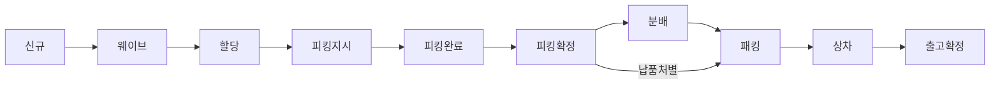

> 총량 방식은 피킹확정 후 **분배 → 패킹 → 상차**를 거치고, 납품처별 방식은 분배 없이 패킹으로 진행한다.

## 화면 분류

| 화면 | 유형 | 처리 |
|------|------|------|
| 출고예정 | ⚙️ 프로세스 | 출고주문 생성 / 취소 |
| 출고웨이브 | ⚙️ 프로세스 | 웨이브 생성(수동 / 전략 선택실행 / 전략 자동실행 / 마스터만 생성) / 취소 |
| 재고할당 · 수기할당 | ⚙️ 프로세스 | 할당(전략=비동기 / 수기=동기) / 할당취소(웨이브 단위 · 할당건 단위) |
| 피킹지시 | ⚙️ 프로세스 | 피킹지시(+조건부 보충 이동지시) / 취소(웨이브 단위 · 지시건 단위) |
| 피킹완료(납품처별·총량) | ⚙️ 프로세스 | 피킹완료(부분 피킹 가능, 실이동) / 취소(라인 전량) |
| 피킹확정(납품처별·총량) | ⚙️ 프로세스 | 피킹확정 / 취소 |
| 분배 | ⚙️ 프로세스 | 총량피킹분 납품처별 분배 |
| 박스라벨 | ⚙️ 프로세스 | 박스라벨 발행 |
| 패킹 | ⚙️ 프로세스 | 포장확정 / 취소 |
| 상차 | ⚙️ 프로세스 | 상차확정 / 취소 |
| 출고확정 | ⚙️ 프로세스 | 출고확정 / 취소 |
| 출고조정등록 | ⚙️ 프로세스 | 출고 후 수량조정 |
| 출고현황 / 작업로그 / 출고조정내역 / 출고결품내역 | 🔎 단순조회 | 조회 전용(작업로그는 로그 삭제 포함) |

---

# ⚙️ 프로세스 화면

## 1. 출고예정 (출고주문 생성 / 취소)

출고 예정건을 확정하여 **출고주문(작업 대상)** 을 생성한다. 생성 시 출고 가능 여부(보류 기준)를 점검한다.

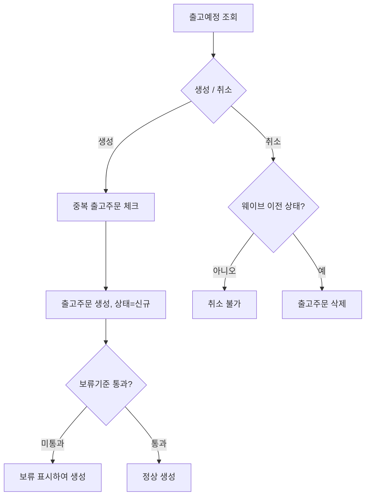

**핵심 검증/로직**
- 이미 출고주문이 생성된 건은 재생성 불가
- **취소는 "웨이브 생성 이전(신규)" 상태만 가능**
- 보류기준(상품운영/UOM/로트속성/고정로케이션/마감 상품) 미충족 시 보류 상태로 생성 (입고예정과 동일 로직)
- **테이블 변경**: 출고주문(헤더/상세) **생성(INSERT)** / 취소 시 **삭제(DELETE)**, 재고 수량 변동 없음

---

## 2. 출고웨이브 (웨이브 생성 / 취소)

출고주문들을 **작업 단위(웨이브)** 로 묶는다. 웨이브는 **마스터(웨이브명·웨이브전략·출고일자를 갖는 빈 그릇) + 디테일(편입된 출고주문 라인)** 2계층이며, 편입의 실체는 **출고주문 라인의 진행상태를 신규 → 웨이브로 전이**시키는 것이다.

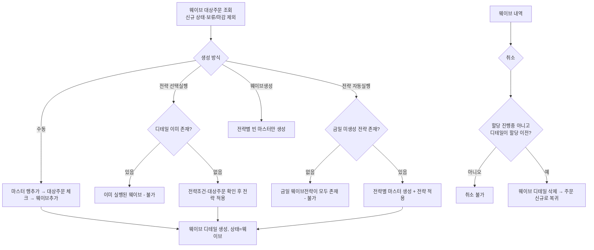

**생성 경로 4가지**

| 경로 | 동작 | 재실행 방지 기준 |
|------|------|-----------------|
| 수동(웨이브추가) | 대상주문을 체크해 선택한 웨이브에 편입 | 없음(반복 추가 가능) |
| 전략 선택실행 | 선택한 웨이브의 전략을 실행해 조건에 맞는 주문 자동 편입 | **디테일 존재 여부** |
| 전략 자동실행 | 금일 미생성 전략 전체에 대해 마스터+디테일 일괄 생성 | **금일 전략별 생성 여부** |
| 웨이브생성 | 금일 미생성 전략 전체에 대해 **빈 마스터만** 생성 | 〃 (자동실행과 공유) |

- **웨이브생성을 먼저 실행하면 자동실행이 막힌다** — 두 기능이 같은 "금일 미생성" 판정을 쓰기 때문. 이 경우 각 웨이브를 선택실행으로 채워야 한다.
- 마스터를 저장하지 않고 바로 웨이브추가/선택실행을 해도 **서버가 마스터를 먼저 생성**한다.

**핵심 검증/로직**
- **웨이브 대상주문**: 아직 어떤 웨이브에도 속하지 않은 **신규 상태** 라인만. **보류·마감 주문은 제외**되고, 센터상품 미등록 상품은 **경고 없이 대상에서 누락**된다.
- **처리 가드 2종** — ① 웨이브 **할당 진행 중**(할당 작업이 점유 중)이면 불가 ② 웨이브 디테일 중 **할당(300) 이상 진행된 라인이 하나라도 있으면** 불가. 가드는 웨이브 단위 판정이라, 같은 웨이브에 할당된 라인이 있으면 아직 미할당인 라인도 취소할 수 없다.
- 위 가드는 **수정·삭제·웨이브추가·웨이브취소에만** 적용되고, **전략 실행 경로에는 적용되지 않는다**(재실행 방지 검사가 대체).
- 전략 실행 시: 전략조건(적용+조건)이 등록되어 있어야 하고, 선택실행은 대상주문이 0건이면 오류로 중단된다(자동실행은 **오류 없이 빈 웨이브 생성**).
- **전략 조건에 맞지 않는 주문은 아무 메시지 없이 제외**된다 — 편입/미편입 건수 안내가 없다.
- **디테일이 붙은 웨이브는 전략코드·출고일자를 변경할 수 없다**(웨이브명만 수정 가능).
- **주문 마스터 상태 롤업은 MAX 기준** — 한 라인만 웨이브에 편입돼도 주문 마스터는 웨이브 상태로 전진하고, 복귀하려면 **전 라인이 신규로 되돌아와야** 한다. (입고의 MIN 롤업과 반대)
- **테이블 변경**: 웨이브 마스터/디테일 **생성(INSERT)** + 주문 상세·마스터 상태 **갱신(수정)** + OMS 주문 상태 **동기화(수정)** / 취소 시 웨이브 디테일 **삭제(DELETE)** + 결품내역 **삭제(DELETE)** + 주문 상태 **복원(수정)**. **재고 수량 변동 없음**.
- **웨이브 취소는 디테일만 지운다** — 전 라인을 취소해도 빈 마스터가 남으므로 별도로 행삭제+저장해야 정리된다.
- 웨이브 마스터가 **할당(300) 이상으로 진행되면 웨이브 화면 조회 대상에서 제외**된다.
- 처리 대상에 **마감된 주문이 섞이면 배치 전체가 롤백**된다(부분 성공 없음).

---

## 3. 재고할당 · 수기할당 (할당 / 취소)

웨이브에 묶인 출고주문 라인에 대해 **어느 로케이션·로트의 재고를 쓸지 결정하고 그 재고를 예약(선점)** 한다. 재고는 물리적으로 이동하지 않는다. 전략 자동할당과 사용자가 직접 지정하는 수기할당이 있으며, 부족분은 결품 처리된다.

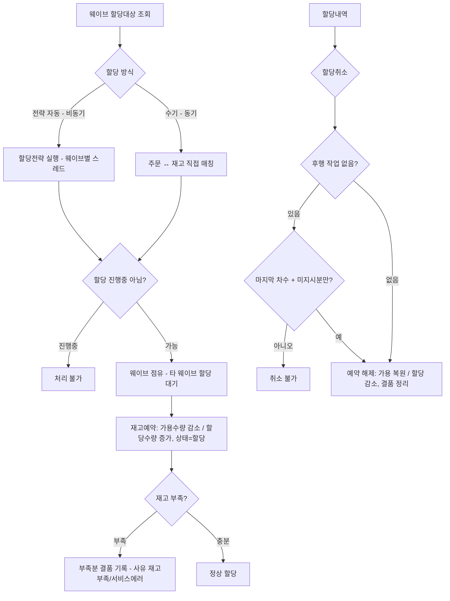

**두 화면 · 두 실행 방식**

| 항목 | 재고할당(전략) | 수기할당 |
|------|---------------|---------|
| 성격 | 웨이브 단위 전략 자동할당 | 주문 라인 ↔ 재고 직접 매칭 |
| 진입 | 메뉴 | 재고할당 화면 미할당 그리드에서 이동 |
| 실행 | **비동기** — 요청 즉시 "할당전략 실행중입니다" 반환 | **동기** — 완료까지 대기, 오류를 그대로 표시 |
| 결과 확인 | 화면이 3~5초 간격으로 재조회하며 **할당진행여부 플래그가 사라지는 것으로 완료를 추정** | 저장 응답 |

- 두 화면은 **동일 서비스를 호출**하고 실행유형(전략/수기)으로 분기한다.
- ⚠ **전략 할당은 성공·실패·결품 결과를 화면에 반환하지 않는다.** 실패 원인은 **작업로그 화면**에서만 확인할 수 있다.
- 수기할당 진입 시 **선택 라인의 출고유형이 섞이면 차단**된다(출고유형별로 적용 전략이 달라지기 때문).

**핵심 검증/로직**
- 웨이브번호 필수
- **이미 할당 진행 중인 웨이브는 중복 실행 불가** (웨이브 점유 플래그). 추가로 **다른 웨이브가 할당 중이면 최대 60초 대기** 후 타임아웃 실패한다.
- 수기할당은 **주문수량 초과 할당 불가** (단, 서버 검증이 첫 행만 검사하는 결함이 있어 실질 방어가 불완전 — 상세 문서 부록 참조)
- 재고 부족 시 부족수량을 **결품**으로 기록. 사유는 **재고부족 / 서비스에러** 2종이며, 전량 결품 건도 별도로 기록된다.
- **출고단위 절사 전략**이 적용되면 요청수량을 입수량 배수로 내림 처리하므로 **낱개 단위 잔량은 할당되지 않는다**.
- **할당은 차수(회차) 단위로 누적**된다. 같은 웨이브를 다시 할당하면 새 차수가 붙어 **부분 결품 후 재할당**이 가능하다.
- **상품 단위로 병렬 처리**되며 상품별로 독립 트랜잭션이라, **한 상품이 실패해도 다른 상품은 커밋**된다(부분 성공). 화면은 부분 성공을 구분해 보여주지 않는다.
- **재고 변경(예약)**: 할당 시 대상 재고를 **예약(할당)으로 선점** → **가용수량 감소, 할당(예약)수량 증가**, 총재고 불변 (재고는 물리적으로 이동하지 않음)
- **테이블 변경**: 할당작업 내역 **기록(INSERT)** + 부족분 **결품 기록(삭제 후 재생성)** + 주문·웨이브 상태 **갱신(수정)** + 작업로그·알림 **생성**
- **조회 대상**: `주문수량 > 할당수량` 이거나 `할당수량 > 피킹지시수량` 인 웨이브. 즉 **전량 할당된 웨이브도 피킹지시 전까지는 목록에 남아** 결과 확인과 취소가 가능하다. 웨이브 상세가 없는 빈 웨이브는 조회되지 않는다.

**할당취소**
- **웨이브 단위 취소**(웨이브 체크)와 **할당건 단위 취소**(할당내역 체크) 2경로가 있다.
- 후행 작업(피킹지시 이상)이 진행된 건은 원칙적으로 취소 불가. 단 **마지막 할당차수이고 취소 후 남는 할당수량이 지시수량과 정확히 일치**하면 허용된다 — 즉 **아직 지시되지 않은 잔량만** 되돌릴 수 있다.
- 취소 시 할당작업 **삭제(DELETE)** + **예약분 해제 → 가용 복원 / 할당 감소** + 결품내역 **삭제 후 취소 반영하여 재기록** + 주문·웨이브 상태 재산출

**할당전략 (전략유형 22) 구분 7종**

| 구분 | 역할 |
|------|------|
| 재고위치(From) | 어느 로케이션 범위에서 재고를 찾을지 |
| 출고제약 | 찾은 재고 중 사용 불가 건 제외 |
| 출고대상-수량/상태 | 출고단위 배수 절사 여부, 허용 재고상태 |
| 할당위치(To) | 할당 결과의 목적지(피킹로케이션 리다이렉트 등) |
| 재고할당순서 | 재고 후보 정렬(FIFO/FEFO/피킹순서 등) |
| 주문할당순서 | 주문 처리 순서 |
| 분배 | 재고 부족 시 주문별 배분 방식(우선/균등 × LDU/전량/주문비율) |

- 재고 총량이 요청 총량보다 **적을 때만 분배전략**이 동작하고, 충분하면 정렬 순서대로 순차 할당한다.
- **할당위치 전략으로 피킹로케이션에 리다이렉트되면 재고 부족 체크가 해제**(과할당 허용)되고, 이후 보관로케이션 재고에서 보정 차감된다.

---

## 4. 피킹지시 (피킹지시 / 취소)

할당된 재고에 대해 **어느 로케이션에서 몇 개를 집품할지** 작업지시를 생성한다. 지시 대상은 **할당수량 − 이미 지시된 수량 > 0** 인 웨이브라인이며, 부분 지시 후 잔량을 다시 지시할 수 있다.

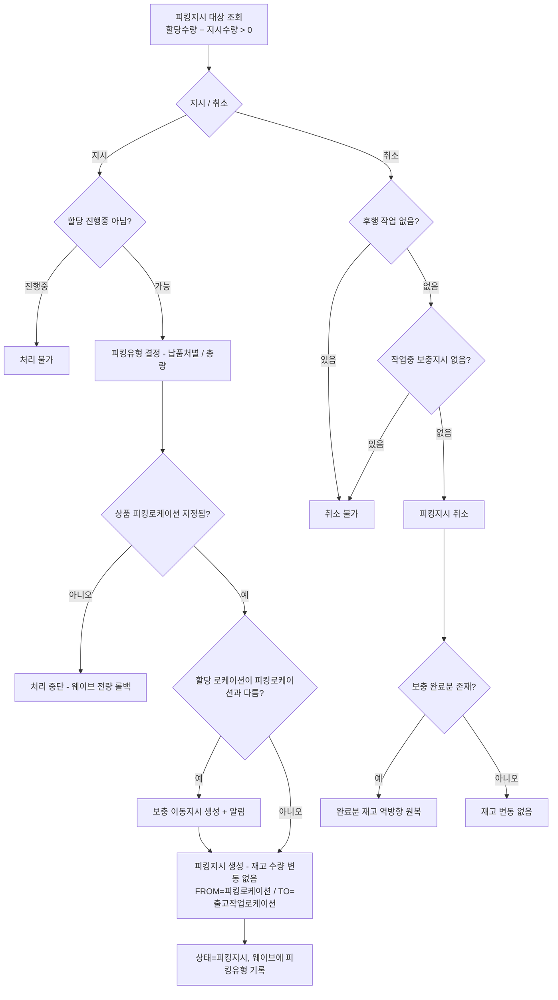

**핵심 검증/로직**
- 피킹지시 대상이 존재해야 하고, **웨이브가 할당 진행 중이면 지시 불가**
- 지시 대상은 화면에서 선별할 수 없다 — **선택 웨이브의 미지시 잔량 전량**이 대상이다(부분 지시는 반복 실행으로만 가능)
- **상품별 피킹로케이션이 지정되어 있어야** 지시 가능. 미지정 상품이 **한 건이라도 있으면 해당 웨이브의 지시 전량이 롤백**된다
- 지시의 **FROM은 상품 고정 피킹로케이션, TO는 센터의 출고작업 로케이션**(업무구분 02)으로 세팅된다
- **재고 변경 없음**: 피킹지시 자체는 재고 수량을 변동시키지 않고 **작업지시만 생성**한다
- 단, **할당 로케이션이 피킹 로케이션과 다르면 보충(수시재고보충) 이동지시를 함께 생성**한다(실제 재고 이동은 이후 보충 완료 시점)
- **피킹유형(납품처별/총량)이 지시 시점에 결정**되어 웨이브에 기록된다 — 현재는 전략이 아니라 **화주코드로 하드코딩**되어 있다
- 지시 저장 후 **할당수량 < 지시수량 검증**과 **마감 주문 검증**이 수행된다(위반 시 예외로 전체 롤백 — 사전 차단이 아닌 사후 롤백)
- **테이블 변경**: 출고작업지시 **생성(INSERT, 상태 피킹지시)** + (조건부) 보충 이동지시 **생성(INSERT)** + 웨이브 피킹유형 **갱신** + 주문/웨이브 상태 **갱신(수정)** + 알림 **생성**, 재고 수량 변동 없음

**피킹지시취소**
- **웨이브 단위 취소**(웨이브 체크)와 **지시건 단위 취소**(지시내역 체크) 2경로가 있다. 할당 진행 중 검사는 웨이브 단위 경로에만 있다.
- 이후 출고작업(피킹완료 이상)이 진행된 건은 취소 불가, **작업 중인 수시보충지시가 있으면 취소 불가**
- **총량피킹 취소는 상품 단위로 확장**된다 — 지시내역이 상품 단위 합계 행이라, 한 행을 취소하면 그 웨이브의 **해당 상품 지시 전부**가 취소된다
- 보충 이동지시는 상태별로 처리: **작업중이면 차단 / 요청·지시면 삭제 + 알림 취소 / 완료수량이 있으면 재고를 역방향으로 원복**
- ⚠ 즉 **취소는 조건부로 재고를 움직인다.** 보충이 없었거나 완료수량이 0이면 재고 변동은 없다.
- 취소 후 웨이브에 지시가 한 건도 남지 않으면 **피킹유형이 초기화**되어 다음 지시에서 다시 결정된다

**납품처별 피킹 vs 총량 피킹**

| 항목 | 납품처별 | 총량 |
|------|---------|------|
| 지시 데이터 | 출고번호·라인 단위 (동일) | 출고번호·라인 단위 (동일) |
| 지시내역 조회 단위 | 출고번호·라인 | **상품·로트·로케이션·차수 합계** |
| 취소 단위 | 체크한 지시행 | **체크 상품의 지시 전량** |
| 후속 공정 | 피킹완료 → 피킹확정 → 패킹 | 피킹완료 → 피킹확정 → **분배** → 패킹 |

> 지시 데이터 자체는 두 방식이 같다. 차이는 **조회·취소의 묶음 단위**와 분배 공정 유무에 있다.

---

## 5. 피킹완료 (납품처별 / 총량)

지시에 따라 실제로 집품한 수량을 등록하여 **피킹을 완료**한다. **출고 흐름에서 재고가 물리적으로 움직이는 첫 지점**으로, 재고를 피킹 로케이션에서 출고작업 로케이션으로 실제 이동시킨다.

> 상세: [wms-ob-피킹완료-화면프로세스정의서.md](wms-ob-피킹완료-화면프로세스정의서.md)

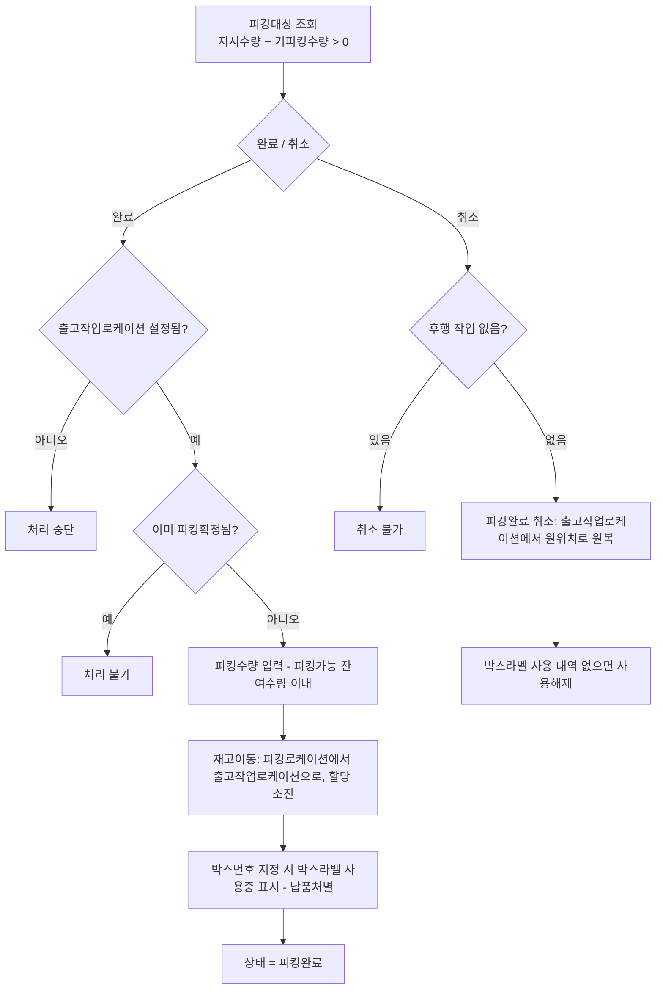

**핵심 검증/로직**
- **출고작업 로케이션 설정 필수** — 완료·취소 **양쪽 모두** 검증한다(피킹지시 화면에는 이 가드가 없다)
- 이미 **피킹확정**이 진행된 건은 완료/취소 불가. 판정 단위가 방식별로 다르다 — **납품처별은 지시번호·차수, 총량은 상품 단위**
- **부분 피킹이 가능**하다. 화면의 **피킹 가능 잔여수량**은 "지시 잔량"과 **실재고** 중 작은 값으로 산출되므로, 지시는 있어도 재고가 없으면 피킹할 수 없다
- 대상 행 선정은 체크박스가 아니라 **피킹수량을 입력(편집)한 행** 기준이다
- **재고 변경(이동)**: 집품 재고를 **피킹 로케이션에서 출고작업 로케이션으로 실제 이동**(할당 단계에서 잡아둔 예약분 소진)
- **박스라벨(납품처별 전용)**: 피킹 시 박스번호를 지정하면 해당 박스라벨이 **사용중**으로 점유되고, 취소 후 남은 사용 내역이 없으면 **사용 해제**된다
- **테이블 변경**: 피킹완료 작업내역 **기록(INSERT, 상태 피킹완료)** + **재고 이동(수정)** + (박스 사용 시) 박스라벨 사용 **표시(수정)** + 주문/웨이브 상태 **갱신(수정)**
- 지시수량 초과 검증과 마감 주문 검증은 **작업내역 기록·재고 이동을 모두 수행한 뒤** 실행된다(위반 시 예외 → 전체 롤백, 사전 차단이 아닌 사후 롤백)
- **조회 대상**: `지시수량 > 완료수량` 이거나 `완료수량 > 확정수량` 인 건. 즉 **전량 피킹된 건도 피킹확정 전까지는 목록에 남아** 결과 확인과 취소가 가능하다
- 취소: 후행 출고작업(피킹확정 이상) 진행 시 불가. 취소 시 이동분을 **원위치로 원복**하며, **수량 부분취소는 불가**(라인 전량 취소)
- **총량 방식**은 상품 단위로 일괄 집품한다. 상품별 완료 가능 여부를 사전 검증하며, **한 상품이 실패하면 전체가 롤백**된다

**납품처별 vs 총량**

| 항목 | 납품처별 | 총량 |
|------|---------|------|
| 마스터 조회 단위 | **출고번호** | **웨이브** |
| 대상 단위 | 지시행(출고라인 · 로케이션 · 로트) | 상품(로케이션 · 로트) |
| 수량 배분 | 입력수량 → **지시행에 순차 배분** | 집품수량 → **주문라인에 순차 배분** |
| 후행 검사 | 지시번호·차수 단위 | **상품 단위** |
| 박스라벨 | ○ | ✕ |
| 후속 공정 | 피킹확정 → 패킹 | 피킹확정 → **분배** → 패킹 |

> ⚠ 납품처별 화면의 마스터는 **출고번호 단위**다. 할당·피킹지시 화면이 웨이브 단위였던 것과 달라, 같은 웨이브가 주문 수만큼 행으로 펼쳐진다.

---

## 6. 피킹확정 (납품처별 / 총량)

집품된 결과를 검증하여 **피킹을 확정**한다. 확정 후 다음 단계(분배/패킹)로 넘어간다.

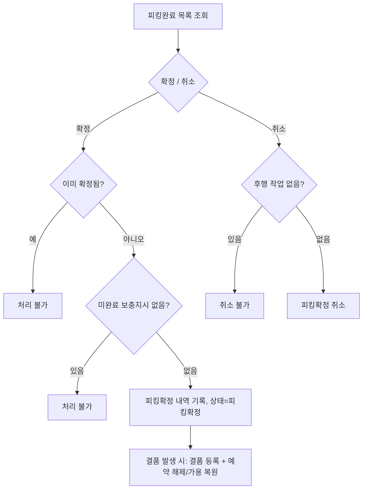

**핵심 검증/로직**
- 이미 피킹확정된 출고라인은 재확정 불가
- **완료되지 않은 보충지시가 있으면 확정 불가**
- **테이블 변경**: 피킹확정 내역 **기록(생성)** + (결품 시) **결품 등록(생성)** + 주문 상태 **갱신(수정)**
- **재고 변경(결품분만)**: 정상 확정분은 재고 수량 변동 없음(피킹완료에서 이미 이동). **결품(부족)수량에 한해 잡아둔 예약(할당)을 해제 → 가용 복원**
- 취소: 후행 출고작업이 진행되면 취소 불가

---

## 7. 분배 (총량피킹분 배분)

총량 방식으로 집품한 재고를 **납품처(주문)별로 분배**한다. (납품처별 피킹 방식은 이 단계 생략)

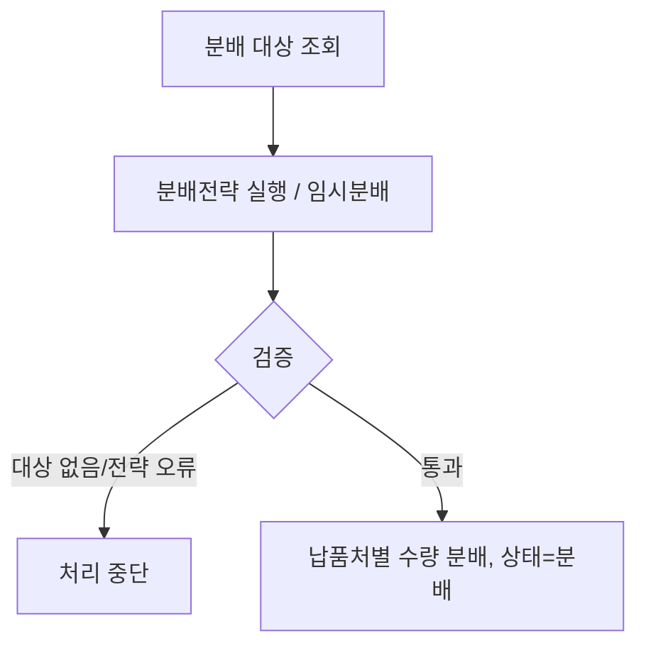

**핵심 검증/로직**
- 분배 대상·주문이 존재해야 함, 분배전략 실행 대상 확인
- 분배전략 오류 시 상세 사유와 함께 중단
- **테이블 변경**: 납품처(주문)별 분배 작업내역 **생성(INSERT)** + 상태 **갱신(수정)**
- **재고 변경 없음**: 재고 수량은 변동하지 않고, 총량 집품분을 주문(납품처)별 작업으로 재배분만 한다

---

## 8. 박스라벨 (라벨 발행)

패킹에 사용할 **박스라벨을 발행**한다.

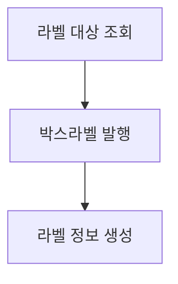

**핵심 로직**
- 대상 건에 대해 박스 단위 라벨을 생성(발행)

---

## 9. 패킹 (포장확정 / 취소)

분배/집품된 상품을 **박스라벨 기준으로 포장 확정**한다.

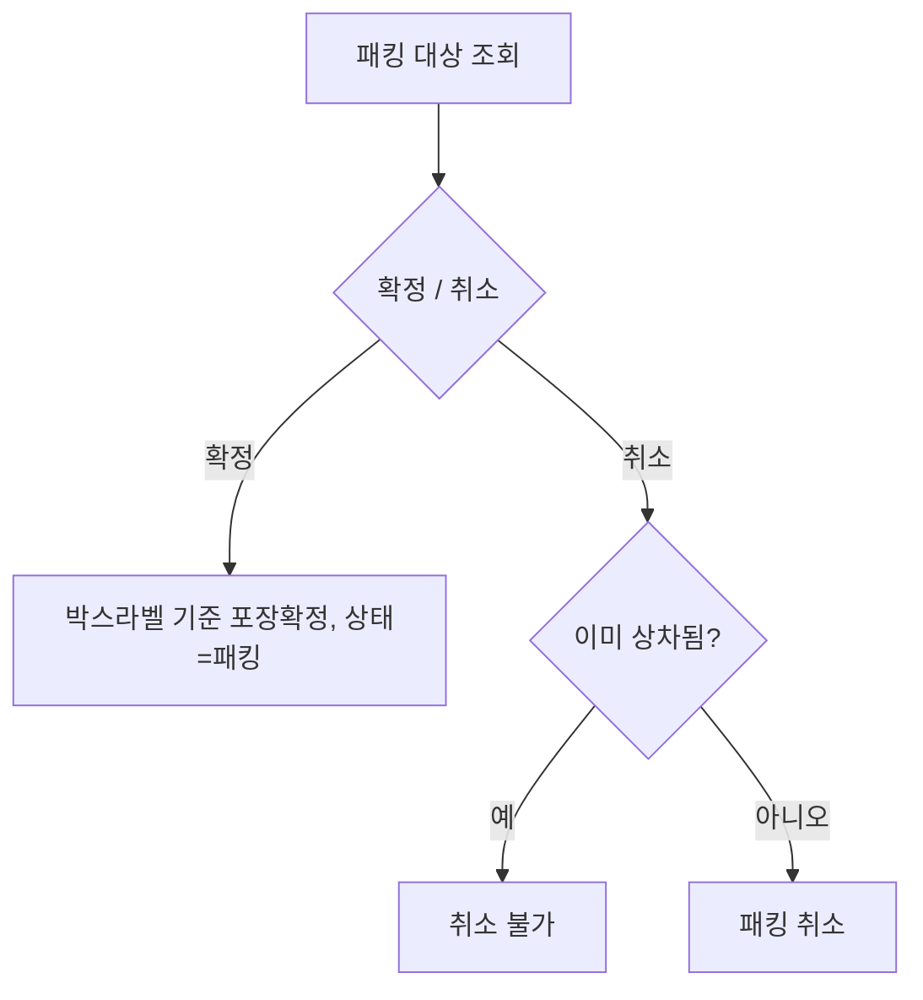

**핵심 검증/로직**
- 포장 확정 시 작업지시번호 채번
- **이미 상차된 상품이 있으면 패킹 취소 불가**
- **테이블 변경**: 포장(패킹) 내역 **생성(INSERT)** + 박스라벨 사용 **표시(수정)** + 주문/웨이브/OMS 상태 **갱신(수정)** / 취소 시 패킹내역 **삭제(DELETE)**
- **재고 변경 없음**: 재고 수량 변동 없이 포장 상태만 처리

---

## 10. 상차 (상차확정 / 취소)

포장된 물품을 **차량에 상차 확정**한다.

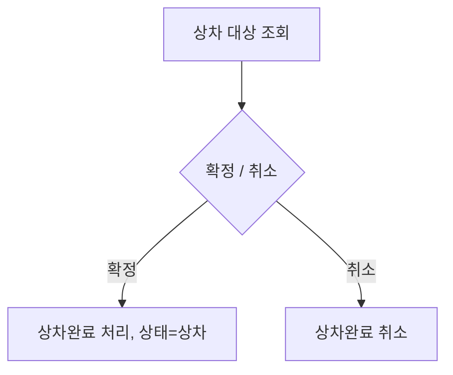

**핵심 검증/로직**
- 확정/취소 대상 데이터가 없으면 처리 불가
- **테이블 변경**: 상차 작업내역 **생성(INSERT)** + 출고건 차량정보/상태 **갱신(수정)** / 취소 시 상차 작업내역 **삭제(DELETE)** 및 출고건 차량정보/상태 **갱신(수정)**
- **재고 변경 없음**: 재고 수량 변동 없이 상차 상태만 처리(최종 재고 차감은 출고확정에서)

---

## 11. 출고확정

검수·피킹·상차가 끝난 출고건을 **최종 확정**하여 재고를 차감하고 출고를 종료한다.

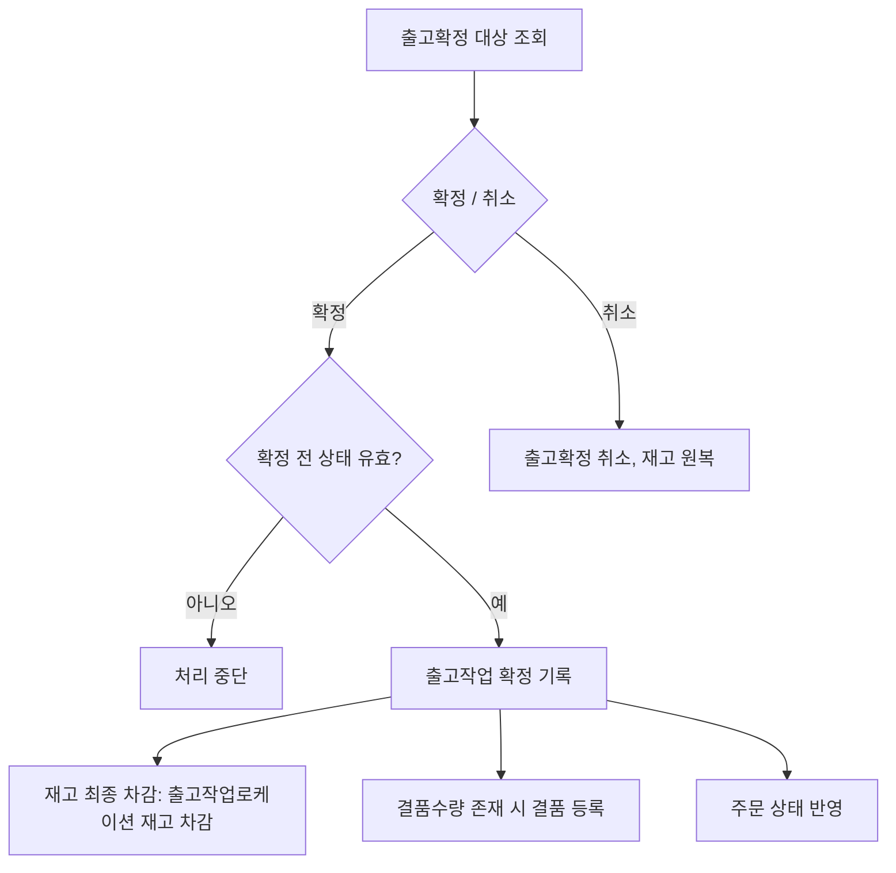

**핵심 검증/로직**
- 화주/센터별 설정된 **출고확정 직전 상태**의 건만 확정 대상(상태 부적합 시 중단)
- 확정 시 작업수량만큼 **재고 최종 차감**, 결품수량이 있으면 결품 등록
- 전량 결품(할당 단계 결품)인 건도 확정 대상에 포함되어 결품으로 종료
- **테이블 변경**: 출고확정 작업내역 **생성(INSERT)** + (결품 시) 결품 **생성(INSERT)** + 재고 **최종 차감(수정)** + 상위 주문(SO/CO) 상태 **동기화(수정)**
- 취소 시: 확정 작업내역 **삭제/원복** + 재고 **원복(수정)**

---

## 12. 출고조정등록

출고확정 이후 실제 출고수량 차이를 **조정(±)** 한다. 조정사유에 따라 증가/감소 방향이 결정된다.

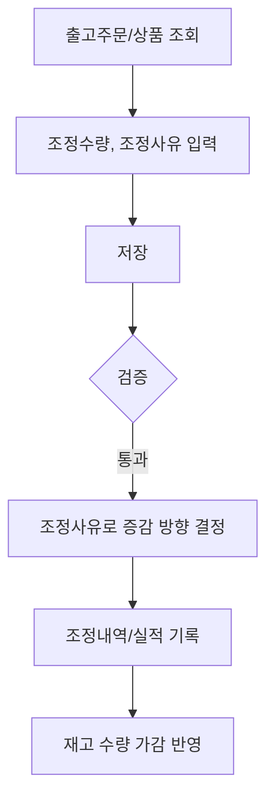

**핵심 검증/로직**
- 조정사유가 증가(+, 과출고/정상입점)면 **출고예정수량 초과 불가**
- 조정사유가 감소(−)면 **조정가능수량 초과 불가**
- 조정전수량 = 출고확정수량 + 기존조정완료수량, 조정후수량 = 조정전수량 + 조정수량
- 출고 수량이 늘면 재고 감소, 줄면 재고 증가 방향으로 반영
- **테이블 변경**: 재고조정 내역 **생성(INSERT)** + 재고조정 실적 **생성(INSERT)** + 재고 수량 **가감(수정)**

---

# 🔎 단순조회 화면

| 화면 | 내용 |
|------|------|
| 출고현황 | 출고 진행현황 리포트 조회 |
| 작업로그 | 작업(할당 등) 실행 로그 조회 및 로그 삭제 |
| 출고조정내역 | 출고조정 실적 조회 ([등록]은 출고조정등록 화면 이동) |
| 출고결품내역 | 결품 발생 내역 조회 |

---

## 부록. 단계별 상태·재고 흐름 한눈에

| 처리 | 재고 영향 | 처리 후 상태 |
|------|-----------|--------------|
| 출고주문 생성 | 없음(작업 대상 생성) | 신규 |
| 웨이브 생성 | 없음(작업 단위 묶음) | 웨이브 (주문 마스터는 **MAX 롤업** — 한 라인만 편입돼도 전진) |
| 할당 | **가용수량 감소 / 할당(예약)수량 증가**(선점, 총재고 불변), 부족분 결품 | 할당 (차수 단위 누적, 재할당 가능) |
| 피킹지시 | **재고 수량 변동 없음**(작업지시 생성, 필요 시 보충 이동지시 생성) | 피킹지시 (피킹유형 결정·기록) |
| 피킹지시 취소 | 원칙적으로 변동 없음. 단 **보충 완료분은 역방향 원복** | 할당으로 복귀 |
| 피킹완료 | **재고 이동: 피킹로케이션 → 출고작업로케이션**(할당 소진) | 피킹완료 (부분 피킹 시 잔량 재피킹 가능) |
| 피킹완료 취소 | **역방향 원복: 출고작업로케이션 → 피킹로케이션** | 피킹지시로 복귀 |
| 피킹확정 | **결품(부족)분만 예약 해제 → 가용 복원**(정상분 변동 없음) | 피킹확정 |
| 분배 | **재고 수량 변동 없음**(총량분 납품처별 재배분) | 분배 |
| 패킹 | **재고 수량 변동 없음**(박스 단위 포장) | 패킹 |
| 상차 | **재고 수량 변동 없음**(차량 상차) | 상차 |
| 출고확정 | **재고 최종 차감**(출고작업로케이션), 결품 확정 | 출고확정 |
| 출고조정 | 재고 수량 ± 조정 | (확정 유지) |
| 각 취소(공통) | 후행 작업 없을 때만 가능, 해당 단계 재고 원복 | 이전 상태 |
