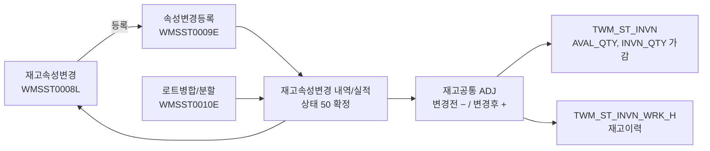
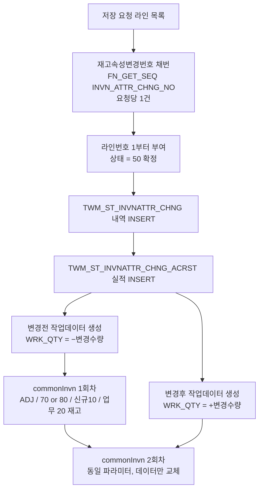
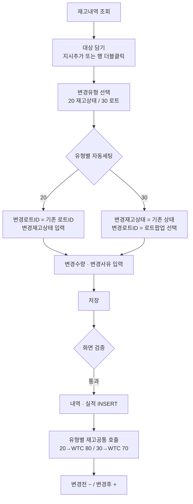
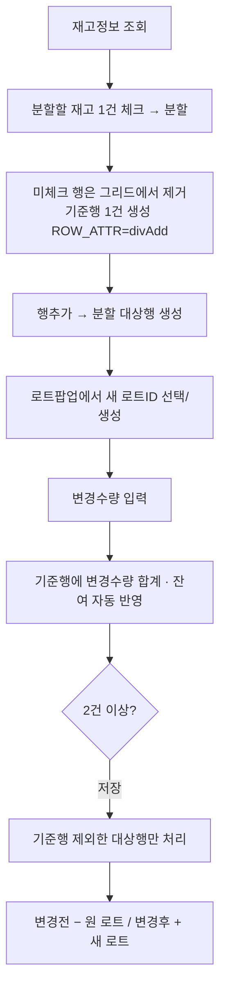
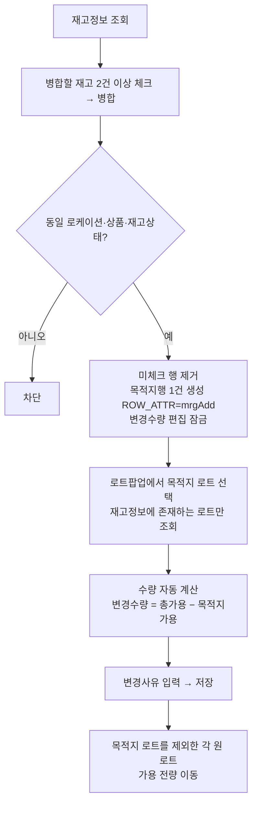

# WMS 재고 속성변경 / 로트(LOT)병합·분할 화면 프로세스 정의서

> 대상: 속성변경등록(WMSST0009E), 로트(LOT)병합/분할(WMSST0010E), 재고속성변경 실적(WMSST0008L)
> 목적: 화면별 **업무 프로세스 뼈대와 핵심 검증·로직**을 정리한다. 실코드(JSP·서비스·SQL·공통코드) 분석 결과 기준.
> 관계: `wms-st-화면프로세스정의서.md` §4·§5의 상세 전개판이다. 상위 문서는 요약, 본 문서는 상세를 담당한다.

---

## 공통 원칙

- **속성변경등록과 로트병합/분할은 같은 백엔드 파이프라인을 쓴다.** 두 화면 모두 재고속성변경 내역/실적을 남기고, 재고공통(`commonInvn`)을 **재고조정(ADJ)** 으로 호출한다. 로트병합·분할은 "재고LOT변경(30)" 속성변경의 **UI 특수형**일 뿐 별도 테이블·별도 처리로직이 없다.
- **총량 보존 원칙**: 모든 처리는 `변경전 재고 차감(−)` + `변경후 재고 증가(+)` 를 **한 쌍**으로 반영한다. 창고 전체 재고 총량은 변하지 않고 **속성(로트ID / 재고상태)만 이동**한다.
- **변경전·변경후는 재고공통을 각각 1회씩, 총 2회 호출한다.** 호출마다 재고작업ID(`WRK_ID`)가 따로 채번되고 임시작업 테이블 → 이력 테이블 경로를 각각 탄다. 차감분과 증가분이 하나의 작업집합으로 묶이지 않는다.
- **움직이는 것은 가용수량뿐이다.** 재고 반영은 `AVAL_QTY`와 `INVN_QTY`만 가감하고 `ALOC_QTY`(할당)·`HLD_QTY`(보류)는 건드리지 않는다. 할당·보류가 걸린 수량은 원래 속성에 남는다.
- **저장 즉시 확정된다.** 재고속성변경상태(C01381)는 항상 `50 확정`으로 기록되며 요청/지시/작업중 단계를 쓰지 않는다. **업무적 취소(되돌리기) 경로가 없다** — 되돌리려면 반대 방향 속성변경을 다시 등록해야 한다.
- 저장은 **트랜잭션 단위**로 처리되어 도중 오류 시 전체 롤백된다(`@Transactional(rollbackFor=Exception.class)`).

## 화면 분류

| 화면 | 프로그램ID | 유형 | 처리 | 메뉴 노출 |
|------|-----------|------|------|-----------|
| 속성변경등록 (WMSST0009E) | PGM000102 | ⚙️ 프로세스 | 재고상태 변경 / 로트ID 변경 | **N — 메뉴 없음**. 재고속성변경(WMSST0008L)의 [등록] 버튼으로만 진입 |
| 로트(LOT)병합/분할 (WMSST0010E) | PGM000113 | ⚙️ 프로세스 | 로트 분할 / 로트 병합 | Y |
| 재고속성변경 (WMSST0008L) | PGM000101 | 🔎 조회 | 속성변경 실적 조회 + 등록화면 진입점 | Y |
| 로트관리 팝업 (CMMBS0001P) | - | 🔧 공통팝업 | 로트ID 조회 / 신규 로트 생성 | - |

## 전체 업무 흐름

| 화면 | 변경유형(C01380) | 재고작업유형(C01498) | 변경 대상 |
|------|-----------------|---------------------|-----------|
| 속성변경등록 | 20 재고상태변경 | **80 재고상태변경** | 재고상태코드 |
| 속성변경등록 | 30 재고LOT변경 | **70 재고속성변경** | 로트ID |
| 로트병합/분할 | 30 재고LOT변경 (고정) | **70 재고속성변경** | 로트ID |

---

# ⚙️ 공통 처리 엔진 — 재고속성변경 저장 파이프라인

두 화면의 저장은 아래 동일 경로를 탄다. 화면별 절에서는 이 파이프라인에 **무엇을 실어 보내는가**만 다룬다.

**재고공통(`commonInvn`) 내부 순서** — 1·2회차 각각 동일하게 수행

1. **재고작업ID 채번**(`FN_GET_SEQ('INVN_WRK_ID')`) → 라인별 `WRK_SN` 1..n 부여
2. **임시 작업테이블 INSERT** (`TWM_ST_INVN_WRK_T`)
3. **로케이션 속성 검증** — 상품 혼적 체크, 고정로케이션 상품 일치 체크
   → *속성변경·병합·분할도 이 검증을 통과해야 한다.* 혼적 불가 로케이션에 다른 상품이 생기거나 고정로케이션 상품이 어긋나면 `"상품 혼적이 존재합니다"` / `"고정로케이션 상품이 일치하지 않습니다"` 로 전체 롤백
4. **수량 규칙 조회** — 공통코드 C01498에서 작업유형별 대상 컬럼·부호를 읽어온다
   - `70 재고속성변경`, `80 재고상태변경` 모두: 대상 컬럼 = **AVAL_QTY, INVN_QTY**, 부호 = **+1, +1**
   - 부호가 모두 +1이므로 **증감 방향은 `WRK_QTY`의 부호가 결정한다** (변경전 −, 변경후 +)
5. **부족수량 체크**(`getCheckFromLocationEnoughQty`) — FROM 키(로케이션·로트·재고상태)별로 `SUM(WRK_QTY)`를 집계해 현재 `AVAL_QTY`/`INVN_QTY`와 비교. 부족하면 `"수량이 충분하지 않습니다"`
   → **수량 초과에 대한 실질적인 서버 방어선은 이 한 곳뿐이다.** 화면·서비스의 수량 검증이 비어 있어도 여기서 막힌다.
6. **재고 반영**(`procInvnAdj`)
   - 대상 재고행이 **있으면 UPDATE**: `AVAL_QTY += WRK_QTY`, `INVN_QTY += WRK_QTY`
   - **없으면 INSERT**: 변경후 로트/상태 조합의 재고행을 새로 생성(`AVAL_QTY`, `INVN_QTY`에 수량, 할당·보류는 기본값 0)
   - **수량 4종이 모두 0인 행은 DELETE** — 단 할당·보류가 남아 있으면 삭제되지 않고 0짜리 잔존 행이 남는다
7. **재고이력 INSERT** (`TWM_ST_INVN_WRK_H`)
8. **finally: 임시 작업테이블 DELETE**

**재고이력 표현 주의** — 변경전·변경후 데이터 모두 `FROM_LOC_CD / FROM_LOT_ID / FROM_INVN_ST_CD` 슬롯에 실려 나가고 `TO_*` 는 전부 NULL이다. 즉 이력에는 **from→to 이동 한 줄이 아니라, 같은 로케이션의 (−)행과 (+)행 두 줄**로 남는다. 재고이력 조회에서 속성변경은 이동처럼 보이지 않으며 두 행을 짝지어 읽어야 한다.

**내역/실적 기록값**

| 컬럼 | 값 |
|------|-----|
| `INVN_ATTR_CHNG_NO` | 저장 요청당 1건 채번 |
| `INVN_ATTR_CHNG_LN_NO` | 1부터 순번 (실적번호도 동일 값) |
| `INVN_ATTR_CHNG_ST_CD` | `50` 확정 고정 |
| `CHNG_DRCT_QTY` / `CHNG_CMPL_QTY` | 변경수량 (지시=완료, 즉시확정) |
| `CHNG_BFR_INVN_QTY` | **가용수량이 아니라 재고수량(INVN_QTY)** |
| `CHNG_AFT_INVN_QTY` | `재고수량 − 변경수량` |
| `REQ_DE` / `WRK_DRCT_DE` / `CHNG_DE` | 처리일(SYSDATE) |
| `RFN_NO` / `RFN_DTL_NO` | NULL (참조 업무 없음) |

---

# ⚙️ 1. 속성변경등록 (WMSST0009E)

재고의 **재고상태(정상↔불량 등)** 또는 **로트ID**를 변경한다. 한 번의 저장에 두 유형을 섞어 담을 수 있다.

## 화면 구성

- **조회조건**: 화주(필수)·센터(필수)·상품(팝업)·상품분류명·로케이션코드(팝업)·LOT ID·재고상태
- **3분할 그리드**
  - `재고내역`(좌 80%) — 조회 결과, 체크박스
  - `로트속성`(우 20%) — 재고내역 행 선택 시 해당 로트의 속성값 조회(로트ID가 있는 행만)
  - `변경처리내역`(하단) — 편집 그리드
- **버튼**: 조회 / **지시추가** / **행삭제** / **저장**

**재고내역 조회 대상** — `TWM_ST_INVN` 기준, 로케이션 데이터상태 `01`, 로케이션 업무구분이 **입고작업(01)·출고작업(02)이 아닌** 것.
※ 병합/분할 화면과 달리 **`재고수량 > 0` / `가용수량 > 0` 조건이 없다.** 가용 0인 재고도 목록에 뜨고 담을 수 있으며, 저장 시 공통계층 부족수량 체크에서 실패한다.

**변경처리내역 편집 컬럼**

| 컬럼 | 유형 | 필수 | 비고 |
|------|------|------|------|
| 변경유형 | 콤보(C01380) | ✔ | 20 재고상태변경 / 30 재고LOT변경 |
| 변경로트ID | 팝업(돋보기) | ✔ | 로트관리 팝업에서 선택 또는 신규 생성 |
| 변경재고상태 | 콤보(C00749) | ✔ | |
| 변경수량 | 입력 | ✔ | |
| 변경후가용수량 | 자동 | - | `가용수량 − 변경수량` 자동 계산 |
| 변경사유 | 콤보(연쇄) | ✔ | 변경유형에 종속 |
| 변경사유(TEXT) | 입력 | - | 자유 입력 |

**변경사유 연쇄 콤보** — 공통코드 C01380의 사용자정의필드가 하위 사유 그룹을 지정한다.
`20 재고상태변경 → C01222`(양품/파손/기타), `30 재고LOT변경 → C00017`.
화면은 두 그룹을 한 번에 받아 상위코드 기준으로 필터링하며, **변경유형을 바꾸면 입력된 변경사유가 초기화**된다.

## 대상 담기

- **[지시추가]**: 재고내역에서 체크한 행들을 변경처리내역으로 복사
- **행 더블클릭**: 해당 행 1건을 복사
- **중복 방지**: `화주 + 센터 + 로케이션 + 로트ID + 재고상태` 가 이미 담긴 조합이면 `"이미 추가한 재고가 존재합니다."`

## 유형별 입력 제어

| 상황 | 동작 |
|------|------|
| 변경유형 미선택 상태에서 변경재고상태 편집 | 차단 — `"변경유형을 먼저 선택해주세요."` |
| 변경유형 미선택 상태에서 로트 돋보기 클릭 | 차단 — 동일 메시지 |
| 변경유형 = 20(재고상태변경) 선택 | **변경로트ID에 기존 로트ID 자동 세팅**, 로트 돋보기 클릭 시 팝업이 열리지 않음 |
| 변경유형 = 30(재고LOT변경) 선택 | **변경재고상태에 기존 상태 자동 세팅**, 변경재고상태 편집 차단 |
| 변경수량 입력 | 양수 검사 → 위반 시 값 초기화 / 가용수량 초과 검사 → 위반 시 경고 후 유지, 통과 시 변경후가용수량 자동 계산 |

→ 즉 **"선택한 유형의 항목만 바뀌도록" UI가 나머지 한쪽을 잠그는 구조**다.

## 저장 — 핵심 검증

저장 대상은 체크박스가 아니라 **추가/편집된 행**(행상태 C/U/D)이다.

1. **필수항목 검사** — 그리드 mandatory 속성으로 처리. 미입력 시 `"N번째 ROW - '항목명' 항목은 필수입니다."`
2. **중복 재고 검사** — `화주+센터+로케이션+로트ID+재고상태` 중복 시 `"중복되는 재고가 존재합니다."`
3. **유형-내용 일치 검사**
   - 유형 20인데 재고상태가 이전과 동일 → `"재고상태가 이전과 동일합니다."`
   - 유형 30인데 로트ID가 이전과 동일 → `"로트ID가 이전과 동일합니다."`
   - **재고상태와 로트ID가 둘 다 달라진 경우** → `"변경유형 항목만 변경 가능합니다."` (동시 변경 금지)
4. **변경수량 재검증** — 0 이하이거나 가용수량 초과 시 `"변경지시 가능수량은 N이내 입니다."`
5. 저장 확인창은 **없다** (즉시 전송)

## 저장 — 핵심 로직

- 재고속성변경번호 1건 채번 → 라인번호 1부터 → 라인마다 내역·실적 INSERT (상태 `50 확정`)
- **유형별로 묶어 재고공통을 호출한다**
  - 유형 20 존재 시 → 작업유형 `80 재고상태변경` 으로 변경전(−)·변경후(+) **2회**
  - 유형 30 존재 시 → 작업유형 `70 재고속성변경` 으로 변경전(−)·변경후(+) **2회**
  - 두 유형이 섞이면 한 트랜잭션 안에서 **최대 4회** 호출된다
- 작업데이터 매핑

  | 항목 | 변경전 | 변경후 |
  |------|--------|--------|
  | FROM 로케이션 | 현 로케이션 | 현 로케이션(동일) |
  | FROM 로트ID | 기존 로트ID | **변경로트ID** |
  | FROM 재고상태 | 기존 재고상태 | **변경재고상태** |
  | 작업수량 | **−변경수량** | **+변경수량** |
  | 지시번호/상세 | 재고속성변경번호 / 라인번호 | 동일 |

- 저장 후 변경처리내역 그리드를 비우고 재고내역을 재조회한다
- **테이블 변경**: 속성변경 내역 **INSERT** + 속성변경 실적 **INSERT** + 재고 **차감·증가(UPDATE, 없으면 INSERT, 0이면 DELETE)** + 재고이력 **INSERT**

---

# ⚙️ 2. 로트(LOT)병합 / 분할 (WMSST0010E)

하나의 로트를 여러 로트로 나누거나(**분할**), 여러 로트를 하나로 합친다(**병합**). 저장 시에는 변경유형 `30 재고LOT변경`으로 고정 기록되어 속성변경등록과 동일한 내역/실적을 남긴다.

## 화면 구성

- **조회조건**: 화주(필수)·센터(필수)·상품(팝업)·로케이션코드(팝업)
- **2분할 그리드**: `재고정보`(좌 54%) / `병합·분할`(우 45%)
- **버튼**: (좌) 조회 / **분할** / **병합** / **취소** — (우) **행추가** / **행삭제** / **저장**
- 재고정보 그리드는 로트속성 중 **입고일자(D01)·제조일자(D02)** 를 컬럼으로 함께 보여준다

**재고정보 조회 대상** — 로케이션 업무구분이 입고작업(01)·출고작업(02)이 아니고, 로케이션 데이터상태가 삭제(03)가 아니며, **재고수량 > 0 이고 가용수량 > 0** 인 재고만.

**모드 상태(divMrgStatus)** — 화면은 `""(대기) / "D"(분할중) / "M"(병합중)` 3상태를 가진다.

| 동작 | 대기 | 분할중(D) | 병합중(M) |
|------|------|-----------|-----------|
| [분할] / [병합] | 진입 가능 | 차단 — `"분할중인 재고가 존재합니다."` | 차단 — `"병합중인 재고가 존재합니다."` |
| [행추가] | - | 가능 | 차단 — `"병합중인경우 추가 할 수 없습니다."` |
| [행삭제] | - | 가능(기준행 제외) | 차단 — `"병합중인경우 삭제 할 수 없습니다."` |
| [취소] | `"취소할 대상이 없습니다."` | 재조회 + 그리드 초기화 | 재조회 + 그리드 초기화 |
| [조회] | - | 모드 해제 + 초기화 | 모드 해제 + 초기화 |

> **[취소] 버튼은 업무 취소가 아니다.** 저장 전 화면 입력을 버리고 재조회하는 리셋 버튼이다. 저장 후에는 되돌릴 수단이 없다.

---

## 2-1. 분할 (Split)

하나의 로트 재고를 여러 개의 새 로트로 나눈다.

**화면 흐름**
- 재고정보에서 **정확히 1건** 체크 후 [분할]
  - 미선택 → `"분할할 재고를 선택해 주세요."` / 2건 이상 → `"하나의 재고만 분할 가능합니다."`
  - 진입 시 **체크되지 않은 행은 재고정보 그리드에서 제거**되어 기준 재고만 남는다
- 병합·분할 그리드에 **기준행**(`ROW_ATTR = divAdd`, 변경로트ID = 원 로트ID) 1건이 생성된다
- [행추가]로 분할 대상행을 추가한다. 기존 행의 변경수량이 비어 있으면 `"변경수량을 입력후 추가해주세요."`
- 대상행의 돋보기 → **로트관리 팝업**에서 새 로트ID 선택 또는 신규 생성
  - 재고정보에 이미 있는 로트를 고르면 `"동일한 로트ID로 분할 할 수 없습니다."` (팝업/부모 양쪽에서 검사)
  - 기준행은 팝업이 열리지 않는다
- 변경수량 입력 시
  - 0 이하 → `"변경수량을 양수로 입력해주세요."`
  - **대상행 변경수량의 합**이 가용수량 초과 → `"변경가능수량의 합은 N이내 입니다."`
  - 통과하면 **기준행에 합계와 잔여(가용−합계)가 자동 표시**된다
- [행삭제]는 체크행 삭제. **기준행(변경로트ID = 원 로트ID)은 삭제되지 않는다**

**저장 — 검증**
- 그리드가 기준행 1건뿐이면 `"2개 이상 분할 가능합니다."`
- 편집된 행이 없으면 `"저장할 대상이 없습니다."`
- 모든 행의 변경수량이 양수여야 함
- 필수항목: 변경로트ID, 변경수량, 변경사유(C00017)

**저장 — 로직**
- 서버는 재고정보 그리드 데이터(`param1`)의 **첫 행**에서 원 로트ID·재고수량을 확정하고, 병합·분할 그리드(`param2`)에서 **변경로트ID가 원 로트와 같은 행(=기준행)을 제외**한다
- 남은 각 행이 1개의 속성변경 라인이 된다
  - 변경유형 `30` 고정, 상태 `50 확정`, 변경재고상태 = 기존 재고상태(상태는 바뀌지 않음)
  - 변경전: FROM 로트 = 원 로트, 수량 `−변경수량`
  - 변경후: FROM 로트 = **새 로트**, 수량 `+변경수량`
- **잔여분은 별도 라인을 만들지 않는다.** 분할한 만큼만 원 로트에서 빠지고 나머지는 그대로 원 로트에 남는다(전량 분할이면 원 재고행은 DELETE)
- **분할 합계에 대한 서비스단 재검증은 없다**(가용수량을 읽어두고 사용하지 않는다). 다만 모든 분할 라인이 **같은 FROM 키**(로케이션·원 로트·재고상태)를 공유하므로 공통계층의 부족수량 체크에서 `SUM(WRK_QTY)` 로 합산 비교되어 초과분이 차단된다
- **테이블 변경**: 속성변경 내역/실적 **INSERT** + 재고 **원 로트 차감 / 새 로트 INSERT** + 재고이력 **INSERT**

---

## 2-2. 병합 (Merge)

여러 로트 재고를 하나의 로트로 합친다.

**화면 흐름**
- 재고정보에서 **2건 이상** 체크 후 [병합]
  - 미선택 → `"병합할 재고를 선택해 주세요."` / 1건 → `"병합할 재고를 2개이상 선택해 주세요."`
  - **동일 로케이션·상품·재고상태가 아니면** → `"동일한 로케이션, 상품, 재고상태의 재고만 병합가능합니다."`
  - 진입 시 미체크 행은 재고정보 그리드에서 제거된다
- 병합·분할 그리드에 **목적지행**(`ROW_ATTR = mrgAdd`) 1건이 생성되고, **변경수량은 편집 불가(자동 계산)** 로 잠긴다
- 돋보기 → 로트관리 팝업. 병합 모드에서는 팝업이 **재고정보 그리드에 있는 로트ID로만 필터링**되어 조회된다
  - 목록 밖 로트를 지정하면 `"재고정보에 존재하는 로트ID를 입력해 주세요."`
- 목적지 로트 선택 시 자동 계산
  - 재고수량·가용수량 = **선택한 목적지 로트의 현재 수량**
  - 변경후가용수량 = **선택된 전체 재고의 가용수량 합**
  - 변경수량 = `전체 가용 합계 − 목적지 로트 가용` (= 유입될 수량)
- 병합 모드에서는 행추가·행삭제가 모두 차단된다

**저장 — 검증**
- 편집된 행이 없으면 `"저장할 대상이 없습니다."`
- 필수항목: 변경로트ID(목적지), 변경사유(C00017)

**저장 — 로직**
- 서버는 병합·분할 그리드(`param2`)의 **첫 행**에서 목적지 로트ID와 변경사유를 확정하고, 재고정보 그리드(`param1`)에서 **목적지 로트와 같은 로트 행을 제외**한다
- 남은 각 원 로트가 1개의 속성변경 라인이 된다
  - 변경수량 = 해당 원 로트의 **가용수량 전량** (부분 병합 불가)
  - 변경유형 `30` 고정, 상태 `50 확정`, 변경재고상태 = 각 원 로트의 재고상태
  - 변경전: FROM 로트 = 원 로트, 수량 `−가용수량`
  - 변경후: FROM 로트 = **목적지 로트**, 수량 `+가용수량`
- **할당·보류는 따라가지 않는다.** 원 로트에 `ALOC_QTY`/`HLD_QTY`가 있으면 가용만 빠져나가고 **잔존 재고행이 남는다**(수량 4종이 모두 0이어야 삭제되므로 삭제되지 않음)
- 변경사유는 목적지행의 값이 **모든 라인에 동일하게** 적용된다
- **테이블 변경**: 속성변경 내역/실적 **INSERT** + 재고 **원 로트 차감 / 목적지 로트 증가** + 재고이력 **INSERT**

---

# 🔎 참조 화면

## 재고속성변경 (WMSST0008L)

- 속성변경 실적 조회 전용. **[등록] 버튼이 속성변경등록(WMSST0009E) 진입 경로**다(해당 화면은 메뉴에 노출되지 않음)
- 조회조건: 화주·센터·변경일자(From~To)·상품·상품분류명·변경유형
- 내역(`TWM_ST_INVNATTR_CHNG`)과 실적(`TWM_ST_INVNATTR_CHNG_ACRST`)을 조인해 변경전/변경후 로트·재고상태·수량을 한 줄로 보여준다
- 변경사유명은 변경유형에 따라 다른 코드그룹에서 조회한다(20→C01222, 30→C00017)
- 하단에 **로트속성 / 변경전 로트속성** 2개 그리드 — 변경 전후 로트의 속성값 비교
- **로트병합·분할 실적도 이 화면에서 조회된다**(변경유형 30으로 기록되므로). 단 병합/분할 여부를 구분하는 플래그는 없다

## 로트관리 팝업 (CMMBS0001P)

- 화주·센터·상품 기준으로 등록된 로트와 속성값을 조회
- **[행추가] → 로트속성값 입력 → [저장]** 으로 **신규 로트 생성** 가능(속성값 조합이 같은 로트가 이미 있으면 기존 로트ID 반환, 없으면 신규 채번)
- 호출 화면별 동작 차이

  | 호출 화면 | 필터 | 추가 검증 |
  |----------|------|-----------|
  | 속성변경등록(유형 30) | 화주·센터·상품 | - |
  | 속성변경등록(유형 20) | **팝업 자체가 열리지 않음** | - |
  | 병합/분할 — 분할 | 화주·센터·상품 | 재고정보에 있는 로트 선택 불가 |
  | 병합/분할 — 병합 | **재고정보에 있는 로트로 한정** | 목록 밖 로트 선택 불가 |

---

## 부록 1. 수량·상태 흐름 한눈에

| 처리 | 재고 반영 | 변경유형 | 재고작업유형 | 처리 후 상태 |
|------|-----------|----------|-------------|--------------|
| 재고상태 변경 | (구 상태) 가용·재고 −N / (신 상태) 가용·재고 +N | 20 | ADJ / 80 | 50 확정 |
| 로트ID 변경 | (구 로트) 가용·재고 −N / (신 로트) 가용·재고 +N | 30 | ADJ / 70 | 50 확정 |
| 로트 분할 | (원 로트) 가용·재고 −ΣN / (새 로트들) 각각 +N | 30 | ADJ / 70 | 50 확정 |
| 로트 병합 | (원 로트들) 가용·재고 −전량 / (목적지 로트) +합계 | 30 | ADJ / 70 | 50 확정 |

- 할당(`ALOC_QTY`)·보류(`HLD_QTY`)는 **어떤 경우에도 이동하지 않는다**
- 총재고 합계는 보존된다(속성만 이동)
- 취소·역처리 기능 없음 — 반대 방향 속성변경으로만 복구 가능

## 부록 2. 검증 책임 분포 (클라이언트 vs 서버)

| 검증 항목 | 화면 | 서비스 | 재고공통 |
|----------|------|--------|----------|
| 필수항목(변경유형·로트·상태·수량·사유) | ✔ | ✘ | ✘ |
| 변경수량 양수 | ✔ | ✘ | ✘ |
| 변경수량 ≤ 가용수량 (속성변경) | ✔ | ✘ | **✔** (부족수량 체크) |
| 분할 수량 합계 ≤ 가용수량 | ✔ | ✘ (가용수량을 읽지만 미사용) | **✔** (동일 FROM 키 SUM 비교) |
| 중복 재고 담기 | ✔ | ✘ | ✘ |
| 재고상태·로트 동시 변경 금지 | ✔ | ✘ | ✘ |
| 변경 전후 값 동일 금지 | ✔ | ✘ | ✘ |
| 분할 시 원 로트와 동일 로트 금지 | ✔ | ✘ | ✘ |
| 병합 시 동일 로케이션·상품·재고상태 | ✔ | ✘ | ✘ |
| 병합 목적지 로트가 재고에 존재 | ✔ | ✘ | ✘ |
| 상품 혼적 / 고정로케이션 상품 일치 | ✘ | ✘ | **✔** |

> **서비스단의 "동일 로트 행 제외"는 검증이 아니라 기준행 제외 메커니즘이다.** 분할의 기준행(`divAdd`)과 병합의 목적지행은 화면 구조상 항상 원 로트와 같은 로트ID를 갖는 표시용 행이므로, 서비스는 이를 처리 대상에서 걸러낼 뿐이다(A+B를 A로 병합하는 정상 케이스가 여기 해당). 누락된 검증으로 읽지 말 것.

→ **서버 단독 방어선은 사실상 재고공통의 부족수량·로케이션 속성 체크뿐**이다. 나머지 업무 규칙은 화면에만 존재하므로, API를 직접 호출하거나 화면 검증이 우회되면 규칙이 적용되지 않는다.

## 부록 3. 구현상 유의사항 (신규 도입 시 개선 대상)

**업무·데이터 품질**

- `CHNG_BFR_INVN_QTY`에 **가용수량이 아닌 재고수량**이 들어가고, 다건 분할 시 **모든 라인에 동일한 원 재고수량**이 기록된다(라인별 누적 반영 아님). 실적 화면이 이 값을 그대로 보여주므로 "변경전 → 변경후"가 라인 순서대로 이어지지 않는다.
- 병합·분할 실적을 **속성변경 실적과 구분할 수 없다**(둘 다 변경유형 30). 병합/분할 여부 구분 코드 신설 검토 필요.
- **업무 취소 경로가 없다.** 상태코드 C01381에 요청/지시/작업중이 정의되어 있으나 사용되지 않고 항상 확정으로 기록된다. 오등록 시 역방향 재등록 외에 복구 수단이 없다.
- 병합 시 원 로트에 할당·보류가 남아 있으면 **수량 0의 잔존 재고행**이 남는다. 재고현황 조회에 0 행이 노출되는지 확인 필요.

**화면(JSP)**

- 저장 요청이 콜백 없이 전송된 뒤 곧바로 그리드 초기화와 재조회가 실행된다(속성변경등록·병합/분할 공통). 저장 실패 시에도 입력이 사라져 재입력이 필요하다 — 성공 콜백 기준 처리로 변경 권장.
- 병합/분할 화면의 [분할]·[병합] 진입 시 **미체크 행을 재고정보 그리드에서 삭제**해 버려, 잘못 눌렀을 때 [취소]/[조회]로 재조회하지 않으면 목록이 복구되지 않는다.
- 분할 [행추가] 시 변경수량 미입력 검사가 기준행까지 포함해 판정한다.
- 속성변경등록의 다건 저장 시 유형-내용 검증은 전체 행을 순회하지만, 변경수량 검증 메시지는 위반 행 번호를 알려주지 않는다.

**공통 재고계층 (ADJ 계열 전체 해당 — 조정·보류 등 동일)**

- 작업대상 미존재 데이터 조회(`getCheckFromLocationNotExistList`)의 첫 서브쿼리에 **작업ID·화주·센터 필터가 없어 임시 작업테이블 전체를 스캔**한다. 임시 데이터가 호출 종료 시 삭제되므로 평시엔 드러나지 않지만, 동시 처리 상황에서 다른 세션의 작업행이 섞일 수 있다. 속성변경/병합·분할만의 결함이 아니라 공통계층 이슈다.
- 변경전·변경후가 **서로 다른 작업ID로 2회 나뉘어** 처리되어, 재고이력에서 한 건의 속성변경을 하나의 작업 단위로 묶어 조회할 수 없다(재고속성변경번호로만 연결 가능).
