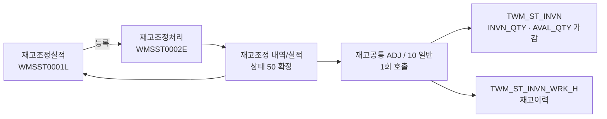
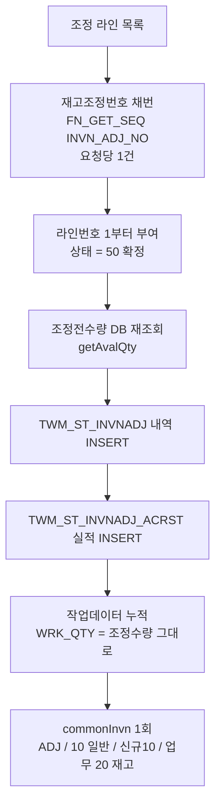
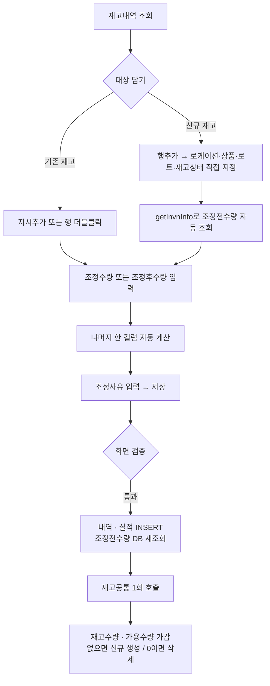

# WMS 재고조정 화면 프로세스 정의서

> 대상: 재고조정처리(WMSST0002E), 재고조정실적(WMSST0001L)
> 목적: 화면별 **업무 프로세스 뼈대와 핵심 검증·로직**을 정리한다. 실코드(JSP·서비스·SQL·공통코드) 분석 결과 기준.
> 관계: `wms-st-화면프로세스정의서.md` §1의 상세 전개판이다. 속성변경·로트병합/분할은 `wms-st-속성변경-로트병합분할-화면프로세스정의서.md` 참조.

---

## 공통 원칙

- 재고조정은 실사 결과 반영·오차 보정·기초재고 생성을 위해 특정 재고의 수량을 **±로 증감**한다. 속성변경/로트병합·분할이 총량을 보존하는 것과 달리, **재고조정은 창고 전체 총량을 변화시키는 유일한 재고운영 처리**다.
- **재고공통(`commonInvn`)을 재고조정(ADJ) / 작업유형 `10 일반` 으로 1회 호출한다.** 속성변경 계열이 변경전(−)·변경후(+) 2회를 호출하는 것과 달리 조정은 한 방향 1회다.
- **`INVN_QTY`(재고수량)와 `AVAL_QTY`(가용수량)가 함께 증감**하고 `ALOC_QTY`(할당)·`HLD_QTY`(보류)는 건드리지 않는다. 즉 조정 가능한 대상은 실질적으로 **가용재고 범위**다.
- **저장 즉시 확정된다.** 재고조정상태(C01381)는 항상 `50 확정`으로 기록되며 요청/지시 단계를 쓰지 않는다. **업무적 취소(되돌리기) 경로가 없다** — 반대 부호의 조정을 다시 등록해야 한다.
- **존재하지 않는 재고도 만들 수 있다.** 조정처리내역에 [행추가]로 로케이션·상품·로트·재고상태를 직접 지정하면, 해당 조합의 재고행이 없어도 (+)조정으로 **재고행이 신규 생성**된다(기초재고 생성·누락재고 추가 용도).
- 저장은 **트랜잭션 단위**로 처리되어 도중 오류 시 전체 롤백된다(`@Transactional(rollbackFor=Exception.class)`).

## 화면 분류

| 화면 | 프로그램ID | 유형 | 처리 | 메뉴 노출 |
|------|-----------|------|------|-----------|
| 재고조정처리 (WMSST0002E) | PGM000097 | ⚙️ 프로세스 | 조정 저장(±) | **N — 메뉴 없음**. 재고조정(WMSST0001L)의 [등록] 버튼으로만 진입 |
| 재고조정 (WMSST0001L) | PGM000066 | 🔎 조회 | 조정 실적 조회 + 등록화면 진입점 | Y |

> 속성변경등록(WMSST0009E)과 동일한 **"실적조회 화면이 등록화면의 유일한 진입점"** 구조다.

## 전체 업무 흐름

---

# ⚙️ 재고조정 저장 파이프라인

**조정전·조정후 수량 산출** — 화면 입력값이 아니라 **서버가 DB에서 다시 읽어 계산**한다.

| 항목 | 산출식 |
|------|--------|
| `ADJ_BFR_QTY` (조정전수량) | `TWM_ST_INVN.AVAL_QTY` **저장 시점 재조회값** (재고행이 없으면 0) |
| `ADJ_QTY` (조정수량) | 화면 입력값 (양수 = 증가, 음수 = 감소) |
| `ADJ_AFT_QTY` (조정후수량) | `조정전수량 + 조정수량` **서버 재계산** |

> 화면의 조정후수량 컬럼은 입력 편의를 위한 것이고 **저장값으로 쓰이지 않는다.** 화면 조회 시점과 저장 시점 사이에 가용수량이 바뀌면 화면 표시값과 실적 기록값이 달라진다.

**재고공통(`commonInvn`) 내부 순서**

1. **재고작업ID 채번**(`FN_GET_SEQ('INVN_WRK_ID')`) → 라인별 `WRK_SN` 1..n 부여
2. **임시 작업테이블 INSERT** (`TWM_ST_INVN_WRK_T`)
3. **로케이션 속성 검증** — 상품 혼적 체크, 고정로케이션 상품 일치 체크
   → 신규 재고행을 만드는 (+)조정도 이 검증을 통과해야 한다. 혼적 불가 로케이션에 다른 상품을 조정으로 밀어 넣거나 고정로케이션 상품이 어긋나면 `"상품 혼적이 존재합니다"` / `"고정로케이션 상품이 일치하지 않습니다"` 로 전체 롤백
4. **수량 규칙 조회** — 공통코드 C01498의 작업유형 `10 일반`
   - 대상 컬럼 = **INVN_QTY, AVAL_QTY**, 부호 = **+1, +1**
   - 증감 방향은 `WRK_QTY`(= 조정수량)의 부호가 결정한다
5. **부족수량 체크**(`getCheckFromLocationEnoughQty`) — 대상 키(로케이션·로트·재고상태)별로 `SUM(WRK_QTY)`를 집계해 현재 `INVN_QTY`/`AVAL_QTY`와 비교. 부족하면 `"수량이 충분하지 않습니다"`
   → **음수 조정에 대한 실질적인 서버 방어선은 이 한 곳뿐이다.** 재고행이 아예 없는 조합에 음수 조정을 걸면 0과 비교되어 차단된다
6. **재고 반영**(`procInvnAdj`)
   - 대상 재고행이 **있으면 UPDATE**: `INVN_QTY += 조정수량`, `AVAL_QTY += 조정수량`
   - **없으면 INSERT**: 해당 로케이션·로트·재고상태 조합의 재고행 신규 생성(할당·보류는 기본값 0)
   - **수량 4종이 모두 0인 행은 DELETE** — 할당·보류가 남아 있으면 삭제되지 않고 0짜리 잔존 행이 남는다
7. **재고이력 INSERT** (`TWM_ST_INVN_WRK_H`)
8. **finally: 임시 작업테이블 DELETE**

**재고이력 표현** — 조정 데이터는 `FROM_LOC_CD / FROM_LOT_ID / FROM_INVN_ST_CD` 슬롯에만 실리고 `TO_*` 는 NULL이다. 속성변경이 (−)/(+) 두 줄로 남는 것과 달리 **조정은 부호가 있는 한 줄**로 남는다.

**내역/실적 기록값**

| 컬럼 | 값 |
|------|-----|
| `INVN_ADJ_NO` | 저장 요청당 1건 채번 |
| `INVN_ADJ_LN_NO` | 1부터 순번 (실적번호 `INVN_ADJ_ACRST_NO`도 동일 값) |
| `INVN_ADJ_ST_CD` | `50` 확정 고정 |
| `ADJ_QTY` | 조정수량(부호 포함) |
| `ADJ_BFR_QTY` / `ADJ_AFT_QTY` | 실적 테이블에만 기록(내역 테이블에는 조정수량만) |
| `REQ_DT` / `WRK_DRCT_DT` | 처리일시(SYSDATE) |
| `ADJ_RSN_CD` / `ADJ_RSN` | 조정사유 코드 / 자유 입력 텍스트 |
| `RFN_NO` / `RFN_DTL_NO` / `RMK_CONTT` | NULL (참조 업무 없음) |

---

# ⚙️ 재고조정처리 (WMSST0002E)

## 화면 구성

- **조회조건**: 화주(필수)·센터(필수)·상품(팝업)·로케이션코드(팝업)·재고상태
- **3분할 그리드**
  - `재고내역`(좌 80%) — 조회 결과, 체크박스. 표시 수량은 **가용수량만**
  - `로트속성`(우 20%) — 재고내역 행 선택 시 해당 로트의 속성값 조회(로트ID가 있는 행만)
  - `조정처리내역`(하단) — 편집 그리드
- **버튼**: 조회 / **지시추가** / **행추가** / **행삭제** / **저장**

**재고내역 조회 대상** — `TWM_ST_INVN` 기준, 로케이션 데이터상태 `01`, 로케이션 업무구분이 **입고작업(01)·출고작업(02)이 아닌** 것.
※ 수량 조건이 없어 **가용수량 0인 재고도 목록에 뜬다**(감소 조정은 부족수량 체크에서 막히고, 증가 조정은 정상 처리된다).

**조정처리내역 편집 컬럼**

| 컬럼 | 유형 | 필수 | 비고 |
|------|------|------|------|
| 로케이션 | 팝업(돋보기) | ✔ | 행추가 행에서만 편집 가능 |
| 상품코드 | 팝업(돋보기) | ✔ | 행추가 행에서만, 로트ID 입력 후에는 변경 불가 |
| 로트ID | 팝업(돋보기) | ✔ | 행추가 행에서만, 상품코드 입력 후 활성 |
| 재고상태 | 콤보(C00749) | ✔ | **모든 행에서 편집 가능**(행추가 행 제한 없음). 변경 시 조정전수량 재조회 |
| 조정전수량 | 자동(읽기전용) | - | 기존 재고의 가용수량 |
| 조정수량 | 입력 | ✔ | 양수 = 증가, 음수 = 감소 |
| 조정후수량 | 입력 | ✔ | 조정수량과 **양방향 자동 계산** |
| 조정사유 | 콤보(C00767) | ✔ | |
| 조정사유(TEXT) | 입력 | △ | 사유가 `99 기타`면 필수 |

## 대상 담기 — 3가지 경로

**① [지시추가]** — 재고내역에서 체크한 행들을 복사. 담은 뒤 **재고내역의 체크박스를 전부 해제**한다.
**② 행 더블클릭** — 해당 행 1건을 복사.
**③ [행추가]** — 재고내역과 무관한 **빈 행**(`ROW_ATTR = rowAdd`)을 생성. 화주·센터는 조회조건 값, 재고상태는 `10 정상`, 조정전수량은 `0`으로 초기화된다.

- ①②는 중복 방지: `화주 + 센터 + 로케이션 + 로트ID + 재고상태` 가 이미 담긴 조합이면 `"이미 추가한 재고가 존재합니다."`
- ③ 행추가 행의 돋보기 버튼은 **컬럼별로 다른 팝업**을 연다
  - 로케이션 → 로케이션 공통팝업
  - 상품코드 → 상품 공통팝업 (**로트ID가 이미 입력되어 있으면** `"상품코드를 변경할수 없습니다."`)
  - 로트ID → 로트관리 팝업 (**상품코드 미입력이면** `"상품코드를 입력해주세요."`) — 기존 로트 선택 또는 **신규 로트 생성** 가능
- 로케이션·로트ID·재고상태가 정해질 때마다 `getInvnInfo`로 **해당 조합의 기존 재고를 조회해 조정전수량을 채운다.** 존재하지 않으면 조정전수량 `0`(재고상태 변경 경로에서는 공백)으로 세팅되고, 그대로 저장하면 신규 재고행이 생성된다

> **재고상태 컬럼에는 행추가 제한이 걸려 있지 않다.** 로케이션·상품·로트 팝업은 행추가 행에서만 열리지만, 재고상태 콤보는 ①②로 담아 온 행에서도 편집된다. 이때 조정전수량이 **바뀐 재고상태의 재고행 값으로 갈아끼워지므로**, 담아 온 재고가 아니라 **다른 재고를 조정하는 라인**이 된다(해당 상태의 재고가 없으면 조정전수량이 공백이 되고 신규 재고행 생성으로 이어진다).

## 수량 입력 — 양방향 자동 계산

| 입력한 컬럼 | 자동 계산 |
|------------|-----------|
| 조정수량 | `조정후수량 = 조정전수량 + 조정수량` |
| 조정후수량 | `조정수량 = 조정후수량 − 조정전수량` |

- 결과가 0이면 상대 컬럼에 `0`을 명시적으로 세팅한다(빈칸이 되지 않도록)
- **입력 단계에서는 음수 결과를 막지 않는다.** 조정후수량이 음수가 되어도 경고 없이 계산되며, 저장 시점에 검증된다

## 저장 — 핵심 검증

저장 대상은 체크박스가 아니라 **추가/편집된 행**(행상태 C/U/D)이다.

1. **필수항목 검사** — 로케이션·상품코드·로트ID·재고상태·조정수량·조정후수량·조정사유. 미입력 시 `"N번째 ROW - '항목명' 항목은 필수입니다."`
2. **중복 재고 검사** — `화주+센터+로케이션+로트ID+재고상태` 중복 시 `"중복되는 재고가 존재합니다."`
3. **조정 후 음수 금지** — `조정전수량 + 조정수량 < 0` 이면 `"조정가능 수량은 N이내 입니다."`
4. **조정수량 0 금지** — `"조정수량이 0입니다."`
5. **기타 사유 상세 필수** — 조정사유가 `99 기타`인데 사유 텍스트가 비어 있으면 `"조정사유를 입력해주세요."`
6. 저장 확인창은 **없다** (즉시 전송)

## 저장 — 핵심 로직

- 재고조정번호 1건 채번 → 라인번호 1부터 → 라인마다 **조정전수량을 DB에서 재조회**한 뒤 내역·실적 INSERT (상태 `50 확정`)
- 모든 라인의 작업데이터를 모아 **재고공통을 1회 호출**한다(작업구분 `ADJ`, 작업유형 `10 일반`, 작업상태 `10 신규`, 업무유형 `20 재고`)
- 작업데이터 매핑

  | 항목 | 값 |
  |------|-----|
  | FROM 로케이션 / 로트 / 재고상태 | 조정 대상 재고의 키 |
  | TO 로케이션 / 로트 / 재고상태 | 전부 NULL |
  | 작업수량 | **조정수량(부호 그대로)** |
  | 지시번호 / 상세 | 재고조정번호 / 라인번호 |

- 저장 후 조정처리내역 그리드를 비우고 재고내역을 재조회한다
- **테이블 변경**: 재고조정 내역 **INSERT** + 재고조정 실적 **INSERT** + 재고 **가감(UPDATE, 없으면 INSERT, 0이면 DELETE)** + 재고이력 **INSERT**

---

# 🔎 재고조정 (WMSST0001L)

- 조정 실적 조회 전용. **[등록] 버튼이 재고조정처리(WMSST0002E) 진입 경로**다(해당 화면은 메뉴에 노출되지 않음)
- 조회조건: 화주·센터·**조정일시(From~To)**·상품·조정사유
  - 일자 기본값은 **7일 전 ~ 오늘**, From/To 중 하나만 입력하면 `"'시작일자'를 입력하여 주십시오."` 등으로 차단
- 내역(`TWM_ST_INVNADJ`)과 실적(`TWM_ST_INVNADJ_ACRST`)을 조인해 **조정전수량 / 조정수량 / 조정후수량**을 나란히 보여준다
- 정렬: 재고조정번호 내림차순 → 라인번호 → 실적번호 오름차순
- 조정사유명은 C00767에서 조회

---

## 부록 1. 수량 흐름 한눈에

| 처리 | 재고 반영 | 작업구분/유형 | 처리 후 상태 |
|------|-----------|--------------|--------------|
| 재고조정 (+) | 재고수량 +N / 가용수량 +N (행 없으면 신규 생성) | ADJ / 10 일반 | 50 확정 |
| 재고조정 (−) | 재고수량 −N / 가용수량 −N (전부 0이면 행 삭제) | ADJ / 10 일반 | 50 확정 |

- 할당(`ALOC_QTY`)·보류(`HLD_QTY`)는 **변하지 않는다** — 조정 가능 범위는 사실상 가용재고
- 창고 총재고 합계가 **변한다**(속성변경·로트병합/분할과의 결정적 차이)
- 취소·역처리 기능 없음 — 반대 부호 조정으로만 복구 가능

## 부록 2. 검증 책임 분포 (클라이언트 vs 서버)

| 검증 항목 | 화면 | 서비스 | 재고공통 |
|----------|------|--------|----------|
| 필수항목(로케이션·상품·로트·상태·수량·사유) | ✔ | ✘ | ✘ |
| 조정수량 0 금지 | ✔ | ✘ | ✘ |
| 조정 후 수량 음수 금지 | ✔ | ✘ | **✔** (부족수량 체크) |
| 중복 재고 담기 | ✔ | ✘ | ✘ |
| 사유 `99 기타` 시 상세 필수 | ✔ | ✘ | ✘ |
| 조정전수량 정확성 | ✘ (표시용) | **✔** (저장 시 DB 재조회 — 조회 키가 재고 테이블 PK와 일치해 단건 보장) | - |
| 담은 재고와 조정 대상 재고의 일치 | ✘ (재고상태 편집 무제한) | ✘ | ✘ |
| 상품 혼적 / 고정로케이션 상품 일치 | ✘ | ✘ | **✔** |
| 조정 대상 로케이션이 작업로케이션(01/02)이 아닐 것 | ✔ (조회 범위) | ✘ | ✘ |

→ **서버 단독 방어선은 재고공통의 부족수량·로케이션 속성 체크**이며, 여기에 **서비스단의 조정전수량 재조회**가 더해진다. 속성변경 계열이 클라이언트 값을 그대로 기록하는 것과 달리, 재고조정은 실적 수량만큼은 서버가 확정한다.

## 부록 3. 구현상 유의사항 (신규 도입 시 개선 대상)

**업무·데이터 품질**

- **업무 취소 경로가 없다.** 상태코드 C01381에 요청/지시가 정의되어 있으나 항상 `50 확정`으로 기록된다. 오등록 시 반대 부호 조정 외에 복구 수단이 없고, 그 경우 실적이 2건 남는다.
- **재고마감의 "미확정 재고조정" 검사가 실질적으로 무효다.** 마감 불가 데이터 조회는 `INVN_ADJ_ST_CD <> '50'` 인 조정을 찾는데, 조정은 항상 50으로만 생성되므로 이 조건에 걸리는 건이 없다. 실제로 마감을 막는 것은 미확정 재고이동과 할당재고(`ALOC_QTY > 0`)뿐이다.
- **조정사유 코드그룹(C00767)에 타 업무 사유가 섞여 있다.** 세트화/세트해체 지시이동·단위대체·수작업출고·센터이고 등 재고조정과 무관한 코드가 같은 그룹에 있고 화면에서 필터링하지 않는다. 조정 전용 사유 집합 분리 검토 필요.
- **조정후수량은 화면 입력값이 저장되지 않는다.** 조회 시점 이후 가용수량이 바뀌면 사용자가 본 조정후수량과 실적에 남는 값이 달라진다(조정수량은 그대로 적용되므로 결과 자체는 정합).
- 신규 재고행 생성 경로에서 **로케이션-상품 조합의 업무적 타당성을 검증하는 지점이 공통계층의 혼적·고정로케이션 체크뿐**이다. 기초재고 생성 용도로 열려 있는 만큼 권한 통제 검토 필요.

**화면(JSP)**

- 저장 요청이 콜백 없이 전송된 뒤 곧바로 그리드 초기화와 재조회가 실행된다. 저장 실패 시에도 입력이 사라져 재입력이 필요하다 — 성공 콜백 기준 처리로 변경 권장(속성변경등록·로트병합/분할과 동일 패턴).
- **재고상태 컬럼에 행추가 제한이 없어**, 재고내역에서 담아 온 행의 재고상태를 바꾸면 담은 재고가 아닌 다른 재고를 조정하게 된다. 담아 온 행(`ROW_ATTR = drctAdd`)에서는 재고상태를 읽기전용으로 잠그는 편이 안전하다. 이때 라인의 상품코드는 담은 시점 값 그대로 남고(`getInvnInfo`는 재고상태·가용수량만 반환) 상품코드가 재고 테이블 PK 밖이라 기존 행 갱신 경로에서는 무시되지만, 해당 상태의 재고행이 없을 때는 **화면의 상품코드로 신규 재고행이 생성**된다. 로트가 상품에 종속되어 실무상 어긋나기 어려울 뿐 방어 장치는 없다.
- 수량 입력 단계에서 **조정 후 음수를 막지 않아** 사용자가 저장을 눌러야 비로소 오류를 알게 된다. 입력 시점 경고 추가 권장.
- 조정전수량 재조회(`getInvnInfo`)가 로케이션/로트/재고상태 편집마다 개별 비동기 호출로 나가며, 응답 처리 중 다른 행으로 이동하면 `getSelectedRowId()` 기준 동기화가 어긋날 수 있다.
- 재고조정실적 화면이 공통코드 `C01498`(재고작업유형)을 로드하지만 그리드에서 사용하지 않는다(잔재 코드).

**공통 재고계층 (ADJ 계열 전체 해당 — 속성변경·보류 등 동일)**

- 작업대상 미존재 데이터 조회(`getCheckFromLocationNotExistList`)의 첫 서브쿼리에 **작업ID·화주·센터 필터가 없어 임시 작업테이블 전체를 스캔**한다. 임시 데이터가 호출 종료 시 삭제되므로 평시엔 드러나지 않지만, 동시 처리 상황에서 다른 세션의 작업행이 섞일 수 있다. 재고조정만의 결함이 아니라 공통계층 이슈다.
