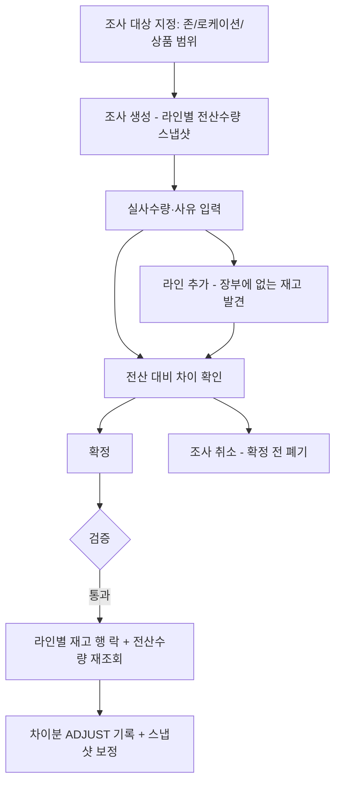
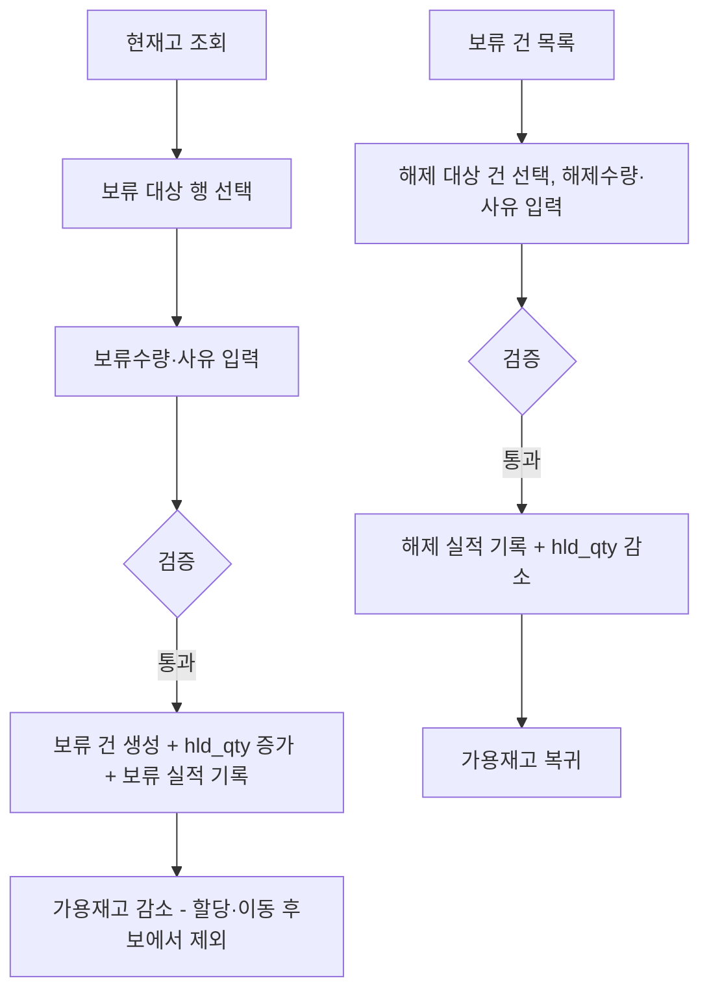
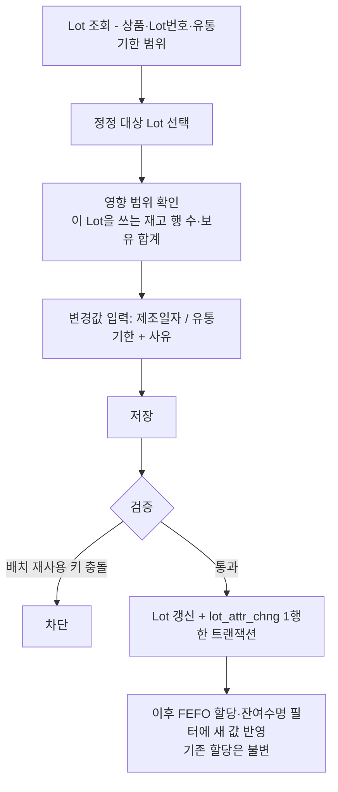
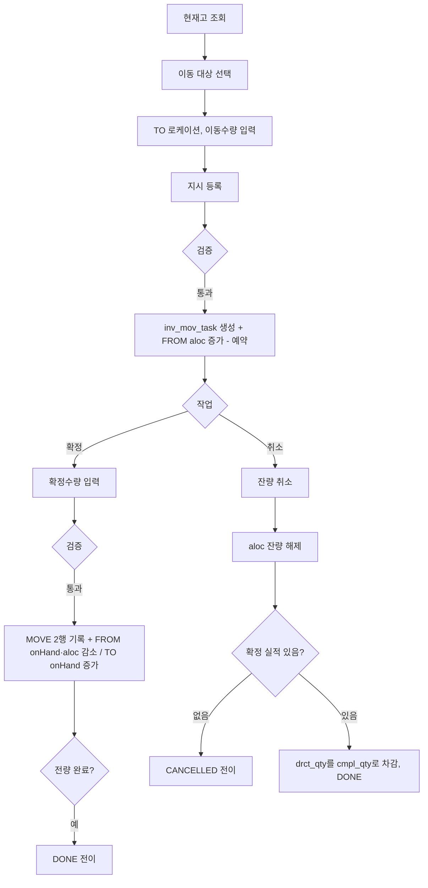

# WMS 재고(Inventory) 화면 프로세스 정의서

> 대상: 재고 7개 화면 — 현재고 조회 / 재고 이력 조회 / 재고조사(실사) / 재고 보류 / 재고 속성변경 / 재고 이동지시등록 / 재고 이동지시 관리
> 목적: 화면별 **업무 프로세스 뼈대와 핵심 검증·로직**만 정리한다. 구현 세부(호출구조·컬럼)는 제외.
> 근거 문서: `docs/design.md`(재고 모델·판단 근거) · `docs/schema.sql`(스키마의 주인) · `docs/screen-list.html`(화면 범위·구현 현황)
>
> 이 문서는 외부 WMS 재고운영 정의서(15화면)를 이 프로젝트의 재고 모델과 범위에 맞게 재작성한 것이다. 원본과의 차이는 [부록 B](#부록-b-원본-정의서15화면와의-범위-차이) 참조.

---

## 공통 원칙 (이 프로젝트의 재고 모델)

- **재고 키는 상품 + Location + Lot.** `inv`가 현재고 스냅샷이고, 수량 컬럼은 `on_hand_qty`(현품) / `aloc_qty`(예약) / `hld_qty`(보류) **셋**이다(보류 컬럼은 추가 예정 — 부록 C #4). `aloc_qty`는 출고 할당 전용이 아니라 **예약수량 일반**이다 — 출고 할당·이동지시(·적치지시)가 모두 이 컬럼으로 재고를 선점한다. **가용재고 = onHand − aloc − hld 는 파생값**이며 컬럼으로 저장하지 않는다. 원본의 4수량 체계 중 총재고 컬럼만 두지 않는다(총재고 = onHand).
- **보류는 수량이다** (번복 2026-08-03 — 원래 「행 단위 재고상태」 v1 설계였다). `inv.hld_qty`가 보류수량이고, 보류 시 가용이 줄고 보류가 는다. 재고상태 컬럼은 두지 않는다. **예약과 보류는 서로 관계가 없다** — 보류는 가용재고에서만 잡고(`aloc + hld ≤ onHand`), 예약된 수량을 보류할 수 없다(아래 「재고 보류」).
- **모든 물리 변동은 `inv_hist`에 ±수량으로 append-only 기록**하고, 같은 트랜잭션에서 스냅샷을 갱신한다. **불변식: `inv_hist` 합계 = `inv` 스냅샷.** 둘 중 하나만 하는 코드를 쓰지 않는다.
- 거래 유형(`tx_typ`)은 5종 — `RECEIVE`(입고) / `MOVE`(이동·적치) / `ADJUST`(조정) / `PICK`(피킹) / `SHIP`(출고확정). 이 목록은 DB CHECK(`ck_invh_tx_typ`)가 강제한다.
- **`MOVE`는 `inv_hist` 2행**(출발지 −, 도착지 +)이며 두 행 모두 같은 `from_loc_id`/`to_loc_id`를 가진다 — 한 행만 봐도 이동 전체를 알 수 있다.
- **정정은 append-only.** 원본 이력을 수정·삭제하지 않고 반대 방향 `ADJUST` 행을 추가한다(검수 취소가 이미 이 방식).
- **예약(할당·지시)은 물리 이동이 아니므로 이력에 기록하지 않는다.** `inv.aloc_qty`만 증감하고, 원천별 내역은 각자의 테이블이 담당한다 — 출고 할당은 `outb_alloc`, 이동 예약은 이동지시(`inv_mov_task`) 잔량. **항등식: `aloc_qty` = 원천별 미소진 잔량의 합** — 「이력 합계 = 스냅샷」과 별도로 대사 대상이다.
- **물리 변동의 실적 테이블을 두지 않는다.** 원본의 「내역 + 실적」 2벌 구조 대신 `inv_hist`가 물리 변동의 유일한 원장이며, 실적 조회 화면은 전부 이 원장 조회로 수렴한다. **예외는 보류다** (번복 2026-08-03) — 보류/해제는 물리 이동이 아니라 `inv_hist`(수량 원장)에 실을 수 없는데 등록·해제 각각의 사유 히스토리를 보존해야 하므로, 보류 전용 3테이블(보류 건 + 보류 실적 + 해제 실적)을 별도로 둔다(「재고 보류」).
- **헤더 상태는 워크플로 단계만** 표현한다. 부분 여부는 라인 수량 비교로 파생하고 `PARTIALLY_*` 상태를 만들지 않는다.
- **모든 수량은 출고단위다**(실사 입력 포함 — `docs/design.md` 「계량단위와 환산」).
- DB가 막아주는 최후 방어선은 `ck_inv_qty`(음수·과예약 금지 — `hld_qty` 도입 시 `aloc_qty + hld_qty <= on_hand_qty`로 변경, 부록 C #4)와 `ck_invh_qty`(변동 0 금지)다. 예약 원천이 늘어도 이 CHECK는 그대로다. FK는 없으므로 참조 무결성은 애플리케이션 책임이다.

## 화면 분류

| 화면 | 유형 | 처리 | 구현 현황 |
|------|------|------|-----------|
| 재고조사(실사) | ⚙️ 프로세스 | 실사 차이를 `ADJUST`로 보정 | **구현** (`/inventory/stocktakes`) |
| 재고 보류 | ⚙️ 프로세스 | 보류수량 증감(보류/해제) | 미구현 (`inv.hld_qty` 컬럼 + 보류 3테이블 필요) |
| 재고 속성변경 | ⚙️ 프로세스 | Lot 속성(제조일자·유통기한) 정정 — 재고 무변동 | **구현** (`/inventory/lot-attrs`) |
| 재고 이동지시등록 | ⚙️ 프로세스 | 이동지시 생성(예약) | **구현** (`/inventory/moves`) |
| 재고 이동지시 관리 | ⚙️ 프로세스 | 이동 확정(부분 허용) / 취소 | **구현** (`/{id}/confirm` · `/{id}/cancel`) |

이동지시등록·관리는 논리적으로 화면 2개지만 **사이드 메뉴는 「재고 이동」 하나**이고, 화면 안 탭으로 오간다 (`/stock/move` — `StockMove.jsx`).
| 현재고 조회 | 🔎 단순조회 | 스냅샷 조회 | 구현 |
| 재고 이력 조회 | 🔎 단순조회 | 원장 조회 | 구현 |

---

# ⚙️ 프로세스 화면

## 1. 재고조사 (실사)

조사 범위를 지정해 실사수량을 입력하고, 전산 대비 차이를 확정 시점에 `ADJUST`로 보정한다. **건별 수동 조정 화면을 따로 두지 않는다** — 특정 재고 하나의 정정도 범위를 좁게 잡은 실사로 수행한다(입고 확정 후 수량 정정도 이 경로 — `docs/design.md`). 즉 **이 화면이 재고 수량 정정의 유일한 경로**이고, 레거시의 「재고조정처리」가 하던 일(오차 보정·기초재고 생성·발견재고 등록)을 전부 흡수한다.

### 1-1. 조정수량의 기준 — 확정시점 전산수량 (2026-08-03 결정)

**조정수량 = 실사수량 − 확정시점 전산수량**이다. 확정 트랜잭션이 라인별로 재고 행 락을 걸고 전산수량을 다시 읽어(`cfm_sys_qty`에 기록) 그 차이를 `ADJUST`로 건다. 따라서 **확정 후 `on_hand_qty`는 실사수량과 정확히 일치한다.**

> **번복 — 원래 이 절은 「차이 = 실사수량 − 조사 생성 시점 전산수량」이었다.** 조사 생성부터 확정까지 몇 시간이 걸리는 것이 정상이라 그 사이의 입고·피킹·이동확정이 전산수량을 바꾼다. 스냅샷 기준으로 조정하면 확정 후 전산수량이 실사수량과 어긋나 「무엇을 위해 셌나」가 무너진다. 대가는 **실사 이후 들어온 입고분이 실사값으로 덮여 사라지는 것**이며, 이건 실사와 입고를 같은 시간대에 돌리지 않는 운영으로 막는다.

조사 생성 시점 스냅샷(`sys_qty`)은 버리지 않고 라인에 남긴다 — 「조사 시작 때는 얼마였나」의 기록이자, 화면이 현재값과 비교해 **「조사 중 변동됨」을 표시**하는 근거다. 사용자는 [전산수량 재조회]로 화면의 기준값을 최신으로 맞출 수 있는데, 이건 표시용 갱신일 뿐 조정 계산에는 영향이 없다(확정은 언제나 그 시점 값을 다시 읽는다).

### 1-2. 테이블 2개 (부록 C #6)

| 테이블 | 역할 |
|---|---|
| 조사 헤더(`inv_stktk`) | 조사번호(`stktk_no` — `nbr_rule` `STKTK_NO` 채번, 건당 유일) · 조사 범위 3필드(`zon_cd`/`loc_id`/`prod_id`, 모두 선택) · 상태(`CREATED`/`CONFIRMED`/`CANCELLED`) · 확정시각 |
| 조사 라인(`inv_stktk_ln`) | 재고 키(상품+Loc+Lot) · `sys_qty`(생성 시점 전산수량) · `stktk_qty`(실사수량, NULL = 미조사) · `cfm_sys_qty`(확정시점 전산수량 = 조정전수량) · 조정사유(`rsn_cd`/`rsn_dscr`). **조정수량은 파생이라 컬럼이 없다** |

**실적 테이블은 없다** — 실적의 실체는 `inv_hist`의 `ADJUST` 행(`rfn_doc_typ = INV_STKTK`, `rfn_doc_no` = 조사번호)이다. 레거시의 「내역 + 실적」 2벌 구조를 채택하지 않는 이유는 이동지시와 같다(보류만이 이 원칙의 예외다).

**사유는 공통코드**(`ADJ_RSN` 그룹 — 파손/분실/작업오류/기초재고/기타)이고 **기타(`ETC`)일 때만 자유 텍스트**(`rsn_dscr`)를 받는다. 보류 사유와 같은 규칙이다. 레거시는 조정사유 그룹에 세트화·단위대체 등 타 업무 사유가 섞여 있고 화면이 걸러내지도 않았는데(레거시 정의서 부록 3), 여기서는 조사 전용 사유만 담는다.

### 1-3. 핵심 검증

- 실사수량은 0 이상. **미입력(NULL)과 0은 다르다** — NULL은 「미조사」로 확정에서 건너뛰고, 0은 「실물 없음」이라 전량 차감된다
- **차이가 0이 아닌 라인만 사유 필수.** 차이 0 라인은 `ADJUST` 자체가 없으므로 사유도 요구하지 않는다(`ck_invh_qty`가 변동 0을 금지)
- 보정 결과 `on_hand_qty < aloc_qty + hld_qty`가 되면 불가(과예약·과보류 — `ck_inv_qty`가 최후 방어). 서버가 먼저 잡아 **「할당 해제·이동지시 취소·보류 해제로 먼저 정리하라」**는 메시지를 준다
- **보관(`STORAGE`) 로케이션 재고만 조사 대상**(v1) — 스테이징 재고는 적치·출고확정이 소진 중인 물량이라 세는 시점 자체가 불안정하다. 보류·이동의 `STORAGE` 한정과 같은 결의 경계다
- 한 조사 안에 같은 재고 키가 두 번 들어올 수 없다(`uq_inv_stktk_ln` — 레거시의 「중복되는 재고가 존재합니다」를 DB로 올린 것)
- **라인 수동 추가에는 온도대·적재가능수량 검증을 걸지 않는다.** 실사는 「거기 실제로 있는 것」을 기록하는 업무라, 온도대가 어긋난 자리나 용량 초과 상태도 사실이면 그대로 적어야 한다(막으면 실물과 장부의 괴리가 오히려 남는다). 대신 **그렇게 만들어진 재고 행은 이후 FEFO 할당·이동이 그대로 신뢰한다**는 점은 알려진 구멍이다 — 잘못 넣은 조합은 다음 조사에서 (−)조정으로 지우고 올바른 로케이션에 (+)조정하는 식으로 바로잡는다. 상품·Lot 정합성(Lot이 그 상품의 것인지)과 보관 로케이션 여부는 검증한다
- 라인 편집(실사수량 입력·라인 추가/삭제·재조회)은 **작성(`CREATED`) 상태에서만**

### 1-4. 핵심 로직

- 조사 생성: 범위에 걸리는 보관 재고를 훑어 라인을 만들고 전산수량을 스냅샷한다. **재고를 선점하지 않는다** — 조사는 예약이 아니므로 `aloc_qty`도 이력도 건드리지 않는다. 그래서 같은 재고에 조사가 둘 겹쳐도 안전하다(각자 확정시점 값을 다시 읽으므로 이중 반영이 없다)
- 확정: 헤더 락 → 라인을 **재고 키 오름차순**으로 순회(동시 확정 시 락 순서 고정 — 교착 방지) → 라인별 `inv` 행 락 → `cfm_sys_qty` 기록 → 차이만큼 `inv_hist` `ADJUST` + `on_hand_qty` 보정을 **한 트랜잭션**으로. 한 라인이라도 검증에 걸리면 전량 롤백
- **장부에 없는 재고 등록**(레거시 [행추가] 대응): 라인 수동 추가로 재고 키를 지정하면 전산수량 0으로 담기고, 확정 시 (+)조정이 `inv` 행을 새로 만든다. 기초재고 생성 경로이기도 하다. **단 Lot은 이미 있는 것만 고를 수 있다** — Lot은 입고 배치의 식별자라 생성은 검수의 소관이다
- 감소 조정으로 재고수량이 0(보유·예약·보류 모두 0)이 된 `inv` 행은 삭제한다(`PutawayService`·`InvMovService`와 같은 관례). 「이력 합계 = 스냅샷」 불변식은 유지된다: 이력 SUM=0 ↔ 행 없음
- 헤더 상태는 워크플로 단계만(작성 → 확정) — 「부분확정」을 두지 않고, 입력 진행도는 라인 수 비교로 파생한다. 확정 전 폐기는 `CANCELLED`(라인 보존 — 무엇을 세려다 접었는지가 남는다)
- 확정 후 재정정은 조사를 되열지 않고 **새 조사를 추가**한다 — append-only 원칙. 레거시도 취소 경로가 없어 반대 부호 조정으로만 복구했는데, 여기서는 그게 「새 조사」다
- REST — `POST /inventory/stocktakes`(생성) · `GET /inventory/stocktakes`(+`/{id}` 상세) · `PUT /{id}/lines`(실사수량 저장) · `POST /{id}/lines`(라인 추가) · `DELETE /{id}/lines/{lnId}` · `POST /{id}/resync` · `POST /{id}/confirm` · `POST /{id}/cancel`. 화면은 사이드 메뉴 하나에 탭 2개(조사 목록 / 실사 입력·확정 — `/stock/count`)

### 1-5. 원본(레거시) 설계 대비 채택/재설계

| 레거시 (재고조정처리 WMSST0002E) | 이 프로젝트 | 사유 |
|---|---|---|
| 저장 즉시 확정(요청/지시 단계 미사용) | 조사 생성 → 실사 입력 → 확정 2단계 | 실사는 「세는 시간」이 있는 업무다. 좁은 범위로 잡으면 레거시와 같은 즉시 처리에 가깝다 |
| 조정전수량 = 저장 시점 `AVAL_QTY` 재조회 | 조정전수량 = 확정시점 `on_hand_qty` 재조회(`cfm_sys_qty`) | 「서버가 다시 읽는다」는 같은 판단. 다만 기준을 가용이 아니라 **보유**로 잡는다 — 예약·보류는 실물의 일부이므로 실사 대상이다(대신 실사수량이 예약+보류보다 적으면 확정 차단) |
| 화면 입력 조정후수량은 저장되지 않음 | 실사수량이 곧 조정후수량 — 그대로 저장·반영 | 실사수량은 사람이 센 값이라 화면 값이 정답이다. 서버가 재계산하는 것은 조정전수량 쪽 |
| 내역(`TWM_ST_INVNADJ`) + 실적(`..._ACRST`) 2테이블 | 헤더/라인 2테이블 + `inv_hist`가 실적 | `putaway_task`·`inv_mov_task` 선례 — 실적의 실체는 원장의 `ADJUST` 행 |
| [행추가]로 존재하지 않는 재고 생성 | **채택** — 라인 수동 추가 (Lot은 기존 것만) | 기초재고·발견재고 등록은 실사의 정당한 일. Lot 생성까지 열면 검수의 책임 경계가 무너진다 |
| 재고상태 컬럼을 라인에서 바꿔 다른 재고를 조정 | 없음 — 재고상태 컬럼 자체가 없다 | 레거시 부록 3이 지적한 결함(담은 재고와 조정 대상이 어긋남)이 구조적으로 사라진다 |
| 조정사유 그룹에 타 업무 사유 혼재 | 조사 전용 `ADJ_RSN` 그룹 | 레거시 부록 3 지적 반영 |
| 음수 방어가 공통계층 부족수량 체크 한 곳 | 서비스 검증(예약·보류 잔량) + `ck_inv_qty` | 메시지로 해소 방법(할당 해제·지시 취소·보류 해제)까지 안내 |
| 동시성 제어 없음 | 헤더 락 + 라인별 재고 행 락(키 오름차순) | 할당·이동과 같은 락 지점 |
| 조정 = 재고수량·가용수량 동시 증감 | `on_hand_qty`만 증감 (가용은 파생값) | 가용을 컬럼으로 두지 않는 이 프로젝트의 재고 모델 |

---

## 2. 재고 보류

특정 재고 행(상품+로케이션+Lot)의 **일부 또는 전량을 수량 단위로 보류**해 가용재고에서 뺀다 — 보류 시 `inv.hld_qty`가 늘고 가용(onHand − aloc − hld)이 준다. 해제하면 다시 가용으로 복귀한다. 등록과 해제 각각 **사유를 기록**하고, 등록 → 해제 → 재등록이 반복돼도 전 이력이 보존된다.

> **v1 설계(행 단위 재고상태) 번복 — 2026-08-03.** 부분수량 보류와 등록/해제 사유별 히스토리 보존이 요구사항으로 확정되어, 재고상태 컬럼 대신 보류수량 컬럼 + 보류 전용 3테이블을 채택했다. 공통 원칙의 「보류는 수량이다」·「실적 테이블 예외」 항목이 이 결정이다.

**수량 관계** — 재고수량(onHand) = 가용 + 예약(aloc) + 보류(hld). **예약과 보류는 서로 관계가 없다**: 보류는 가용재고에서만 잡고, 예약된 수량은 보류할 수 없으며, 보류된 수량은 할당·이동지시의 후보가 아니다. DB 최후 방어는 `ck_inv_qty`를 `aloc_qty + hld_qty <= on_hand_qty`로 확장해 담당한다.

**테이블 3개** (모두 신규 — 부록 C #4·#5):

| 테이블 | 역할 |
|---|---|
| 보류 건(`inv_hld`) | 보류 단위의 마스터. 보류번호(`hld_no` — `nbr_rule` `HLD_NO` 채번, 건당 유일·라인 구조 없음) · 재고 키 · 보류수량(`hld_qty`) · 해제누계(`rlz_qty`) · 등록 사유 · 상태(`HELD`/`RELEASED`). 잔량 = `hld − rlz` 파생. 전량 해제돼도 행 보존(상태 전이) — `putaway_task` 선례 |
| 보류 실적(`inv_hld_acrst`) | 보류 등록의 append-only 로그(보류번호 · 수량 · 사유 · 시각) |
| 해제 실적(`inv_hld_rlz_acrst`) | 해제의 append-only 로그(보류번호 · 해제수량 · 해제 사유 · 시각). 부분 해제가 N번이면 N행 |

**사유는 공통코드다** — 등록·해제 각각 사유코드(`rsn_cd`, `code` 테이블에 보류사유·해제사유 그룹 신설)를 받고, **코드가 기타(`ETC`)일 때만 자유 텍스트(`rsn_dscr`) 입력**을 받는다(기타가 아니면 텍스트 없음). 실적 로그는 자기완결이다 — 수량·사유를 보류 건에서 파생하지 않고 실적 행에 그대로 담아, 건이 갱신돼도 각 시점의 기록이 보존된다.

**핵심 검증**
- 보류수량은 양수, **가용재고(onHand − aloc − hld) 이내** — 예약 잔량이 있어도 남은 가용분은 보류 가능
- **보관(`STORAGE`) 로케이션 재고만 대상**(v1) — 스테이징 보류를 허용하면 적치지시·출고확정의 수량 체크에도 `− hld` 파급이 생기므로, 필요해지면 확장한다
- 같은 재고 행에 보류 여러 건 가능 — 단, **미해제 잔량이 있는 동일 사유코드의 보류가 이미 있으면 중복 등록 불가**(사유가 다를 때만 병존). DB도 부분 UNIQUE 인덱스(`(prod, loc, lot, rsn_cd) WHERE status = 'HELD'`)로 최후 방어
- 해제는 **특정 보류 건을 지목**한다(재고 행 기준 자유 수량 해제가 아니다 — 해제 사유가 어느 보류를 왜 풀었는지 가리켜야 하므로). 해제수량은 양수, 그 건의 잔량(`hld − rlz`) 이내 — **부분 해제 허용**
- 기타(`ETC`) 사유코드는 텍스트 필수, 그 외 코드는 텍스트 무시

**핵심 로직**
- 등록: `inv` 행 락 → 가용 검증 → 보류 건 생성 + `inv.hld_qty += 수량` + 보류 실적 1행을 **한 트랜잭션**으로. 해제: 보류 건 잔량 검증 → 해제 실적 1행 + `rlz_qty` 누적 + `inv.hld_qty −= 수량`, 전량 해제 시 `RELEASED` 전이 — 역시 한 트랜잭션
- 상태는 `HELD`/`RELEASED` **2값뿐** — 오등록 취소는 별도 상태 없이 「해제(사유: 오등록)」로 흡수한다. 보류는 등록 즉시 발효라 `putaway_task`의 `CANCELLED`(실행 전에 접은 지시)에 해당하는 경우가 없다
- 보류/해제는 물리 이동이 아니므로 **`inv_hist`에 기록하지 않는다**(할당과 같은 판단). `on_hand_qty`도 변하지 않는다. 보류의 원장은 실적 2테이블이다
- 실물은 그대로 있으므로 보류 재고도 현재고 조회·실사 대상에는 포함된다(현재고 조회에 보류수량·가용재고 표시)
- **항등식: `inv.hld_qty` = SUM(보류 건 미해제 잔량)** — `aloc_qty` 항등식과 같은 방식의 대사 축. 대사 배치에 검증 추가
- **파급**: 할당(FEFO 후보 쿼리)과 이동지시등록의 가용 계산 두 곳에 `− hld_qty` 반영. `inv` 행 자동 삭제 조건에 `hld_qty = 0` 추가(재고수량이 0이어야 — 가용·예약·보류 모두 0)
- 화면은 사이드 메뉴 하나에 탭 구성(등록 / 보류 건·해제 / 실적 조회 — 재고 이동의 탭 선례). REST — `POST /inventory/holds`, `POST /inventory/holds/{id}/release`, `GET /inventory/holds`(+ 실적 조회)
- 유통기한 만료 Lot 자동 보류 배치는 백로그

---

## 3. 재고 속성변경 (Lot 속성 정정)

**수량이 아닌 속성**만 정정한다 — Lot의 제조일자·유통기한 오입력 정정. 재고상태 전환은 「재고 보류」, 수량 정정은 「재고조사」가 각각 담당하므로 이 화면의 일이 아니다. **재고는 한 톨도 움직이지 않는다** — `inv`·`inv_hist` 어느 쪽도 건드리지 않는 이 화면군의 유일한 처리 화면이다.

### 3-1. 무엇을 바꾸고 무엇을 바꾸지 않는가

| `lot` 컬럼 | 정정 | 사유 |
|---|---|---|
| `prod_id` | ✘ | Lot은 「그 상품의 입고 배치」다. 상품이 틀렸다면 Lot이 아니라 재고 자체가 잘못 잡힌 것이므로 재고조사의 (−)/(+) 조정이 맡는다 |
| `lot_no` | ✘ | 채번된 식별자. 재고·이력·지시가 `lot_id`로 물려 있어 값 자체는 표시용이지만, 입고일 기반 형식(`LOT-YYMMDD-NNN`)이라 바꾸면 번호가 입고일과 어긋난다 |
| `receipt_dt` | ✘ | 배치 재사용 키의 일부이자 `lot_no`의 근거. 둘을 함께 바꿔야 정합이 유지되는데 그건 정정이 아니라 재입고다 |
| `mfg_dt` | **✔** | 검수 입력 오류의 주 사례. **단 배치 재사용 키의 일부라 충돌 검증이 붙는다 (3-2)** |
| `expiry_dt` | **✔** | 벤더 인쇄 유통기한과 계산값이 다른 경우의 정정 (3-4) |

### 3-2. 배치 재사용 키 충돌 — 이 화면의 유일한 구조적 위험

검수(`ReceivingService.findOrCreateLot`)는 **`(상품 + 입고일자 + 제조일자)`가 같으면 기존 Lot을 재사용**한다(증분 검수로 배치가 쪼개지지 않게). `mfg_dt` 정정은 바로 이 키를 바꾼다.

- **정정 결과 키가 기존 다른 Lot과 겹치면 차단**한다. 겹치면 같은 배치를 가리키는 Lot이 둘이 되어, 이후 검수가 어느 쪽을 재사용할지 비결정이 된다(`findByProdIdAndReceiptDtAndMfgDt`가 임의의 한 건을 집는다)
- **DB는 이걸 막아주지 않는다.** `uq_lot`은 `(prod_id, lot_no)`에만 걸려 있어 날짜 조합에는 제약이 없다 — **서비스 검증이 유일한 방어선**이다. 「FK가 하나도 없다」와 같은 성격의 애플리케이션 책임
- **동시성**: 정정도 검수와 **같은 상품 로우 락**(`prodRepository.findByIdForUpdate`)을 먼저 잡는다. 검수의 락 순서(상품 → Lot)와 동일해 교착이 없고, 「정정이 키를 X로 바꾸는 사이 검수가 X 배치를 새로 만드는」 경합이 직렬화된다
- 겹치는 Lot이 이미 있다면 정정이 아니라 **두 Lot을 하나로 합치는 일**이고, 그건 로트 병합이라 이 프로젝트의 범위 밖이다([부록 B](#부록-b-원본-정의서15화면와의-범위-차이)). 필요하면 재고조사로 한쪽 Lot 재고를 (−)/(+) 옮긴다

### 3-3. 유통기한 미관리 상품의 Lot은 대상이 아니다

`prod.shelf_life_days = NULL`인 상품의 Lot은 `mfg_dt`·`expiry_dt`가 **항상 NULL이고 그게 정의**다(검수가 그렇게 만든다 — 「유통기한 미관리 상품은 제조일자가 항상 null」). 값을 넣는 것은 정정이 아니라 상품 관리방식 전환이고, 그건 상품 마스터의 소관이다. **관리로 전환해도 소급 적용하지 않는다** — `expiry_dt`는 생성 시점 `shelf_life_days`로 계산한 스냅샷이라는 기존 결정 그대로다.

따라서 정정 대상 Lot 조회는 **유통기한 관리 상품의 Lot만** 내려보내고, 서버도 저장 시 재검증한다.

### 3-4. 유통기한을 `제조일자 + shelf_life_days`로 강제하지 않는다

`expiry_dt`는 계산 스냅샷일 뿐 계산식에 종속된 파생값이 아니다. **오히려 「벤더가 찍은 유통기한이 계산값과 다르다」가 이 화면의 주 사용처**이므로 등식을 강제하면 정정 자체가 불가능해진다.

- 화면은 `mfg_dt`를 바꾸면 **재계산값(`새 제조일자 + shelf_life_days`)을 유통기한 기본값으로 제안**하되, 사용자가 덮어쓸 수 있다
- 서버는 `expiry_dt >= mfg_dt`만 본다(그 외 관계는 업무 판단)
- `mfg_dt <= receipt_dt` — 검수의 「제조일자가 입고일자보다 미래일 수 없다」와 같은 검증

### 3-5. 테이블 1개 — `lot_attr_chng` ([부록 C](#부록-c-스키마-변경-목록-반영-대기) #7 확정)

| 컬럼 | 역할 |
|---|---|
| `lot_id` / `prod_id` / `lot_no` | 대상 Lot. `lot_no`는 **스냅샷**이다 — 로그를 자기완결로 두는 보류 실적과 같은 판단 |
| `bfr_mfg_dt` / `aft_mfg_dt` | 제조일자 변경 전/후 |
| `bfr_expiry_dt` / `aft_expiry_dt` | 유통기한 변경 전/후 |
| `rsn_cd` / `rsn_dscr` | 정정 사유(공통코드 `LOT_ATTR_RSN`). **`ETC`(기타)일 때만 자유 텍스트** — 보류·조사와 같은 규칙 |

- **필드별 행이 아니라 변경 이벤트별 1행**이고, 바뀌지 않은 필드도 전/후에 같은 값이 들어간다. 「그 시점에 Lot이 어떤 모습에서 어떤 모습이 됐나」가 한 행으로 읽히는 편이 정정 이력의 용도에 맞는다(이 프로젝트는 범용 key-value 대신 타입 있는 컬럼을 쓴다는 관례이기도 하다)
- **채번하지 않는다.** 어디서도 참조되지 않는 append-only 로그라 문서번호가 필요 없다 — 보류가 `hld_no`를 가진 것은 해제가 특정 건을 지목해야 해서이고, 조사가 `stktk_no`를 가진 것은 `inv_hist.rfn_doc_no`가 그걸 물어서다. 여기엔 둘 다 없다
- **변경 전후가 완전히 같은 행은 DB가 거부**한다(`ck_lot_attr_chng_diff`) — `ck_invh_qty`(변동 0 금지)와 같은 성격의 최후 방어

### 3-6. 핵심 검증

- 대상 Lot이 **유통기한 관리 상품의 Lot**이어야 한다 (3-3)
- 제조일자·유통기한 **둘 다 필수**(관리 상품의 Lot에서 NULL로 되돌릴 수 없다), `mfg_dt <= receipt_dt`, `expiry_dt >= mfg_dt`
- **변경 전후가 완전히 동일하면 불가** — 바꿀 게 없는 저장은 로그만 늘린다
- **배치 재사용 키 `(상품+입고일자+제조일자)` 충돌 시 불가** (3-2) — 자기 자신은 당연히 제외
- 사유코드 필수, `ETC`일 때만 사유 텍스트 필수(그 외 코드에서는 무시하고 NULL 저장)

### 3-7. 핵심 로직

- **상품 로우 락 → Lot 로우 락 → 검증 → `lot` UPDATE + `lot_attr_chng` INSERT**를 한 트랜잭션으로. 락 순서는 검수와 동일(3-2)
- **Lot 단위 정정이다** — 그 Lot을 공유하는 **모든 재고 행(로케이션이 달라도)에 일괄 반영**된다. 화면이 저장 전에 영향 범위(재고 행 수·보유 합계)를 보여주는 이유다
- **수량 변동이 없으므로 `inv_hist`에 기록하지 않고 `inv`도 건드리지 않는다.** 원장은 `lot_attr_chng` 하나다(보류가 실적 2테이블을 갖는 것과 같은 예외 성격 — 물리 변동이 아니라 수량 원장에 실을 수 없다)
- **이미 생성된 할당은 건드리지 않는다** — 재검증·재할당이 없고, 이후 할당부터 새 값이 반영된다. 유통기한을 앞당기는 정정이 이미 할당된 물량을 점포 잔여수명 미달로 만들 수 있으나, 그 처리는 할당 취소·재할당(출고 소관)이다
- REST — `GET /inventory/lot-attrs`(정정 대상 Lot + 영향 범위) · `PUT /inventory/lot-attrs/{lotId}`(정정) · `GET /inventory/lot-attrs/chngs`(변경 이력). 화면은 사이드 메뉴 하나에 탭 2개(속성 정정 / 변경 이력 — `/stock/attribute`)
- **구현 위치는 `inventory` 패키지다.** `Lot` 엔티티는 `warehouse`가 갖지만 Lot을 쓰는 코드는 이미 그 밖에 있고(생성은 `inbound`의 `ReceivingService`), `warehouse`는 wmsback 안에서 아무 패키지도 import하지 않는 잎이라 그 상태를 깨지 않는다. 「쓰는 주체는 업무 프로세스다」

### 3-8. 파급

- **FEFO 정렬**(할당 후보 쿼리)과 **점포 잔여수명 필터**가 즉시 새 값을 본다 — 쿼리가 `lot.expiry_dt`를 직접 읽으므로 코드 변경은 없다
- 현재고 조회·재고조사·보류 화면의 유통기한 표시가 즉시 바뀐다(같은 컬럼 참조)
- **대사(reconciliation)에는 축이 늘지 않는다** — 수량을 건드리지 않으므로 「이력 합계 = 스냅샷」·`aloc_qty`·`hld_qty` 항등식 어느 것에도 영향이 없다

### 3-9. 원본(레거시) 설계 대비 채택/재설계

레거시의 「속성변경등록(WMSST0009E)」·「로트(LOT)병합/분할(WMSST0010E)」·「재고속성변경 실적(WMSST0008L)」 3화면 분석(`wms-st-속성변경-로트병합분할-화면프로세스정의서.md`) 대비.

| 레거시 | 이 프로젝트 | 사유 |
|---|---|---|
| 변경유형 `20 재고상태변경` — 재고상태 코드 전환 | **미채택** — 재고상태 컬럼 자체가 없다 | 상태 전환은 「재고 보류」가 수량으로 담당(2절). 레거시가 재고를 차감·증가시켜 표현하던 것을 컬럼 하나로 대신한다 |
| 변경유형 `30 재고LOT변경` — 재고를 다른 로트로 이동 | **미채택** | Lot은 검수 시 채번되는 **입고 배치**(상품+입고일자+제조일자)라 재고를 임의로 다른 배치에 옮기면 배치 추적이 무너진다. 잘못 잡힌 재고는 재고조사의 (−)/(+) 조정으로 바로잡는다 |
| 로트 병합 / 분할 | **제외** | 위와 같은 이유. 분할은 같은 배치를 쪼개 배치의 의미를 없애고, 병합은 서로 다른 입고일·제조일의 물량을 한 유통기한으로 뭉쳐 FEFO를 왜곡한다 |
| 「속성」이 **재고 행의 속성**(로트ID·재고상태) | 「속성」이 **Lot의 속성**(제조일자·유통기한) | 이 프로젝트에서 정정 가능한 속성은 Lot에만 있다. 그래서 수량 이동형이 아니라 **수량 무변동 UPDATE**가 된다 |
| 변경전 차감(−) + 변경후 증가(+) 2회 재고공통 호출 | **재고 미변동** — 호출 자체가 없다 | 총량 보존을 위해 −/+ 한 쌍이 필요했던 것은 재고 행을 옮겼기 때문이다. 옮기지 않으면 필요 없다 |
| 재고이력에 (−)행·(+)행 2줄, `TO_*` 전부 NULL이라 이동으로 안 보임 | `inv_hist` 기록 없음 | 물리 변동이 아니다. 레거시의 「두 행을 짝지어 읽어야 한다」 문제가 구조적으로 사라진다 |
| 내역(`TWM_ST_INVNATTR_CHNG`) + 실적(`..._ACRST`) 2테이블 | `lot_attr_chng` **1테이블** | 지시/실적 단계가 없다(저장 = 확정). 레거시도 상태를 항상 `50 확정`으로만 썼다 |
| 상태코드 C01381에 요청/지시/작업중이 있으나 미사용, 항상 확정 | 상태 컬럼 없음 | 쓰이지 않는 단계를 스키마에 남기지 않는다 |
| **업무 취소 경로 없음** — 반대 방향 재등록으로만 복구 | **같음** (되돌리는 정정을 한 번 더 한다) | 정정의 정정도 정정이다. `lot_attr_chng`가 append-only라 왕복이 그대로 이력에 남는다 — 레거시의 「복구 수단 없음」과 달리 추적은 된다 |
| 병합/분할 실적을 속성변경 실적과 구분 불가(둘 다 변경유형 30) | 유형 자체가 하나뿐 | 구분할 것이 없다 |
| `CHNG_BFR_INVN_QTY`에 가용이 아닌 재고수량, 다건 시 전 라인 동일값 | 수량 컬럼 없음 | 레거시 부록 3이 지적한 결함이 대상 자체와 함께 사라진다 |
| 변경사유가 변경유형 종속 연쇄 콤보(C01222 / C00017) | 단일 그룹 `LOT_ATTR_RSN` | 유형이 하나이므로 연쇄가 필요 없다 |
| 저장 요청이 콜백 없이 전송된 뒤 곧바로 그리드 초기화·재조회 | 성공 응답 후 초기화·재조회 | 레거시 부록 3 지적 반영 — 실패 시 입력이 사라지지 않는다 |
| 검증이 화면에만 있고 서버 단독 방어선은 부족수량 체크뿐 | 전 항목 서버 검증 | 「API를 직접 호출하면 규칙이 적용되지 않는다」(레거시 부록 2) 대응 |
| 로케이션 혼적·고정로케이션 검증이 공통계층에서 걸림 | 해당 없음 | 재고가 움직이지 않으므로 로케이션 제약이 관여할 여지가 없다 |
| 동시성 제어 없음 | 상품 락 + Lot 락(검수와 같은 순서) | 배치 재사용 키 충돌을 막으려면 필수다(3-2) |

---

## 4. 재고 이동 (이동지시 → 이동확정, 2단계)

보관 로케이션 간 이동을 **지시(예약) → 확정(실물 이동)** 2단계로 처리한다. 지시 시점에 FROM 재고를 선점해 **출고 할당(FEFO)과의 경합을 원천 차단**한다.

**예약은 `inv.aloc_qty`로 잡는다.** `aloc_qty`는 출고 할당 전용이 아니라 **예약수량 일반**이다(`docs/schema.sql` 코멘트도 「할당(예약) 수량」) — 출고 할당·이동지시(·적치지시)가 모두 이 컬럼으로 재고를 선점하고, 실행(피킹·이동확정·적치)이 `onHand`와 `aloc`를 함께 소진한다. 가용재고 파생식(`onHand − aloc − hld`)과 `ck_inv_qty`는 그대로다 — **이동 기능만으로는 `inv` 스키마 변경이 없다**(`hld_qty`는 재고 보류의 파급 — 부록 C #4).

`aloc_qty`가 여러 원천의 합이 되므로 **항등식으로 대사한다**: `aloc_qty = SUM(outb_alloc 미피킹 잔량) + SUM(미완료 이동지시 잔량)` (+ 적치지시 예약 도입 시 그 잔량). 원천별 내역은 각자의 테이블(`outb_alloc` / `inv_mov_task`)이 담당한다 — `inv` 행만 봐서는 어느 원천의 예약인지 알 수 없고, 알 필요가 있는 화면이 원천 테이블을 조회한다.

> **`docs/design.md`와의 충돌 — 갱신 필요.** design.md는 「할당 상태는 `outb_alloc`이 담당」(재고 할당 절)이라 적어 `aloc_qty`를 출고 할당과 1:1로 묶었고, 적치 절에서는 「지시는 로케이션을 선점하지 않는다 … 잠글 것이 없다」고 명시적으로 결정했다. `aloc_qty` = 예약수량 일반(적치지시 포함)으로 확정했으므로 이 두 서술을 고쳐야 한다. 적치지시가 `RCV-STAGE` 재고를 `aloc_qty`로 예약하게 되면, 검수취소의 「미완료 적치지시가 있으면 차단」 특례가 「가용수량 체크」 하나로 단순화되는 이점도 있다.

지시는 `inv_mov_task` **한 테이블**이다 — 지시수량(`drct_qty`) + 완료수량(`cmpl_qty`), 잔여수량은 `drct − cmpl` 파생. **실적 테이블은 두지 않는다.** 실적의 실체는 `inv_hist`의 `MOVE` 2행이고, 분할확정은 그 2행이 N번 쌓이는 것이다(`putaway_task`와 같은 판단 — "지시 한 테이블 + `cmpl_qty`로 충분").

### 4-1. 이동지시등록 (예약)

**핵심 검증**
- 이동수량은 양수, **가용재고(onHand − aloc − hld) 이내** — 보류분은 이동 대상이 아니다
- FROM = TO 불가. 둘 다 보관(`STORAGE`) 로케이션 — 스테이징이 낀 이동은 적치·피킹의 소관
- **온도대 제약**: TO 로케이션 온도대가 상품 온도대와 일치해야 한다(적치와 같은 검증)
- **TO 적재가능수량 이내** — 적치와 같은 식을 쓰되 유입 항을 확장한다: `max_qty − 현재고 − 미완료 적치지시 잔량 − 미완료 이동지시 유입 잔량`. **적치지시의 적재가능수량 식에도 이동지시 유입 항이 같이 추가되어야 한다**(파급 효과)

**핵심 로직**
- FROM `inv` 행 락 → `aloc_qty += 수량`(예약 — 출고 할당이 선점하는 것과 같은 지점·같은 방식). 물리 이동이 아니므로 **`inv_hist` 기록 없음**. TO 용량은 컬럼 선점 없이 미완료 지시 잔량 파생식이 담당한다
- 지시 상태는 `DIRECTED`(부분 실행 포함) — 상태 집합은 `putaway_task`와 동일한 `DIRECTED / DONE / CANCELLED`를 쓴다
- **이동구분(`mov_dvsn`)을 둔다** (번복 2026-08-03 — 원래 「두지 않는다」였다): `INV_MOV` 재고이동 / `PTAWY` 적치 / `PIKNG` 피킹. 이 화면의 등록은 **`INV_MOV` 고정**(레거시 '01' 고정과 동일)이고, 적치·피킹 지시가 이 테이블로 들어오더라도 유형이 구분되어 각자의 화면 경로에서만 처리된다. **미결정**: 적치·피킹 지시를 실제로 이 테이블로 통합할지(별도 `putaway_task` 유지 여부)는 각 지시 구현 시 결정
- 지시번호는 `nbr_rule` 채번, **건당 유일**(라인 구조 없음) — `inv_hist` 실적이 `rfn_doc_no`(지시번호)만으로 지시와 정확히 매칭된다

### 4-2. 이동확정 (실물 이동, 부분확정 허용)

**핵심 검증**
- **재고이동(`INV_MOV`) 유형만 이 화면에서 확정 가능** — 적치·피킹 유형은 각자의 경로 전용(레거시의 「재고업무 유형만 확정 가능, 입고적치 차단」 대응). 서버가 재검증한다
- 확정수량은 양수, **잔여수량(`drct − cmpl`) 이내** — 서버에서 재검증
- **지시 TO와 다른 로케이션으로 확정 불가** — 「지시는 권고가 아니라 명령」(적치 선례). 허용하면 TO 용량 계산이 즉시 실제와 어긋난다. 다른 곳에 두려면 잔량 취소 후 재지시

**핵심 로직**
- `inv_hist`에 `MOVE` 2행(출발지 −, 도착지 +, 두 행 모두 같은 `from_loc_id`/`to_loc_id`, 참조번호 = 이동지시번호) 기록 + FROM `on_hand −`·`aloc −`(예약 소진 — 피킹과 같은 패턴) + TO `on_hand +` + `cmpl_qty` 누적을 **한 트랜잭션**으로 수행
- 전량 완료(`cmpl == drct`) 시 `DONE` 자동 전이(완료 시각 기록). 「진행」 같은 부분 상태는 두지 않는다 — 진행도는 수량 비교로 파생
- `rfn_doc_typ`에 이동 지시용 값 추가 필요(현재 INBOUND/OUTBOUND뿐 — `RefDocType` enum과 컬럼 코멘트 갱신)

### 4-3. 이동취소 (잔량 취소)

- **재고이동(`INV_MOV`) 유형만 이 화면에서 취소 가능** (확정과 같은 가드)
- 잔여수량 > 0인 지시만 대상. `aloc_qty −= 잔여수량`(예약 해제 — 할당 해제와 같은 패턴). 물리 이동이 없으므로 `inv_hist` 기록 없음
- 확정 실적이 없으면(`cmpl == 0`) `CANCELLED` 전이(행 보존 — `putaway_task`의 취소와 같은 방식), 부분확정 후면 `drct_qty`를 `cmpl_qty`로 **차감**하고 `DONE` 전이. 행을 삭제하지 않는다 — ASN 확정취소는 행을 지우지만 그건 아무 일도 안 한 문서였고, 이동지시는 재고를 선점했다 풀어준 이력이 있는 문서라 `putaway_task` 선례를 따른다
- 지시 행이 보존되므로 `inv_hist` 실적의 지시번호 참조가 깨질 일이 없고, 실물 이력은 어느 경로든 원장에 남는다 — 원본의 「취소 DELETE로 지시 이력 소실」 문제가 구조적으로 사라진다

### 4-4. 원본(레거시) 설계 대비 채택/재설계

| 레거시 | 이 프로젝트 | 사유 |
|---|---|---|
| 예약(가용−/할당+) → 확정 2단계 | **채택** — 예약 컬럼도 `aloc_qty` 그대로 | `aloc_qty`는 예약수량 일반. 원천별 내역은 `outb_alloc`/`inv_mov_task`가 담당, 항등식으로 대사 |
| 4수량(총 = 가용+할당+보류) | 컬럼 3개(onHand/aloc/hld) + 파생 가용. 총재고 컬럼 없음(= onHand) | 파생 가능한 값(가용·총재고)은 저장하지 않는다 |
| 지시(DRCT) + 실적(ACRST) 2테이블 | 지시 1테이블(`inv_mov_task`) + `inv_hist`가 실적 | `putaway_task` 선례 — 실적의 실체는 `MOVE` 2행 |
| 실적 TO ≠ 지시 TO 허용(나란히 표시) | 불허 — 잔량 취소 후 재지시 | 지시는 명령(적치 선례), 용량 계산 보호 |
| 재고작업이력 WRK_T/WRK_H(수량 항상 양수, 증감은 코드 조합 해석) | `inv_hist`에 ±부호 직접 기록. 예약/해제는 기록 없음 | 원장 일원화, 해석 규칙 제거 |
| 이동구분 코드(재고이동/수시보충/입고적치, 등록 시 '01' 고정) | **채택** — `mov_dvsn`(INV_MOV/PTAWY/PIKNG), 등록은 INV_MOV 고정, 확정·취소는 INV_MOV만 허용 | 「재고업무 유형만 확정 가능, 입고적치 차단」 안전장치 유지. 수시보충은 없음(보충 업무 자체가 범위 외) |
| 4수량 0이면 재고행 자동 삭제(`deleteFromToInvn`) | **같은 방식 채택** — `on_hand`·`aloc`·`hld` 모두 0이 된 `inv` 행은 삭제(재고수량 0 = 가용·예약·보류 전부 0) | 기존 관례(`PutawayService`가 이미 수행 — 재고 테이블엔 실물이 있는 행만 남긴다). 「이력 합계 = 스냅샷」 불변식은 유지된다: 이력 SUM=0 ↔ 행 없음 |
| 공통코드 수량 계산식(`${컬럼명}` 치환) | 서비스 코드에 계산 고정 | 레거시 가이드 7-3① 권고 그대로 |
| 리플렉션 디스패처(`/service/call.do`) | REST — `POST /inventory/moves`, `/{id}/confirm`, `/{id}/cancel`, `GET /inventory/moves` | 7-3② 권고 + 기존 `/inventory/*` 관례 |
| `FN_GET_SEQ` 채번 | `nbr_rule` 채번 | 기존 채번 체계 재사용 |
| 취소 이원화(적치용/화면용) + 이동구분별 취소 미완성 | 취소 경로 1개(잔량 취소) + 유형 가드(INV_MOV만) | 유형별로 취소 로직이 갈리지 않고, 다른 유형은 진입 자체가 차단된다(7-3③) |
| 동시성 제어 없음(음수 재고 가능) | FROM `inv` 행 락 + `ck_inv_qty` | 7-3④ — 할당과 같은 락 지점, DB 최후 방어 |
| 검증이 클라이언트 위주 | 전 항목 서버 검증(수량·FROM=TO·온도대·용량·잔여) | 7-3⑤⑥ |
| 이동지시 알림 | 없음 | 알림 체계 자체가 범위 외 |

**파급 효과 (구현 전 반영 필요)**
1. `docs/schema.sql` — `inv_mov_task` 신규 (+ 라이브 DB 마이그레이션). `inv`는 변경 없음 — `aloc_qty` 코멘트에 예약 원천이 복수임을 명시하는 정도. 문서 전체의 스키마 변경 목록은 [부록 C](#부록-c-스키마-변경-목록-반영-대기)
2. `docs/design.md` 갱신 — ① 「할당 상태는 `outb_alloc`이 담당」을 「예약 원천은 복수(`outb_alloc`·이동지시·적치지시), `aloc_qty`는 그 합」으로 ② 적치 절 「지시는 로케이션을 선점하지 않는다」 번복: 적치지시도 `RCV-STAGE` 재고를 `aloc_qty`로 예약하고, 적치 실행이 `onHand`·`aloc`를 함께 소진하도록. 이때 검수취소의 「미완료 적치지시 차단」 특례는 가용수량 체크로 단순화
3. 적치지시 적재가능수량 식에 이동지시 유입 잔량 항 추가 (TO 용량 쪽 — FROM 예약과 별개)
4. 대사(reconciliation) 배치에 `aloc_qty` 항등식 검증 추가 — 기존 「이력 합계 = 스냅샷」과 별도 축
5. `docs/screen-list.html` 재고 그룹을 화면 2개(이동지시등록/관리)로 갱신

---

# 🔎 단순조회 화면

저장/변경 없이 조회만 수행 (재고 변경 없음).

| 화면 | 내용 |
|------|------|
| 현재고 조회 | 상품+로케이션+Lot 단위 스냅샷. 가용재고(onHand − aloc − hld)는 파생 컬럼으로 표시(보류수량 컬럼 포함), 유통기한 임박 강조. `GET /inventory/stock` |
| 재고 이력 조회 | `RECEIVE / MOVE / ADJUST / PICK / SHIP` 원장 그대로 조회. 참조문서번호(`rfn_doc_no`)로 입·출고 문서 역추적, `MOVE`는 2행으로 보인다. `GET /inventory/history` |

원본의 실적 조회 화면 중 **물리 변동 실적**(조정실적·이동실적)은 전부 이 두 화면으로 수렴한다 — 물리 변동의 실적 테이블이 따로 없고 `inv_hist`가 원장이기 때문이다. **보류·해제 실적은 예외** — 물리 이동이 아니라 `inv_hist`에 없으므로, 보류 실적·해제 실적 테이블을 재고 보류 화면에서 조회한다(2절). 할당 내역 조회는 재고가 아니라 출고(할당 화면, `outb_alloc`)의 소관이다.

---

## 부록 A. 처리별 이력·스냅샷 매핑

재고를 건드리는 모든 처리의 「이력 1건 기록 + 스냅샷 갱신 = 한 트랜잭션」 대응표. 이 화면군 밖의 처리(검수·적치·피킹 등)도 같은 모델을 쓰므로 함께 적는다.

| 처리 (소관 화면) | `inv_hist` | `inv` 스냅샷 |
|------|-----------|--------------|
| 검수 (입고 검수) | `RECEIVE` + | `RCV-STAGE` onHand + |
| 검수 취소 (입고 검수) | `ADJUST` − (원본 건을 `cncl_inv_hist_id`로 지목) | onHand − |
| 적치지시 생성 (적치지시) | **기록 없음** | `RCV-STAGE` aloc + (예약) ※ |
| 적치 (적치) | `MOVE` 2행 | `RCV-STAGE` onHand·aloc − / 보관 onHand + ※ |
| 할당·할당해제 (할당) | **기록 없음** | aloc ± |
| 피킹 (피킹) | `PICK` 2행 | 보관 onHand·aloc − / `SHIP-STAGE` onHand + |
| 출고확정 (출고확정) | `SHIP` − | `SHIP-STAGE` onHand − |
| 조사 생성·취소 (재고조사) | **기록 없음** | 변경 없음 (조사는 재고를 선점하지 않는다) |
| 실사 확정 (재고조사) | `ADJUST` ±차이 (차이 0 라인은 기록 없음) | onHand 보정 (= 실사수량. 확정시점 전산수량 기준) |
| 보류·해제 (재고 보류) | **기록 없음** (보류 실적·해제 실적 테이블이 별도 원장) | `hld_qty` ± (onHand 불변) |
| 이동지시등록 (재고 이동지시등록) | **기록 없음** | FROM aloc + (예약) |
| 이동확정 (재고 이동지시 관리) | `MOVE` 2행 | FROM onHand·aloc − / TO onHand + |
| 이동취소 (재고 이동지시 관리) | **기록 없음** | FROM aloc − (잔량 해제) |
| 속성 정정 (재고 속성변경) | **기록 없음** | **변경 없음** — `lot` 행만 UPDATE (`lot_attr_chng`가 그 원장) |

※ 적치지시의 `aloc_qty` 예약은 `aloc_qty` = 예약수량 일반 확정에 따른 것 — `docs/design.md`의 「지시는 로케이션을 선점하지 않는다」를 번복하므로 design.md 갱신이 선행되어야 한다(4-4절 파급 효과 ②).

## 부록 B. 원본 정의서(15화면)와의 범위 차이

| 원본 화면 | 이 프로젝트 | 사유 |
|------|------|------|
| 재고조정처리 / 재고조정실적 | 재고조사(실사) + 재고 이력 조회 | 건별 즉시 조정 화면을 두지 않고 실사로 일원화(1절). 조정사유·[행추가](기초재고 생성)는 채택하고, 실적 테이블 없이 `inv_hist`의 `ADJUST`가 원장. 조정실적 조회는 재고 이력 조회에서 `rfn_doc_no`(조사번호)로 |
| 이동지시등록 / 재고이동지시(확정·취소) / 재고이동실적 | 재고 이동지시등록 / 재고 이동지시 관리 + 재고 이력 조회 | **2단계 예약 모델 채택** (4절). 예약은 원본과 같이 `aloc_qty`(예약수량 일반)로 잡고, 실적 화면·테이블은 `inv_hist`(재고 이력 조회)로 수렴 |
| 속성변경등록 (재고상태·로트 변경) | 재고 속성변경 (Lot 속성 정정) | 원본은 「변경전 차감 + 변경후 증가」의 수량 이동형. 이 프로젝트는 수량 무변동 정정만 두고, 재고상태 전환은 재고 보류로, 잘못 잡힌 재고의 로트 교정은 재고조사의 (−)/(+) 조정으로 분리 — 상세 대비표는 [3-9](#3-9-원본레거시-설계-대비-채택재설계) |
| 로트(LOT)병합/분할 | 제외 | Lot은 검수 시 채번되는 입고 배치 단위(상품+입고일자+제조일자)라 병합·분할 대상이 아니다. 분할은 배치의 의미를 없애고 병합은 서로 다른 입고일·제조일을 한 유통기한으로 뭉쳐 FEFO를 왜곡한다. 화면 목록(`docs/screen-list.html`)에도 없음 |
| 재고속성변경 실적 (WMSST0008L) | 재고 속성변경 화면의 「변경 이력」 탭 | 원본은 내역+실적 2테이블을 조인해 보여줬다. 여기서는 `lot_attr_chng` 한 테이블이 곧 이력이라 별도 화면이 아니라 탭이다 |
| 재고보류등록 / 재고보류해제 / 보류·해제 실적 | 재고 보류 (한 화면) | 보류수량 컬럼(`inv.hld_qty`) + 보류 건·보류 실적·해제 실적 3테이블 — 원본의 수량·실적 구조를 이 항목만 채택(등록/해제 사유 히스토리 보존 요구). 물리 이동이 아니므로 `inv_hist`에는 기록하지 않음 |
| 로케이션별재고현황 / 재고이력 | 현재고 조회 / 재고 이력 조회 | 동일 역할 |
| 재고할당내역 | 출고 할당 화면 소관 | 할당은 `outb_alloc`이 담당 — 재고 화면군이 아니라 출고 화면군 |

수량 체계 차이: 원본의 「가용 / 할당(예약) / 보류 / 총재고」 4수량 → 이 프로젝트는 `on_hand_qty` / `aloc_qty`(예약수량 일반 — 할당·이동지시·적치지시 공유) / `hld_qty`(보류) 3수량 + 파생 가용재고. 총재고 컬럼만 없다(= onHand).

## 부록 C. 스키마 변경 목록 (반영 대기)

이 정의서가 요구하는 테이블 스키마 변경의 전체 목록. **스키마의 주인은 `docs/schema.sql`이므로 구현 전에 거기에 먼저 반영하고**, 라이브 DB에는 존재 확인을 건 재실행 가능한 마이그레이션(`DO $tag$ … $tag$` 블록 하나)으로 적용한다. 새 테이블에도 프로젝트 원칙대로 **FK는 걸지 않고**, 지켜야 할 불변식은 CHECK·UNIQUE로 건다. 새 이름은 `docs/naming-dictionary.md`의 단어로만 조합한다.

| # | 구분 | 대상 | 내용 | 근거 | 상태 |
|---|------|------|------|------|------|
| 1 | 신규 테이블 | `inv_mov_task` | 이동지시. 지시번호(`inv_mov_no`, 건당 유일, `nbr_rule` 채번) · **이동구분(`mov_dvsn` — INV_MOV/PTAWY/PIKNG, 4-1절)** · 상품/Lot/FROM/TO · 지시수량(`drct_qty`) · 완료수량(`cmpl_qty`) · 상태(`DIRECTED`/`DONE`/`CANCELLED` — `putaway_task`와 동일 집합) · 완료시각(`cmpl_dt`). 잔여수량은 파생이라 컬럼 없음. CHECK: 수량 양수·`cmpl <= drct`·`from <> to`·이동구분 값, UNIQUE: 지시번호. 적재가능수량 계산용 부분 인덱스(`status = 'DIRECTED'`) + `INV_MOV_NO` 채번 규칙 시드 | 4절 | **반영 완료** (`schema.sql` + `migration-inv-mov-task.sql` + `migration-inv-mov-dvsn.sql`) |
| 2 | 코멘트만 | `inv.aloc_qty` | 예약 원천이 복수(출고 할당 · 이동지시 · 적치지시)임을 코멘트에 명시. **컬럼·`ck_inv_qty` 변경 없음** | 4절 | **반영 완료** (같은 마이그레이션) |
| 3 | 코멘트만 | `inv_hist.rfn_doc_typ` | 이동지시 참조용 값 `INV_MOV` 추가. CHECK가 없는 컬럼이라 DDL 변경은 없고 코멘트 + `RefDocType` enum(코드) 갱신 | 4-2절 | **반영 완료** (같은 마이그레이션) |
| 4 | 컬럼 추가 + CHECK 변경 | `inv` | **보류수량 컬럼 `hld_qty`**(사전: 보류 `HLD`) 추가, DEFAULT 0 NOT NULL. `ck_inv_qty`를 `aloc_qty + hld_qty <= on_hand_qty`로 변경(예약·보류 배타 — 보류는 가용에서만). 가용재고 파생식·행 자동 삭제 조건·할당(FEFO)·이동지시 가용 계산에 반영 | 2절(재고 보류) | **결정** (반영 대기) |
| 5 | 신규 테이블 3개 | `inv_hld` / `inv_hld_acrst` / `inv_hld_rlz_acrst` | 보류 건(`inv_hld`): 보류번호(`hld_no` — `nbr_rule` `HLD_NO` 채번, UNIQUE) · 재고 키 · `hld_qty` · 해제누계(`rlz_qty`) · 사유코드(`rsn_cd`) + 기타 텍스트(`rsn_dscr`) · 상태(`HELD`/`RELEASED`), CHECK: 수량 양수·`rlz <= hld`·상태 값, 부분 UNIQUE: `(prod, loc, lot, rsn_cd) WHERE status='HELD'`(동일 사유 미해제 중복 차단). 실적 2테이블은 등록/해제의 append-only 자기완결 로그(보류번호 · 수량 · 사유코드/텍스트 · 시각). 공통코드에 보류사유·해제사유 그룹 신설(기타 `ETC` 포함 — 기타일 때만 텍스트). 항등식 `inv.hld_qty` = SUM(미해제 잔량) 대사 추가 | 2절(재고 보류) | **결정** (반영 대기) |
| 6 | 신규 테이블 2개 + 코멘트 | `inv_stktk` / `inv_stktk_ln` (+ `inv_hist.rfn_doc_typ`) | 실사. 헤더: 조사번호(`stktk_no` — `nbr_rule` `STKTK_NO` 채번, UNIQUE) · 범위 3필드(`zon_cd`/`loc_id`/`prod_id`) · 상태(`CREATED`/`CONFIRMED`/`CANCELLED`) · 확정시각. 라인: 재고 키 · `sys_qty`(생성시점) · `stktk_qty`(실사, NULL=미조사) · `cfm_sys_qty`(확정시점 = 조정전수량) · 사유(`rsn_cd`/`rsn_dscr`), UNIQUE `(inv_stktk_id, prod, loc, lot)`. 조정수량은 파생이라 컬럼 없음. 공통코드 `ADJ_RSN` 그룹 신설(기타 `ETC` 포함). `inv_hist.rfn_doc_typ` 코멘트에 `INV_STKTK` 추가(CHECK 없는 컬럼이라 DDL 변경 없음). **사전에 「실사 `STKTK`」 1개 추가** | 1절(재고조사) | **반영 완료** (`schema.sql` + `migration-inv-stktk.sql`) |
| 7 | 신규 테이블 | `lot_attr_chng` | Lot 속성 정정 이력 (append-only, 자기완결 로그). 대상(`lot_id`/`prod_id`/`lot_no` 스냅샷) · 제조일자 전후(`bfr_mfg_dt`/`aft_mfg_dt`) · 유통기한 전후(`bfr_expiry_dt`/`aft_expiry_dt`) · 사유(`rsn_cd`/`rsn_dscr`). **채번 없음**(참조되지 않는 로그). CHECK: 전후 완전 동일 금지(`ck_lot_attr_chng_diff` — `ck_invh_qty` 성격) · `aft_expiry_dt >= aft_mfg_dt`. 공통코드 `LOT_ATTR_RSN` 그룹 신설(기타 `ETC` 포함). **`lot`·`inv`·`inv_hist` 변경 없음** — 정정은 `lot` 행 UPDATE뿐이다 | 3절(재고 속성변경) | **반영 완료** (`schema.sql` + `migration-lot-attr-chng.sql`) |

변경이 **없는** 것도 기록해 둔다: `inv`의 기존 수량 컬럼(`on_hand_qty`/`aloc_qty`) 자체(#4는 컬럼 추가와 CHECK 확장이지 기존 컬럼 변경이 아니다), `inv_hist` 구조와 `ck_invh_tx_typ`(`MOVE`가 이미 있음 — 보류는 아예 기록하지 않으므로 거래 유형 추가도 없다), `putaway_task` — 적치지시의 `aloc_qty` 예약 채택(부록 A ※)은 서비스 로직 변경이지 스키마 변경이 아니다.
