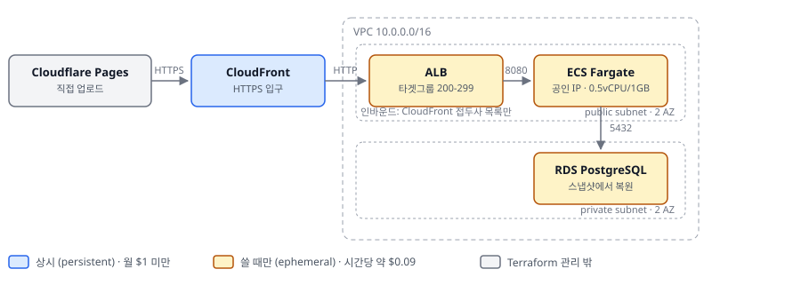

# WareFlow AWS 인프라 (Terraform)

같은 애플리케이션을 PaaS(Render + Supabase + Cloudflare Pages)와 AWS 두 구성으로 배포한다.
이 디렉터리는 그중 AWS 쪽을 Terraform으로 정의한 것이다.

AWS는 사용자 대면이 아니다. 필요할 때 `up.sh`로 올리고 `down.sh`로 내린다. 올리는 데 약 10분 걸린다.

## 구성



```
Cloudflare Pages (AWS용, 직접 업로드)
      │  fetch — 쿠키: SameSite=None; Secure
      ▼
CloudFront  *.cloudfront.net            [상시]  HTTPS 입구
      │  HTTP
      ▼
ALB  (public subnet)                    [쓸 때만]
      │  8080
      ▼
ECS Fargate  (public subnet)            [쓸 때만]  스프링 부트 컨테이너
      │  5432
      ▼
RDS PostgreSQL  (private subnet)        [쓸 때만]  골든 스냅샷에서 복원
```

- 도메인을 사지 않아 ALB에 인증서를 붙일 수 없다. CloudFront가 HTTPS를 맡고, ALB 인바운드는 CloudFront 관리형 접두사 목록(`com.amazonaws.global.cloudfront.origin-facing`)으로 제한한다.
- NAT는 두지 않는다. Fargate 태스크가 공인 IP를 받아 IGW로 나간다(ECR·CloudWatch·SSM).
- 보안그룹은 한 단계씩만 연다: CloudFront → ALB → 앱 → DB.

## 스택을 둘로 나눈 이유

| 스택 | 담는 것 | 유지비 |
|---|---|---|
| `persistent/` | VPC · 서브넷 · IGW · 보안그룹 · DB 서브넷 그룹 · ECR · ECS 클러스터 · IAM/OIDC · 로그 그룹 · **CloudFront** | 월 $1 미만 |
| `ephemeral/` | **RDS** · ALB · 타겟그룹 · 리스너 · 태스크 정의 · ECS 서비스 | 시간당 약 $0.09 |

CloudFront가 상시인 이유는 주소 고정이 아니라 시간이다. 배포 생성·삭제가 각각 15분을 넘겨 올리고 내리는 과정에서 가장 느리다. 비용은 거의 0이라 남겨 둔다.

값은 한 방향으로만 흐른다.

- `ephemeral` → `terraform_remote_state`로 `persistent`의 출력값을 읽는다.
- `persistent`는 `ephemeral`을 읽지 않는다. ALB 주소는 `up.sh`가 `-var alb_dns_name=...`으로 넘긴다.
- 서로 읽게 두면 `ephemeral`을 destroy한 뒤 `persistent`를 plan할 수 없다.

`ephemeral`이 없을 때 CloudFront 오리진은 `origin.invalid`를 가리킨다. 오리진 요청 정책이 쿠키를 그대로 넘기므로, 임시 주소에 실재하는 도메인을 쓰면 사용자 쿠키가 그쪽으로 간다. `.invalid`는 해석되지 않는 예약 도메인이다.

## 사전 요구사항

- Terraform 1.10 이상 (S3 백엔드의 `use_lockfile`)
- AWS CLI 2.32 이상, `aws login --profile <프로필>`로 임시 자격증명을 받은 상태 (장기 액세스 키는 쓰지 않는다)
- Terraform state용 S3 버킷 (버저닝·암호화). 콘솔에서 미리 만든다 — state를 담을 버킷을 Terraform으로 만들 수는 없다
- SSM SecureString `/wareflow/db/password` — RDS 마스터 비밀번호. **Terraform이 관리하지 않는다.** 리소스로 만들면 state에 평문으로 남는다
- 골든 스냅샷 (기본값 `wareflow-golden-20260918`)

## 올리기 / 내리기

```bash
./up.sh <이미지 태그>      # 예: ./up.sh 1b64d0b5e3c7
./down.sh
```

`up.sh`가 하는 일

1. `ephemeral` apply — RDS 스냅샷 복원 5~10분
2. 출력에서 ALB 주소를 꺼낸다
3. `persistent` apply — 그 주소로 CloudFront 오리진을 갱신 (반영 5~15분)

`down.sh`는 `ephemeral`만 destroy한다. `persistent`는 건드리지 않는다. CloudFront가 사라진 ALB를 가리켜 502를 내도 상관없다 — 보는 사람이 없다.

**이미지 태그에는 기본값이 없다.** ECR에 실제로 있는 태그를 넘겨야 한다. 기본값을 두면 없는 이미지를 가리킨 채 태스크가 조용히 pull에 실패한다.

레포가 있는 드라이브가 작으면 프로바이더(약 700MB)를 다른 곳에 둘 수 있다.

```bash
export TF_PLUGIN_CACHE_DIR=~/.terraform.d/plugin-cache
export TF_DATA_ROOT=/c/Users/<사용자>/.terraform-data   # up.sh·down.sh가 스택별로 나눠 쓴다
```

## 프론트

AWS용 프론트는 직접 업로드로 배포한다. 레포 소유자가 따로 있어 Git 연동을 쓸 수 없다.

```bash
cd ../../logistics-front
VITE_API_URL=https://<CloudFront 주소> npm run build
npx wrangler pages deploy dist --project-name wareflow-aws
```

프로젝트 이름이 곧 주소이며, 태스크의 `CORS_ALLOWED_ORIGINS`와 같아야 한다.

## 변수

### persistent

| 변수 | 기본값 | 설명 |
|---|---|---|
| `region` | `ap-northeast-2` | |
| `project` | `wareflow` | 모든 리소스 이름의 접두사 |
| `vpc_cidr` | `10.0.0.0/16` | |
| `public_subnets` | 10.0.1.0/24 (2a), 10.0.2.0/24 (2c) | ALB·Fargate |
| `db_subnets` | 10.0.11.0/24 (2a), 10.0.12.0/24 (2c) | RDS |
| `alb_dns_name` | `origin.invalid` | CloudFront 오리진. `up.sh`가 넘긴다 |
| `github_repo` / `github_branch` | `jhogunhee/logistics-back` / `main` | OIDC 신뢰 조건 |
| `db_password_param` | `/wareflow/db/password` | SSM 파라미터 **이름** |
| `log_retention_days` | `7` | 기본값이 무기한이라 비용이 샌다 |

### ephemeral

| 변수 | 기본값 | 설명 |
|---|---|---|
| `image_tag` | **없음** | 커밋 SHA. 반드시 넘긴다 |
| `snapshot_identifier` | `wareflow-golden-20260918` | `schema.sql`이 바뀌면 새로 떠서 교체 |
| `db_instance_class` | `db.t4g.micro` | |
| `db_name` / `db_username` | `wareflow` / `postgres` | 스냅샷과 같아야 한다 |
| `db_public` | `false` | 최초 1회 적재용 도구. 평소에는 private |
| `cors_allowed_origins` | `https://wareflow-aws.pages.dev` | AWS용 Pages 주소만. 라이브 주소는 넣지 않는다 |
| `task_cpu` / `task_memory` | `512` / `1024` | 0.5 vCPU / 1GB |
| `desired_count` | `1` | |
| `health_check_grace_period` | `180` | 스프링 부트 기동이 수십 초 걸린다 |

## 스모크 테스트

`/health`는 DB를 보지 않는다. 데이터소스가 깨져 있어도 204를 준다. 그래서 로그인과 목록 조회까지 확인한다.

```bash
CF=$(cd persistent && terraform output -raw cloudfront_domain_name)

curl -i https://$CF/health                       # 204
curl -i -c c.txt -H "Content-Type: application/json" \
  -d '{"loginId":"...","pwd":"..."}' https://$CF/auth/login    # 200
curl -i -b c.txt https://$CF/master/codes/groups               # 200
```

ALB 주소로 직접 호출하면 로그인 뒤 목록 조회가 401이 된다. 세션 쿠키가 `Secure`라 평문 HTTP로는 다시 실리지 않기 때문이다. **테스트는 CloudFront 주소로 한다.**

## 놓치면 안 되는 것

| 자리 | 내용 |
|---|---|
| 타겟그룹 | `/health`가 **204**를 준다. 성공 코드를 `200-299`로 두지 않으면 정상 태스크가 계속 unhealthy가 되어 재시작을 반복한다 |
| ECS 서비스 | `assign_public_ip = true`. NAT가 없어 IGW로 나가려면 공인 IP가 필요하다. 없으면 `CannotPullContainerError` |
| 타겟그룹 | `target_type = "ip"` — Fargate는 awsvpc라 인스턴스가 아니라 IP로 등록된다 |
| CloudFront | `CachingDisabled` + `AllViewerExceptHostHeader`, 허용 메서드에 **OPTIONS 포함**. 기본 정책은 응답을 캐시하고 쿠키·헤더를 떼어내 세션과 CORS를 깨뜨린다 |
| 태스크 정의 | `SESSION_COOKIE_SAME_SITE=none`, `SESSION_COOKIE_SECURE=true`. 빠지면 로그인 응답은 정상인데 브라우저가 쿠키를 버리고, 서버 로그에는 아무것도 안 남는다 |
| 태스크 정의 | `PORT`를 넣지 않는다. `server.port=${PORT:8080}`이라 Fargate에서는 8080이 된다. 컨테이너·타겟그룹 포트를 8080으로 맞춘다 |
| 태스크 정의 | `MaxRAMPercentage=60`. 75%면 힙 768MB에 Metaspace 128MB와 CodeCache 48MB가 절대값으로 더 붙어 1GB에 육박한다 |
| 실행 역할 | `AmazonECSTaskExecutionRolePolicy`에는 SSM 읽기가 없다. 인라인 정책을 따로 붙이지 않으면 `ResourceInitializationError`로 죽는다 |
| RDS | `storage_encrypted = true`를 코드에 적는다. 스냅샷이 암호화돼 있어 복원본은 `true`인데 코드에 값이 없으면 Terraform이 차이로 보고 **인스턴스를 교체**한다 |
| 새 계정 | ECS·ELB의 서비스 연결 역할이 없어 첫 생성이 실패할 수 있다. `aws iam create-service-linked-role`로 먼저 만든다 |

애플리케이션 코드(`Dockerfile`, `application.properties`)는 Render와 공유한다. **AWS에 맞춘 차이는 전부 환경변수로 준다.** 예를 들어 `Dockerfile`의 `ENV JAVA_TOOL_OPTIONS`는 Render 512MB에 맞춘 기본값이고, 태스크 정의가 같은 이름의 환경변수로 덮어쓴다.

## 비용

| 구분 | 금액 |
|---|---|
| 상시 (CloudFront · ECR 보관 · S3 · 로그) | 월 $1 미만 |
| 켤 때 (ALB $0.023 + Fargate $0.025 + RDS $0.026 + 공인 IPv4 $0.015) | 시간당 약 $0.09 |
| 24시간 운영 | 월 약 $70 |

서울 리전 기준 추정치다. VPC·서브넷·보안그룹·IAM·SSM·ECS 클러스터는 $0이다.

## 실무와 다르게 한 선택

| 선택 | 실무라면 | 이유 |
|---|---|---|
| Fargate가 public subnet | private subnet + NAT 또는 VPC 엔드포인트 | NAT가 월 $32. 보안그룹으로 동등한 격리를 얻는다고 판단 |
| CloudFront ↔ ALB 평문 HTTP | 종단간 HTTPS | ALB 인증서는 소유 도메인 검증이 필요한데 도메인을 사지 않았다. 대신 인바운드를 CloudFront 접두사 목록으로 제한 |
| RDS 단일 AZ · 태스크 1개 | Multi-AZ · 최소 2개 + 오토스케일링 | 복구 목표가 없는 데모, 동시 사용자 1명 |
| RDS를 매번 스냅샷에서 복원 | 상시 운영 DB | 상시로 두면 월 $19. 원본은 Supabase에 살아 있어 스냅샷이 유일한 사본이 아니다 |
